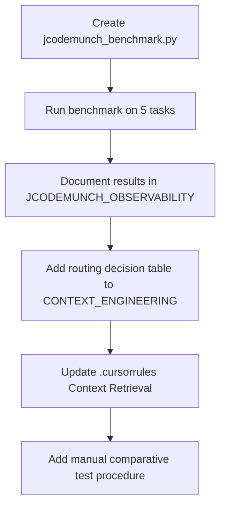

# jCodeMunch Comparative Testing and Implementation

Expand testing to compare jCodeMunch vs normal operations, measure impact, and improve implementation effectiveness.

---

## 1. Current State

**Normal operations** (alternatives to jCodeMunch):

- **read_file(path, offset, limit)** — Targeted file sections; requires knowing path and line range
- **codebase_search** — Semantic search; returns chunks; agent then reads files
- **grep** — Text search; returns matches; agent then reads_file at paths

**Retrieval routing** ([CONTEXT_ENGINEERING.md](D:\portfolio-harness.cursor\docs\CONTEXT_ENGINEERING.md)): "Symbol/function by name? → jCodeMunch search_symbols → get_symbol"

**Gap:** No automated comparison of methods; routing is guidance only; agent may not choose jCodeMunch.

---

## 2. Comparative Benchmark Script

**File:** [.cursor/scripts/jcodemunch_benchmark.py](D:\portfolio-harness.cursor\scripts\jcodemunch_benchmark.py)

**Purpose:** Run the same retrieval task with multiple methods; measure tool calls, output size (chars), latency.

**Methods (implementable in Python):**


| Method                     | Implementation                                               |
| -------------------------- | ------------------------------------------------------------ |
| **jCodeMunch**             | search_symbols(repo, query) → get_symbol(repo, symbol_id)    |
| **grep + read_file**       | subprocess rg/grep for symbol name → read file at path:line  |
| **read_file (known path)** | read_file(path, offset, limit) — baseline when path is known |


**Task catalog (5 tasks):**


| Task | Symbol         | Repo              | Expected file                         |
| ---- | -------------- | ----------------- | ------------------------------------- |
| 1    | _audit_summary | local-proto       | scripts/test_mcp_and_audit.py         |
| 2    | _audit_dir     | local-proto       | scripts/audit_wrapper.py              |
| 3    | index_folder   | local-proto       | jcodemunch_mcp (or portfolio-harness) |
| 4    | list_repos     | portfolio-harness | (jcodemunch package)                  |
| 5    | _vault_dir     | local-proto       | credential_vault/vault.py             |


**Output:** JSON report per task:

```json
{
  "task": "find _audit_summary",
  "methods": {
    "jcodemunch": { "tool_calls": 2, "output_chars": 950, "latency_ms": 15, "correct": true },
    "grep_read_file": { "tool_calls": 2, "output_chars": 1200, "latency_ms": 45, "correct": true },
    "read_file_known": { "tool_calls": 1, "output_chars": 950, "latency_ms": 2, "correct": true }
  }
}
```

**Correctness:** Verify returned content contains the symbol definition (e.g. `def _audit_summary`).

---

## 3. Manual Comparative Test (Agent Behavior)

**Not automatable in Python:** codebase_search is a Cursor tool; agent choice depends on prompts.

**Manual procedure:**

1. Open new chat; ensure jCodeMunch MCP is loaded.
2. Prompt: "Where is _audit_summary defined? Show its full implementation."
3. Record: tools used, approximate token count (Cursor usage panel).
4. Repeat in new chat with instruction: "Do NOT use jCodeMunch. Use codebase_search or grep."
5. Compare: tool count, tokens, correctness.

**Artifact:** Add to [JCODEMUNCH_OBSERVABILITY.md](D:\portfolio-harness.cursor\docs\JCODEMUNCH_OBSERVABILITY.md) as "Manual comparative test procedure" with a results template.

---

## 4. Implementation Effectiveness

### 4.1 Routing decision criteria (when to use which)


| Need                                           | Prefer                                 | Fallback                                     |
| ---------------------------------------------- | -------------------------------------- | -------------------------------------------- |
| Symbol/function/class by exact or partial name | jCodeMunch search_symbols → get_symbol | grep → read_file                             |
| String literal, config value, comment          | jCodeMunch search_text OR grep         | codebase_search                              |
| "Where is X defined?"                          | jCodeMunch                             | codebase_search                              |
| Large file, need lines 100–150                 | read_file(offset, limit)               | get_file_content                             |
| Broad "how does X work?"                       | codebase_search                        | jCodeMunch get_repo_outline → search_symbols |


### 4.2 Doc updates

- **[CONTEXT_ENGINEERING.md](D:\portfolio-harness.cursor\docs\CONTEXT_ENGINEERING.md):** Add "When to use jCodeMunch vs alternatives" subsection with the table above.
- **[JCODEMUNCH_OBSERVABILITY.md](D:\portfolio-harness.cursor\docs\JCODEMUNCH_OBSERVABILITY.md):** Add benchmark results section; link to benchmark script; add manual test procedure.

### 4.3 .cursorrules reinforcement

- Strengthen Context Retrieval bullet: add explicit "When looking for a symbol by name, use jCodeMunch search_symbols → get_symbol before codebase_search or grep."
- Optional: Add a Tool Output Limits note that jCodeMunch returns smaller payloads than full-file read.

### 4.4 Optional: Retrieval routing skill

- If agent frequently ignores jCodeMunch: create a lightweight skill or rule that triggers on "find", "where is", "show definition" and reminds to prefer jCodeMunch for symbol lookups.
- Lower priority; try doc/rules updates first.

---

## 5. Execution Order




---

## 6. Deliverables

1. **jcodemunch_benchmark.py** — Comparative benchmark script (jCodeMunch vs grep+read_file vs read_file_known).
2. **Benchmark results** — Run once; record in JCODEMUNCH_OBSERVABILITY.md.
3. **CONTEXT_ENGINEERING.md** — "When to use jCodeMunch vs alternatives" subsection.
4. **JCODEMUNCH_OBSERVABILITY.md** — Benchmark section, manual test procedure.
5. **.cursorrules** — Stronger Context Retrieval guidance for symbol-by-name.

---

## 7. Out of Scope

- pytest integration for benchmark (run as script for now)
- CI automation
- Agent-native routing (tool that suggests retrieval method) — future

