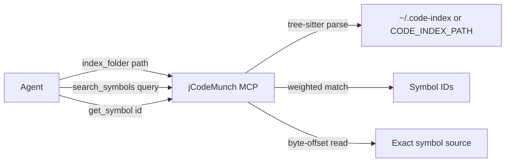

# jCodeMunch MCP Integration Plan

## Phase 1: Add jCodeMunch to MCP Config and Run Trial

### 1.1 Add jCodeMunch to mcp.json

Edit [.cursor/mcp.json](D:\portfolio-harness.cursor\mcp.json). Add a new `jcodemunch` entry following the audit_wrapper pattern used by sqlite/docker:

```json
"jcodemunch": {
  "command": "python",
  "args": [
    "D:/portfolio-harness/local-proto/scripts/audit_wrapper.py",
    "--",
    "uvx",
    "jcodemunch-mcp"
  ],
  "env": {
    "ORG_INTENT_PATH": "D:/portfolio-harness/org-intent-spec/examples/org-intent.example.json",
    "ORG_INTENT_ENFORCE": "1",
    "MCP_RISK_TIER": "low",
    "JCODEMUNCH_SHARE_SAVINGS": "0",
    "CODE_INDEX_PATH": "D:/portfolio-harness/.code-index"
  }
}
```

- **Prerequisite:** `uv` installed (already required for sqlite, docker). `uvx jcodemunch-mcp` will fetch the package on first run.
- **Security:** `JCODEMUNCH_SHARE_SAVINGS=0` disables telemetry; `CODE_INDEX_PATH` keeps index inside harness.

### 1.2 Restart Cursor and Verify Server Loads

Restart Cursor so the new MCP server is picked up. Confirm jCodeMunch tools appear (e.g. `list_repos`, `index_folder`, `search_symbols`, `get_symbol`).

### 1.3 Run Trial

1. **Index a folder:** Use `index_folder` with `path: "D:/portfolio-harness/local-proto"` (smaller than full harness; ~2k file cap).
2. **List repos:** Call `list_repos` to get the indexed repo id (local folders use hashed ids).
3. **Search:** Call `search_symbols` with `repo: "<id>"` and `query: "audit"` (or another symbol name).
4. **Retrieve:** Call `get_symbol` with a symbol_id from the search results.

If the trial succeeds and the agent finds value, proceed to Phase 2.

---

## Phase 2: Update Retrieval Routing (Conditional on Trial Success)

### 2.1 Update CONTEXT_ENGINEERING.md

Edit [.cursor/docs/CONTEXT_ENGINEERING.md](D:\portfolio-harness.cursor\docs\CONTEXT_ENGINEERING.md):

- Add a node to the mermaid flowchart (around line 40): `Need -->|Symbol/function by name| jCodeMunch[search_symbols / get_symbol]`
- Add bullet: **Symbol/function/class by name?** → jCodeMunch `search_symbols` → `get_symbol`

### 2.2 Update .cursorrules

Edit [.cursorrules](D:\portfolio-harness.cursorrules) in the Context Retrieval section (line 56):

- Extend the bullet to include: `prefer jCodeMunch search_symbols/get_symbol for symbol-by-name lookups`

### 2.3 Update CONTEXT_INTEGRATION_AUDIT.md

Edit [.cursor/docs/CONTEXT_INTEGRATION_AUDIT.md](D:\portfolio-harness.cursor\docs\CONTEXT_INTEGRATION_AUDIT.md):

- Add jcodemunch to the MCP Tools table (around line 52): `**jcodemunch** | index_folder, list_repos, search_symbols, get_symbol, get_file_outline | Symbol-level code retrieval; token-efficient`
- Add row to Tool Routing table (around line 68): `Symbol/function by name | jCodeMunch | search_symbols → get_symbol`

---

## Phase 3: Add to MCP Server Tiers

Edit [local-proto/config/mcp_server_tiers.json](D:\portfolio-harness\local-proto\config\mcp_server_tiers.json):

- Add `"jcodemunch"` to `tiers.3` (tier 3, same as sqlite/scrapling/docker).
- Add server entry:

```json
"jcodemunch": {
  "tier": 3,
  "smoke_tool": "list_repos",
  "prereqs": ["uv"]
}
```

---

## Phase 4: Security Audit Before Commit

Per [security-audit-rules SKILL](D:\portfolio-harness.cursor\skills\security-audit-rules\SKILL.md):

1. Run the security-audit-rules skill on any new or modified rules/docs.
2. Scope: `.cursorrules`, `CONTEXT_ENGINEERING.md`, `CONTEXT_INTEGRATION_AUDIT.md`.
3. Check for: override instructions, path traversal, env manipulation, hidden Unicode.
4. Do not commit until audit passes or findings are resolved.

---

## Data Flow (Trial)




---

## Rollback

- Remove `jcodemunch` block from mcp.json.
- Revert doc edits (CONTEXT_ENGINEERING.md, .cursorrules, CONTEXT_INTEGRATION_AUDIT.md, mcp_server_tiers.json).
- Optionally delete `D:/portfolio-harness/.code-index` if created.

---

## Risk Level

**Low.** Read-only indexing and retrieval; no writes to workspace. MCP_RISK_TIER=low. Audit wrapper logs tool calls.