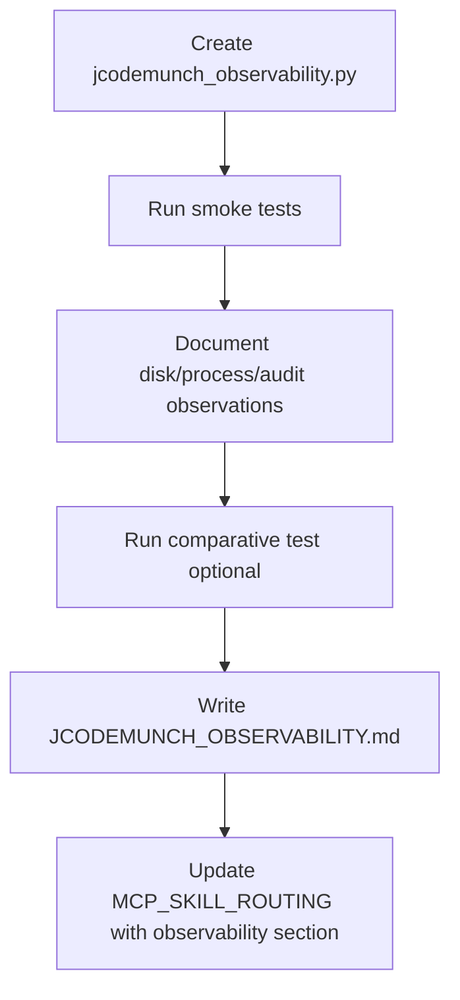

# jCodeMunch Observability and Testing Plan

Test jCodeMunch MCP for functionality, identify its effects, and establish how to best understand its impact on agent behavior and context usage.

---

## 1. What jCodeMunch Does (Current Understanding)

**Tools exposed (12 total):**

| Tool               | Effect                                                      | Risk            |
| ------------------ | ----------------------------------------------------------- | --------------- |
| `index_folder`     | Parses local code via tree-sitter, writes to `.code-index/` | Disk write, CPU |
| `index_repo`       | Fetches GitHub repo, indexes (uses httpx)                   | Network, disk   |
| `list_repos`       | Reads index metadata                                        | Read-only       |
| `search_symbols`   | Fuzzy search over symbol names/signatures/summaries         | Read-only       |
| `get_symbol`       | Returns symbol source from cache by byte offset             | Read-only       |
| `get_symbols`      | Batch get_symbol                                            | Read-only       |
| `get_file_outline` | Symbols in a file                                           | Read-only       |
| `get_file_content` | Cached file content, optional line range                    | Read-only       |
| `get_file_tree`    | Directory tree of indexed repo                              | Read-only       |
| `get_repo_outline` | Repo overview (dirs, counts, languages)                     | Read-only       |
| `search_text`      | Full-text search (string literals, comments)                | Read-only       |
| `invalidate_cache` | Deletes repo index and cache                                | Destructive     |

**Storage layout** ([.code-index](D:\portfolio-harness.code-index)):

- `local-{repo}-{hash}.json` — symbol index (~17MB for portfolio-harness, ~71KB for local-proto)
- `local-{repo}-{hash}/` — cached source files (mirrors repo structure)

**Current config** ([mcp.json](D:\portfolio-harness.cursor\mcp.json)):

- `CODE_INDEX_PATH=D:/portfolio-harness/.code-index`
- `JCODEMUNCH_SHARE_SAVINGS=0` (telemetry off)
- Wrapped by [audit_wrapper.py](D:\portfolio-harness\local-proto\scripts\audit_wrapper.py) — logs tool calls to `%LOCALAPPDATA%\local-proto\audit\`

---

## 2. Functional Verification (What to Test)

### 2.1 Tool-by-tool smoke tests

Extend or create a test script that exercises each tool and records:

- **index_folder:** Success, `changed`/`new`/`deleted` counts, `discovery_skip_counts`, `no_symbols_files`
- **list_repos:** Count, repo IDs, symbol counts
- **search_symbols:** Query → result count, top match relevance
- **get_symbol:** Symbol ID → source returned, hash match (with `verify=true`)
- **get_file_outline:** File path → symbol list
- **get_file_content:** File + line range → content
- **search_text:** Query → matching lines (e.g. string literal, config value)
- **get_repo_outline:** Repo → dir/file/symbol counts
- **invalidate_cache:** (Optional) Delete one repo, re-index, confirm fresh index

**Artifact:** [.cursor/scripts/jcodemunch_observability.py](D:\portfolio-harness.cursor\scripts\jcodemunch_observability.py) — runnable script that prints structured results for each tool.

### 2.2 MCP vs Python API parity

Run the same operations via:

1. Python API (direct import, as in [jcodemunch_trial.py](D:\portfolio-harness.cursor\scripts\jcodemunch_trial.py))
2. MCP tools (after Cursor restart)

Compare outputs. Any divergence indicates MCP wiring or env issues.

---

## 3. Effects Observability (What to Observe)

### 3.1 Disk effects

| Observation                 | How                                                          |
| --------------------------- | ------------------------------------------------------------ |
| Index size before/after     | `Get-ChildItem .code-index -Recurse                          |
| File count                  | `Get-ChildItem .code-index -Recurse -File                    |
| Growth per index_folder run | Run index_folder twice (no changes vs with changes), compare |

**Baseline (current):** 2 repos, ~17MB + 71KB JSON, ~1970 files in `.code-index/`.

### 3.2 Process effects

| Observation  | How                                                                                                   |
| ------------ | ----------------------------------------------------------------------------------------------------- |
| MCP spawn    | Cursor spawns `python audit_wrapper.py -- python -c "from jcodemunch_mcp.server import main; main()"` |
| Memory/CPU   | Task Manager or `Get-Process` during index_folder on large repo                                       |
| Startup time | Time from Cursor load to first `list_repos` response                                                  |

### 3.3 Audit trail

- **Location:** `%LOCALAPPDATA%\local-proto\audit\` (or `LOCAL_PROTO_AUDIT_DIR`)
- **Content:** Tool name, args hash, timestamp, outcome
- **Access:** Human-only (AI has no access per audit_wrapper design)

**Action:** Document how to inspect audit logs and what fields to look for (e.g. `index_folder` path, `search_symbols` query).

### 3.4 Network (index_repo only)

- `index_repo` uses `httpx` to fetch GitHub. Not used in current harness config (index_folder only).
- If ever enabled: observe outbound HTTPS to `api.github.com`.

---

## 4. Comparative Testing (Understanding Impact)

### 4.1 Token efficiency

**Hypothesis:** For "find function X and show its implementation," jCodeMunch (`search_symbols` → `get_symbol`) uses fewer tokens than `read_file` or `codebase_search` + `read_file`.

**Method:**

1. Pick 3–5 representative tasks (e.g. "Where is `_audit_summary` defined? Show its code").
2. Run each task twice: (A) with jCodeMunch available, (B) with jCodeMunch disabled (remove from mcp.json or instruct agent to avoid it).
3. Compare: tool calls used, approximate token count (Cursor usage or manual estimate).

**Artifact:** Short table in a doc: Task | With jCodeMunch | Without | Delta.

### 4.2 Accuracy / relevance

- **search_symbols:** Run queries that should match vs. miss (e.g. typo, partial name).
- **get_symbol:** Verify returned source matches on-disk file (use `verify=true`).
- **search_text:** Confirm it finds string literals and comments that `search_symbols` would miss.

### 4.3 Edge cases

| Case                | Test                                                                                              |
| ------------------- | ------------------------------------------------------------------------------------------------- |
| Large file          | get_file_outline on a 500+ line file; get_symbol on a large function                              |
| Multi-language repo | portfolio-harness has Python, Go, TS, etc. — verify symbols across languages                      |
| Stale index         | Change a file, run search_symbols/get_symbol without re-index — expect drift; re-index and verify |
| Empty query         | search_symbols with empty or very short query                                                     |
| Non-indexed path    | get_file_outline for path not in index                                                            |

---

## 5. Observability Gaps and Mitigations

| Gap                             | Mitigation                                                                                                                                                                                                          |
| ------------------------------- | ------------------------------------------------------------------------------------------------------------------------------------------------------------------------------------------------------------------- |
| No built-in usage metrics       | Rely on audit_wrapper logs; optionally add lightweight script to count tool calls per session                                                                                                                       |
| Token count not exposed         | Use Cursor usage panel or manual estimation from tool output sizes                                                                                                                                                  |
| Agent may not choose jCodeMunch | Ensure retrieval routing in [CONTEXT_ENGINEERING.md](D:\portfolio-harness.cursor\docs\CONTEXT_ENGINEERING.md) and [.cursorrules](D:\portfolio-harness.cursorrules) clearly recommends jCodeMunch for symbol-by-name |
| Stale index                     | Document: re-run `index_folder` after significant changes; consider pre-commit or CI hook                                                                                                                           |

---

## 6. Deliverables

1. **jcodemunch_observability.py** — Script that runs all tool smoke tests and prints structured results.
2. **JCODEMUNCH_OBSERVABILITY.md** — Doc in `.cursor/docs/` covering:
  - Tool inventory and effects
  - How to observe (disk, process, audit)
  - Comparative testing method
  - Edge cases and known limitations
3. **Update MCP_SKILL_ROUTING.md** — Add "Observability" section with links to audit dir, observability script, and doc.
4. **Optional:** One comparative run (with vs without jCodeMunch) for a sample task, recorded in the doc.

---

## 7. Execution Order

---

## 8. Out of Scope (For Later)

- Automated regression tests (pytest)
- CI integration for index freshness
- index_repo (GitHub) testing
- JCODEMUNCH_USE_AI_SUMMARIES=true behavior (we use false)

