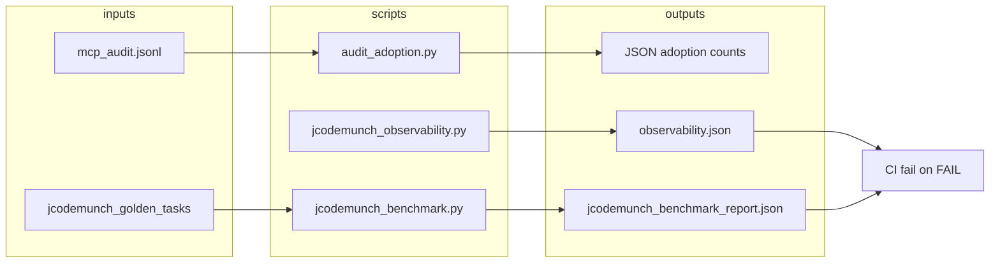

# jCodeMunch Quick Wins Plan

Four focused improvements to jCodeMunch tooling: adoption metrics, benchmark reliability, Windows compatibility, and CI enforcement.

---

## 1. Audit Log Analysis Script

**Goal:** Count jCodeMunch vs other retrieval tools from `mcp_audit.jsonl` to measure adoption.

**Audit format** (from [audit_wrapper.py](D:\portfolio-harness\local-proto\scripts\audit_wrapper.py)): Each line is JSON with `tool`, `args_hash`, `timestamp`, `outcome`.

**jCodeMunch tools** (from [JCODEMUNCH_OBSERVABILITY.md](D:\portfolio-harness.cursor\docs\JCODEMUNCH_OBSERVABILITY.md)): `search_symbols`, `get_symbol`, `get_symbols`, `list_repos`, `index_folder`, `index_repo`, `get_file_outline`, `get_file_content`, `get_file_tree`, `get_repo_outline`, `search_text`, `invalidate_cache`.

**Implementation:**

- Create `[.cursor/scripts/audit_adoption.py](D:\portfolio-harness\.cursor\scripts\audit_adoption.py)`
- Accept `--path` (default: `%LOCALAPPDATA%\local-proto\audit\mcp_audit.jsonl` or `LOCAL_PROTO_AUDIT_DIR` env)
- Parse JSONL; count per `tool`; bucket into `jcodemunch` vs `other`
- Output: `{"jcodemunch": N, "other": M, "by_tool": {...}, "total": N+M}`
- Support `--tail N` to analyze last N lines only
- Exit 0; no failure semantics (informational script)

---

## 2. Golden Task Set and Assertions

**Goal:** Define 10–15 symbols that must resolve; add assertions in the benchmark so failures are explicit.

**Current state:** [jcodemunch_benchmark.py](D:\portfolio-harness.cursor\scripts\jcodemunch_benchmark.py) has 5 tasks; `correct` is recorded but not asserted.

**Implementation:**

- Expand `TASKS` to 10–15 symbols across `local-proto` and `portfolio-harness`
- Add `--assert-golden` flag: when set, `sys.exit(1)` if any task has `correct=False` for jcodemunch
- Optional: assert `grep_read_file` and `read_file_known` correct for known-path tasks (grep may fail on Windows; see Win 3)
- Golden symbols (candidates): `_audit_summary`, `_audit_dir`, `_ensure_audit_dir`, `_vault_dir`, `compute_checksum`, `index_folder`, `list_repos`, `search_symbols`, `get_symbol`, `_relay`, `_log_entry`, `main` (from audit_wrapper), `check_handoff_integrity`, etc.
- Store golden list in `.cursor/state/jcodemunch_golden_tasks.json` or inline in script

---

## 3. Fix Grep Benchmark on Windows

**Goal:** Use Select-String or document `rg` as a dependency so `grep_read_file` works on Windows.

**Current behavior:** [jcodemunch_benchmark.py](D:\portfolio-harness.cursor\scripts\jcodemunch_benchmark.py) lines 83–86 try `rg` then `grep`; both fail on Windows (no rg/grep by default). Benchmark report shows `grep_read_file: tool_calls=0, correct=false` for all tasks.

**Options:**

- **A) Python-native fallback:** Use `pathlib` + `re` or `fnmatch` to search `.py` files; no external deps. Slower but portable.
- **B) PowerShell Select-String:** `subprocess.run(["powershell", "-Command", "Get-ChildItem ... | Select-String ..."])` when `sys.platform == "win32"`. Native on Windows.
- **C) Document rg:** Add `rg` (ripgrep) to README/requirements as optional; keep current logic; CI installs `ripgrep` on Ubuntu.

**Recommendation:** **B** for Windows + keep `rg`/`grep` for Unix. Detect platform; use Select-String on win32. Add brief note in [JCODEMUNCH_OBSERVABILITY.md](D:\portfolio-harness.cursor\docs\JCODEMUNCH_OBSERVABILITY.md) that `rg` is preferred on Unix for speed.

---

## 4. CI Integration

**Goal:** Add a job that runs `jcodemunch_observability.py` and `jcodemunch_benchmark.py`; fail on overall FAIL or benchmark regressions.

**Reference:** [mcp_tests.yml](D:\portfolio-harness.github\workflows\mcp_tests.yml) — path patching, Python 3.11, `local-proto` scripts.

**Implementation:**

- Create `[.github/workflows/jcodemunch_ci.yml](D:\portfolio-harness\.github\workflows\jcodemunch_ci.yml)`
- Triggers: `push`/`pull_request` on `main`, `master`; paths: `local-proto/`**, `.cursor/`**, `.code-index/**` (or broader: `.cursor/scripts/jcodemunch*.py`)
- Steps:
  1. Checkout
  2. Set up Python 3.11
  3. `pip install jcodemunch-mcp`
  4. Patch paths in scripts (replace `D:/portfolio-harness` with `${{ github.workspace }}`) — scripts use hardcoded paths; need `ROOT`/`STORAGE` from env or patching
  5. Run `index_folder` once to populate `.code-index` (or use cached index artifact)
  6. Run `jcodemunch_observability.py -o observability.json`; fail if exit code != 0 (observability already returns 1 on FAIL)
  7. Run `jcodemunch_benchmark.py --assert-golden`; fail if exit code != 0
- **Path portability:** Scripts use `D:/portfolio-harness` and `D:/portfolio-harness/.code-index`. Add env vars `JCODEMUNCH_ROOT` and `CODE_INDEX_PATH`; default to `D:/portfolio-harness` when unset. CI sets them to `${{ github.workspace }}`.
- **Index bootstrap:** CI may need to run `index_folder` before benchmark (or use a pre-built index artifact). Observability already runs `index_folder` internally.

---

## Data Flow

---

## Execution Order

1. **Audit adoption script** — standalone, no deps on other changes
2. **Golden task set + assertions** — expand TASKS, add `--assert-golden`
3. **Windows grep fix** — platform branch in `_method_grep_read_file`
4. **CI job** — new workflow; depends on path env vars in scripts (minor script edits)

---

## Files to Create/Modify

| File                                                                                                           | Action                                                      |
| -------------------------------------------------------------------------------------------------------------- | ----------------------------------------------------------- |
| [.cursor/scripts/audit_adoption.py](D:\portfolio-harness.cursor\scripts\audit_adoption.py)                     | Create                                                      |
| [.cursor/scripts/jcodemunch_benchmark.py](D:\portfolio-harness.cursor\scripts\jcodemunch_benchmark.py)         | Modify: TASKS, --assert-golden, Windows grep, env path vars |
| [.cursor/scripts/jcodemunch_observability.py](D:\portfolio-harness.cursor\scripts\jcodemunch_observability.py) | Modify: env path vars for CI                                |
| [.github/workflows/jcodemunch_ci.yml](D:\portfolio-harness.github\workflows\jcodemunch_ci.yml)                 | Create                                                      |
| [.cursor/docs/JCODEMUNCH_OBSERVABILITY.md](D:\portfolio-harness.cursor\docs\JCODEMUNCH_OBSERVABILITY.md)       | Update: audit adoption usage, rg note                       |

---

## Out of Scope

- pytest wrappers for scripts (run as CLI for now)
- Automated baseline regression (compare benchmark report to prior; future enhancement)

