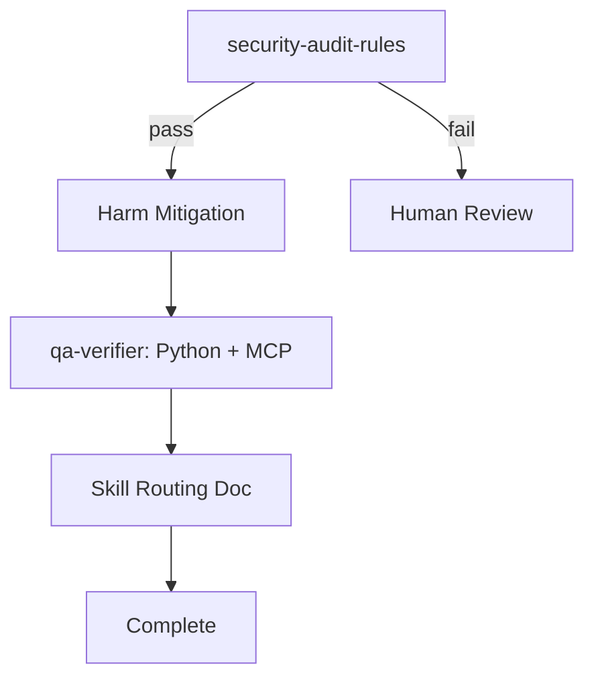

# jCodeMunch Security Audit, Harm Mitigation, and Test Plan

> **For Claude:** REQUIRED SUB-SKILL: Use superpowers:executing-plans to implement this plan task-by-task.

**Goal:** Audit jCodeMunch integration for security risks, fix any findings, verify MCP works, and document skill routing for future MCP/context work.

**Architecture:** Security-first (audit before test); harm mitigation before verification; skill-utilization doc for harness operators.

**Tech Stack:** jcodemunch-mcp (Python), MCP, audit_wrapper, portfolio-harness skills.

---

## Phase 1: Security Audit

### Task 1: Run security-audit-rules on jCodeMunch-touched files

**Scope (per [security-audit-rules SKILL](D:\portfolio-harness.cursor\skills\security-audit-rules\SKILL.md)):**

- [.cursor/mcp.json](D:\portfolio-harness.cursor\mcp.json) (jcodemunch block)
- [.cursorrules](D:\portfolio-harness.cursorrules) (Context Retrieval section mentioning jCodeMunch)
- [.cursor/docs/CONTEXT_ENGINEERING.md](D:\portfolio-harness.cursor\docs\CONTEXT_ENGINEERING.md) (retrieval routing)
- [.cursor/docs/CONTEXT_INTEGRATION_AUDIT.md](D:\portfolio-harness.cursor\docs\CONTEXT_INTEGRATION_AUDIT.md) (jcodemunch tool entry)
- [.cursor/scripts/jcodemunch_trial.py](D:\portfolio-harness.cursor\scripts\jcodemunch_trial.py)

**Checklist:** Shell env manipulation, redirects, remote fetch, override instructions, hidden Unicode, path traversal, dependency confusion.

**Step 1:** Load security-audit-rules skill and scan each file.
**Step 2:** Produce report: files scanned; matches (path, pattern, concern); or "No red-flag patterns found."
**Step 3:** If findings: stop and list; do not proceed until human review.

---

## Phase 2: Harm Mitigation

### Task 2: Address audit findings (conditional)

**Trigger:** Only if Task 1 reported red-flag matches.

**Files:** Per audit report.
**Actions:** Remove or fix flagged content; prefer structure over pasted external content.
**Step:** Re-run audit after fixes; confirm "No red-flag patterns found."

### Task 3: Verify safe defaults in mcp.json

**File:** [.cursor/mcp.json](D:\portfolio-harness.cursor\mcp.json) jcodemunch env.

**Checks:**

- `JCODEMUNCH_SHARE_SAVINGS=0` (telemetry off)
- `CODE_INDEX_PATH` inside harness (no `~` or user-home leakage)
- `MCP_RISK_TIER=low` (read-only indexing)

**Step:** Confirm env block; no changes if already correct.

---

## Phase 3: Test jCodeMunch MCP

### Task 4: Python API smoke test (no MCP dependency)

**Command:**

```powershell
Set-Location D:\portfolio-harness; python .cursor/scripts/jcodemunch_trial.py
```

**Expected:** index_folder success, list_repos returns 2 repos, search_symbols returns results, get_symbol returns source.

**Step 1:** Run command.
**Step 2:** Confirm output shows success for all four steps.
**Step 3:** If fail: capture error; check `pip list | Select-String jcodemunch`.

### Task 5: MCP tool smoke test (requires Cursor restart)

**Prerequisite:** Cursor restarted so jCodeMunch MCP loads.

**Steps:**

1. Invoke `list_repos` via jCodeMunch MCP tools.
2. Expected: JSON with `count` and `repos` array.
3. If MCP not available: confirm mcp.json jcodemunch block; confirm audit_wrapper spawns correctly; check Cursor MCP logs.

---

## Phase 4: Skill Utilization Documentation

### Task 6: Add skill-routing guidance for MCP/context work

**File:** Create or update [.cursor/docs/MCP_SKILL_ROUTING.md](D:\portfolio-harness.cursor\docs\MCP_SKILL_ROUTING.md) (or append to existing MCP doc).

**Content (per [role-routing.mdc](D:\portfolio-harness.cursor\rules\role-routing.mdc)):**


| When                                             | Load skill           | Rationale                      |
| ------------------------------------------------ | -------------------- | ------------------------------ |
| Adding or modifying MCP config, rules, or skills | security-audit-rules | Rule 10: audit before applying |
| Testing MCP or verification                      | qa-verifier          | Rule 3: validate behavior      |
| Deciding where MCP docs or scripts go            | tech-lead            | Rule 5: placement, structure   |
| Designing retrieval routing or human-agent seam  | frontier-ops         | Rule 5a: AI workflow design    |
| Requirements for new MCP integration             | product-scope        | Rule 6: scope first            |


**Suggested sequence for new MCP:** product-scope (if new) → tech-lead (placement) → security-audit-rules (before commit) → qa-verifier (smoke test).

**Step 1:** Check if `MCP_SKILL_ROUTING.md` or equivalent exists.
**Step 2:** Create or update with table and sequence.
**Step 3:** Link from [CONTEXT_INTEGRATION_AUDIT.md](D:\portfolio-harness.cursor\docs\CONTEXT_INTEGRATION_AUDIT.md) Audit Checklist.

---

## Execution Handoff

After completing the plan:

**1. Subagent-Driven (this session)** — Dispatch fresh subagent per task; review between tasks.
**2. Parallel Session** — Open new session with executing-plans; batch with checkpoints.

---

## Data Flow




