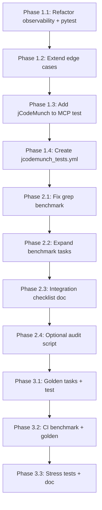

# jCodeMunch Testing Layers Implementation

Full implementation of the six testing layers with CI integration. Phased delivery: Phase 1 (core automation), Phase 2 (integration + benchmark), Phase 3 (regression + stress).

---

## Current State

- **Observability:** [jcodemunch_observability.py](D:\portfolio-harness.cursor\scripts\jcodemunch_observability.py) — runs per-tool checks, edge cases, baseline; exits 0/1 on OK/FAIL
- **Benchmark:** [jcodemunch_benchmark.py](D:\portfolio-harness.cursor\scripts\jcodemunch_benchmark.py) — compares jCodeMunch vs grep vs read_file; grep fails on Windows
- **MCP tests:** [test_mcp_and_audit.py](D:\portfolio-harness\local-proto\scripts\test_mcp_and_audit.py) — tests git, filesystem, credential-vault (Tier 1); jCodeMunch not included
- **CI:** [mcp_tests.yml](D:\portfolio-harness.github\workflows\mcp_tests.yml) — runs on push/PR; paths patched for Linux

---

## Phase 1: Unit/API + CI Gate (Layers 1–2 core)

### 1.1 Pytest wrappers for observability

**File:** `.cursor/tests/test_jcodemunch_observability.py` (new)

- Extract `run_observability()` from `jcodemunch_observability.py` that returns the analyzer report dict (or refactor main to call a function).
- Pytest tests:
  - `test_observability_overall_ok` — run full observability; assert `overall["status"] in ("OK", "WARN")` and `overall["score"] >= 0.7`
  - `test_observability_no_fail` — assert no tool has `status == "FAIL"`
  - `test_observability_edge_cases` — assert edge cases (empty_query, non_indexed_path, typo_query) return OK or WARN
- Use `pathlib` and `os.environ` for `CODE_INDEX_PATH` and `STORAGE` so tests work on CI (Linux runner).

**Refactor:** Add `def run_observability(storage_path: str, local_proto: str, baseline: bool = False) -> dict` to [jcodemunch_observability.py](D:\portfolio-harness.cursor\scripts\jcodemunch_observability.py) — parameterize paths and return report dict instead of only printing.

### 1.2 Extend edge cases in observability

**File:** [jcodemunch_observability.py](D:\portfolio-harness.cursor\scripts\jcodemunch_observability.py)

Add edge-case checks (after existing §10):

- **Very long symbol name:** `search_symbols` with a 200+ char query — expect no crash or graceful handling
- **Unicode query:** `search_symbols` with `"émoji"` or similar — expect no crash
- **Wrong repo id:** `get_symbol` with `repo="nonexistent/repo"` — expect error or empty response, not crash
- **Large file:** `get_file_outline` for a known 500+ line file (if exists in local-proto) — measure latency

### 1.3 Add jCodeMunch to MCP smoke test

**File:** [test_mcp_and_audit.py](D:\portfolio-harness\local-proto\scripts\test_mcp_and_audit.py)

- Add to `TOOL_MAP`: `"jcodemunch": ("list_repos", {})`
- Add to `TIER1_SERVERS` or `TIER2_SERVERS`: `jcodemunch` (Tier 2 if index_folder is slow; Tier 1 if list_repos is fast)
- Ensure `mcp.json` path patch for CI includes `CODE_INDEX_PATH` and `.code-index` — CI may need a pre-indexed fixture or skip index_folder; `list_repos` works with empty index.

**CI consideration:** jCodeMunch requires `.code-index/` to exist. Options:

- (A) Create minimal `.code-index` fixture in CI (e.g. commit a small index or run `index_folder` once in CI)
- (B) Use `list_repos` only — returns empty if no index; still validates MCP spawn
- (C) Add `--skip jcodemunch` if `CODE_INDEX_PATH` not found or index empty

Recommend (B) for Tier 1: `list_repos` with empty index is valid; add `jcodemunch` to Tier 2 and run `index_folder` in a setup step if needed.

### 1.4 New GitHub Actions workflow

**File:** `.github/workflows/jcodemunch_tests.yml` (new)

```yaml
name: jCodeMunch tests
on:
  push:
    paths: [".cursor/**", ".code-index/**", "local-proto/**"]
  pull_request:
    paths: [".cursor/**", ".code-index/**", "local-proto/**"]
jobs:
  observability:
    runs-on: ubuntu-latest
    steps:
      - uses: actions/checkout@v4
      - uses: actions/setup-python@v5
        with:
          python-version: "3.11"
      - run: pip install jcodemunch-mcp
      - name: Patch paths for CI
        run: |
          REPO="${{ github.workspace }}"
          sed -i "s|D:/portfolio-harness|$REPO|g" .cursor/scripts/jcodemunch_observability.py
          # Or use env vars in script
      - name: Run index_folder (if .code-index missing)
        run: python -c "from jcodemunch_mcp.tools.index_folder import index_folder; index_folder('$REPO/local-proto', storage_path='$REPO/.code-index', incremental=True)"
        env:
          REPO: ${{ github.workspace }}
      - name: Run observability
        run: python .cursor/scripts/jcodemunch_observability.py -o report.json
      - name: Run pytest
        run: pytest .cursor/tests/test_jcodemunch_observability.py -v
```

**Path handling:** Observability scripts use hardcoded `D:/portfolio-harness`. Refactor to read `CODE_INDEX_PATH` and repo roots from env; CI sets `CODE_INDEX_PATH=$REPO/.code-index`, `REPO_ROOT=$REPO`.

---

## Phase 2: Benchmark + Integration (Layers 3–4)

### 2.1 Fix grep benchmark on Windows

**File:** [jcodemunch_benchmark.py](D:\portfolio-harness.cursor\scripts\jcodemunch_benchmark.py)

- Add `_method_grep_powershell()`: use `subprocess.run(["powershell", "-Command", "Select-String -Path ... -Pattern ..."])` when `rg` and `grep` fail
- Fallback order: `rg` → `grep` → `Select-String` (PowerShell)
- Parse output: `Select-String` returns `Path:LineNumber:LineContent`; extract path and line number

### 2.2 Expand benchmark task catalog

**File:** [jcodemunch_benchmark.py](D:\portfolio-harness.cursor\scripts\jcodemunch_benchmark.py)

- Add `search_text` tasks: e.g. find string literal `"audit_wrapper"` in local-proto
- Add `get_file_outline` task: e.g. `scripts/audit_wrapper.py` — compare output size vs read_file
- Add multi-language symbols if available: TS/Go symbols in portfolio-harness (e.g. `*.ts` or `*.go` files)

### 2.3 Integration test procedures

**File:** [JCODEMUNCH_OBSERVABILITY.md](D:\portfolio-harness.cursor\docs\JCODEMUNCH_OBSERVABILITY.md)

Add a new section **"Integration Test Checklist"**:

- MCP spawn: Cursor loads jCodeMunch; `list_repos` appears in tools
- Path resolution: `CODE_INDEX_PATH` and repo ids work for portfolio-harness and local-proto
- Audit trail: After `search_symbols`, check `mcp_audit.jsonl` for tool entry
- Stale index: Document procedure — change file, run search without re-index, verify expected behavior (drift or cached)

### 2.4 Agent behavior audit script (optional)

**File:** `.cursor/scripts/jcodemunch_audit_usage.py` (new)

- Read `mcp_audit.jsonl` (or path from env)
- Count tool calls per tool: `search_symbols`, `get_symbol`, `list_repos`, etc.
- Compare to total tool calls (if available from audit) — report jCodeMunch adoption rate
- Output: JSON summary `{ "jcodemunch_calls": N, "total_calls": M, "adoption_rate": N/M }`

---

## Phase 3: Regression + Stress (Layers 5–6)

### 3.1 Golden task set

**File:** `.cursor/scripts/jcodemunch_golden_tasks.json` (new)

```json
{
  "tasks": [
    {"symbol": "_audit_summary", "repo_hint": "local-proto", "must_contain": "def _audit_summary"},
    {"symbol": "compute_checksum", "repo_hint": "portfolio-harness", "must_contain": "def compute_checksum"}
  ]
}
```

**File:** `.cursor/tests/test_jcodemunch_golden.py` (new)

- Load golden tasks; for each, run `search_symbols` → `get_symbol`
- Assert returned source contains `must_contain`
- Fail if any task regresses

### 3.2 CI integration for benchmark and golden

**File:** [jcodemunch_tests.yml](D:\portfolio-harness.github\workflows\jcodemunch_tests.yml)

- Add job `benchmark`: run `jcodemunch_benchmark.py`; assert all jCodeMunch tasks have `correct: true`
- Add job `golden`: run `pytest .cursor/tests/test_jcodemunch_golden.py`
- Add `--output` artifact upload for reports

### 3.3 Stress and edge-case tests

**File:** `.cursor/tests/test_jcodemunch_stress.py` (new)

- `test_wrong_repo_id` — call `get_symbol` with invalid repo; expect error, no crash
- `test_empty_query` — `search_symbols` with `""`; expect no crash
- `test_corrupt_index_graceful` — (optional) delete one file from `.code-index`; run `list_repos`; expect graceful handling or skip if too destructive

**Document:** Add "Stress Test Procedures" to [JCODEMUNCH_OBSERVABILITY.md](D:\portfolio-harness.cursor\docs\JCODEMUNCH_OBSERVABILITY.md) — manual steps for large repo, concurrent access (not automatable in CI easily).

---

## Execution Order




---

## Deliverables Summary


| Deliverable                                  | Path                                             |
| -------------------------------------------- | ------------------------------------------------ |
| Refactored observability (run_observability) | `.cursor/scripts/jcodemunch_observability.py`    |
| Pytest observability tests                   | `.cursor/tests/test_jcodemunch_observability.py` |
| Extended edge cases                          | `jcodemunch_observability.py`                    |
| jCodeMunch in MCP test                       | `local-proto/scripts/test_mcp_and_audit.py`      |
| New CI workflow                              | `.github/workflows/jcodemunch_tests.yml`         |
| Benchmark grep fix                           | `.cursor/scripts/jcodemunch_benchmark.py`        |
| Benchmark task expansion                     | `jcodemunch_benchmark.py`                        |
| Integration checklist                        | `JCODEMUNCH_OBSERVABILITY.md`                    |
| Audit usage script                           | `.cursor/scripts/jcodemunch_audit_usage.py`      |
| Golden tasks JSON                            | `.cursor/scripts/jcodemunch_golden_tasks.json`   |
| Golden pytest                                | `.cursor/tests/test_jcodemunch_golden.py`        |
| Stress pytest                                | `.cursor/tests/test_jcodemunch_stress.py`        |


---

## Path and Env Refactor (Critical for CI)

Both scripts use hardcoded `D:/portfolio-harness`. Refactor to:

```python
ROOT = Path(os.environ.get("REPO_ROOT", "D:/portfolio-harness"))
STORAGE = os.environ.get("CODE_INDEX_PATH", str(ROOT / ".code-index"))
LOCAL_PROTO = ROOT / "local-proto"
```

CI sets `REPO_ROOT=${{ github.workspace }}`, `CODE_INDEX_PATH=${{ github.workspace }}/.code-index`.

---

## Out of Scope

- pytest integration for benchmark (benchmark remains script; CI runs it and asserts)
- Agent-native routing tool (future)
- Automated replay of Cursor prompts

