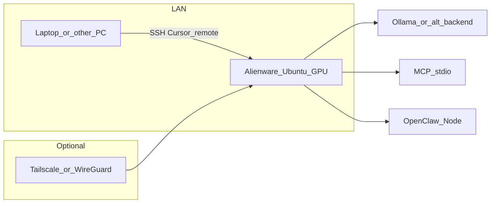

# Linux memory, documented services, optional backends, and stack synthesis

## Ground truth from your repo (hardware)

| Spec                               | Source                                                                                                                                   | Implication                                                                                                                     |
| ---------------------------------- | ---------------------------------------------------------------------------------------------------------------------------------------- | ------------------------------------------------------------------------------------------------------------------------------- |
| **eGPU: GTX 1060, 6 GB VRAM**      | [HARDWARE.md](D:/portfolio-harness/local-proto/docs/HARDWARE.md), [REQUIREMENTS.md](D:/portfolio-harness/local-proto/REQUIREMENTS.md) §4 | Model tier is **VRAM-bound** on GPU; 7B–13B quantized is the documented band—larger models need offload/CPU or a different GPU. |
| **Jetson ~4 GB** (secondary)       | Same                                                                                                                                     | Not your primary GPU host.                                                                                                      |
| **System RAM (Alienware Mini v2)** | **Not** in repo                                                                                                                          | **Do not assume** SODIMM vs soldered LPDDR5 without Dell specs for **your SKU**.                                                |

**Cost-accessible “RAM/swap” recommendation (before buying modules):**

1. **Ubuntu swap file** (e.g. 1–2× physical RAM or 16–32 GB on NVMe): cheapest reliability upgrade for OOM during model load, `git`, parallel MCP—no hardware SKU dependency. Document `swapon`, `/etc/fstab` persistence, and `vm.swappiness` tuning (e.g. 10–60) in new doc (below).
2. **zram** (optional, `zram-config` or systemd-zram): compresses anonymous pages—often pairs well with small-RAM SFF PCs; low cash cost.
3. **Physical RAM upgrade** only after confirming **upgrade path** for your Mini v2 variant (many compact units are **soldered** or single-slot). If upgradeable, match **DDR5 SODIMM** speed/capacity per Dell/Hynix compatibility—**budget is SKU-specific**; the plan cannot quote a price without your exact model.

**Constraint:** GPU VRAM stays **6 GB** until you change the card; more system RAM helps **host + Cursor + MCP + disk cache**, not VRAM.

---

## Remote use (only this box is GPU host)

Align with existing intent: **desktop + SSH** + optional **Tailscale/WireGuard** ([UBUNTU24_CURSOR_ALIGNMENT.md](D:/portfolio-harness/local-proto/docs/UBUNTU24_CURSOR_ALIGNMENT.md) Primary host section).

**Documented services** should spell out:

- `**openssh-server`** (LAN SSH).
- `**ufw`** (or firewalld): allow SSH from **trusted subnet only** by default; document **Ollama bind** (`127.0.0.1` vs LAN) as a conscious choice.
- Optional **Tailscale** / **WireGuard**: pointer to upstream install only (no vendor secrets in-repo)—already consistent with your “no full VPN runbook” stance.

---

## New / updated docs (canonical: `portfolio-harness/local-proto/docs`)

### 1. `LINUX_MEMORY_AND_SWAP.md` (new)

- Tie to **GTX 1060 6 GB** vs **system RAM unknown**: explain **host RAM + swap** vs **VRAM** for Ollama.
- Sections: swap file creation on Ubuntu 24.04; optional zram; when to consider RAM sticks (after Dell verification); link [LINUX_INSTALL.md](D:/portfolio-harness/local-proto/docs/LINUX_INSTALL.md).

### 2. `LINUX_DOCUMENTED_SERVICES.md` (new)

- **Purpose:** Single place for **systemd user or system units** (templates, not committed secrets): `ollama` (if not using upstream installer service), `ssh`, optional `openclaw` (Node), optional `orchestrator` pointing at [ORCHESTRATOR_CONFIG.md](D:/portfolio-harness/local-proto/docs/ORCHESTRATOR_CONFIG.md).
- Cross-link [SCHEDULED_TASKS.md](D:/local-proto/docs/SCHEDULED_TASKS.md) Linux appendix (extend if needed) so Windows `schtasks` and Linux **systemd timers** stay parallel.
- **Remote matrix:** Local GUI vs SSH vs VPN—one table.

### 3. `OPTIONAL_INFERENCE_BACKENDS.md` (new, short)

- **Default:** **Ollama** (already in [OPENCLAW.md](D:/portfolio-harness/local-proto/docs/OPENCLAW.md) local backends).
- **When to add vLLM:** throughput / OpenAI-compatible API / multi-request serving—typically **Docker + NVIDIA Container Toolkit** on Ubuntu; **not** required for MVP.
- **llama.cpp:** `llama-server` binary path—use when you want smallest dependency surface; same `baseUrl` pattern as Ollama for OpenClaw if HTTP-compatible.
- Explicit **out of scope:** full eGPU troubleshooting beyond drivers (per decision-log MVP).

### 4. `PYTHON_VENV_MCP.md` (new, short)

- Pattern: `python3 -m venv ~/venvs/harness-mcp` (path TBD), `source .../bin/activate`, `pip install` packages needed by MCP servers; set `**mcp.json`** `command` to **venv python** absolute path **or** wrap in a shell script that activates venv—document one canonical approach.
- Align with [FIRST_INSTALL_RUNBOOK.md](D:/portfolio-harness/local-proto/docs/FIRST_INSTALL_RUNBOOK.md) “pip install mcp-server-git” so human and agent use the same venv.

### 5. `AUTONOMOUS_STACK_LANDSCAPE.md` (new — research synthesis)

**Goal:** One map of **life-assist autonomous system** without duplicating every README.

Suggested structure:

- **Hardware:** Alienware Mini v2 + eGPU **6 GB** + Ubuntu 24.04 primary ([scope_nas_assistant.md](D:/portfolio-harness/local-proto/docs/scope_nas_assistant.md), decision-log 2026-03-22 / 2026-03-24).
- **local-proto:** MCP, SCP, vault, orchestrator handoff, pre-install verification, intent checksum.
- **portfolio-harness:** Org-intent, `.cursor` skills, LangChainChatBot as **optional RAG/app** under harness—not the messaging shell; link [LangChainChatBot/README](D:/portfolio-harness/LangChainChatBot/README.md) if present.
- **openharness:** Planning/verification/critic patterns; brain-map / handoff—**governance**, not runtime on GPU.
- **OpenAtlas:** App + DB contract; self-hosted paths per decision-log—not required on the Alienware unless you run that workload there.
- **Flows:** Cursor (sync dev) vs OpenClaw (async channel) vs orchestrator (handoff file)—resolve overlap in prose (“when to use which”).

Append **one line** to [decision-log.md](D:/portfolio-harness/.cursor/state/decision-log.md) when the synthesis doc lands.

### 6. Sibling mirror

Copy or symlink policy: mirror substantive new files to [D:/local-proto/docs/](D:/local-proto/docs/) with sibling path adjustments (same pattern as [scope_nas_assistant.md](D:/local-proto/docs/scope_nas_assistant.md)).

### 7. `HARDWARE.md` hygiene (small)

- Top “Primary topology” still says **x64 Windows** in places ([HARDWARE.md](D:/portfolio-harness/local-proto/docs/HARDWARE.md) L9). Add a **single** banner line: **Ubuntu 24.04 LTS primary OS supported**; link `UBUNTU24_CURSOR_ALIGNMENT.md`—avoid full rewrite in this pass.

---

## Mermaid: service + remote mental model

---

## Implementation order

1. `LINUX_MEMORY_AND_SWAP.md` + `HARDWARE.md` one-line OS alignment.
2. `LINUX_DOCUMENTED_SERVICES.md` + extend [SCHEDULED_TASKS.md](D:/local-proto/docs/SCHEDULED_TASKS.md) pointer if needed.
3. `OPTIONAL_INFERENCE_BACKENDS.md` + `PYTHON_VENV_MCP.md`.
4. `AUTONOMOUS_STACK_LANDSCAPE.md` + decision-log entry.
5. Mirror to `D:\local-proto\docs\` + link from [LINUX_INSTALL.md](D:/portfolio-harness/local-proto/docs/LINUX_INSTALL.md) “See also” section.

---

## Out of scope (this plan)

- Purchasing specific RAM SKUs or opening the chassis.
- Production Kubernetes or multi-node inference.
- Changing OpenAtlas/Postgres topology beyond documentation links.

