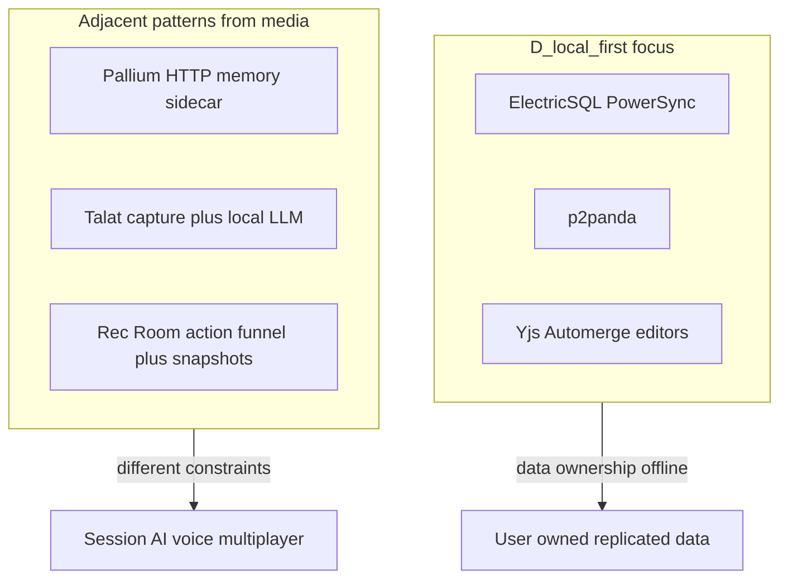

# Local-first knowledge: media gap analysis (updated)

## Sources

| Source                                                                                                                                | Status                                                                                                                                                       | Canonical link                                                  |
| ------------------------------------------------------------------------------------------------------------------------------------- | ------------------------------------------------------------------------------------------------------------------------------------------------------------ | --------------------------------------------------------------- |
| Gmail inbox thread                                                                                                                    | Not needed. that is the PDF                                                                                                                                 | N/A                                                             |
| [Pallium](https://github.com/rore/Pallium)                                                                                            | Summarized from README                                                                                                                                       | MIT; Python/FastAPI agent memory sidecar                        |
| [Talat (TechCrunch)](https://techcrunch.com/2026/03/24/talats-ai-meeting-notes-stay-on-your-machine-not-in-the-cloud/)                | Summarized                                                                                                                                                   | Mac local AI meeting notes; FluidAudio; MCP/Obsidian            |
| [Rec Room Circuits V2 (tyleo.com)](https://www.tyleo.com/blog/how-we-synchronized-editing-for-rec-rooms-multiplayer-scripting-system) | Full text from [PDF](c:/Users/schum/Downloads/How%20We%20Synchronized%20Editing%20for%20Rec%20Room's%20Multiplayer%20Scripting%20System%20-%20tyleo.com.pdf) | Multiplayer scripting sync; Redux-style reducers; action funnel |

---

## What [D:/local-first/](D:/local-first/) optimizes for today

From [README.md](D:/local-first/README.md), [RESOURCES.md](D:/local-first/RESOURCES.md), [LEARNING_PATH.md](D:/local-first/LEARNING_PATH.md), [STACK_MATRIX.md](D:/local-first/STACK_MATRIX.md), [AI_SECURITY.md](D:/local-first/AI_SECURITY.md):

- **Primary lens:** Offline-first / **client-owned SQLite** sync with commercial engines (ElectricSQL, PowerSync), P2P (p2panda), or git-embedded patterns.
- **Collaboration row:** Yjs / Automerge / Liveblocks for **realtime editing**; CRDTs called out explicitly.
- **AI angle:** Retain, Ollama, encryption/traceability — **app data + RAG-ish** security, not a dedicated “agent memory HTTP API.”

The [local-first SKILL](D:/portfolio-harness/.cursor/skills/local-first/SKILL.md) mirrors that: triggers are sync engines, CRDTs, Electric, PowerSync — **not** session-based multiplayer reducers or desktop audio pipelines.

---

## Gap analysis by artifact

### 1. Pallium (agent memory sidecar)

- **What it is:** Local-first **memory service** for agents: ingest evidence, extract structured memory (decisions/findings/checkpoints), hybrid retrieval (lexical + vector + RRF), `POST /query` with injection decisions. Explicitly **not** a transcript archive or general vector DB.
- **Gap:** [RESOURCES.md](D:/local-first/RESOURCES.md) lists **Retain** as “AI conversations → SQLite” but does **not** cover a **standalone sidecar** pattern (HTTP API, visibility scopes, evidence-backed injection). Pallium fills a **different box** than sync engines.
- **Archive value:** Named pattern + link for “local agent memory layer” next to Retain.

### 2. Talat (local meeting AI)

- **What it is:** Mac app; **on-device** transcription (FluidAudio / Neural Engine); optional cloud LLM or Ollama; summarization; Obsidian export, webhooks, **MCP server** for on-demand access; privacy positioning.
- **Gap:** D:/local-first/ does **not** index **desktop capture pipelines** (Core Audio Taps, on-device STT) or **meeting-specific** local AI products. [AI_SECURITY.md](D:/local-first/AI_SECURITY.md) mentions Ollama and encryption but not **voice/audio** as sensitive modality or **MCP as export surface** for local data.
- **Archive value:** Short “local AI modalities” note: text/chat vs voice capture; link Talat article as product exemplar; MCP as integration pattern (aligns with broader portfolio agent tooling, not yet in this seed).

### 3. Rec Room Circuits V2 (tyleo / PDF)

- **Core architecture:** Single game object for all Circuits; state as **one global Redux-like tree**; changes only via **protobuf actions** and pure **reducers** `f(S1, A) = S2`; **one RPC** for all mutations.
- **Ordering / consistency:** **Action funnel** — all actions go to a single **owner** client, then broadcast; **serializable isolation** (quote from *Designing Data-Intensive Applications*). Not CRDT; avoids P2P ordering explosions.
- **Ops patterns:** Join-in-progress via **InitializePayloadData** snapshots + replay; compression/splitting on the single path; **action logging** and replay for tests; **Watchdog** state hashes every ~15m for divergence detection.
- **Explicit non-goals:** “Social solutions to social problems” — **drop** actions on master disconnect rather than complex replay; **decline** heavy concurrent-edit-on-same-object tech (compare to Google Docs usage).
- **Gap vs D:/local-first/:**
  - **Different problem domain:** Session-scoped **realtime multiplayer** with a **designated serializer**, not offline-first **bidirectional DB sync**.
  - **Contrast with [LEARNING_PATH.md](D:/local-first/LEARNING_PATH.md):** Doc steers collaborative editing to **Yjs/Automerge**; Rec Room argues **simple serial funnel + social tolerance** can beat sophisticated merge for their workload.
  - **Missing vocabulary:** No row for **“owner-serialized action log + periodic snapshots”** or **reducer-only state** as a **deliberate alternative** to CRDT when constraints allow.
- **Archive value:** High — canonical **industry case study** for “boring architecture wins”; cite tyleo blog + optional PDF path for internal notes.

### 4. Gmail thread

- Remains **out of scope** until you paste key content or confirm skip.

---

## Suggested archive documentation (when you execute)

One compact addition avoids scattering facts:

- **Option A:** New file [D:/local-first/CASE_STUDIES.md](D:/local-first/CASE_STUDIES.md) (or `MEDIA_NOTES.md`) with sections: Agent memory (Pallium), Local AI modalities (Talat + link), Multiplayer action funnel (Rec Room + link).
- **Option B:** Extend [RESOURCES.md](D:/local-first/RESOURCES.md) with small tables: “Agent memory / sidecars”, “Exemplar: local voice+LLM”, “Further reading: realtime sync patterns (non-CRDT)”.

Update [README.md](D:/local-first/README.md) “If you are…” row only if the new doc is added.

Optional: add triggers in [SKILL.md](D:/portfolio-harness/.cursor/skills/local-first/SKILL.md) for **agent memory sidecar**, **multiplayer action log**, **on-device audio AI** so agents load this skill when those keywords appear (still points to D:/local-first/).

---

## Mermaid: where these sit vs classic local-first sync

---

## Risk note

Doc-only updates to D:/local-first/ and the skill file are **low risk**; no git tag required for a few markdown edits. Follow portfolio decision-log rule if you log a stack choice.

---

## Definition of done (after execution)

- CASE_STUDIES or RESOURCES extended with Pallium, Talat, Rec Room citations.
- SKILL triggers updated if you want discovery.
- Optional: one line in [portfolio-harness/.cursor/state/decision-log.md](D:/portfolio-harness/.cursor/state/decision-log.md) under **[Local-first]** documenting “expanded media notes.”

