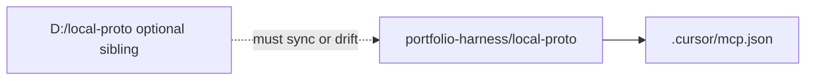

# local-proto canonical source and follow-up recommendations

## 1. Single source of truth (analysis conclusion)

**Finding: treat `[portfolio-harness/local-proto/](D:/portfolio-harness/local-proto/)` as canonical** for:

- **Cursor runtime:** `[portfolio-harness/.cursor/mcp.json](D:/portfolio-harness/.cursor/mcp.json)` hardcodes `D:/portfolio-harness/local-proto/scripts/...` (e.g. `audit_wrapper`, `credential_vault_mcp`, `fish_speech_mcp.py`).
- **Default topology:** `[docs/LINUX_INSTALL.md](D:/local-proto/docs/LINUX_INSTALL.md)` (same text in both trees, lines 5–6) states the default layout is a **portfolio-harness checkout with `local-proto/` inside**; `LOCAL_PROTO_REPO_ROOT` is only for when the clone lives elsewhere.
- **Code drift:** Not a harmless duplicate—`[observation_mcp.py](D:/portfolio-harness/local-proto/scripts/observation_mcp.py)` under portfolio has **three** tools (`observation_log_append`, `observation_list`, `observation_read`) plus SCP gate on append; the `[D:/local-proto/scripts/observation_mcp.py](D:/local-proto/scripts/observation_mcp.py)` copy is **append-only** (82 lines vs 198). Portfolio also carries **only** `[capability_mcp.py](D:/portfolio-harness/local-proto/scripts/capability_mcp.py)`, `[fish_speech_mcp.py](D:/portfolio-harness/local-proto/scripts/fish_speech_mcp.py)`, extra tests, `tool_safeguards.json`, etc.

**Role of `D:\local-proto`:** Valid as a **sibling clone** for paths/docs that still say `D:/local-proto` (e.g. examples in `[docs/MCP_SERVERS.md](D:/local-proto/docs/MCP_SERVERS.md)`), but it should **track** the portfolio nested copy or those examples should be updated—otherwise parity and audits will keep diverging.

`**verify_capability` / Capability MCP:** Implemented under portfolio `[capability_mcp.py](D:/portfolio-harness/local-proto/scripts/capability_mcp.py)`; documented in `[MCP_CAPABILITY_MAP.md](D:/portfolio-harness/.cursor/docs/MCP_CAPABILITY_MAP.md)` and `[AUTHORITY_GAPS.md](D:/portfolio-harness/docs/AUTHORITY_GAPS.md)`. **It is not referenced in** `[mcp.json](D:/portfolio-harness/.cursor/mcp.json)` (grep: no matches)—so agents do **not** get a false “verified” signal from a default-enabled stub. Policy is already “opt-in server + prompt discipline.”

---

## 2. Entity × tool matrix (planned doc change)

Add a **short subsection** (one table) in a single place—best fit: `[docs/MCP_SERVERS.md](D:/portfolio-harness/local-proto/docs/MCP_SERVERS.md)` after the Survival / vault sections, or a new `[docs/ENTITY_CRUD_MATRIX.md](D:/portfolio-harness/local-proto/docs/ENTITY_CRUD_MATRIX.md)` linked from `MCP_SERVERS.md` and `TOOL_SAFEGUARDS.md` to avoid duplication.

**Content (from code review; to be pasted as the table body):**

| Entity                      | Create                                                                                          | Read                                                                    | Update                                                                    | Delete                                        | List                                                                  |
| --------------------------- | ----------------------------------------------------------------------------------------------- | ----------------------------------------------------------------------- | ------------------------------------------------------------------------- | --------------------------------------------- | --------------------------------------------------------------------- |
| **Survival KB chunks**      | Human/script: `[survival_kb_ingest.py](D:/local-proto/scripts/survival_kb_ingest.py)` (not MCP) | MCP: `survival_search`, `survival_get_chunk`                            | MCP: `survival_record_feedback` (feedback only; not arbitrary chunk edit) | Not via MCP                                   | MCP: `survival_list_sources`                                          |
| **Credential vault (site)** | MCP: `credential_vault_create`                                                                  | MCP: `credential_vault_get`                                             | MCP: `credential_vault_update`                                            | MCP: `credential_vault_revoke`                | MCP: `credential_vault_list` (+ `credential_vault_export` for backup) |
| **Bitcoin observations**    | MCP: `observation_log_append`                                                                   | MCP: `observation_read` (portfolio) / filesystem (D:\local-proto stale) | Append-only model; no in-place edit                                       | Not via MCP (delete would be human/file edit) | MCP: `observation_list` (portfolio only)                              |

**Note in table footer:** If `D:\local-proto` is refreshed from portfolio, observation parity matches portfolio.

---

## 3. AITrends split (optional, defer)

No doc change required now. If you pursue higher primitive score later: identify **stable** operations in `[ai_trends_mcp.py](D:/portfolio-harness/local-proto/scripts/ai_trends_mcp.py)` (e.g. fetch vs summarize vs ingest), extract to thin tools, leave orchestration to the agent prompt. Track as a separate refactor with tests.

---

## 4. verify_capability policy (minimal action)

**Current state is acceptable:** stub not in default `mcp.json`, docs say `verified=false` until AuthModule.

**Optional follow-ups (pick one):**

- **A (documentation only):** Add one line in `[MCP_SERVERS.md](D:/portfolio-harness/local-proto/docs/MCP_SERVERS.md)` under Capability: “Not enabled in default `mcp.json`; enable only when testing hb-4 wiring.”
- **B (future):** When AuthModule exists, register server + gate high-risk tools in code or skills.

No requirement to remove `capability_mcp.py` from portfolio.

---

## 5. Canonical “SSOT” doc (one-time)

Add a short **“Repository layout”** blurb (5–8 lines) to `[portfolio-harness/local-proto/REQUIREMENTS.md](D:/portfolio-harness/local-proto/REQUIREMENTS.md)` or `[README](D:/portfolio-harness/local-proto/)` if present: canonical path = nested under portfolio-harness; sibling `D:\local-proto` = optional mirror; sync policy = “one direction: portfolio → sibling or retire sibling.”

---

## Implementation order (after approval)

1. Add SSOT blurb + entity matrix (or new `ENTITY_CRUD_MATRIX.md` + link).
2. Optionally align `D:\local-proto\scripts\observation_mcp.py` with portfolio (or delete sibling copy if unused).
3. Optional: Capability line in `MCP_SERVERS.md` re default mcp.json.

