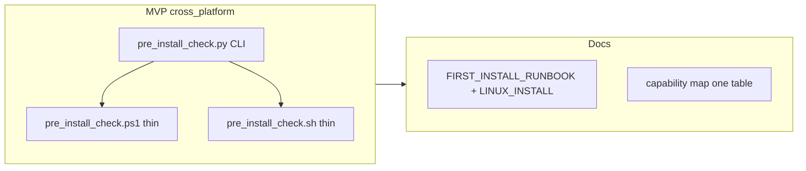

# local-proto Ubuntu LTS transition plan

## Locked product decisions (for this plan)

| Topic               | Choice                                 | Rationale                                                                                                                                                                                                                                                                       |
| ------------------- | -------------------------------------- | ------------------------------------------------------------------------------------------------------------------------------------------------------------------------------------------------------------------------------------------------------------------------------- |
| **Deployment mode** | **(c) Both, default = Ubuntu Desktop** | Aligns with existing decision: Alienware mini + eGPU as Cursor/Ollama host ([decision-log 2026-03-22](D:/portfolio-harness/.cursor/state/decision-log.md)). **Server + SSH + Remote SSH** documented as a supported variant for headless inference; not the default happy path. |
| **Parity level**    | **Phased**                             | **MVP:** path checks, pip/git MCP, npx, Ollama verify, MCP warmup, intent checksum — same commands for human and agent. **Backlog:** stealth regtest, Daggr registry, NIM smoke, vehicle recovery schedules, vault sync, audit rotation — port after MVP is green on hardware.  |

## Current state (inventory)

- **Runbook:** [local-proto/docs/FIRST_INSTALL_RUNBOOK.md](D:/local-proto/docs/FIRST_INSTALL_RUNBOOK.md) — Windows/WSL2, PowerShell env (`LOCAL_PROTO_REPO_ROOT`, `NPX_PATH`), `pre_install_check.ps1`, `verify_ollama_llm.ps1`.
- **Pre-install:** [local-proto/scripts/pre_install_check.ps1](D:/local-proto/scripts/pre_install_check.ps1) — ~180 lines: path matrix (repo, `.cursor/mcp.json`, Arc_Forge sibling, `kb.sqlite3`, `obsidian_cursor_integration`), pip import, npx resolution (Windows-specific paths), Tier1 MCP tests, Ollama/NIM optional skips. **Core logic belongs in Python** so Linux/macOS/Windows share one implementation.
- **Other `*.ps1`:** `verify_ollama_llm.ps1`, `verify_nim_llm.ps1`, `mcp_warmup.ps1`, `check_intent_checksum.ps1`, `run_stealth_regtest.ps1`, `run_daggr_registry.ps1`, `import_operator_alignment_openatlas.ps1`, `sync_harness_to_vault.ps1`, `rotate_audit_logs.ps1`, `run_nim_smoke.ps1`, `run_vehicle_recovery_scheduled.ps1` (+ `.cmd` wrapper). MVP covers the first four categories; rest = backlog.
- **Scheduling:** [local-proto/docs/SCHEDULED_TASKS.md](D:/local-proto/docs/SCHEDULED_TASKS.md) already mentions cron equivalents; expand with **systemd user units + timers** templates mirroring `schtasks` examples (orchestrator, intent drift).
- **Intent:** [local-proto/docs/INTENT_CHECKSUM.md](D:/local-proto/docs/INTENT_CHECKSUM.md) uses `%LOCALAPPDATA%` for checksum storage — Linux plan must use **XDG** (e.g. `$XDG_STATE_HOME/local-proto/` or `~/.local/state/local-proto/`).

## Architecture (agent-native)

- **Single source of truth:** Implement `pre_install_check` (and shared helpers for npx resolution, Ollama ping, Tier1) in **Python** under `local-proto/scripts/` (e.g. `pre_install_check.py` with `if __name__ == "__main__"` or a small `local_proto_cli` package if you prefer namespacing later).
- **Thin wrappers:** Keep `pre_install_check.ps1` as a **caller** of `python .../pre_install_check.py` with the same flags (`--accept-2-of-3`, `--skip-ollama`, etc.) to avoid duplicated business logic. Add `pre_install_check.sh` that exports env and invokes the same module.
- **Capability map:** One table in [LINUX_INSTALL.md](D:/local-proto/docs/LINUX_INSTALL.md) (new) or a **“Commands (all platforms)”** section: Human action → `python -m ...` or `./scripts/pre_install_check.sh` → exit codes.
- **Context injection:** Document `LOCAL_PROTO_REPO_ROOT`, `NPX_PATH` (Linux: path to `npx` when using nvm/fnm), optional `XDG_*` for intent checksum; example `export` lines for `~/.profile` or systemd `Environment=`.

## Tech-lead: file placement

| Deliverable                                  | Location                                                                                                                                                                            |
| -------------------------------------------- | ----------------------------------------------------------------------------------------------------------------------------------------------------------------------------------- |
| Cross-platform pre-install / verify          | `local-proto/scripts/pre_install_check.py` (and small shared `verify_ollama_llm` if not already Python-invokable)                                                                   |
| Thin shell entrypoints                       | `local-proto/scripts/pre_install_check.sh`, optional `mcp_warmup.sh`                                                                                                                |
| Linux-first install + NVIDIA/Ollama pointers | **New** [local-proto/docs/LINUX_INSTALL.md](D:/local-proto/docs/LINUX_INSTALL.md) (apt Node, official Ollama install, NVIDIA driver stack — link to Ubuntu docs; no vendor secrets) |
| Windows/Linux path table                     | Section in LINUX_INSTALL + short pointer from [FIRST_INSTALL_RUNBOOK.md](D:/local-proto/docs/FIRST_INSTALL_RUNBOOK.md)                                                              |
| systemd templates                            | New subsection under [SCHEDULED_TASKS.md](D:/local-proto/docs/SCHEDULED_TASKS.md) or `docs/systemd/` snippets                                                                       |
| Decision                                     | One line in [portfolio-harness/.cursor/state/decision-log.md](D:/portfolio-harness/.cursor/state/decision-log.md) after scope approval                                              |

## Risks

| Risk                                            | Mitigation                                                                                                                                                                                                   |
| ----------------------------------------------- | ------------------------------------------------------------------------------------------------------------------------------------------------------------------------------------------------------------ |
| **NVIDIA + eGPU (Thunderbolt)**                 | Document BIOS steps (TB security), `ubuntu-drivers devices`, optional `nvidia-smi` gate in runbook; out-of-scope: full eGPU troubleshooting — link Ubuntu/NVIDIA KB.                                         |
| `**mcp.json` absolute paths**                   | Runbook: `sed`/editor examples for `$HOME/Code/portfolio-harness`; optional future: env-substitution doc only (no behavior change in MVP).                                                                   |
| **Optional path `obsidian_cursor_integration`** | Pre-install already treats as required path check — clarify **Linux clone location** or make check **warn-only** if product accepts missing Obsidian bridge on server-only installs (decision in MVP scope). |
| **Snap**                                        | Prefer apt/deb Node or NodeSource/nvm; Ollama official `.deb` or install script per upstream; document “avoid snap for node/ollama if preferred.”                                                            |

## Verification (definition of done for MVP)

Run on a fresh Ubuntu 22.04 or 24.04 machine (Desktop or Server+SSH):

1. `python3 -m pip install mcp-server-git` (or project venv pattern if you add one later)
2. `node -v` / `npx --version`
3. Ollama installed and `ollama run <model>` works
4. `python local-proto/scripts/pre_install_check.py` (or equivalent) **exit 0**
5. `python` or script invocation of `verify_ollama_llm` equivalent **exit 0**
6. `mcp_warmup` equivalent succeeds after Cursor loads `.cursor/mcp.json`
7. `check_intent_checksum` works with XDG state dir on Linux

## Intent / decision one-pager (for org-intent or checksum narrative)

> **Commitment:** local-proto adds **Ubuntu LTS 22.04/24.04** as a **supported primary Linux path** alongside Windows, with **phased parity**: MVP delivers cross-platform **pre-install, Ollama verify, MCP warmup, intent checksum** via shared Python + documented env paths; Windows PowerShell remains thin wrappers. **Out of scope for MVP:** full port of stealth/Daggr/NIM/vehicle-recovery automation; new sync engines; any change to org-intent semantics beyond checksum storage location on Linux.

## Implementation phases (WBS)

1. **Inventory & design** — List CLI flags mapping PS1 → Python; define XDG path for intent checksum on Linux; confirm MVP script list.
2. **Extract pre_install_check to Python** — Behavior parity with [pre_install_check.ps1](D:/local-proto/scripts/pre_install_check.ps1); refactor PS1 to delegate.
3. **MVP scripts** — `verify_ollama_llm`, `mcp_warmup`, `check_intent_checksum`: either Python modules or sh wrappers calling existing minimal logic; fix `%LOCALAPPDATA%` → XDG on non-Windows in checksum script or companion `.py`.
4. **Docs** — Add LINUX_INSTALL.md; update FIRST_INSTALL_RUNBOOK with “Linux quick path” link; path migration table; capability map; NVIDIA/Ollama section; mcp.json examples with `$HOME`.
5. **Scheduling appendix** — systemd user timer examples in SCHEDULED_TASKS.md matching orchestrator/intent jobs.
6. **Backlog (later)** — Remaining PS1 ports; optional CI job `ubuntu-latest` running MVP verify only.

## local-first / constraints

- No new sync engine; reference [D:/local-first/RESOURCES.md](D:/local-first/RESOURCES.md) only if persistence docs need a cross-link.
- Security: follow [TOOL_SAFEGUARDS.md](D:/local-proto/docs/TOOL_SAFEGUARDS.md); no secrets in docs; vault patterns unchanged.

