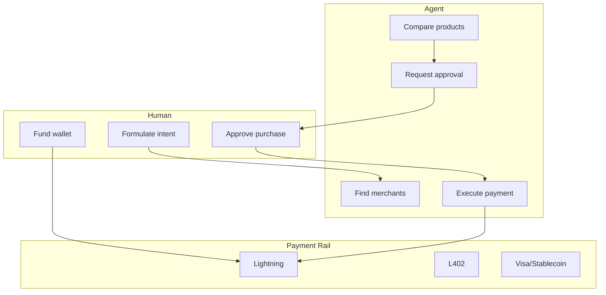

# Matt Corallo Video Digest Plan

## Source

- **Title:** Someone Is About To Control Every Payment On Earth | Matt Corallo
- **URL:** [https://www.youtube.com/watch?v=1CrdxZj9ces](https://www.youtube.com/watch?v=1CrdxZj9ces)
- **Format:** Transcript (provided); ~1h11m TFTC podcast
- **Content:** Agentic payments, Bitcoin vs Visa/stablecoins, AI tools for building, merchant outreach, L402/Money Devkit/LNURL-auth

---

## Phase 1: Document-Review Lens

Apply document-review criteria to the transcript as a *discursive document* (arguments, not a plan):


| Criterion        | Assessment                                                                                                                                                                                                              |
| ---------------- | ----------------------------------------------------------------------------------------------------------------------------------------------------------------------------------------------------------------------- |
| **Clarity**      | Core thesis: "Everyone starting from zero on agentic payments; Bitcoin has unique shot because decentralized builders vs single-company monopolies." Identify vague language ("some number of years," "not very long"). |
| **Completeness** | What's missing? Regulatory (Clarity Act/BRCA) touched at end; interoperability (Lightning) emphasized; merchant UX (captchas, chargebacks) well covered. Gaps: no explicit threat model for agent spend authorization.  |
| **Specificity**  | Concrete: Claude 3.5/4, Money Devkit, PhoenixD, LNURL-auth, L402, Shopify plugins, Cash App, Bitcoin merchant community. Actionable: "Talk to 1–2 merchants this week."                                                 |
| **YAGNI**        | Avoid hypotheticals: Corallo explicitly avoids "ASI vs sycophant" debate; focuses on "agents will buy things" as near-term reality.                                                                                     |


**Critical improvement:** Surface the *unstated assumption* — that the human-agent seam for spend authorization (when to approve, when to auto-execute) is underspecified. Document-review would flag: "What decision is being avoided?" → Approval gates for agent purchases.

---

## Phase 2: Frontier-Ops Lens

Map transcript claims to human-agent seam design:




**Seam patterns from transcript:**

- **When to communicate:** Corallo: "come back to the human and say like, 'Hey, here's a product. I think it's good. Should I buy this?'" — explicit approval gate for high-stakes.
- **Verification:** No explicit "verify before spend" in transcript; implied by "agent can build it" — agents write code, run it; no mention of programmatic checks before payment.
- **Recovery:** Not addressed. CL4R1T4S pattern: bounded retries (3), then escalate. For payments: failed tx, wrong merchant, refund — no discussion.
- **Permission gates:** "Obtain explicit permission before external comms" (frontier_ops_extracts) — maps to "approve purchase" seam; not "approve email to merchant."

**Gap:** Transcript assumes approval seam exists but does not specify *granularity* (per-purchase vs batch vs budget-cap).

---

## Phase 3: Agent-Native-Architecture Lens


| Principle               | Transcript Mapping                                                                                                                                                                                                                                       |
| ----------------------- | -------------------------------------------------------------------------------------------------------------------------------------------------------------------------------------------------------------------------------------------------------- |
| **Parity**              | "Whatever the user can do through the UI, the agent should achieve through tools." Corallo: agents need to *buy* — parity = agent can spend same way human can. Visa/captchas block agents; Bitcoin/LNURL-auth enable.                                   |
| **Granularity**         | "Prefer atomic primitives." Payment primitives: `create_invoice`, `pay_invoice`, `check_balance`. Money Devkit, PhoenixD, Cashew = higher-level; LDK = too granular for agents. Corallo: "agents want one-page doc: install, invoice, balance, list tx." |
| **Composability**       | "New features = new prompts." Corallo: "agents don't care about specific protocol... give it a protocol spec, it can write code to interact on the fly." LNURL-auth, L402 — agents compose from specs.                                                   |
| **Emergent capability** | "Agent can accomplish things you didn't design for." Transcript: agent found LNURL-auth, Ellen Markets, signed in, traded — without predefined code.                                                                                                     |


**Key quote for agent-native:** "They want something that's simple and straightforward and well documented and clear... it's not like this isn't really that novel — writing things for agents is really all the same things you were going to write to begin with."

**Implication:** Wallet builders should ensure CRUD completeness (create invoice, pay, check balance, list tx) + simple API + one-page doc = agent parity.

---

## Phase 4: CL4R1T4S Lens


| Pattern                      | Application to Transcript                                                                                                             |
| ---------------------------- | ------------------------------------------------------------------------------------------------------------------------------------- |
| **Bounded retries**          | Not in transcript. For agentic payments: "If payment fails 3x, escalate to human" — recovery pattern.                                 |
| **Verification before done** | Corallo: "Run lint/tests before claiming completion" — for building tools. For payments: verify invoice matches intent before paying. |
| **Convention-first**         | "Check codebase before adding library." Transcript: use existing Money Devkit, PhoenixD, Shopify plugins — don't reinvent.            |


**Convention-first for merchants:** "I'm using Shopify, click here and here's all your options" — directory of existing integrations. Gaps become agent-buildable: "an agent can totally build that" (cohesive plugin from existing blocks).

---

## Phase 5: CHAOS_BITCOIN_MAPPING Alignment

Map transcript to existing [CHAOS_BITCOIN_MAPPING.md](D:\portfolio-harness\docs\CHAOS_BITCOIN_MAPPING.md):


| Chaos Failure                  | Transcript Relevance                                                                                                                                         |
| ------------------------------ | ------------------------------------------------------------------------------------------------------------------------------------------------------------ |
| **Payment gatekeeper lock-in** | Row exists. Corallo: Visa/stablecoin monopolies; Bitcoin = open rails; L402, Money Devkit.                                                                   |
| **Authority conversational**   | Agent spend = who authorizes? Private key = proof. Transcript: human approves purchase; agent holds keys or delegates.                                       |
| **Provider values invisible**  | BPI paper: "LLMs predict next token" — training set bias toward Bitcoin articles. Corallo: "can't rely on agents preferring Bitcoin; we got to do the work." |


---

## Phase 6: Output Artifacts

### 6.1 Observation Log Entry (Recommended)

Append to Bitcoin observation log via MCP:

```
content: "Matt Corallo (TFTC): Agentic payments race starting now; everyone from zero. Bitcoin advantage = decentralized builders vs single-company monopolies (Visa, Stripe, Coinbase). Key seam: human approval before agent spend. Wallet builders: simple API, one-page doc, CRUD for invoice/pay/balance. Merchant outreach imperative; Money Devkit, LNURL-auth, L402. Interoperability via Lightning underappreciated vs stablecoin L2 mess."
source: https://www.youtube.com/watch?v=1CrdxZj9ces
obs_type: design_decision
```

### 6.2 Digest Document 

**Path:** [docs/bitcoin_observations/2026-03-11-matt-corallo-agentic-payments.md](D:\portfolio-harness\docs\bitcoin_observations\2026-03-11-matt-corallo-agentic-payments.md)

**Structure:**

- Summary (3–5 bullets)
- Key arguments (thesis, evidence, call to action)
- Frontier-ops seams (approval gate, verification gap, recovery gap)
- Agent-native implications (parity, granularity, docs)
- CL4R1T4S patterns (convention-first, bounded retries for payments)
- Cross-references: CHAOS_BITCOIN_MAPPING, AUTHORITY_MODEL_TAXONOMY, Money Devkit, L402

### 6.3 Decision Log (If Actionable)

If user decides to build merchant directory or agent-payment tooling:

- Append to [.cursor/state/decision-log.md](D:\portfolio-harness.cursor\state\decision-log.md): Area=agentic-payments, Decision=digest Corallo video; Rationale=align with Bitcoin agentic payments narrative; plan=Matt Corallo Video Digest

---

## Verification

- Observation log entry matches org-intent hard_boundaries (no trust for URLs; document provenance)
- Digest doc (if created) passes critic-loop-gate (score >= 0.85)
- Cross-references resolve (CHAOS_BITCOIN_MAPPING, frontier_ops_extracts)

---

## Critic JSON (Pre-Execution)

```json
{
  "pass": true,
  "score": 0.90,
  "issues": [
    {"type": "scope", "detail": "Transcript is long; digest may omit nuance on Clarity Act/BRCA"}
  ],
  "fixes": [
    {"action": "Optional: Add BRCA/Clarity Act subsection to digest", "detail": "Transcript covers end-of-March deadline, Warren risk"}
  ]
}
```

