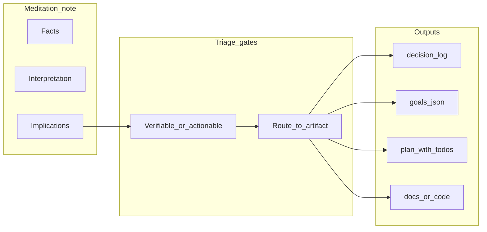

# Identifying features and to-dos from meditations

## Core idea

A **meditation** mixes three layers: **facts** (from the source), **interpretation** (your synthesis), and **implications** (what should change in systems or process). Only **implications** should become backlog items—and only when they pass a **verb + object + acceptance** test.




## Step 1: Tag each paragraph (30 seconds)

While reading or right after writing, label lines:


| Tag   | Question                         | Becomes backlog?                                                                                                 |
| ----- | -------------------------------- | ---------------------------------------------------------------------------------------------------------------- |
| **F** | Cited from paper/source?         | Rarely (unless "verify claim" is the task)                                                                       |
| **I** | Your synthesis / framing?        | Only if it implies a **decision** (log in [decision-log.md](D:/portfolio-harness/.cursor/state/decision-log.md)) |
| **M** | "We should / avoid / measure …"? | **Yes**—candidate feature, doc, or experiment                                                                    |


Your [arxiv meditation note](D:/software/docs/research/arxiv_2509.12190_DECIDE_SIM.md) already structures this: **Compressed take** ≈ F, **Meditation** ≈ I+M.

## Step 2: Turn **M** lines into candidates (the "feature filter")

For each **M** bullet, require:

1. **Verb**: audit | implement | measure | document | spike | deprecate (avoid "consider", "think about").
2. **Object**: one concrete system—e.g. "agent seam for destructive actions", "SCP chunking for PDF ingest", "OpenRouter eval harness".
3. **Acceptance**: one observable outcome—e.g. "checklist exists", "metric in dashboard", "CI runs eval".

**Example from your three threads:**


| Thread              | Candidate backlog item (typed)                                                                                                                                                   |
| ------------------- | -------------------------------------------------------------------------------------------------------------------------------------------------------------------------------- |
| Seam design         | **DOCS/CONFIG:** Add a one-page "catastrophic convenience" checklist to frontier-ops or product-scope template; acceptance: checklist linked from agent review protocol.         |
| ESRS as engineering | **DOCS:** Document ESRS-style feedback as "closed-loop observation shaping" alongside RLHF/critique in alignment notes; acceptance: single comparison table.                     |
| Cooperation at zero | **CODE/TEST (spike):** Prototype one coordination affordance (e.g. commitment message type or shared visible state) in a toy multi-agent sim; acceptance: repro script + metric. |


If you cannot write acceptance in one sentence, the item stays **research debt**—park it under `## Open questions` in the same note, not in `goals.json`.

## Step 3: Route to existing harness artifacts (no new tooling required)

Align with [ALIGNMENT_SURFACE](D:/portfolio-harness/.cursor/docs/ALIGNMENT_SURFACE.md) and [.cursor/state/README](D:/portfolio-harness/.cursor/state/README.md):


| Outcome                           | Where it goes                                                                                                                                                                           |
| --------------------------------- | --------------------------------------------------------------------------------------------------------------------------------------------------------------------------------------- |
| Irreversible choice or stack pick | Append [decision-log.md](D:/portfolio-harness/.cursor/state/decision-log.md) with Area + Rationale + optional `plan:` link                                                              |
| Multi-step work with dependencies | New or updated `.cursor/plans/*.plan.md` (YAML `todos` + overview)—same pattern as [survival_pdfs_scp_archive](D:/software/.cursor/plans/survival_pdfs_scp_archive_812b2b5a.plan.md)    |
| Current sprint / session focus    | [goals.json](D:/portfolio-harness/.cursor/state/goals.json) or `session_brief.md` with `goal_ids`                                                                                       |
| Recurring task shape              | Match a section in [AI_TASK_TEMPLATES.md](D:/software/docs/AI_TASK_TEMPLATES.md) (your typed categories: CONFIG, DOCS, CODE, TEST, DEPLOY per [.cursorrules](D:/software/.cursorrules)) |
| Optional product definition       | `scope_<feature>.md` per state README                                                                                                                                                   |


## Step 4: Optional note template (keeps extraction cheap)

Add a **fixed footer** to meditation-style docs (e.g. under [docs/research/](D:/software/docs/research/)):

```markdown
## Backlog candidates (from meditation)
| ID | Type | Candidate one-liner | Acceptance | Routed to |
|----|------|---------------------|------------|-----------|
| M1 | DOCS | ... | ... | decision-log / plan / goals |
```

Promote rows to real todos when you **rout** them (copy row into plan YAML or goals). IDs tie meditation → plan → handoff.

## Step 5: Cadence (prevents backlog noise)

- **Weekly (5 min):** Scan recent meditation notes; promote at most **3** M-items to plans/goals; demote or merge the rest.
- **After meta-review:** Use [meta-review skill](D:/portfolio-harness/.cursor/skills/meta-review/SKILL.md) alignment with `agent_log` / goals drift to see if meditations generated orphan intents.

## Anti-patterns

- **Ticket = restate the paper title** — no acceptance.
- **Duplicate decision-log and plan** — decision-log is the *why*; plan is the *how* with ordered todos.
- **Everything is P0** — use scarcity: if it does not connect to [org-intent hard_boundaries](D:/portfolio-harness/org-intent-spec/examples/org-intent.example.json) or active goals, it waits in `Open questions`.

## Summary

You identify features/todos by **forcing implications through verb + object + acceptance**, then **routing** to artifacts you already maintain. The meditation file stays the **source**; decision-log, goals, and plans are the **system of record** for execution.