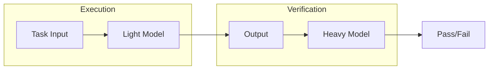

# Model Escalation and Lowest-Viable-Model Brainstorm

## Context

From [BitDevs MPLS 2026-03-10](D:\portfolio-harness\docs\bitcoin_observations\2026-03-10-bitdevs-mpls-seminar-36.md): **Model escalation pattern** — use the lightest model possible for execution; evaluate completion with a stronger but heavier model. Rationale: cost/latency optimization; stronger model for verification only.

**local-proto constraints:** Jetson Nano ~4GB, GTX 1060 6GB VRAM; single `ollama_model` in [orchestrator_config.json](D:\portfolio-harness\local-proto.cursor\orchestrator_config.json); topology A/B (Cursor on 1060, Ollama on Jetson or local). Model selection is essential — wrong model = OOM or unusable latency.

**Existing assets:**

- [AI_TASK_EVALS.md](D:\portfolio-harness.cursor\docs\AI_TASK_EVALS.md) — registry of recurring tasks (handoff, Daggr, plan, RAG, calibration, moral boundary, drift)
- [calibration_test_suite.md](D:\portfolio-harness.cursor\scripts\calibration_test_suite.md) — predict AI success/failure, verification depth
- [ORCHESTRATOR_CONFIG.md](D:\portfolio-harness\local-proto\docs\ORCHESTRATOR_CONFIG.md) — model guidance table (tinyllama/phi on Jetson; llama3.2/qwen2.5:7b on 1060)
- MCP tiers in [mcp_server_tiers.json](D:\portfolio-harness\local-proto\config\mcp_server_tiers.json) — tool tiers, no model tiers yet

---

## Phase 1: Task Taxonomy (Job Types)

Before testing models, we need a **task-type taxonomy** so we can map "job X → minimum viable model."


| Task type                 | Examples                       | Likely model floor      | Rationale                               |
| ------------------------- | ------------------------------ | ----------------------- | --------------------------------------- |
| **Handoff summarization** | handoff → next_prompt          | tinyllama, phi          | Short output; template-following        |
| **Critic / verification** | pass/fail, score, issues       | 7B+ (llama3.2, qwen2.5) | Judgment, nuance, schema compliance     |
| **Plan decomposition**    | WBS, dependencies              | 3B–7B                   | Structure; medium reasoning             |
| **Code generation**       | unit test, refactor            | 7B+                     | Syntax, logic                           |
| **RAG / retrieval**       | semantic search, summarization | 3B–7B                   | Embeddings separate; generation varies  |
| **Moral boundary**        | refuse, escalate               | 7B+                     | Hard boundaries need stronger reasoning |
| **Tool orchestration**    | MCP tool selection             | 3B–7B                   | Depends on tool complexity              |


**Proposed taxonomy source:** Extend AI_TASK_EVALS registry rows into task types with `model_floor` and `verification_model` columns.

---

## Phase 2: Testing Workflow to Find Lowest Viable Model

### 2.1 Binary search (model size)

1. Pick a task type and 3–5 representative test cases (known-good outputs).
2. Start with smallest model (e.g., tinyllama on Jetson).
3. Run task; record pass/fail (critic or human).
4. If pass: try next smaller (or declare floor). If fail: try next larger.
5. Record `(task_type, model, pass_rate)` in eval log.

### 2.2 Escalation pattern (light exec, heavy verify)




**Implementation options:**

- **Option A (orchestrator):** Orchestrator uses `ollama_model` (light) for handoff→prompt; Cursor (heavy) runs critic on handoff. No code change — already split.
- **Option B (explicit):** Add `execution_model` and `verification_model` to orchestrator_config; script runs task with light, then calls heavy for critic.
- **Option C (LiteLLM):** Use LiteLLM proxy for routing; route by task type or fallback chain.

### 2.3 Eval script design

New script: `run_model_floor_evals.ps1` (or `.py`):

- Input: task type, model list (smallest→largest), test cases from AI_TASK_EVALS
- For each model: run task N times; record pass/fail
- Output: `model_floor_results.json` — `{ "handoff_summarization": { "tinyllama": 0.8, "phi": 0.95, "llama3.2": 1.0 }, ... }`
- Append to agent_log: `model_floor_eval` event

---

## Phase 3: Prompts to Propose Workflows and Testing Systems

**Goal:** Prompt the system so an agent can propose workflows and testing systems for model selection.

### 3.1 System prompt / rule addition

Add to `.cursor/rules` or `AGENT_ENTRY_INDEX`:

> **Model selection:** When proposing AI workflows or task automation, consider model escalation (light for execution, heavy for verification). For each task type, propose or reference the minimum viable model from AI_TASK_EVALS model-floor table. If unknown, suggest a binary-search eval: 3–5 test cases, smallest→largest model, record pass rate.

### 3.2 Brainstorm prompt template

Stored in `docs/brainstorms/` or `.cursor/prompts/`:

```
When designing a new AI task or workflow:
1. Classify the task type (handoff, critic, plan, code, RAG, moral boundary, tool orchestration).
2. Propose the lightest model for execution and the verification model (per AI_TASK_EVALS model escalation).
3. If no model-floor data exists for this task type, propose a model-floor eval: 3–5 test cases, model list, pass criteria.
4. Document in AI_TASK_EVALS registry with model_floor and verification_model columns.
```

### 3.3 Continual-learning integration

**AGENTS.md bullets to capture:**

- "For task type X, model Y is the observed floor (pass rate Z%)."
- "Prefer light model for execution; heavy model for verification only."
- "When adding new task types, run model-floor eval before assuming a model."

**continual-learning-index:** Process transcripts that mention `model_floor`, `model escalation`, `lowest viable model` — extract and merge into AGENTS.md Learned Workspace Facts.

---

## Phase 4: AI_TASK_EVALS Extension

Extend [AI_TASK_EVALS.md](D:\portfolio-harness.cursor\docs\AI_TASK_EVALS.md) with:

1. **Model escalation pattern** section — light exec, heavy verify; when to use.
2. **Model-floor table** — task type → suggested execution model → verification model (from ORCHESTRATOR_CONFIG hardware guidance).
3. **New registry row:** Model floor eval — run `run_model_floor_evals.ps1`; when: before new task type, after model updates, quarterly.
4. **Cross-ref:** BitDevs MPLS 2026-03-10, calibration_test_suite, ORCHESTRATOR_CONFIG.

---

## Phase 5: local-proto Integration


| Component                    | Change                                                                                                 |
| ---------------------------- | ------------------------------------------------------------------------------------------------------ |
| **orchestrator_config.json** | Optional: `execution_model`, `verification_model` (default both to `ollama_model` for backward compat) |
| **ORCHESTRATOR_CONFIG.md**   | Add model escalation section; link to AI_TASK_EVALS                                                    |
| **REQUIREMENTS.md**          | Note model selection as essential for Jetson/1060 topology                                             |
| **MCP_SEAM_DESIGN**          | Consider model-tier concept (future: route MCP tool calls by model capability)                         |


---

## Deliverables


| Artifact                | Location                                                           | Purpose                              |
| ----------------------- | ------------------------------------------------------------------ | ------------------------------------ |
| Brainstorm doc          | `docs/brainstorms/2026-03-10-model-escalation-brainstorm.md`       | Design summary, key decisions        |
| AI_TASK_EVALS extension | `.cursor/docs/AI_TASK_EVALS.md`                                    | Model escalation + model-floor table |
| Model-floor eval script | `.cursor/scripts/run_model_floor_evals.ps1` or `.py`               | Automated testing                    |
| Rule / prompt           | `.cursor/rules/model-selection.mdc` or prompt in AGENT_ENTRY_INDEX | Agent guidance                       |
| AGENTS.md schema        | Learned Workspace Facts                                            | Model-floor observations             |
| continual-learning      | Extract model-floor from transcripts                               | Merge into AGENTS.md                 |


---

## Open Questions

1. **Verification model source:** Use Cursor (cloud) as heavy verifier, or local 7B? Affects cost/privacy.
2. **LiteLLM vs orchestrator:** Should model routing live in LiteLLM proxy or stay in orchestrator + Cursor split?
3. **Task-type granularity:** Coarse (7 types) vs fine (e.g., "handoff with 3 bullets" vs "handoff with 10 bullets")?
4. **Pass threshold:** What pass rate defines "floor"? 80%? 95%?

---

## Next Steps

1. Create brainstorm doc at `docs/brainstorms/2026-03-10-model-escalation-brainstorm.md`.
2. Extend AI_TASK_EVALS.md with model escalation section and model-floor table.
3. Implement `run_model_floor_evals` script (start with handoff + critic task types).
4. Add model-selection rule or prompt to agent entry flow.
5. Update continual-learning to extract model-floor facts into AGENTS.md.

