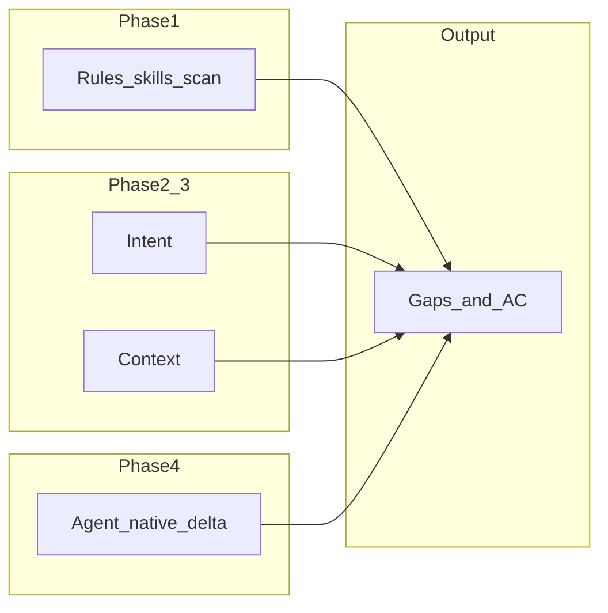

# Multi-stack review: security, intent, context, agent-native, gaps

## Scope (what “all stacks” means here)

Primary repo: **portfolio-harness** (Cursor harness, scripts, skills, docs). Integrated surfaces documented in [.cursor/docs/STACK_OVERVIEW.md](D:/portfolio-harness/.cursor/docs/STACK_OVERVIEW.md) and [.cursor/docs/MCP_CAPABILITY_MAP.md](D:/portfolio-harness/.cursor/docs/MCP_CAPABILITY_MAP.md):

- **Harness** — scripts, handoff, meta-review, pre-commit, brain map, etc.
- **WatchTower_main** — Flask API, Gradio/Daggr, discovery (partial MCP coverage per CM-3)
- **campaign_kb** (Arc_Forge path in map) — ingest, search, merge; some ingest routes **Missing** in parity audit
- **workflow_ui** — Arc_Forge workflow UI; mixed Done/Partial per [action_parity_audit_cm3](D:/portfolio-harness/.cursor/state/adhoc/action_parity_audit_cm3_2026-03-16.md)
- **OpenGrimoire / Brain Map** — dev server, alignment API CLI
- **Obsidian / foam-pkm** — vault MCP, shared workspace note in MCP map (“No agent sandbox”)
- **Cross-repo** — local-proto (TOOL_SAFEGUARDS, Playwright config), scp (when referenced), sibling clones as listed in workspace rules

**Out of scope for a single pass:** Full codebase review of every line in OpenGrimoire, WatchTower, and campaign_kb application code—unless scoped to **agent-facing** surfaces (APIs, MCP tools, scripts the agent runs).

---

## Phase 1 — Rules and skills security audit (audit-rules / security-audit-rules)

**Contract:** Read-only scan; report only unless user asks for fixes.

1. Load checklist: [.cursor/docs/RULES_AND_SKILLS_AUDIT_CHECKLIST.md](D:/portfolio-harness/.cursor/docs/RULES_AND_SKILLS_AUDIT_CHECKLIST.md).
2. Scan with bounded output:
  - `.cursor/rules/**/*.mdc` (and `.md` if any)
  - `.cursor/skills/**/SKILL.md`
  - Root `.cursorrules`, `AGENTS.md` if present in portfolio-harness
3. Apply patterns: shell env manipulation as *instructions*, redirects/`curl`/`wget` to external URLs, override phrases, extended rows (tool-output poisoning, path traversal in *instructions*).
4. **Deliverable slice:** `files_scanned`, matches with `path` + `pattern` + `concern`, or **no issues found**.

**Risk intent:** Supply-chain and prompt-injection in *agent context files*; distinguish descriptive text (plans mentioning “export”) from executable instructions.

---

## Phase 2 — Intent analyze

**Goal:** Are stated agent/org intents consistent, checksum-valid, and aligned with hard boundaries?

1. Run [.cursor/scripts](D:/portfolio-harness/.cursor/scripts) entry points referenced in harness: `check_intent_checksum.ps1` (path per [MCP_CAPABILITY_MAP harness table](D:/portfolio-harness/.cursor/docs/MCP_CAPABILITY_MAP.md)) from `local-proto` as documented—capture pass/fail and which file drifted.
2. Read org-intent / Bitcoin-boundary docs only if workspace uses them (per [.cursorrules](D:/portfolio-harness/.cursorrules) and `BITCOIN_AGENT_CAPABILITIES` pointers)—**summarize alignment**, not full re-audit of Bitcoin content.
3. **Deliverable slice:** Intent posture (OK / drift / not configured) + **gap:** missing or stale intent artifacts.

---

## Phase 3 — Context analyze

**Goal:** Context engineering health and known structural gaps.

1. Skim [.cursor/docs/CONTEXT_ENGINEERING.md](D:/portfolio-harness/.cursor/docs/CONTEXT_ENGINEERING.md) and [CONTEXT_INTEGRATION_AUDIT.md](D:/portfolio-harness/.cursor/docs/CONTEXT_INTEGRATION_AUDIT.md) if present for stated expectations.
2. Reconcile **STACK_OVERVIEW** audit note: `.cursor_context` files missing vs loader expectations (ObsidianVault path—may be Arc_Forge-specific; note **cross-drive / path** risk without exposing secrets).
3. **Deliverable slice:** Context gaps table (missing files, RAG vs vault routing confusion, oversized-context risks) and recommendations (docs-only).

---

## Phase 4 — Agent-native audit (pragmatic, not 8 blind parallel deep dives)

The `/agent-native-audit` command describes 8 principles and 8 parallel explorers—**prohibitively large** for one session. Use a **harness-grounded** approach:

1. **Baseline:** Start from [.cursor/state/adhoc/action_parity_audit_cm3_2026-03-16.md](D:/portfolio-harness/.cursor/state/adhoc/action_parity_audit_cm3_2026-03-16.md) (already lists Missing/Partial/Done per surface).
2. **Refresh selectively:** For each **Missing** or **Partial** row that is still security- or ops-relevant (e.g. WatchTower discovery endpoints, campaign_kb ingest routes), verify whether [MCP_CAPABILITY_MAP](D:/portfolio-harness/.cursor/docs/MCP_CAPABILITY_MAP.md) or Daggr MCP now covers it—**delta** since 2026-03-16.
3. **Principle scoring (lightweight):** Score each of the 8 principles **for the harness + MCP layer** using evidence from MCP map + parity doc (not full frontend enumeration unless user narrows to one app). Document explicitly what was **not** exhaustively enumerated (e.g. OpenGrimoire React buttons).
4. **Tools as primitives:** Spot-check: Daggr/SCP tools described as pipelines vs read/list primitives per [.cursor/docs/AGENT_NATIVE_CHECKLIST.md](D:/portfolio-harness/.cursor/docs/AGENT_NATIVE_CHECKLIST.md).

**Deliverable slice:** Updated-style summary table (principle → score → evidence pointer → top gaps), plus **parity delta** subsection.

---

## Phase 5 — Security and operational risks (cross-cutting)

Consolidate **without duplicating** Phase 1:

| Area                          | Source                               | Notes                                                     |
| ----------------------------- | ------------------------------------ | --------------------------------------------------------- |
| Shared workspace / no sandbox | MCP_CAPABILITY_MAP Workspace section | Trust model: agent and user same FS                       |
| Credential seams              | TOOL_SAFEGUARDS, browser-web skill   | Vault vs APPROVAL_NEEDED                                  |
| SCP pipeline                  | scp MCP usage                        | Fail-closed vs fail-open (see decision-log Bitcoin entry) |
| Cross-session browser         | PLAYWRIGHT_MCP_CONFIG                | Storage state path gitignore                              |
| API surfaces without MCP      | CM-3 Missing rows                    | Operational risk if agent uses ad-hoc curl                |

---

## Phase 6 — Gap analysis (product-scope framing)

Per product-scope skill: **requirements**, **acceptance criteria**, **80% test** (independent observer can verify).

1. **Stakeholder goals (inferred):** Safe agent operation, parity where promised, observable handoffs, no silent capability loss on WatchTower/campaign_kb.
2. **Gap list:** From Phases 1–5, each gap gets: *Given / When / Then* or checklist AC, **priority** (P0 security, P1 parity, P2 doc), **owner** (harness vs app team).
3. **Optional follow-ups:** Single-line entries in `pending_tasks` or decision-log **only if** user wants tracking—plan does not require editing those files by default.

---

## Consolidated output artifact

Single markdown report (suggested path for implementation pass): `.cursor/state/adhoc/multi_stack_review_YYYY-MM-DD.md` containing:

1. Executive summary (risks + top 5 recommendations)
2. Phase 1–6 sections with evidence links (repo-relative paths)
3. Agent-native score table (qualitative or X/Y where counted)
4. Product-scope **acceptance criteria** for closing P0/P1 gaps

---

## Non-goals

- Forking or changing Playwright MCP (already policy in browser-web plan).
- Full static analysis of all Python/TS in WatchTower/campaign_kb unless scoped later.
- Replacing **security-sentinel** deep review—if org requires it, run **Task** `security-sentinel` as a **separate** follow-up on Phase 1 findings.

