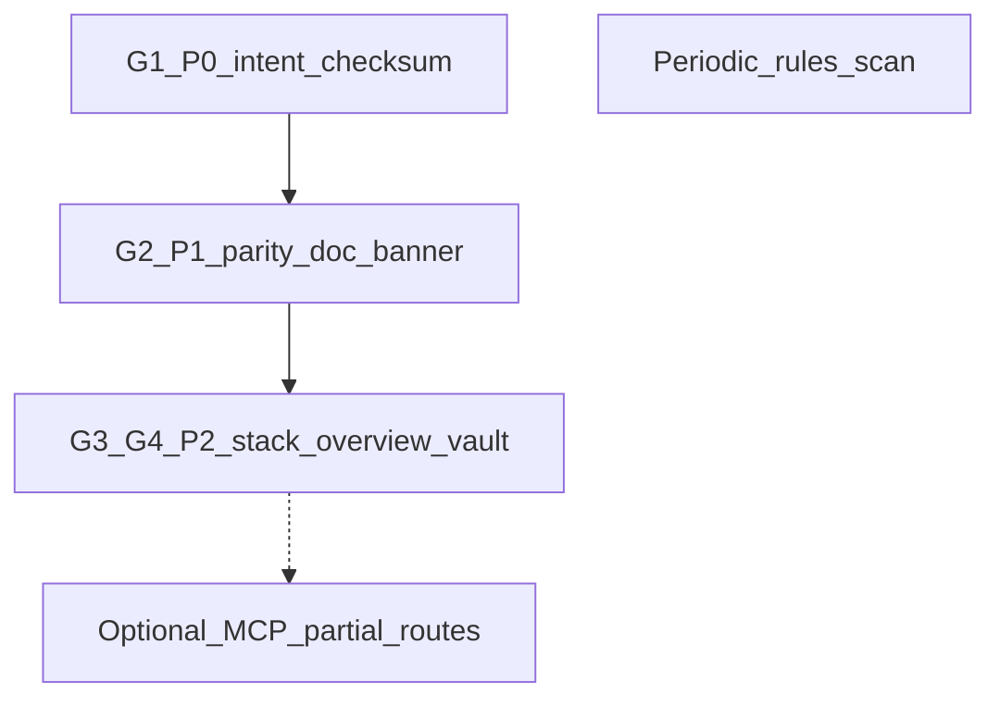

# Multi-stack review — lined-up next steps

Source: executive recommendations and G1–G4 in [multi_stack_review_2026-03-20.md](D:/portfolio-harness/.cursor/state/adhoc/multi_stack_review_2026-03-20.md).

## Dependency order

---

## Step 1 — P0: Resolve intent checksum (human gate)

**Gap:** G1 — `check_intent_checksum.ps1` reported INTENT CHANGED.

**Actions:**

1. **Diff** [org-intent-spec/examples/org-intent.example.json](D:/portfolio-harness/org-intent-spec/examples/org-intent.example.json) against last known good (git history or backup).
2. **Decide:** intentional policy change vs accidental edit.
3. If intentional: run `local-proto/scripts/check_intent_checksum.ps1 -Update` after review (checksum stored per script: `%LOCALAPPDATA%\local-proto\audit\intent_checksum.txt` unless overridden).
4. If accidental: revert file, then re-run script to confirm exit 0.

**Owner:** Operator (not agent-only). **Do not** auto-`-Update` without human approval per harness governance.

---

## Step 2 — P1: Parity doc vs MCP map (harness doc)

**Gap:** G2 — CM-3 [action_parity_audit_cm3_2026-03-16.md](D:/portfolio-harness/.cursor/state/adhoc/action_parity_audit_cm3_2026-03-16.md) still shows Missing/55% while [MCP_CAPABILITY_MAP.md](D:/portfolio-harness/.cursor/docs/MCP_CAPABILITY_MAP.md) documents Done for discovery, `campaign_kb_ingest`, `run_workflow`.

**Pick one (minimal churn):**

- **A (fast):** Add a **banner** after the title block in `action_parity_audit_cm3_2026-03-16.md`: stale as of 2026-03-20; authoritative parity for daggr/watchtower/campaign_kb is MCP map sections; or
- **B (full refresh):** Re-run a lightweight delta audit and replace the table (more effort; optional later).

**Recommendation:** Do **A** now; schedule **B** only if you need a new numeric score.

---

## Step 3 — P2: STACK_OVERVIEW and `.cursor_context`

**Gaps:** G3, G4 — audit paragraph vs current vault; missing `system.md` / `constraints.md` / `preferences.md` per [STACK_OVERVIEW.md](D:/portfolio-harness/.cursor/docs/STACK_OVERVIEW.md).

**Actions:**

1. **Verify** current contents of `ObsidianVault/.cursor_context/` (or your canonical vault path on disk)—which files exist now.
2. **Edit** STACK_OVERVIEW **Audit Summary** row: update date, list what exists vs expected, or mark paragraph **historical (2026-02-27)** if structure changed.
3. If files should exist for the loader: add minimal stubs in the vault (Arc_Forge owner) or document **exception** in CONTEXT_INTEGRATION_AUDIT / state README.

**Owner:** Harness doc (STACK_OVERVIEW) + Arc_Forge for vault files if you choose to populate.

---

## Step 4 — Optional: Partial encoder/alert routes

**When:** Operators need first-class agent parity without `run_terminal_cmd` + curl for WatchTower encoder/monitoring REST.

**Actions:** Extend Daggr MCP or document runbook patterns in [MCP_CAPABILITY_MAP](D:/portfolio-harness/.cursor/docs/MCP_CAPABILITY_MAP.md) / private runbooks; scope with a small design note (new tools vs curl recipes).

**Defer** until there is a concrete operator story.

---

## Step 5 — Ongoing: Phase 1 grep hygiene

**When:** Any edit to `.cursor/rules/`, `.cursor/skills/**/SKILL.md`, root `.cursorrules`.

**Action:** Re-run patterns from [RULES_AND_SKILLS_AUDIT_CHECKLIST.md](D:/portfolio-harness/.cursor/docs/RULES_AND_SKILLS_AUDIT_CHECKLIST.md) (or `/portfolio-harness/audit-rules` command).

---

## Suggested checklist (copy to todo or session)

| Seq | Task                                  | Blocker              |
| --- | ------------------------------------- | -------------------- |
| 1   | Intent diff + `-Update` or revert     | Human                |
| 2   | Parity doc banner                     | None                 |
| 3   | STACK_OVERVIEW + optional vault stubs | Human for vault path |
| 4   | MCP partial routes                    | Optional             |
| 5   | Rules scan on next rules/skill edit   | Habit                |

---

## Out of scope here

- Re-running full multi-stack review (use [MULTI_STACK_REVIEW_TEMPLATE.md](D:/portfolio-harness/.cursor/docs/MULTI_STACK_REVIEW_TEMPLATE.md) on a later date after Steps 1–3).

