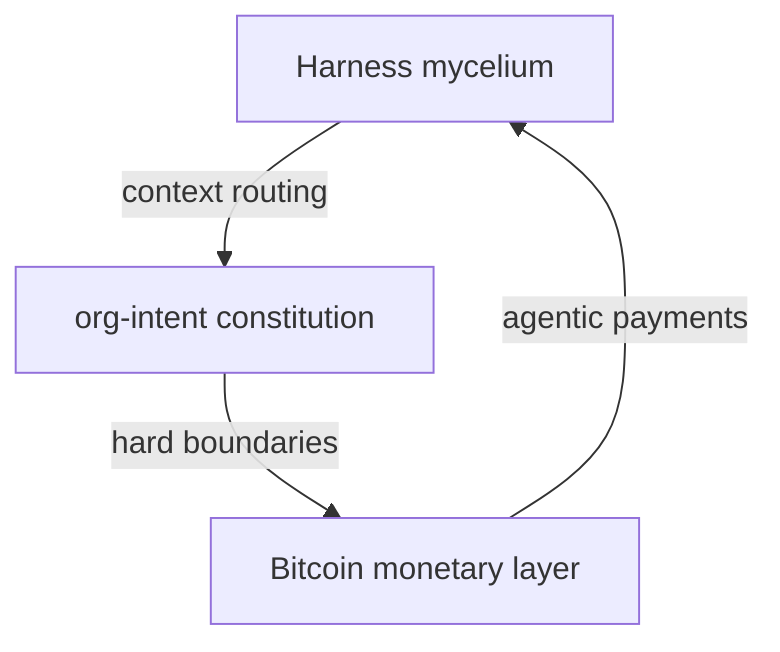

# Mycelium Metaphor Integration Plan

## Design Rationale

Quittem's mycelium framing ([Bitcoin is the Mycelium of Money](https://brandonquittem.com/bitcoin-is-the-mycelium-of-money/)) aligns with the existing organism metaphor: Paul Stamets calls mycelium "the neurological network of nature." Neural and mycelial metaphors are compatible—both describe decentralized, information-sharing networks. The unified layer positions mycelium as the macro metaphor (harness = mycelium of context) and neural terms as the micro metaphor (proprioception, synapse, etc.).

---

## Approach A: Light Touch (Recommended)

**Block 1:** Add one sentence after the hook: "The harness is the mycelium of context—the decentralized network that routes signal and sustains the organism." Cite Quittem. Keep "nervous system" as-is (Stamets bridges the two).

**Block 8:** Keep current organism metaphor. Add a one-line bridge: "Neural terms map to mycelial: hyphae = pathways; nutrient transfer = handoff."

**Block 10:** Add a "Mycelium bridge" subsection: "Bitcoin is the mycelium of money (Quittem); harness + org-intent is the mycelium of agent context." Include a Mermaid diagram: Harness (mycelium) → org-intent (constitution) → Bitcoin (monetary layer).

**Files:** [context-engineering-walkthrough.html](D:\portfolio-harness\docs\demo\context-engineering-walkthrough.html), [CONTEXT_ENGINEERING_DEMO_CHEATSHEET.md](D:\portfolio-harness.cursor\docs\CONTEXT_ENGINEERING_DEMO_CHEATSHEET.md), [CONTEXT_ENGINEERING_TECH_DEMO_PLAN.md](D:\portfolio-harness.cursor\docs\CONTEXT_ENGINEERING_TECH_DEMO_PLAN.md)

**Trade-off:** Minimal change; clear attribution; preserves existing content.

---

## Approach B: Deeper Integration

**Block 1:** Replace "nervous system" with "mycelium"—"context engineering is the mycelium around the model." Add Quittem citation. Optional: "Stamets: mycelium is nature's neurological network."

**Block 8:** Rename section to "Mycelium / Organism Metaphor." Present a dual mapping table: Mycelial | Neural | Harness artifact (e.g., Hyphae | Nerves | handoff, retrieval; Nutrient transfer | Synapse | handoff).

**Block 10:** Full "Mycelium of Money" bridge: 2–3 bullet points from Quittem (decentralized, no central failure, information-sharing membranes). Diagram: Mycelium (harness) ↔ Bitcoin (money) ↔ org-intent (constitution).

**Files:** Same as A, plus [AI_USAGE_ENGINEERING.md](D:\portfolio-harness.cursor\docs\AI_USAGE_ENGINEERING.md) — add "Mycelial parallel" column to Organism Metaphor table.

**Trade-off:** Richer metaphor; more edits; risk of metaphor overload for non-Bitcoin audiences.

---

## Approach C: Bitcoin-Optional Variant

Same as Approach A, but wrap the Block 10 mycelium bridge in a "Bitcoin-aligned demo variant" conditional—only shown when Block 10 is included. Block 1 gets a generic mycelium line without Bitcoin; Block 10 adds the Quittem bridge when that block is used.

**Trade-off:** Clean separation for non-Bitcoin demos; slightly more conditional logic in cheatsheet/plan.

---

## Recommended: Approach A

- Preserves "nervous system" (familiar, cited)
- Adds mycelium as an overarching frame without replacing neural terms
- Block 10 bridge gives Bitcoin-aligned audiences a clear Quittem connection
- Minimal file churn

---

## Implementation Details (Approach A)

### Block 1 changes

- After "The harness is a critical performance multiplier," add:
  - "The harness is the mycelium of context—the decentralized network that routes signal and sustains the organism. (Quittem, [Bitcoin is the Mycelium of Money](https://brandonquittem.com/bitcoin-is-the-mycelium-of-money/); Stamets: mycelium as nature's neurological network.)"
- Update cite line to include Quittem.

### Block 8 changes

- After the organism metaphor list, add:
  - "Mycelial parallel: hyphae = pathways; nutrient transfer = handoff; no central node = decentralized harness."

### Block 10 changes

- Add subsection "Mycelium bridge" before or after CHAOS_BITCOIN_MAPPING:
  - "Bitcoin is the mycelium of money (Quittem); harness + org-intent is the mycelium of agent context. Same decentralized-network archetype."
  - Mermaid: `Harness[Harness mycelium] --> OrgIntent[org-intent constitution]; OrgIntent --> Bitcoin[Bitcoin monetary layer]; Bitcoin --> Harness`
  - Cite: Quittem, [Bitcoin is the Mycelium of Money](https://brandonquittem.com/bitcoin-is-the-mycelium-of-money/)

### Cheatsheet and tech demo plan

- Block 1: Add mycelium sentence and Quittem cite to script/artifact.
- Block 8: Add mycelial parallel line.
- Block 10: Add mycelium bridge content and "Try this" prompt: "Show the mycelium bridge diagram—how does harness map to Bitcoin?"

---

## Mermaid Diagram for Block 10 (Mycelium Bridge)

---

## Files to Modify

| File                                                                                                                           | Changes                    |
| ------------------------------------------------------------------------------------------------------------------------------ | -------------------------- |
| [docs/demo/context-engineering-walkthrough.html](D:\portfolio-harness\docs\demo\context-engineering-walkthrough.html)          | Block 1, Block 8, Block 10 |
| [.cursor/docs/CONTEXT_ENGINEERING_DEMO_CHEATSHEET.md](D:\portfolio-harness.cursor\docs\CONTEXT_ENGINEERING_DEMO_CHEATSHEET.md) | Block 1, 8, 10 script/cite |
| [.cursor/docs/CONTEXT_ENGINEERING_TECH_DEMO_PLAN.md](D:\portfolio-harness.cursor\docs\CONTEXT_ENGINEERING_TECH_DEMO_PLAN.md)   | Block 1, 8, 10 cite/script |

---

## Citation

- **Primary:** Brandon Quittem, [Bitcoin is the Mycelium of Money](https://brandonquittem.com/bitcoin-is-the-mycelium-of-money/)
- **Bridge:** Paul Stamets (cited in Quittem): "I believe that mycelium is the neurological network of nature"

