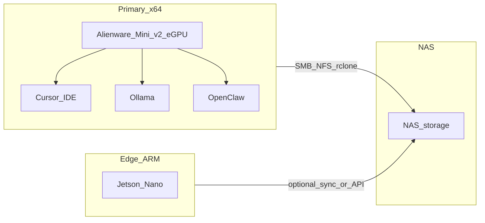

# Tie NAS + Jetson + Alienware/eGPU into local-proto (Bednar gap closure)

## Product-scope (what we are building)

**Goal:** A **documented, repeatable** local deployment story in `[portfolio-harness/local-proto](D:/portfolio-harness/local-proto)` that connects:

- **Primary inference / IDE host:** Alienware Mini v2 + **eGPU** (your selection).
- **Workspace NAS:** details you will supply (services, paths, sync).
- **Jetson Nano:** edge/orchestrator/secondary inference (existing role in [HARDWARE.md](D:/portfolio-harness/local-proto/docs/HARDWARE.md) as optional secondary).

**Requirements (numbered):**

1. **Single source of truth** for hardware topology and data flow (NAS ↔ eGPU host ↔ Jetson), including what runs where.
2. **OpenClaw** install path aligned with [OPENCLAW.md](D:/portfolio-harness/local-proto/docs/OPENCLAW.md) / [OPENCLAW_READINESS.md](D:/portfolio-harness/local-proto/docs/OPENCLAW_READINESS.md), with explicit note that **Cursor stays on x64 Windows** (not on Jetson ARM64—already stated in HARDWARE.md).
3. **Optional Bednar-style capabilities** captured as **optional runbooks**, not core harness code: Venice (DIEM + ladder), SimpleX vs Signal (current docs favor Signal—resolve as “channel options” table), **Whisper + TTS** local loop, **Proton+rclone** shared folder, **MeshCore** / ultra-low bandwidth—only if you add acceptance criteria.

**Acceptance criteria (checklist):**

- A reader can answer: “Where do Ollama, OpenClaw, MCP, and NAS mounts live?” without asking you.
- Jetson and NAS roles are either specified or explicitly marked **TBD** with a placeholder section.
- No secrets in repo (credentials via existing vault / env patterns per [AI_CREDENTIAL_VAULT_DESIGN.md](D:/portfolio-harness/local-proto/docs/AI_CREDENTIAL_VAULT_DESIGN.md)).
- If Venice is adopted: **optional** doc exists + one line in [decision-log](D:/portfolio-harness/.cursor/state/decision-log.md) (or local-proto equivalent) stating **policy** (budget, privacy stance), not API keys.

**Offline / sync:** Ask when you fill in NAS details: “Does this path need **offline** or **multi-device sync**?” If yes, cross-link [LOCAL_FIRST_STACK_CHOICE.md](D:/portfolio-harness/local-proto/docs/LOCAL_FIRST_STACK_CHOICE.md) and portfolio **local-first** skill.

---

## Tech-lead (where things go)

| Deliverable                    | Path / layer                                                                                    | Rationale                                                                                                                                                                   |
| ------------------------------ | ----------------------------------------------------------------------------------------------- | --------------------------------------------------------------------------------------------------------------------------------------------------------------------------- |
| **Canonical topology**         | Update [local-proto/docs/HARDWARE.md](D:/portfolio-harness/local-proto/docs/HARDWARE.md)        | Already has Jetson + 1060 + Alpha R2+AGA; add **Alienware Mini v2 + eGPU as primary** diagram row and retire or demote 1060 to “legacy” if you no longer use it.            |
| **Scope + acceptance**         | `local-proto/docs/scope_nas_assistant.md` (new) or `.cursor/state/scope_nas_assistant.md`       | **Product-scope** artifact: requirements + Given/When/Then for “deployed assistant” vs “dev harness only.”                                                                  |
| **Venice playbook**            | `portfolio-harness/docs/brainstorms/venice_optional_playbook.md` (new, optional)                | **External** integration; links to upstream API docs, DIEM semantics, **model ladder** pattern; points to Bednar’s `venice-model-switcher` as reference, not vendored code. |
| **Multimodal local loop**      | `local-proto/docs/MULTIMODAL_LOCAL_LOOP.md` (new)                                               | Whisper / TTS / voice chat: **out of openharness core**; **in local-proto** as operational runbook (binds to eGPU host + optional NAS).                                     |
| **Shared human–agent FS**      | Section in `scope_nas_assistant.md` + optional `MULTIMODAL` or `NAS_MOUNTS.md`                  | Operational pattern (rclone, mount paths); **not** OpenGrimoire until you scope UI sync—note in scope: “OpenGrimoire integration = future.”                                       |
| **Mesh / ultra-low bandwidth** | Single subsection under `scope_nas_assistant.md` **or** “Out of scope” until product-scope gate | Avoids building MeshCore docs without a requirement.                                                                                                                        |

**Conflict to resolve in docs:** [OPENCLAW.md](D:/portfolio-harness/local-proto/docs/OPENCLAW.md) says **prefer Signal**; Bednar uses **SimpleX**. Plan: add a short **“Messaging channels”** comparison table (Signal / SimpleX / Telegram risks) and **do not** delete Signal guidance—align with org-intent and TOOL_SAFEGUARDS.

---

## Agent-native architecture (parity and primitives)

| Principle              | Application                                                                                                                                                                                                                                |
| ---------------------- | ------------------------------------------------------------------------------------------------------------------------------------------------------------------------------------------------------------------------------------------ |
| **Parity**             | If the human can read/write a **shared agent directory** (rclone mount), the **agent** must have the same via tools: `read_file` / `write` to that path, or a thin MCP wrapper. Document the **mount path** in scope (not secrets).        |
| **Granularity**        | **Budget / model ladder:** prefer documenting **policy + hooks** (systemd/timer on Linux, Task Scheduler on Windows, or a small Python script) over a monolithic “Venice tool” in MCP—unless you later add a dedicated MCP for Venice API. |
| **Shared workspace**   | Same filesystem namespace for human + agent drafts (Bednar Proton pattern); map to **your** NAS export or sync target.                                                                                                                     |
| **Completion signals** | Long-running services (OpenClaw, Ollama, rclone) use **health checks** in runbooks (curl to Ollama, OpenClaw status), not heuristic “done” in chat.                                                                                        |

---

## Suggested architecture diagram (target)

*(Jetson/NAS arrows refined when you define NAS services.)*

---

## Implementation sequence (after you approve)

1. **You:** Provide NAS specifics (OS, shares, intended services: Ollama mirror, OpenClaw remote, rclone targets, Jetson workload).
2. **Docs:** Add `scope_nas_assistant.md` + update `HARDWARE.md` (Alienware Mini v2 + eGPU primary).
3. **Optional:** `venice_optional_playbook.md`, `MULTIMODAL_LOCAL_LOOP.md`, decision-log line for Venice/budget policy.
4. **Cross-link:** [OPENCLAW_READINESS.md](D:/portfolio-harness/local-proto/docs/OPENCLAW_READINESS.md) checklist → new topology section.
5. **Review:** If any new MCP or script handles secrets → **security-audit-rules** pass on changed rules/skills.

---

## Out of scope (unless scope doc adds them)

- Vendoring OpenClaw, SimpleX, or Venice code in-repo.
- OpenGrimoire **live** sync to NAS mounts (document as future).
- MeshCore implementation (requirements only).

