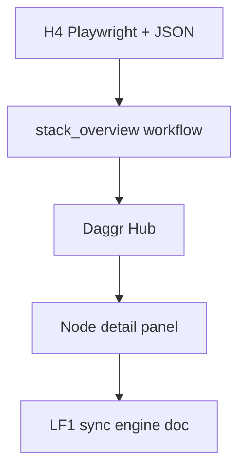

# Next-Wave Daggr Stack Order

Five items in suggested implementation order. Each builds on prior work.

---

## 1. H4 — Playwright Smoke + Quantitative Output (Quick Win)

**Status:** Largely done. [run_daggr_tests.ps1](D:\portfolio-harness.cursor\scripts\run_daggr_tests.ps1) already runs Playwright smoke (WatchTower Daggr, Flask E2E, campaign_kb E2E, workflow_ui E2E) when `-SkipPlaywright` is omitted, and prints quantitative summary (pass/fail/skip counts, per-stack duration).

**Quick win scope:**

- Add optional `-OutputFormat json` to emit machine-parseable JSON for CI (e.g. GitHub Actions, Azure Pipelines).
- Output schema: `{ "passed": N, "failed": N, "skipped": N, "total_duration_s": X, "stacks": [{ "label": "...", "status": "PASS|FAIL|SKIP", "duration_s": X }] }`
- Update [pending_tasks.md](D:\portfolio-harness.cursor\state\pending_tasks.md) and [TESTING_QUALITY_SMOKE_CONCRETE_PLANS.md](D:\portfolio-harness\docs\TESTING_QUALITY_SMOKE_CONCRETE_PLANS.md) to mark H4 done.

**Files:** `.cursor/scripts/run_daggr_tests.ps1`, `.cursor/state/pending_tasks.md`, `docs/TESTING_QUALITY_SMOKE_CONCRETE_PLANS.md`

---

## 2. stack_overview — Implement Planned Workflow (Daggr Visibility)

**Current state:**

- [stack_overview.py](D:\portfolio-harness\WatchTower_main\WatchTower_main\daggr_workflows\stack_overview.py) exists and runs (Gradio UI).
- Daggr MCP `get_graph_schema` fails: `Invalid input(s) {'trigger'}` — FnNode uses `inputs={"trigger": gr.Textbox(...)}` but function signature is `render_stack(_: str = "")`; param name mismatch.
- [daggr_schemas.json](D:\Arc_Forge\ObsidianVault\workflow_ui\data\daggr_schemas.json) does not include `stack_overview`.
- [STACK_OVERVIEW.md](D:\portfolio-harness.cursor\docs\STACK_OVERVIEW.md) is source of truth; `get_stack_overview` MCP reads it.

**Steps:**

1. Fix stack_overview.py: align FnNode input key with function param (e.g. `inputs={"trigger": ...}` → `inputs={"_": ...}` or rename param to `trigger` and keep Gradio label).
2. Add `stack_overview` to [daggr_schemas.json](D:\Arc_Forge\ObsidianVault\workflow_ui\data\daggr_schemas.json) with nodes/edges (single node `stack_node`; no edges).
3. Ensure `verify_integration` and `run_workflow` include stack_overview (already in [daggr_test_matrix.md](D:\portfolio-harness.cursor\docs\daggr_test_matrix.md)).
4. Add pytest: `test_stack_overview_defines_graph` in WatchTower `daggr_workflows/test_workflows.py` or equivalent.

**Files:** `WatchTower_main/WatchTower_main/daggr_workflows/stack_overview.py`, `Arc_Forge/ObsidianVault/workflow_ui/data/daggr_schemas.json`, WatchTower test module.

---

## 3. Daggr Hub — Single workflow_ui Page with WorkflowGraphCards

**Current state:**

- [/tools/daggr-graphs](D:\Arc_Forge\ObsidianVault\workflow_ui\templates\daggr_graphs.html) already has WorkflowGraphCards in the sidebar (workflow list by stack).
- [index.html](D:\Arc_Forge\ObsidianVault\workflow_ui\templates\index.html) has "Workflow Graphs" link to `/tools/daggr-graphs`.

**Product-scope decision needed:**

- **Option A:** Enhance daggr-graphs as the canonical Daggr Hub — add hero section, stack summary, and prominent WorkflowGraphCards; index links to it as "Daggr Hub".
- **Option B:** New `/tools/daggr-hub` route — landing page with all WorkflowGraphCards in a grid; clicking a card navigates to daggr-graphs with that workflow pre-selected.
- **Option C:** Index becomes the hub — show WorkflowGraphCards on index; daggr-graphs remains for graph viewer only.

**Recommendation:** Option A — minimal change; daggr-graphs is already the hub; add a header/title "Daggr Hub" and optionally a brief stack summary. Product-scope phase should confirm before tech-lead implementation.

**Files:** `daggr_graphs.html`, `app.py`, `index.html`, `design-tokens.css`

---

## 4. Node Detail Panel — DaggrNodeCard on Node Click

**Current state:**

- [daggr_graphs.html](D:\Arc_Forge\ObsidianVault\workflow_ui\templates\daggr_graphs.html) renders Mermaid flowchart; no click handlers.
- [A2UI_CATALOG.md](D:\portfolio-harness\docs\demo\components\A2UI_CATALOG.md) defines DaggrNodeCard: `nodeId`, `label`, `inputs`, `outputs`.

**Implementation:**

1. After Mermaid render, attach click handlers to SVG nodes. Mermaid node IDs follow pattern (e.g. `flowchart-*-0`); map to schema node `id` via Mermaid's `bindFunctions` or DOM inspection.
2. On node click: resolve node from schema (edges give `sourceOutput`/`targetInput`); build inputs = edges where `target` = node; outputs = edges where `source` = node.
3. Show DaggrNodeCard in a side panel or modal (e.g. right of graph or overlay). Use design tokens from `design-tokens.css`.
4. Add CSS for `.daggr-node-card` per A2UI_CATALOG structure.

**Schema mapping:** For node `add_node`, inputs = edges with `target: "add_node"` → `targetInput` values; outputs = edges with `source: "add_node"` → `sourceOutput` values.

**Files:** `daggr_graphs.html`, `style.css` or `design-tokens.css`, possibly new `daggr-graphs.js`

---

## 5. LF1 — Document Sync Engine Choice (Electric/PowerSync/p2panda)

**Current state:**

- [LOCAL_FIRST_STACK_CHOICE.md](D:\portfolio-harness\local-proto\docs\LOCAL_FIRST_STACK_CHOICE.md) lists candidates and decision tree; choice is TBD.
- Next step: "Document stack choice and log to `.cursor/private/scope-notes.md`".

**Scope:**

1. Finalize choice based on PENTAGI_FEDIMINT_ACE_ROADMAP §3 (client as source of truth; Fedimint = sync relay).
2. Update LOCAL_FIRST_STACK_CHOICE.md: add "Recommended Choice" section with rationale.
3. Log to `.cursor/private/scope-notes.md` (create if missing): date, choice, rationale, constraints.
4. Align with C4/C5 (Fedimint testnet, capability schema) per doc — note dependency if not yet ready.

**Files:** `local-proto/docs/LOCAL_FIRST_STACK_CHOICE.md`, `.cursor/private/scope-notes.md`

---

## Dependency Graph

H4 is independent. stack_overview adds a workflow to the hub. Daggr Hub surfaces all workflows including stack_overview. Node panel enhances the graph viewer. LF1 is documentation-only and can run in parallel with UI work.

---

## Risk and Effort

| Item              | Risk | Effort                        |
| ----------------- | ---- | ----------------------------- |
| H4                | Low  | ~30 min                       |
| stack_overview    | Low  | 1–2 hrs                       |
| Daggr Hub         | Low  | 1–2 hrs (after product-scope) |
| Node detail panel | Low  | 2–3 hrs                       |
| LF1               | Low  | 1–2 hrs                       |

