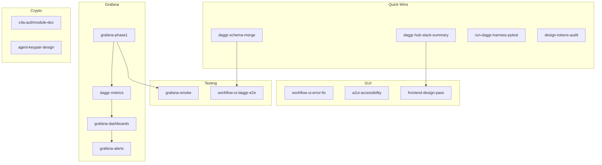

# Next-Wave Gap Audit and Task Decomposition

Gap analysis across the five Next-Wave Daggr items plus testing, GUI, backend, frontend, cryptographic agent identity, and Grafana. Produces an actionable to-do list and discovery strategies for unknowns.

---

## Current State Summary

**Next-Wave items (implemented):** H4 (Playwright + JSON), stack_overview (fixed, in schemas), Daggr Hub (hero, title), Node detail panel (DaggrNodeCard on click), LF1 (ElectricSQL choice + scope-notes).

**Canonical sources:** [DAGGR_FUNCTION_MAP.md](D:\portfolio-harness.cursor\docs\DAGGR_FUNCTION_MAP.md), [daggr_test_matrix.md](D:\portfolio-harness.cursor\docs\daggr_test_matrix.md), [daggr_schemas.json](D:\Arc_Forge\ObsidianVault\workflow_ui\data\daggr_schemas.json), [pending_tasks.md](D:\portfolio-harness.cursor\state\pending_tasks.md).

---

## Gap Analysis by Domain

### 1. Testing Gaps

| Gap                                     | Location                        | Effort  | Priority |
| --------------------------------------- | ------------------------------- | ------- | -------- |
| Daggr Hub / node-click E2E              | workflow_ui Playwright          | 1–2 hrs | Medium   |
| campaign_kb merge edges in schema       | daggr_schemas.json              | 30 min  | Low      |
| harness scp/blue_hat full topology      | daggr_schemas.json (multi-node) | 1 hr    | Low      |
| Grafana/Prometheus smoke                | D:\software                     | 2–4 hrs | Medium   |
| CRY1/CRY2 unit tests                    | Blocked on C4/C5                | —       | Deferred |
| run_daggr_tests.ps1 harness pytest step | run_daggr_tests.ps1             | 30 min  | Low      |

**Schema drift:** [DAGGR_FUNCTION_MAP](D:\portfolio-harness.cursor\docs\DAGGR_FUNCTION_MAP.md) shows campaign_kb merge has `keywords_node` and `merge_node` with parallel inputs; [daggr_schemas.json](D:\Arc_Forge\ObsidianVault\workflow_ui\data\daggr_schemas.json) has no edges. Node panel will show empty I/O for merge until edges added.

---

### 2. GUI Gaps

| Gap                                        | Location                             | Effort  | Priority |
| ------------------------------------------ | ------------------------------------ | ------- | -------- |
| Stack summary in Daggr Hub                 | daggr_graphs.html                    | 30 min  | Low      |
| workflow_ui error display fix              | Wave 5 quick wins                    | 1 hr    | Medium   |
| A2UI accessibility (ARIA, focus, contrast) | daggr_graphs.html, design-tokens.css | 1–2 hrs | Medium   |
| Distinctive frontend-design pass           | daggr_graphs.html, design-tokens     | 2–3 hrs | Low      |
| Keyboard nav for node panel                | daggr_graphs.html                    | 1 hr    | Low      |

**Reference:** [A2UI_CATALOG.md](D:\portfolio-harness\docs\demo\components\A2UI_CATALOG.md), [A2UI_FRONTEND_DESIGN_GUIDANCE.md](D:\portfolio-harness.cursor\docs\A2UI_FRONTEND_DESIGN_GUIDANCE.md).

---

### 3. Backend Gaps

| Gap                               | Location                | Effort            | Priority |
| --------------------------------- | ----------------------- | ----------------- | -------- |
| Daggr workflow run metrics        | WatchTower, campaign_kb | 2–4 hrs           | High     |
| Prometheus /metrics endpoints     | Four apps               | 1–2 hrs           | High     |
| audit_wrapper → Prometheus bridge | local-proto             | 2–3 hrs           | Medium   |
| ElectricSQL implementation        | local-proto             | Deferred to C4/C5 | —        |

---

### 4. Frontend Gaps

| Gap                              | Location                                     | Effort | Priority |
| -------------------------------- | -------------------------------------------- | ------ | -------- |
| Node ID resolution edge cases    | daggr_graphs.html (resolveNodeIdFromElement) | 1 hr   | Low      |
| Design tokens completeness       | design-tokens.css                            | 30 min | Low      |
| WorkflowGraphCard semantic props | A2UI_CATALOG alignment                       | 30 min | Low      |

---

### 5. Cryptographic Pub/Private Key for AI Agents

| Gap                                  | Location                             | Effort  | Priority |
| ------------------------------------ | ------------------------------------ | ------- | -------- |
| C4a: AuthModule design doc expansion | FEDIMINT_AUTHMODULE_DESIGN_TARGET.md | 1–2 hrs | Medium   |
| CRY1: secp256k1 / AuthModule         | Blocked on C4/C5                     | —       | Blocked  |
| CRY2: hb-4 escalation tools          | Blocked on CRY1                      | —       | Blocked  |
| Agent identity keypair (standalone)  | Design: agent pubkey = identity      | 2–4 hrs | Medium   |

**Design target:** [FEDIMINT_AUTHMODULE_DESIGN_TARGET.md](D:\portfolio-harness\docs\FEDIMINT_AUTHMODULE_DESIGN_TARGET.md). Agent identity = Fedimint pubkey; secp256k1 signing for capability tokens. Until C4/C5: document standalone agent keypair option (e.g. secp256k1 keypair per agent, stored outside AI access; used for signing audit events or capability requests).

---

### 6. Grafana Implementation

| Gap                                      | Location                                      | Effort  | Priority |
| ---------------------------------------- | --------------------------------------------- | ------- | -------- |
| Resolve open questions                   | First-class workflows, Signal/email, Moltbook | 30 min  | High     |
| Scrape configs + labels                  | D:\software/prometheus                        | 1–2 hrs | High     |
| DAGGR workflow metrics                   | WatchTower, campaign_kb                       | 2–4 hrs | High     |
| Dashboards (one per project or overview) | D:\software Grafana                           | 2–3 hrs | High     |
| Alert rules + Alertmanager               | D:\software                                   | 1–2 hrs | Medium   |
| Docs and runbooks                        | D:\software monitoring README                 | 1 hr    | Medium   |
| PM docs for further development          | D:\software                                   | 1 hr    | Low      |

**Source:** [GRAFANA_DAGGR_MONITORING_PROMPT.md](D:\portfolio-harness.cursor\docs\GRAFANA_DAGGR_MONITORING_PROMPT.md), [grafana_daggr_monitoring_pipeline.plan.md](D:\portfolio-harness\plans\grafana_daggr_monitoring_pipeline.plan.md). D:\software owns the stack; portfolio-harness is a separate workspace.

---

## Task Decomposition (To-Do List)

### Quick Wins (under 1 hr each)

1. **daggr-schema-merge:** Add campaign_kb merge edges to daggr_schemas.json (keywords_node, merge_node inputs per DAGGR_FUNCTION_MAP).
2. **daggr-hub-stack-summary:** Add brief stack summary (WatchTower, harness, campaign_kb counts) to Daggr Hub hero.
3. **run-daggr-harness-pytest:** Add harness pytest step to run_daggr_tests.ps1 before WatchTower.
4. **design-tokens-audit:** Audit design-tokens.css for missing vars; add any gaps.

### Testing (1–4 hrs each)

1. **workflow-ui-daggr-e2e:** Add Playwright E2E: load Daggr Hub, select workflow, click node, assert DaggrNodeCard visible.
2. **grafana-smoke:** Add smoke test or runbook step: start D:\software monitoring stack, verify Prometheus scrapes, Grafana loads.

### GUI / Frontend (1–3 hrs each)

1. **workflow-ui-error-fix:** Fix workflow_ui error display (Wave 5 quick wins).
2. **a2ui-accessibility:** Add ARIA, focus management, contrast check for DaggrNodeCard and node panel.
3. **frontend-design-pass:** Apply frontend-design skill: distinctive typography, color, motion for Daggr Hub.

### Backend / Grafana (2–4 hrs each)

1. **grafana-phase1:** Resolve open questions; add scrape configs and labels in D:\software.
2. **daggr-metrics:** Implement workflow run metrics (WatchTower, optionally campaign_kb); expose /metrics.
3. **grafana-dashboards:** Create at least one dashboard per project in D:\software Grafana.
4. **grafana-alerts:** Add alert rules; route through D:\software Alertmanager.

### Crypto / Design (1–4 hrs each)

1. **c4a-authmodule-doc:** Expand FEDIMINT_AUTHMODULE_DESIGN_TARGET with interface, flow, harness integration.
2. **agent-keypair-design:** Document standalone agent identity keypair option (secp256k1, storage, use for audit/capability).

### Discovery: Known Unknowns

| Known Unknown               | Resolution Strategy                                                             |
| --------------------------- | ------------------------------------------------------------------------------- |
| D:\software structure       | List D:\software/monitoring, prometheus/, grafana/; confirm paths in workspace. |
| Moltbook metrics endpoint   | Check Moltbook watchtower repo for /metrics or shared Flask app.                |
| Arc_Forge KeyError 'source' | Grep known-issues; reproduce; fix or document.                                  |
| C4/C5 timeline              | Log in decision-log; defer CRY1/CRY2 until unblocked.                           |

### Discovery: Unknown Unknowns

| Strategy                              | Action                                                                                               |
| ------------------------------------- | ---------------------------------------------------------------------------------------------------- |
| **Critic pass**                       | Run critic on daggr_graphs.html, daggr_schemas.json, run_daggr_tests.ps1; surface issues.            |
| **Manual smoke**                      | Human runs full flow: Daggr Hub → select workflow → click node → verify card; report gaps.           |
| **Cross-stack verification**          | Run `run_daggr_tests.ps1` and `run_verification` (Daggr MCP); compare outputs for drift.             |
| **Schema vs DAGGR_FUNCTION_MAP diff** | Script or manual diff: daggr_schemas.json nodes/edges vs DAGGR_FUNCTION_MAP; flag mismatches.        |
| **Frontier-ops seam review**          | Apply frontier-ops skill: verify human-agent seams, recovery, observability for Daggr/Grafana.       |
| **Agent-native review**               | Load agent-native-reviewer: ensure Daggr Hub, node panel, Grafana are agent-accessible (MCP, tools). |

---

## Dependency Graph

---

## Recommended Execution Order

1. **Quick wins** (schema merge, stack summary, harness pytest, design tokens) — unblock E2E and polish.
2. **workflow-ui-daggr-e2e** — validate Node panel and Daggr Hub.
3. **workflow-ui-error-fix, a2ui-accessibility** — GUI quality.
4. **grafana-phase1** — resolve questions, scrape configs.
5. **daggr-metrics, grafana-dashboards, grafana-alerts** — observability.
6. **c4a-authmodule-doc, agent-keypair-design** — crypto design (implementation blocked).
7. **frontend-design-pass** — aesthetic polish.
8. **Discovery actions** — critic, schema diff, frontier-ops, agent-native review.

---

## Files to Update

- [pending_tasks.md](D:\portfolio-harness.cursor\state\pending_tasks.md) — add new task rows from this list.
- [daggr_schemas.json](D:\Arc_Forge\ObsidianVault\workflow_ui\data\daggr_schemas.json) — campaign_kb merge edges.
- [daggr_graphs.html](D:\Arc_Forge\ObsidianVault\workflow_ui\templates\daggr_graphs.html) — stack summary, a11y.
- [run_daggr_tests.ps1](D:\portfolio-harness.cursor\scripts\run_daggr_tests.ps1) — harness pytest step.
- [FEDIMINT_AUTHMODULE_DESIGN_TARGET.md](D:\portfolio-harness\docs\FEDIMINT_AUTHMODULE_DESIGN_TARGET.md) — C4a expansion.
- D:\software (separate workspace) — Prometheus, Grafana, dashboards, alerts, docs.

