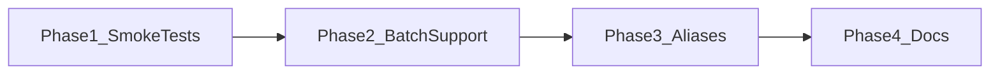

# NIM Quick Wins and Delegation Plan

## Phase 1: Verify System (Quick Wins)

### 1.1 Smoke test nim_batch.py

From `D:\software`:

```powershell
python scripts/nim_batch.py "Explain in one sentence what this script does." scripts/nim_batch.py
```

### 1.2 Smoke test job-automation-service NIM path

```powershell
cd D:\software\job-automation-service
python -c "import asyncio; from app.services.llm_client import generate_via_llm; print(asyncio.run(generate_via_llm('Be brief.', 'Say OK')))"
```

### 1.3 Run existing cover letter tests

```powershell
cd D:\software\job-automation-service
pytest tests/test_cover_letter.py -v
```

### 1.4 Optional: Add NIM integration test

Add a small test in [job-automation-service/tests/](D:\software\job-automation-service\tests\) that calls NIM when `OPENAI_API_KEY` is set, skips when missing. Keeps NIM path regression-tested.

---

## Phase 2: Extend nim_batch.py for Batch Processing

### 2.1 Add `--dir` and `--glob` support

Extend [scripts/nim_batch.py](D:\software\scripts\nim_batch.py):

- `**--dir PATH**`: Process all matching files in directory (default glob: `*.py` or configurable)
- `**--glob PATTERN**`: Override file pattern (e.g. `*.py`, `*.md`, `*.txt`)
- `**--output-dir PATH**`: Write each result to `{output_dir}/{original_name}.out` or similar
- Mutually exclusive: either `file_path` (single file) or `--dir` (batch)

**Usage:**

```bash
python scripts/nim_batch.py "add docstrings" --dir job-automation-service/app/services/
python scripts/nim_batch.py "summarize" --dir logs/ --glob "*.log" --output-dir summaries/
```

**Implementation sketch:**

- argparse: make `file_path` optional when `--dir` is present
- When `--dir`: `Path(dir).rglob(glob)` to collect files, loop over each, call `run_nim` per file
- When `--output-dir`: write to `output_dir / f"{stem}.out"` or `{stem}.summary.txt`

---

## Phase 3: PowerShell Aliases

### 3.1 Create nim aliases script

Add [scripts/nim_aliases.ps1](D:\software\scripts\nim_aliases.ps1) (or append to existing profile):

```powershell
$NimBatch = "D:\software\scripts\nim_batch.py"
$Python = "python"

function nim-explain { & $Python $NimBatch "explain this code" $args }
function nim-docs    { & $Python $NimBatch "add docstrings" $args --model mistralai/codestral-22b-instruct-v0.1 }
function nim-summary { & $Python $NimBatch "summarize" $args }
```

### 3.2 Document usage

Add to [NIM_OFFLOAD.md](D:\software\NIM_OFFLOAD.md):

- How to source: `. .\scripts\nim_aliases.ps1` or add to `$PROFILE`
- Example: `nim-explain job-automation-service/app/services/cover_letter.py`

---

## Phase 4: Documentation Updates

- Update [NIM_OFFLOAD.md](D:\software\NIM_OFFLOAD.md) with:
  - Quick wins verification steps
  - `--dir` / `--glob` usage
  - Aliases section
- Update [scripts/nim_batch.py](D:\software\scripts\nim_batch.py) docstring with new args

---

## Out of Scope (Future)

- **Scheduled jobs**: Task Scheduler / cron for nightly runs
- **local-proto NIM worker**: Task queue + worker + human review (defer until local-proto is stable)
- **Cover letter API test**: Requires running API; manual verification sufficient for now

---

## Execution Order




## Risk

- **Low**: Additive changes; batch mode and aliases do not modify existing single-file behavior

