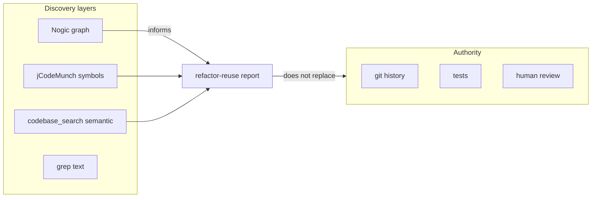

# Institutionalize Nogic workflow in the harness

## Goal

Turn the five principles you listed into **durable, discoverable guidance** so future you (and agents) default to: **Nogic = shape/coupling layer**; **git/tests/humans = correctness**; **jCodeMunch/grep/codebase_search = behavioral / duplicate logic**; **privacy and language limits explicit**.

## Canonical location

Use **[portfolio-harness](D:/portfolio-harness)** as the source of truth for agent context docs ([CONTEXT_ENGINEERING.md](D:/portfolio-harness/.cursor/docs/CONTEXT_ENGINEERING.md), [MCP_CAPABILITY_MAP.md](D:/portfolio-harness/.cursor/docs/MCP_CAPABILITY_MAP.md)). Optionally mirror the same short section into [openharness](D:/openharness) if you keep skills/docs synced between harnesses—only if you already maintain parity there.

## Deliverables

### 1. New doc: `.cursor/docs/NOGIC_WORKFLOW.md`

Add a compact page (~1–2 screens) with:

- **Role**: structural graph / dependency and “what touches what” (pre-refactor navigation), not ground truth for behavior.
- **Indexing policy**: prefer **task-scoped repos** over indexing every multi-root folder at once; note tradeoff (speed vs noise).
- **Pairing with refactor-reuse**: Nogic for **edges and call structure**; [refactor-reuse SKILL](D:/portfolio-harness/.cursor/skills/refactor-reuse/SKILL.md) still requires **codebase_search, grep, jCodeMunch** for “similar implementation” and naming.
- **Privacy**: MCP usage → verify current Nogic docs/TOS; sensitive work → local-only / confirm no cloud sync.
- **Language coverage**: Python/JS/TS strong; C++/Unreal/etc. → fall back to normal search; state “graph may be incomplete.”

Include a **See also** block linking to CONTEXT_ENGINEERING, MCP_CAPABILITY_MAP, CONTEXT_INTEGRATION_AUDIT, refactor-reuse.

### 2. Wire into [CONTEXT_ENGINEERING.md](D:/portfolio-harness/.cursor/docs/CONTEXT_ENGINEERING.md)

- Extend the **retrieval routing** mermaid tree with one branch, e.g. **“Structural graph / coupling / import fan-in?” → Nogic (extension + MCP if enabled)**.
- Add a short subsection under **“When to Use jCodeMunch vs Alternatives”** (or adjacent): table row **Nogic vs jCodeMunch vs codebase_search**—Nogic for graph-level structure; jCodeMunch for symbols; codebase_search for semantic “how does X work.”
- Add `NOGIC_WORKFLOW.md` to the **See also** line at the top.

### 3. Wire into [MCP_CAPABILITY_MAP.md](D:/portfolio-harness/.cursor/docs/MCP_CAPABILITY_MAP.md)

Under **“Docs and code retrieval”** (or a small **“Optional / third-party MCP”** subsection):

- Add a row: **Structural codebase graph (if Nogic MCP configured)** → primary **Nogic MCP**; notes: local index, verify data handling, complements not replaces jCodeMunch.
- Link to `NOGIC_WORKFLOW.md`.

If Nogic is **not** in your `mcp.json` yet, phrase the row as **“when enabled”** so the map stays accurate.

### 4. Light touch on [refactor-reuse/SKILL.md](D:/portfolio-harness/.cursor/skills/refactor-reuse/SKILL.md)

In **Steps**, augment step 1 (Scan) with one bullet:

- *Optional:* If Nogic (graph/MCP) is available, use it for **coupling and call-site structure**; still run **grep / codebase_search / jCodeMunch** for duplicate or similar *implementations*.

This keeps the skill’s **forbidden_actions** intact (no code without redundancy report).

### 5. Optional discoverability

- Add a single line in [HARNESS_ROUTER_INVENTORY.md](D:/portfolio-harness/.cursor/docs/HARNESS_ROUTER_INVENTORY.md) or [CONTEXT_INTEGRATION_AUDIT.md](D:/portfolio-harness/.cursor/docs/CONTEXT_INTEGRATION_AUDIT.md) pointing to Nogic workflow (same pattern as jCodeMunch / refactor-reuse rows).

## What we are not doing

- No changes to Nogic itself, no automation scripts, no mandatory MCP install.
- No duplication of long Nogic product docs—only **your** operating rules and pointers to official docs for privacy/MCP details.

## Verification

- Links from CONTEXT_ENGINEERING and MCP map resolve to `NOGIC_WORKFLOW.md`.
- Refactor-reuse still mandates explicit reuse report before code.
- Wording avoids claiming Nogic replaces tests or git history.

