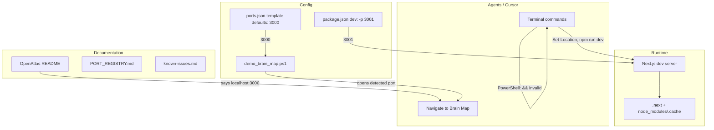

# NPM System Reliability Review

## Problem Summary

The NPM system fails often due to several distinct failure modes observed in recent sessions:

| Failure                                         | Cause                                                          | Location                             |
| ----------------------------------------------- | -------------------------------------------------------------- | ------------------------------------ |
| `cd X && npm run dev` fails                     | PowerShell does not support `&&`                               | Cursor terminal (PowerShell default) |
| `Cannot find module './638.js'`                 | Next.js webpack chunk ID mismatch / stale `.next` cache        | OpenAtlas dev server                 |
| `Cannot find module 'middleware-manifest.json'` | Partial `.next` deletion; manifest missing during error render | OpenAtlas                            |
| `EADDRINUSE: address already in use :::3001`    | Previous dev server not stopped before restart                 | OpenAtlas                            |
| Port mismatch (3000 vs 3001)                    | README, ports.json.template say 3000; package.json uses 3001   | Docs, demo script                    |
| Playwright E2E fails                            | Browsers not installed                                         | `npx playwright install` not run     |

---

## Architecture (Current State)

---

## Root Causes

### 1. Shell compatibility (PowerShell vs Bash)

- Cursor runs PowerShell on Windows. `cd D:\portfolio-harness\OpenAtlas && npm run dev` fails with "The token '&&' is not a valid statement separator."
- **Fix:** Use `;` (PowerShell) or `Set-Location X; npm run dev`. Document in runbooks.

### 2. Next.js dev cache corruption

- `./638.js` and similar chunk errors occur when:
  - `.next` is partially built or stale
  - Hot reload races with incremental compilation
  - Switching between `next build` and `next dev` without clean
- **Fix:** Add a `clean` script and document a clean-before-dev flow; optionally try Turbopack (`--turbo`) for Next.js 15+.

### 3. Port inconsistency

- [OpenAtlas/package.json](D:\portfolio-harness\OpenAtlas\package.json): `dev` uses `-p 3001`
- [OpenAtlas/README.md](D:\portfolio-harness\OpenAtlas\README.md): "Open [http://localhost:3000](http://localhost:3000)"
- [ports.json.template](D:\portfolio-harness.cursor\state\ports.json.template): `defaults.openatlas: 3000`
- [demo_brain_map.ps1](D:\portfolio-harness.cursor\scripts\demo_brain_map.ps1): Detects port from output (works if server prints it)
- **Fix:** Align all to 3001 (or 3000). Recommend 3001 to avoid conflict with other Next.js apps on 3000.

### 4. No Node version pinning

- No `.nvmrc`, `volta`, or `engines` in package.json. Different Node versions can cause subtle build issues.
- **Fix:** Add `engines.node` and optionally `.nvmrc` for local dev.

### 5. EADDRINUSE on restart

- Restarting dev without killing the old process causes port-in-use errors.
- **Fix:** Document "kill port before restart" in troubleshooting; optionally add a `dev:restart` script that kills 3001 then starts.

---

## Proposed Changes

### Phase 1: Documentation and known-issues (low risk)

1. **known-issues.md** — Add entry:
  - **NPM / OpenAtlas dev:** PowerShell `&&` invalid; use `Set-Location OpenAtlas; npm run dev`. If "Cannot find module './XXX.js'", run `npm run clean` then `npm run dev`. If EADDRINUSE, kill process on port 3001 first.
2. **OpenAtlas README** — Update Quick start:
  - Change "Open [http://localhost:3000](http://localhost:3000)" to "Open [http://localhost:3001](http://localhost:3001)"
  - Add Windows note: use `;` not `&&` in PowerShell
3. **ports.json.template** — Change `defaults.openatlas` from 3000 to 3001
4. **TROUBLESHOOTING_AND_PLAYBOOKS.md** — Add row:
  - OpenAtlas / NPM: `OpenAtlas/TROUBLESHOOTING.md` (or new doc) — chunk errors, port, PowerShell

### Phase 2: Scripts and config (medium risk)

1. **OpenAtlas package.json** — Add scripts:
  - `"clean": "rimraf .next node_modules/.cache"` (add `rimraf` as devDep) or `"clean": "node -e \"require('fs').rmSync('.next',{recursive:true,force:true}); require('fs').rmSync('node_modules/.cache',{recursive:true,force:true})\""`
  - `"dev:clean": "npm run clean && npm run dev"` (npm scripts use shell, so `&&` works in npm context)
2. **OpenAtlas package.json** — Add `engines`:
  - `"engines": { "node": ">=18" }`
3. **OpenAtlas/TROUBLESHOOTING.md** (new) — Sections:
  - Symptom: "Cannot find module './XXX.js'" → Cause: stale .next → Fix: `npm run clean` then `npm run dev`
  - Symptom: EADDRINUSE 3001 → Fix: kill process on 3001, then restart
  - Symptom: PowerShell `&&` error → Fix: use `;` or run commands separately

### Phase 3: Agent-facing guidance (low risk)

1. **browser-web SKILL** or **MCP_CAPABILITY_MAP** — Add note:
  - When starting OpenAtlas: use `Set-Location D:\portfolio-harness\OpenAtlas; npm run dev` (PowerShell). Port 3001. If chunk errors, run `npm run clean` first.
2. **demo_brain_map.ps1** — Ensure it reads `ports.json` for `services.openatlas.port` when opening browser (already does merge-on-write; verify it uses detected port).

---

## Out of Scope (for this plan)

- Upgrading Next.js (14.0.4 → 15 with Turbopack) — larger change
- Monorepo / npm workspaces — structural
- PentAGI or obsidian_plugin NPM issues — separate projects

---

## Files to Modify

| File                                                                                                                 | Change                      |
| -------------------------------------------------------------------------------------------------------------------- | --------------------------- |
| [.cursor/state/known-issues.md](D:\portfolio-harness.cursor\state\known-issues.md)                                   | Add NPM/OpenAtlas dev entry |
| [OpenAtlas/README.md](D:\portfolio-harness\OpenAtlas\README.md)                                                      | Port 3001, PowerShell note  |
| [.cursor/state/ports.json.template](D:\portfolio-harness.cursor\state\ports.json.template)                           | defaults.openatlas: 3001    |
| [.cursor/docs/TROUBLESHOOTING_AND_PLAYBOOKS.md](D:\portfolio-harness.cursor\docs\TROUBLESHOOTING_AND_PLAYBOOKS.md)   | OpenAtlas row               |
| [OpenAtlas/package.json](D:\portfolio-harness\OpenAtlas\package.json)                                                | clean, dev:clean, engines   |
| [OpenAtlas/TROUBLESHOOTING.md](D:\portfolio-harness\OpenAtlas\TROUBLESHOOTING.md)                                    | New file                    |
| [.cursor/skills/browser-web/SKILL.md](D:\portfolio-harness.cursor\skills\browser-web\SKILL.md) or MCP_CAPABILITY_MAP | OpenAtlas startup note      |

---

## Verification

1. Run `Set-Location D:\portfolio-harness\OpenAtlas; npm run clean; npm run dev` — server starts on 3001
2. Open [http://localhost:3001/context-atlas](http://localhost:3001/context-atlas) — page loads
3. Simulate chunk error: delete `.next` partially, restart — `npm run clean` then `npm run dev` recovers

