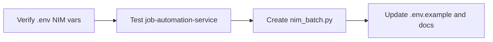

# NVIDIA NIM Integration Plan

## Current State

- [llm_client.py](D:\software\job-automation-service\app\services\llm_client.py) already supports OpenAI-compatible endpoints via `_generate_openai()` using `base_url` and `api_key`
- [config.py](D:\software\job-automation-service\app\config.py) has `openai_api_key`, `openai_base_url` (lines 86-87)
- User has added NVIDIA API key to `.env`; needs the remaining NIM-specific vars

## Tier 1: Point job-automation-service at NIM

**No code changes required.** The existing OpenAI path works with NIM. Add/verify these in `.env` (or [job-automation-service/.env](D:\software\job-automation-service.env)):

```env
LLM_PROVIDER=openai
LLM_MODEL=meta/llama-3.1-8b-instruct
OPENAI_API_KEY=<your-nvidia-api-key>
OPENAI_BASE_URL=https://integrate.api.nvidia.com/v1
```

**Verification:** Run cover letter generation or any flow that calls `generate_via_llm` and confirm NIM responds.

**Optional model swaps** (code-focused):

- `mistralai/codestral-22b-instruct-v0.1`
- `ibm/granite-34b-code-instruct`
- `google/codegemma-7b`

---

## Tier 2: Standalone nim_batch.py script

Create [scripts/nim_batch.py](D:\software\scripts\nim_batch.py) for terminal-driven offload tasks.

**Behavior:**

- CLI: `python scripts/nim_batch.py "explain this code" path/to/file.py`
- Reads env: `NVIDIA_API_KEY` or `OPENAI_API_KEY` + `OPENAI_BASE_URL` (NIM)
- Uses `AsyncOpenAI` with NIM base URL
- Default model: `meta/llama-3.1-8b-instruct` (overridable via `--model`)
- Supports: explain, refactor, add-tests, summarize, or arbitrary prompt

**Usage examples:**

```bash
python scripts/nim_batch.py "explain this code" job-automation-service/app/services/cover_letter.py
python scripts/nim_batch.py "add docstrings" path/to/module.py --model mistralai/codestral-22b-instruct-v0.1
python scripts/nim_batch.py "summarize" path/to/log.txt
```

**Implementation sketch:**

- argparse for `prompt`, `file_path`, `--model`, `--output`
- Read file, build messages, call NIM, print or write result
- Load env from `.env` in software root (via `python-dotenv` or `Path`-based discovery)
- Standalone: no `app` imports; only `openai`, `dotenv`, stdlib

---

## Documentation Updates

Update [.env.example](D:\software\job-automation-service.env.example) to document NIM:

```env
# LLM Configuration (ollama | openai | anthropic)
# For NVIDIA NIM: use openai + OPENAI_BASE_URL below
LLM_PROVIDER=ollama
LLM_MODEL=llama3.2

# OpenAI / NVIDIA NIM (when LLM_PROVIDER=openai)
# For NIM: OPENAI_BASE_URL=https://integrate.api.nvidia.com/v1
#         LLM_MODEL=meta/llama-3.1-8b-instruct (or mistralai/codestral-22b-instruct-v0.1)
# OPENAI_API_KEY=sk-...
# OPENAI_BASE_URL=https://integrate.api.nvidia.com/v1
```

Add a short README or doc section for `scripts/nim_batch.py` (e.g. in [scripts/](D:\software\scripts\) or a `NIM_OFFLOAD.md` in software root) with usage and env vars.

---

## Out of Scope (Future)

- **Tier 3 (local-proto delegation):** Task queue + worker + human review — defer until local-proto is running
- **Dedicated `nim` provider in llm_client:** Optional; current openai path is sufficient

---

## Execution Order




## Risk

- **Low:** Env-only config for Tier 1; new script is additive and does not modify existing services

