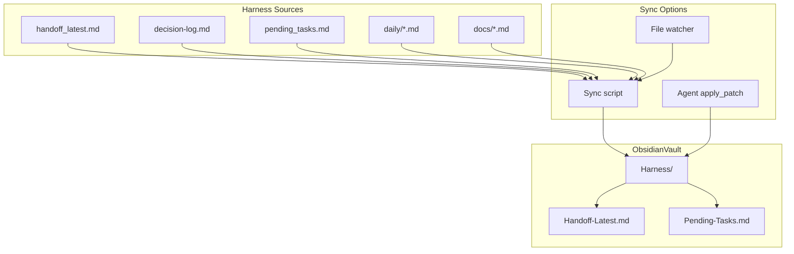

# ObsidianVault Integration Audit and Roadmap

## Current Integration State

### What Exists

| Component                      | Location                                                                                                          | Purpose                                                                                     |
| ------------------------------ | ----------------------------------------------------------------------------------------------------------------- | ------------------------------------------------------------------------------------------- |
| MCP obsidian-vault             | [.cursor/mcp.json](D:\portfolio-harness.cursor\mcp.json)                                                          | Wrapped by audit_wrapper; OBSIDIAN_VAULT_ROOT=D:/Arc_Forge/ObsidianVault                    |
| Vault root                     | D:/Arc_Forge/ObsidianVault                                                                                        | Campaign-focused; RAG pipeline, workflow_ui                                                 |
| session_save / session_history | [obsidian_cursor_integration/session/store.py](D:\portfolio-harness\obsidian_cursor_integration\session\store.py) | Writes to vault_root/.cursor_context/sessions.db (SQLite)                                   |
| .cursor_context                | vault_root/.cursor_context/                                                                                       | system.md, constraints.md, preferences.md, workflows.md; loaded by context loader           |
| Handoff flow                   | [.cursorrules](D:\portfolio-harness.cursorrules), [HANDOFF_FLOW.md](D:\portfolio-harness.cursor\HANDOFF_FLOW.md)  | Optional session_save when handoff involves "vault work"                                    |
| Filesystem MCP                 | .cursor/mcp.json                                                                                                  | Allows D:/portfolio-harness, D:/Arc_Forge — agent can read/write vault notes via filesystem |

### Integration Gaps

1. **session_save is optional and narrow** — Only invoked when handoff "involves Obsidian vault work." Most handoffs do not trigger it; session history lives in SQLite, not human-readable notes.
2. **No sync from .cursor/state to vault** — handoff_latest.md, decision-log.md, pending_tasks.md, daily summaries, known-issues.md live only in portfolio-harness.
3. **No mirror of key docs** — .cursor/docs (COMMANDS_README, MCP_CAPABILITY_MAP), local-proto/docs, docs/ (CHAOS_BITCOIN_MAPPING, bitcoin_observations) are not in vault.
4. **JSON not human-readable in vault** — org-intent, preferences, goals, rejection_log are JSON; no markdown summary or table view in vault.
5. **Path case mismatch** — [obsidian_cursor_integration/mcp.json](D:\portfolio-harness\obsidian_cursor_integration\mcp.json) uses `D:/arc_forge/` (lowercase); .cursor/mcp.json uses `D:/Arc_Forge/`.

---

## Human-Readable Content Inventory

### High-Value for Vault (frequent human review)

| Source          | Path                              | Suggested vault note        |
| --------------- | --------------------------------- | --------------------------- |
| Handoff         | .cursor/state/handoff_latest.md   | Harness/Handoff-Latest.md   |
| Pending tasks   | .cursor/state/pending_tasks.md    | Harness/Pending-Tasks.md    |
| Decision log    | .cursor/state/decision-log.md     | Harness/Decision-Log.md     |
| Daily summaries | .cursor/state/daily/YYYY-MM-DD.md | Harness/Daily/YYYY-MM-DD.md |
| Known issues    | .cursor/state/known-issues.md     | Harness/Known-Issues.md     |

### High-Value Docs (reference)

| Source                | Path                                | Suggested vault note                   |
| --------------------- | ----------------------------------- | -------------------------------------- |
| Commands              | .cursor/docs/COMMANDS_README.md     | Harness/Docs/Commands-README.md        |
| MCP capability map    | .cursor/docs/MCP_CAPABILITY_MAP.md  | Harness/Docs/MCP-Capability-Map.md     |
| Agent entry           | .cursor/docs/AGENT_ENTRY_INDEX.md   | Harness/Docs/Agent-Entry-Index.md      |
| Scheduled tasks       | local-proto/docs/SCHEDULED_TASKS.md | Harness/Docs/Scheduled-Tasks.md        |
| Chaos-Bitcoin mapping | docs/CHAOS_BITCOIN_MAPPING.md       | Harness/Docs/Chaos-Bitcoin-Mapping.md  |
| Bitcoin observations  | docs/bitcoin_observations/*.md      | Harness/Bitcoin-Observations/ (mirror) |

### JSON → Human-Readable (optional)

| Source        | Path                                             | Suggested vault note                                     |
| ------------- | ------------------------------------------------ | -------------------------------------------------------- |
| Org-intent    | org-intent-spec/examples/org-intent.example.json | Harness/Org-Intent-Summary.md (table of hard_boundaries) |
| Goals         | .cursor/state/goals.json                         | Harness/Goals-Summary.md (table)                         |
| Pending tasks | .cursor/state/pending_tasks.md                   | Already markdown; sync as-is                             |

---

## Architecture Options

---

## Recommended Approach

### Phase 1: Sync Script (Low Risk)

Create `local-proto/scripts/sync_harness_to_vault.ps1` (or `sync_harness_to_vault.py`):

- **Inputs:** `HarnessRoot`, `VaultRoot` (env or params)
- **Actions:** Copy (or overwrite) selected files to vault `Harness/` folder:
  - handoff_latest.md → Harness/Handoff-Latest.md
  - pending_tasks.md → Harness/Pending-Tasks.md
  - decision-log.md → Harness/Decision-Log.md
  - daily/*.md → Harness/Daily/
- **Schedule:** Run manually or via SCHEDULED_TASKS (e.g. daily or on handoff)
- **Safety:** Validate VaultRoot under safe base (e.g. Arc_Forge); dry-run mode

### Phase 2: Handoff Flow Enhancement

- **Optional:** On handoff, agent calls `session_save` with summary (already in .cursorrules) but also **writes** a short note to vault via `apply_patch`: `Harness/Session-Handoff-YYYYMMDD-HHMM.md` with Done, Next, Paths.
- **Optional:** Add copy_continue_prompt.ps1 step to also run sync_harness_to_vault before new chat.

### Phase 3: Doc Mirror (Selective)

- **Selective:** Mirror COMMANDS_README, MCP_CAPABILITY_MAP, SCHEDULED_TASKS, CHAOS_BITCOIN_MAPPING to vault `Harness/Docs/`.
- **Bitcoin observations:** Sync or symlink `docs/bitcoin_observations/` → `Harness/Bitcoin-Observations/` (Obsidian can follow symlinks on some setups; copy is safer).

### Phase 4: JSON Representation (necessary)

- **Org-intent summary:** Script or agent generates `Harness/Org-Intent-Summary.md` from org-intent JSON (table of hard_boundaries, principles).
- **Goals summary:** Optional table view from goals.json.

---

## Where ObsidianVault Makes More Sense

| Area                 | Use case                                                | Integration                                                |
| -------------------- | ------------------------------------------------------- | ---------------------------------------------------------- |
| Handoff review       | Human reads handoff in Obsidian between sessions        | Sync handoff_latest.md                                     |
| Pending tasks        | Human checks tasks in Obsidian without opening Cursor   | Sync pending_tasks.md                                      |
| Decision log         | Human browses decisions and rationale                   | Sync decision-log.md                                       |
| Daily summaries      | Human reviews "what we did today"                       | Sync daily/*.md                                            |
| Documentation        | Human references COMMANDS_README, MCP map in Obsidian   | Mirror key docs                                            |
| Bitcoin observations | Human reads observation logs in Obsidian                | Mirror bitcoin_observations                                |
| Session continuity   | Handoff → session_save → session_history for next agent | Already supported; make session_save mandatory for handoff |

---

## Better Representation of Markdown/JSON

| Format            | Current  | Better in vault                                                 |
| ----------------- | -------- | --------------------------------------------------------------- |
| handoff_latest.md | Markdown | Sync as-is; add frontmatter if desired (tags, links)            |
| decision-log.md   | Markdown | Sync as-is; consider dataview queries for "decisions by date"   |
| pending_tasks.md  | Markdown | Sync as-is; add `#task` or `#pending` tags for Obsidian         |
| goals.json        | JSON     | Optional: Harness/Goals-Summary.md with table                   |
| org-intent JSON   | JSON     | Optional: Harness/Org-Intent-Summary.md (hard_boundaries table) |
| preferences.json  | JSON     | Keep in .cursor/state; no vault copy (sensitive)                |

---

## To-Do Items for pending_tasks.md

Add to **PENDING_OTHER** or new **PENDING_VAULT** section:

| ID  | Task                                                                                                 | Spec / Link                          |
| --- | ---------------------------------------------------------------------------------------------------- | ------------------------------------ |
| V1  | Create sync_harness_to_vault.ps1: copy handoff, pending_tasks, decision-log, daily to vault Harness/ | local-proto/scripts/                 |
| V2  | Fix OBSIDIAN_VAULT_ROOT case: obsidian_cursor_integration/mcp.json use D:/Arc_Forge/                 | obsidian_cursor_integration/mcp.json |
| V3  | Document vault sync in SCHEDULED_TASKS or HANDOFF_FLOW (when to run sync)                            | SCHEDULED_TASKS.md, HANDOFF_FLOW.md  |
| V4  | Make session_save mandatory on handoff (not optional) when obsidian-vault available                  | .cursorrules, HANDOFF_FLOW.md        |
| V5  | Create Harness/Docs/ mirror: COMMANDS_README, MCP_CAPABILITY_MAP, SCHEDULED_TASKS                    | sync script or manual                |
| V6  | Create OBSIDIAN_VAULT_INTEGRATION.md audit doc (this plan)                                           | .cursor/docs/ or local-proto/docs/   |

---

## Files to Create/Modify

| File                                                                                                                | Action                                   |
| ------------------------------------------------------------------------------------------------------------------- | ---------------------------------------- |
| [local-proto/scripts/sync_harness_to_vault.ps1](D:\portfolio-harness\local-proto\scripts\sync_harness_to_vault.ps1) | Create                                   |
| [obsidian_cursor_integration/mcp.json](D:\portfolio-harness\obsidian_cursor_integration\mcp.json)                   | Update (case fix)                        |
| [.cursor/docs/OBSIDIAN_VAULT_INTEGRATION.md](D:\portfolio-harness.cursor\docs\OBSIDIAN_VAULT_INTEGRATION.md)        | Create (audit + roadmap)                 |
| [.cursor/state/pending_tasks.md](D:\portfolio-harness.cursor\state\pending_tasks.md)                                | Add V1–V6 to PENDING_OTHER               |
| [.cursorrules](D:\portfolio-harness.cursorrules)                                                                    | Optional: session_save always on handoff |
| [HANDOFF_FLOW.md](D:\portfolio-harness.cursor\HANDOFF_FLOW.md)                                                      | Optional: session_save always            |

---

## Verification

- Run sync script with -DryRun; verify source paths exist; verify vault Harness/ created.
- Open Obsidian; confirm Harness/Handoff-Latest.md, Pending-Tasks.md visible.
- Trigger handoff; confirm session_save called (if made mandatory).

