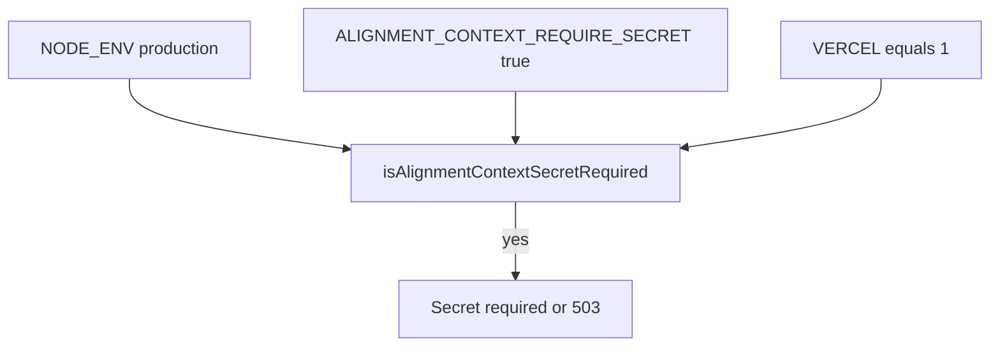

# OpenAtlas Wave 1–2 (verify + staging contract docs)

## Context loaded (protocol)

| Source                                                                                                                                                               | Relevance                                                                                                                        |
| -------------------------------------------------------------------------------------------------------------------------------------------------------------------- | -------------------------------------------------------------------------------------------------------------------------------- |
| `[.cursor/state/handoff_latest.md](D:/portfolio-harness/.cursor/state/handoff_latest.md)` (#78)                                                                      | **Done:** verify green noted. **Next:** Phase 3 Option A (staging API) — **out of scope** for this plan unless you reprioritize. |
| `[.cursor/state/intent_surface.md](D:/portfolio-harness/.cursor/state/intent_surface.md)` / [session_brief.md`](D:/portfolio-harness/.cursor/state/session_brief.md) | Playwright audit prep — **differs** from this Wave 1–2; your message defines scope here.                                         |
| [docs/VERIFICATION_CI_ALIGNMENT.md`](D:/portfolio-harness/docs/VERIFICATION_CI_ALIGNMENT.md)                                                                         | Local DoD = same order as CI for OpenAtlas.                                                                                      |

**Bitcoin-Chaos / org-intent:** Not engaged (no observation, mapping, or org-intent edits).

---

## Wave 1 — Definition of done: `npm run verify` green

**Repo:** `[D:/portfolio-harness/OpenAtlas](D:/portfolio-harness/OpenAtlas)`

1. **Run** `npm run verify` (lint + `tsc --noEmit` + Vitest). Capture **all** `tsc`/ESLint failures with `file:line` (cap output per serialization rules).
2. **Fix** with **minimal diffs**: prefer proper types and narrowing over `@ts-expect-error` except where already established (e.g. known Three.js depth issues). Match patterns in adjacent code (`[src/lib/hooks/useSurveyForm.ts](D:/portfolio-harness/OpenAtlas/src/lib/hooks/useSurveyForm.ts)`, viz components, `[src/lib/dataAdapter.ts](D:/portfolio-harness/OpenAtlas/src/lib/dataAdapter.ts)`, etc.).
3. **Exclude from tsconfig** only if [CONTRIBUTING](D:/portfolio-harness/OpenAtlas/CONTRIBUTING.md) or team convention allows and the path is truly dev-only; default is **fix types**.
4. **Re-run** `npm run verify` until exit 0.
5. **Handoff block (for agent or human):** commands run, pass/fail, list of files touched.

### Capabilities + CI (likely no code change)

- **Read:** `[package.json](D:/portfolio-harness/OpenAtlas/package.json)` scripts `verify` / `verify:capabilities`; `[scripts/verify-capabilities-routes.mjs](D:/portfolio-harness/OpenAtlas/scripts/verify-capabilities-routes.mjs)`; `[src/app/api/capabilities/route.ts](D:/portfolio-harness/OpenAtlas/src/app/api/capabilities/route.ts)`.
- **CI:** `[.github/workflows/openatlas_e2e.yml](D:/portfolio-harness/.github/workflows/openatlas_e2e.yml)` already runs `npm run verify`, then `npm run verify:capabilities`, then Playwright — aligned with [VERIFICATION_CI_ALIGNMENT.md](D:/portfolio-harness/docs/VERIFICATION_CI_ALIGNMENT.md) § Portfolio-harness.
- **Action:** If script vs route manifest drift appears after verify fixes, apply the **smallest** edit (usually manifest or script expectations). **Do not** add a duplicate workflow if this file already gates `OpenAtlas/`**.

### Optional local parity with CI

- Run `npm run verify:e2e` or `npm run test:e2e` when claiming full CI parity (not strictly required if Wave 1 only mandates `verify`).

---

## Wave 2 — Staging / env contract (docs only)

**Goal:** Minimal checklist; **no** long duplication — link canonical docs.

**Authority for “when secret is required”:** `[src/lib/alignment-context/api-auth.ts](D:/portfolio-harness/OpenAtlas/src/lib/alignment-context/api-auth.ts)` — `isAlignmentContextSecretRequired()`: production `NODE_ENV`, `ALIGNMENT_CONTEXT_REQUIRE_SECRET=true`, or `VERCEL=1`.

| Deliverable                                                     | Change                                                                                                                                                                                                                                                                                                                                                                                                                                                                                        |
| --------------------------------------------------------------- | --------------------------------------------------------------------------------------------------------------------------------------------------------------------------------------------------------------------------------------------------------------------------------------------------------------------------------------------------------------------------------------------------------------------------------------------------------------------------------------------- |
| `[DEPLOYMENT.md](D:/portfolio-harness/OpenAtlas/DEPLOYMENT.md)` | Add a short **“Staging / non-localhost hosts”** subsection: any URL not localhost should set `ALIGNMENT_CONTEXT_API_SECRET` and use `ALIGNMENT_CONTEXT_REQUIRE_SECRET=true` **or** rely on Vercel (`VERCEL=1`) so secret is required per `api-auth.ts`. Link `[docs/agent/ALIGNMENT_CONTEXT_API.md](D:/portfolio-harness/OpenAtlas/docs/agent/ALIGNMENT_CONTEXT_API.md)` and `[docs/security/PUBLIC_SURFACE_AUDIT.md](D:/portfolio-harness/OpenAtlas/docs/security/PUBLIC_SURFACE_AUDIT.md)`. |
| `[.env.example](D:/portfolio-harness/OpenAtlas/.env.example)`   | One-line callout pointing to DEPLOYMENT + ALIGNMENT_CONTEXT_API (file already has commented alignment vars; avoid prose bloat).                                                                                                                                                                                                                                                                                                                                                               |
| `[README.md](D:/portfolio-harness/OpenAtlas/README.md)`         | Optional single bullet linking DEPLOYMENT § staging if README is the operator entry — only if it improves discoverability without duplicating DEPLOYMENT.                                                                                                                                                                                                                                                                                                                                     |

---

## Handoff update (after execution)

Update `[.cursor/state/handoff_latest.md](D:/portfolio-harness/.cursor/state/handoff_latest.md)` (or successor): **Done** = Wave 1 verify + Wave 2 docs; **Next** = leave handoff #78 Phase 3 as-is or your chosen priority; include commands run and files touched.

---

## Mermaid — alignment API secret gates (reference)

---

## Risks / escalation

- If `npm run verify` fails on **pre-existing lint debt** unrelated to touched files, note in handoff and avoid drive-by repo-wide lint unless in scope.
- **Scope creep:** Phase 3 DB routes (`[DATABASE_V1_INTENT.md](D:/portfolio-harness/OpenAtlas/docs/DATABASE_V1_INTENT.md)`) is **not** part of Wave 1–2 unless explicitly added.

