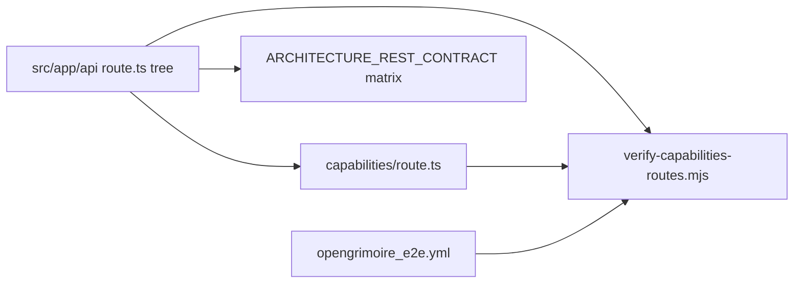

# OpenGrimoire agent-native priority backlog (items 1–10)

**Canonical repo:** [OpenGrimoire](D:\portfolio-harness\OpenGrimoire) under portfolio-harness. Normative docs: `[ARCHITECTURE_REST_CONTRACT.md](D:\portfolio-harness\OpenGrimoire\docs\ARCHITECTURE_REST_CONTRACT.md)`, `[agent/INTEGRATION_PATHS.md](D:\portfolio-harness\OpenGrimoire\docs\agent\INTEGRATION_PATHS.md)`, `[ACTION_PARITY_FILE_INDEX.md](D:\portfolio-harness\OpenGrimoire\docs\ACTION_PARITY_FILE_INDEX.md)`.

**Likely first fix:** `[src/app/api/capabilities/route.ts](D:\portfolio-harness\OpenGrimoire\src\app\api\capabilities\route.ts)` currently lists 9 `path` entries; `[scripts/verify-capabilities-routes.mjs](D:\portfolio-harness\OpenGrimoire\scripts\verify-capabilities-routes.mjs)` discovers **every** `src/app/api/**/route.ts` and expects a matching manifest path. Routes under `auth/`, `viz/`, `admin/moderation/` (and any other handlers) must either appear in `CAPABILITIES.routes` or the verify script must be intentionally narrowed (not recommended without documenting exclusions). Run `cd OpenGrimoire && npm run verify:capabilities` to see current drift, then fix manifest + matrix in one pass (unblocks P1 and feeds P5).

---

## P1 — Keep `GET /api/capabilities` and `npm run verify:capabilities` in sync (Low)

- After reconciling paths (above), ensure `[CONTRIBUTING.md](D:\portfolio-harness\OpenGrimoire\CONTRIBUTING.md)` (if present) or `[ACTION_PARITY_FILE_INDEX.md](D:\portfolio-harness\OpenGrimoire\docs\ACTION_PARITY_FILE_INDEX.md)` § maintainer checklist remains the single source for “touch API → update manifest.”
- CI already runs `npm run verify:capabilities` in `[.github/workflows/opengrimoire_e2e.yml](D:\portfolio-harness\.github\workflows\opengrimoire_e2e.yml)` (line ~39); no change unless you want a **standalone** job on every PR touching `OpenGrimoire/src/app/api/`** only (optional optimization).

## P2 — Entity × HTTP × auth matrix same PR as API changes (Low)

- Process rule only: any PR that adds/changes `[src/app/api/](D:\portfolio-harness\OpenGrimoire\src\app\api)` updates `[ARCHITECTURE_REST_CONTRACT.md](D:\portfolio-harness\OpenGrimoire\docs\ARCHITECTURE_REST_CONTRACT.md)` § Entity × HTTP × auth matrix in the **same** PR (`[ACTION_PARITY_FILE_INDEX.md](D:\portfolio-harness\OpenGrimoire\docs\ACTION_PARITY_FILE_INDEX.md)` already states this).
- Optional: add a one-line checkbox to the GitHub PR template for OpenGrimoire (if the repo uses `.github/pull_request_template.md`).

## P3 — Optional thin MCP over REST (Medium)

- Follow `[agent/INTEGRATION_PATHS.md](D:\portfolio-harness\OpenGrimoire\docs\agent\INTEGRATION_PATHS.md)` § “Optional future: thin MCP over REST”: tools = thin `fetch` wrappers to existing endpoints only; no duplicate business logic.
- Deliverable sketch: small Node package or repo subfolder (e.g. `OpenGrimoire/mcp-server/` or under `portfolio-harness`) listing tools (`alignment_context_list`, …) mapping to documented paths + auth headers; document env vars and link from `[MCP_CAPABILITY_MAP.md](D:\portfolio-harness\.cursor\docs\MCP_CAPABILITY_MAP.md)` when stable.

## P4 — Tiered UI freshness documentation (Medium)

- **Already documented** in `[ARCHITECTURE_REST_CONTRACT.md](D:\portfolio-harness\OpenGrimoire\docs\ARCHITECTURE_REST_CONTRACT.md)` § “UI integration: API mutations and UI freshness” (tiers 1–3) with pointer to `[AGENT_NATIVE_ALIGNMENT_UI_SEAM.md](D:\portfolio-harness\OpenGrimoire\docs\AGENT_NATIVE_ALIGNMENT_UI_SEAM.md)`.
- Remaining work: ensure OpenGrimoire `[README.md](D:\portfolio-harness\OpenGrimoire\README.md)` links to that section once for operator expectations; no new behavior required unless product wants tier-2 polling everywhere.

## P5 — Expand CRUD matrix for survey, brain-map, viz, moderation (Medium)

- Extend `[ARCHITECTURE_REST_CONTRACT.md](D:\portfolio-harness\OpenGrimoire\docs\ARCHITECTURE_REST_CONTRACT.md)` matrix with **honest** rows: for each route group (e.g. `viz/`*, `admin/moderation/`*, `auth/*`), document methods, auth, and whether the surface is **agent-observable** vs **browser/session only** (per contract’s “honest labeling” rule).
- Align `[capabilities/route.ts](D:\portfolio-harness\OpenGrimoire\src\app\api\capabilities\route.ts)` entries and `[alignment-context-cli.mjs](D:\portfolio-harness\OpenGrimoire\scripts\alignment-context-cli.mjs)` scope: CLI may remain alignment-only; matrix clarifies what external agents use HTTP for.

## P6 — SCP / provenance at harness (Medium)

- **Non-goal inside OpenGrimoire** per `[ARCHITECTURE_REST_CONTRACT.md](D:\portfolio-harness\OpenGrimoire\docs\ARCHITECTURE_REST_CONTRACT.md)` § Non-goals; enforcement is harness-side.
- Action: add or verify a short “OpenGrimoire alignment ingestion” bullet in `[local-proto/docs/TOOL_SAFEGUARDS.md](D:\portfolio-harness\local-proto\docs\TOOL_SAFEGUARDS.md)` (or portfolio link) pointing to `[SCP_LLM_INGESTION_CHECKLIST.md](D:\portfolio-harness\OpenGrimoire\docs\agent\SCP_LLM_INGESTION_CHECKLIST.md)` and MCP `scp_run_pipeline` usage; no app code required unless you want optional server-side redaction (out of scope here).

## P7 — In-app capabilities / deep link to `/api/capabilities` (Medium)

- Implement one minimal UX per `[ARCHITECTURE_REST_CONTRACT.md](D:\portfolio-harness\OpenGrimoire\docs\ARCHITECTURE_REST_CONTRACT.md)` § Capability discovery (roadmap): e.g. footer or About link “API and agents” → same host `GET /api/capabilities` or a static page that embeds/fetches JSON read-only.
- Keep machine-readable source of truth in `[capabilities/route.ts](D:\portfolio-harness\OpenGrimoire\src\app\api\capabilities\route.ts)`.

## P8 — Playwright E2E as CI truth (Ongoing)

- Keep `[e2e/](D:\portfolio-harness\OpenGrimoire\e2e)` as the gate; `[ARCHITECTURE_REST_CONTRACT.md](D:\portfolio-harness\OpenGrimoire\docs\ARCHITECTURE_REST_CONTRACT.md)` § Verification already names Playwright vs Maestro.
- Ongoing: extend specs when new user-visible flows ship; reference `[docs/AUTOMATION_INDEX.md](D:\portfolio-harness\docs\AUTOMATION_INDEX.md)` / `[VERIFICATION_CI_ALIGNMENT.md](D:\portfolio-harness\docs\VERIFICATION_CI_ALIGNMENT.md)` if present.

## P9 — Live agent + UI co-editing (High — product decision)

- Do **not** implement SSE/WebSocket in this backlog without an explicit decision.
- Deliverable: short ADR or section in contract: “We stay at tier 1–2 unless …” and link from `[AGENT_NATIVE_ALIGNMENT_UI_SEAM.md](D:\portfolio-harness\OpenGrimoire\docs\AGENT_NATIVE_ALIGNMENT_UI_SEAM.md)`.

## P10 — Prompt-native layer (High — product decision)

- **Today:** code-first per contract § Prompt-native features.
- Deliverable: if the product ever shifts, add an ADR and update the same contract section; no code in this pass unless scoped separately.

---

## Suggested implementation order

1. **Reconcile routes** (fixes P1, enables P5/P7 honesty): manifest + verify + matrix rows for all `route.ts` handlers.
2. **Docs/process** (P2, P4 README link, P6 harness cross-link).
3. **In-app discovery** (P7).
4. **Optional MCP** (P3) and **ADR-only** items (P9, P10).
5. **P8** continuously with feature work.

