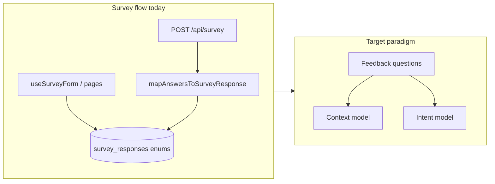

# OpenGrimoire: context and intent survey migration

## Locked paradigm (carry into every agent prompt)

**Old:** Collect attributes about the person.  
**New:** Elicit corrections and refinements so the system’s model of **situation (context)** and **goals/constraints (intent)** matches what the human means.

## Current codebase reality (constraints implementation)

- **DB:** `[OpenGrimoire/supabase/migrations/20240320000000_initial_schema.sql](D:/portfolio-harness/OpenGrimoire/supabase/migrations/20240320000000_initial_schema.sql)` defines `survey_responses` with Postgres enums (`learning_style`, `shaped_by`, `peak_performance` historically evolved), `tenure_years`, `unique_quality`, tied to `[attendees](D:/portfolio-harness/OpenGrimoire/supabase/migrations/20240320000000_initial_schema.sql)`.
- **Separate concern:** `[alignment_context_items](D:/portfolio-harness/OpenGrimoire/supabase/migrations/20260319140000_alignment_context_items.sql)` already stores operator/context notes (title, body, tags, `attendee_id`). The migration plan must decide **merge, link, or keep orthogonal** to the new survey paradigm.
- **API wire format:** `[OpenGrimoire/src/lib/survey/schemas.ts](D:/portfolio-harness/OpenGrimoire/src/lib/survey/schemas.ts)` — `POST` body with `answers[]` (`questionId` + `answer`).
- **Mapper:** `[OpenGrimoire/src/lib/survey/mapAnswersToSurveyResponse.ts](D:/portfolio-harness/OpenGrimoire/src/lib/survey/mapAnswersToSurveyResponse.ts)` — strict allowlist `KNOWN_QUESTION_IDS` maps to typed columns; unknown IDs fail.
- **Client paths:** `[OpenGrimoire/src/lib/hooks/useSurveyForm.ts](D:/portfolio-harness/OpenGrimoire/src/lib/hooks/useSurveyForm.ts)` writes legacy fields directly via `[createSurveyResponse](D:/portfolio-harness/OpenGrimoire/src/lib/supabase/db.ts)`; `[OpenGrimoire/src/app/api/survey/route.ts](D:/portfolio-harness/OpenGrimoire/src/app/api/survey/route.ts)` uses mapper for API submissions.
- **Types:** `[OpenGrimoire/src/lib/supabase/types.ts](D:/portfolio-harness/OpenGrimoire/src/lib/supabase/types.ts)` must stay in sync with migrations.
- **Alignment vocabulary:** [OpenHarness `docs/INTENT_ENGINEERING.md](D:/openharness/docs/INTENT_ENGINEERING.md)` defines **intent**, **scope**, **constraints**, **human_gate**, latency — use this as the canonical field vocabulary when designing `intent_snapshot` / handoff compatibility.
- **Verification bar:** Per `[portfolio-harness/docs/VERIFICATION_CI_ALIGNMENT.md](D:/portfolio-harness/docs/VERIFICATION_CI_ALIGNMENT.md)`, OpenGrimoire CI runs `npm run verify`, `npm run verify:capabilities`, then Playwright `npm run test:e2e` — any API/mapper/UI change must pass that sequence.

## Deliverable 1: Prompt pack (single source of truth)

Add a **new markdown file** under OpenGrimoire (suggested path: `[OpenGrimoire/docs/CONTEXT_INTENT_SURVEY_PROMPT_PACK.md](D:/portfolio-harness/OpenGrimoire/docs/CONTEXT_INTENT_SURVEY_PROMPT_PACK.md)`) that embeds verbatim:

1. **Paradigm sentence** (old vs new) at the top.
2. **Master system prompt** (role, definitions of context/intent, non-goals, data principle, output discipline with blast radius + rollback).
3. **Phased prompts A–E** exactly as you specified (discovery, IA, Supabase+API, copy+flow, verification).
4. **Example question transforms** (table: avoid self / prefer feedback-to-system).
5. **Supabase safety constraints** (no orphan renames; Zod for JSON bundles; document row semantics: session vs user vs project).
6. **Alignment tie-in:** Survey outputs should be usable for intent-alignment checks (scope, constraints, human_gate, escalation).
7. **Anti-patterns** (psychometrics center, orphan UI, ambiguous “you”).

**Storage fork (decision deferred):** Add a short subsection **“Phase A output: choose storage”** comparing:

- **Option A — JSONB on `survey_responses`:** e.g. `context_snapshot`, `intent_snapshot`, `schema_version`; additive migration; legacy enum columns deprecated or nullable.
- **Option B — New table:** e.g. `alignment_feedback_sessions` with FK to `attendees`/`sessions`; `survey_responses` retired or minimized.

Criteria: evolution speed, reporting needs, RLS, and how `[alignment_context_items](D:/portfolio-harness/OpenGrimoire/supabase/migrations/20260319140000_alignment_context_items.sql)` fits.

---

## Phase A — Discovery (read-only execution)

**Goal:** Fill the “artifact → purpose → change → risk” table for this repo.

**Inventory (minimum):**

| Area                | Files                                                                                                                                                                                                                                                                      |
| ------------------- | -------------------------------------------------------------------------------------------------------------------------------------------------------------------------------------------------------------------------------------------------------------------------- |
| Migrations / schema | `OpenGrimoire/supabase/migrations/*.sql`                                                                                                                                                                                                                                      |
| Generated types     | `[OpenGrimoire/src/lib/supabase/types.ts](D:/portfolio-harness/OpenGrimoire/src/lib/supabase/types.ts)`                                                                                                                                                                          |
| Zod + mapper        | `[schemas.ts](D:/portfolio-harness/OpenGrimoire/src/lib/survey/schemas.ts)`, `[mapAnswersToSurveyResponse.ts](D:/portfolio-harness/OpenGrimoire/src/lib/survey/mapAnswersToSurveyResponse.ts)`, `[survey.test.ts](D:/portfolio-harness/OpenGrimoire/src/lib/survey/survey.test.ts)` |
| API                 | `[OpenGrimoire/src/app/api/survey/route.ts](D:/portfolio-harness/OpenGrimoire/src/app/api/survey/route.ts)`                                                                                                                                                                      |
| UI                  | `[useSurveyForm.ts](D:/portfolio-harness/OpenGrimoire/src/lib/hooks/useSurveyForm.ts)`, survey-related pages/components (grep `survey` / `SurveyForm`)                                                                                                                        |
| Fixtures            | `[sample-survey-data.json](D:/portfolio-harness/OpenGrimoire/sample-survey-data.json)`, `[mockSurveyResponses3.json](D:/portfolio-harness/OpenGrimoire/src/data/mockSurveyResponses3.json)`                                                                                      |
| E2E                 | `[OpenGrimoire/e2e/survey.spec.ts](D:/portfolio-harness/OpenGrimoire/e2e/survey.spec.ts)`                                                                                                                                                                                        |
| Viz                 | `[OpenGrimoire/src/app/test-chord/page.tsx](D:/portfolio-harness/OpenGrimoire/src/app/test-chord/page.tsx)`                                                                                                                                                                      |
| `dataAdapter`       | `[OpenGrimoire/src/lib/dataAdapter.ts](D:/portfolio-harness/OpenGrimoire/src/lib/dataAdapter.ts)`                                                                                                                                                                                |

**Exit:** Written recommendation **JSONB vs new table** (or hybrid) + whether to integrate with `alignment_context_items`.

---

## Phase B — Target information architecture

**Goal:** Minimal schema for (1) context snapshot, (2) intent snapshot, (3) optional versioning — aligned with **Intent Schema** in `[INTENT_ENGINEERING.md](D:/openharness/docs/INTENT_ENGINEERING.md)` (e.g. `intent`, `scope`, `constraints`, `human_gate`, optional `latency_tolerance`).

- For each field: **owner** (human vs system), **cadence**, **structured vs free text**.
- Explicit mapping: **each UI question → one JSON path or column** (no orphan fields).

---

## Phase C — Supabase + API (after Phase B)

- New migration(s) under `[OpenGrimoire/supabase/migrations/](D:/portfolio-harness/OpenGrimoire/supabase/migrations/)`: prefer **additive** steps + backfill notes; document rollback (reverse migration or column drop policy).
- Regenerate or hand-update `[types.ts](D:/portfolio-harness/OpenGrimoire/src/lib/supabase/types.ts)` per project convention.
- Extend `[mapAnswersToSurveyResponse](D:/portfolio-harness/OpenGrimoire/src/lib/survey/mapAnswersToSurveyResponse.ts)` (or add a parallel mapper for JSON) so **new `questionId`s** validate and persist; **Zod** for JSON payloads on write.
- Update `[createSurveyResponse](D:/portfolio-harness/OpenGrimoire/src/lib/supabase/db.ts)` and `[route.ts](D:/portfolio-harness/OpenGrimoire/src/app/api/survey/route.ts)` as needed.

---

## Phase D — Question copy + UI flow

- Replace self-descriptive prompts with **feedback-to-system** wording; fix **subject** (“system’s current understanding” vs “your correction”).
- Align **live form** (`useSurveyForm` and any multi-step UI) with **API** (`/api/survey`) so **no orphan questions** (per your anti-patterns).
- Deprecate or remove unused `[SurveyForm.tsx](D:/portfolio-harness/OpenGrimoire/src/components/form/SurveyForm.tsx)` placeholder if it is dead code, or wire it to the same contract — confirm in Phase A.

---

## Phase E — Verification

Run the same sequence as CI (`[VERIFICATION_CI_ALIGNMENT.md](D:/portfolio-harness/docs/VERIFICATION_CI_ALIGNMENT.md)`):

`npm run verify` → `npm run verify:capabilities` → `npm run test:e2e` from `OpenGrimoire/`.

Extend unit tests in `[survey.test.ts](D:/portfolio-harness/OpenGrimoire/src/lib/survey/survey.test.ts)` for new `questionId` → storage mapping; update e2e if flows change.

---

## Risk and governance notes

- **RLS:** `[PUBLIC_SURFACE_AUDIT.md](D:/portfolio-harness/OpenGrimoire/docs/security/PUBLIC_SURFACE_AUDIT.md)` mentions `survey_responses` — any new table or policy must stay consistent.
- **Enum churn:** Replacing Postgres enums for personality fields is expensive; **JSONB + Zod** often reduces migration thrash for evolving questions (aligns with Phase A recommendation).
- **Portfolio gates:** For multi-file substantive edits, apply **critic** + **intent-alignment** JSON per `[.cursor/rules](D:/portfolio-harness/.cursor/rules)` when you mark work complete.

---

## What we are n

