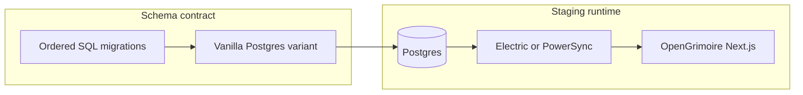

# OpenGrimoire: self-hosted Postgres + sync (schema freeze to staging app)

## Current state (repo facts)

- **Canonical DDL** lives under [OpenGrimoire/supabase/migrations/](D:\portfolio-harness\OpenGrimoire\supabase\migrations\), applied in timestamp order:
  - `20240320000000_initial_schema.sql` — enums, `attendees`, `survey_responses`, `peak_performance_definitions`, `moderation`, indexes, triggers, **RLS**
  - `20240320000001_fix_moderation_rls.sql`
  - `20250319130000_rename_years_at_medtronic_to_tenure_years.sql`
  - `20260319140000_alignment_context_items.sql`
  - `20260323120000_add_context_intent_snapshots.sql`
- **App integration today:** `[src/lib/supabase/client.ts](D:\portfolio-harness\OpenGrimoire\src\lib\supabase\client.ts)`, `[db.ts](D:\portfolio-harness\OpenGrimoire\src\lib\supabase\db.ts)`, **Realtime** in `[useVisualizationData.ts](D:\portfolio-harness\OpenGrimoire\src\components\DataVisualization\shared\useVisualizationData.ts)` (`supabase.channel`), `@supabase/supabase-js` + auth helpers in `[package.json](D:\portfolio-harness\OpenGrimoire\package.json)`. **No TanStack DB / Electric client yet** — local-first would be additive.

## Critical blocker: vanilla Postgres vs Supabase-only DDL

`[20240320000000_initial_schema.sql](D:\portfolio-harness\OpenGrimoire\supabase\migrations\20240320000000_initial_schema.sql)` uses **Supabase Auth**:

- `TO authenticated` role
- `auth.uid()` and `auth.users` in policies (e.g. peak performance admin email check, moderation)

**Self-hosted “just Postgres” will not apply cleanly** unless you either:

1. **Bring a compatible `auth` schema** (e.g. keep using Supabase Auth only for tokens while DB is elsewhere — unusual), or
2. **Ship a “vanilla Postgres” migration variant** that replaces Supabase RLS with:
  - database roles (`app_user`, `app_moderator`, …) and `SET ROLE` / connection role, or
  - RLS using `current_setting('request.jwt.claims', true)::json` **only if** you issue JWTs from your own IdP in the same shape, or
  - **move authorization to the application + sync rules** and simplify DB policies for the sync service user.

**Recommendation:** Treat “schema contract” as **two artifacts**:

- **A. Supabase-target** (unchanged): existing migrations for current hosted Supabase.  
- **B. Self-hosted-target**: new migration file(s) or patch sequence that removes `auth.`* dependencies and defines explicit roles/policies for staging/prod Postgres.

Until **B** exists, “empty DB + same migrations” is **blocked** for pure Postgres.

## Phase 1 — Freeze schema contract (no export required)

1. **Document the ordered list** above as the single source of truth (README or decision-log entry in portfolio-harness per your governance rules).
2. **Add a compatibility matrix row:** which statements require Supabase (`auth`, `authenticated`).
3. **Implement vanilla-Postgres RLS/roles strategy** (choose one approach from the blocker section); add migrations under the same folder or `supabase/migrations/vanilla/` with a clear naming convention.

## Phase 2 — Self-hosted Postgres (staging)

1. Run Postgres **15+** (match Supabase major if you plan logical migration later).
2. Apply **vanilla** migration sequence to an empty DB; verify tables: `attendees`, `survey_responses`, `peak_performance_definitions`, `moderation`, plus columns from later migrations (`alignment_context_items`, snapshot columns, etc.).
3. **Backups:** configure `pg_dump` / volume snapshots for staging before sync experiments.

## Phase 3 — Electric vs PowerSync (decision)

Use [D:\local-first\STACK_MATRIX.md](D:\local-first\STACK_MATRIX.md) as the project reference.

| Factor                              | ElectricSQL                                                                              | PowerSync                                                |
| ----------------------------------- | ---------------------------------------------------------------------------------------- | -------------------------------------------------------- |
| OpenGrimoire today                     | Web-first Next.js; fits **query-driven sync** and future **TanStack DB**                 | Strong when **SQLite on device** is primary client store |
| Ops                                 | Electric service + Postgres replication requirements                                     | PowerSync service + Postgres connector                   |
| **Suggested default for this repo** | **Electric** first — aligns with “reactive queries” path without mandating mobile SQLite | Choose if you standardize on **client SQLite** early     |

Pick one for **staging**; do not run both in production without a strong reason.

## Phase 4 — Wire sync to Postgres

1. Follow vendor self-hosted docs: **WAL / replication user / connection limits** (varies by product).
2. **Auth for sync clients:** issue **short-lived, scoped JWTs** (or vendor-equivalent) mapping users to row subsets; this **replaces** implicit Supabase RLS for those code paths over time.
3. **RLS vs sync:** sync services often use a **privileged DB user**; enforce **data scope** in sync rules + app, and keep RLS as defense-in-depth only if compatible with how the connector connects.

## Phase 5 — Point staging app at new stack

1. **Env split:** `NEXT_PUBLIC`_* for Supabase prod vs staging URLs for Postgres-backed API/sync (exact shape depends on Electric/PowerSync client).
2. **Replace over time:**
  - **Reads:** move from `supabase.from(...).select` to **local query** (PGlite/SQLite/Electric shapes) where synced.
  - **Writes:** optimistic local write + sync vs direct insert (survey flow: `[db.ts](D:\portfolio-harness\OpenGrimoire\src\lib\supabase\db.ts)`).
  - **Realtime:** `[useVisualizationData.ts](D:\portfolio-harness\OpenGrimoire\src\components\DataVisualization\shared\useVisualizationData.ts)` today uses **Supabase Realtime**; local-first replacement is **sync updates** or a small WebSocket to your app server — plan an explicit substitute.
3. **Verify:** extend existing `npm run verify` / Playwright against **staging** when env vars point there.

## Phase 6 — Data migration when export works

1. Prefer **logical dump** or Supabase-supported backup restore into self-hosted Postgres.
2. **Validate** row counts, FK integrity, and **auth user mapping** if you changed IdP.
3. **Cutover:** DNS/env flip; monitor; keep Supabase read-only until stable.

## What you drop vs keep (summary)

- **Drop (unless reimplemented):** Supabase Dashboard, hosted Postgres, bundled Realtime/Edge/Storage as product features.
- **Keep:** SQL shapes, migration history, **business rules** (re-express RLS as roles, JWT claims, or app logic).
- **Auth:** plan **token issuer** for sync; Supabase Auth can remain **only** for the legacy app until cutover — then migrate users or dual-run with clear session boundaries.

## Export blocked today

- Parallel track: **staging DDL + sync + app** does not require production export.
- For production data: **Supabase support** or **SQL editor table-by-table export** as fallback; track in your issue tracker.

## Suggested implementation todos (after approval)

1. Audit migrations for Supabase-only objects; design vanilla Postgres RLS/role strategy.
2. Add vanilla migration variant and apply to staging Postgres.
3. Choose Electric or PowerSync; deploy sync service against staging Postgres.
4. Spike one read path + one write path in OpenGrimoire using sync client; retire direct fetch for that slice.
5. Replace Realtime subscription in visualization with sync-driven refresh strategy.
6. Document env vars and runbook; align with [docs/VERIFICATION_CI_ALIGNMENT.md](D:\portfolio-harness\docs\VERIFICATION_CI_ALIGNMENT.md) if CI should hit staging.

