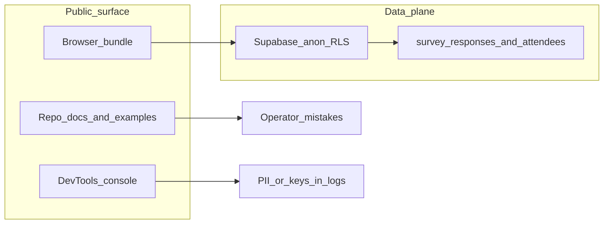

# OpenGrimoire: public-data audit, alignment channel, agent-native review

## Context (from read-only scan)

- **[DEPLOYMENT.md](D:/portfolio-harness/OpenGrimoire/DEPLOYMENT.md)** contains example lines for `NEXT_PUBLIC_SUPABASE_ANON_KEY` and `SUPABASE_SERVICE_ROLE_KEY` with JWT-shaped placeholders. Even truncated, this pattern encourages copying real material into tracked docs; treat as **high-priority redaction** (placeholders only, never project-specific values).
- **[README.md](D:/portfolio-harness/OpenGrimoire/README.md)** documents `NEXT_PUBLIC_BRAIN_MAP_SECRET` for a client header. Anything under `NEXT_PUBLIC_`* is **bundled to the browser**—this is an **architectural exposure** (not a “secret” in the server sense). The audit should flag it and recommend server-only verification or a short-lived token pattern.
- **Schema history:** `years_at_medtronic` appears only in [supabase/migrations](D:/portfolio-harness/OpenGrimoire/supabase/migrations) (initial + rename to `tenure_years`). Acceptable as migration archaeology; optional follow-up is renaming the migration file for cosmetic consistency (low priority, can break reproducibility if anyone relies on filenames).
- **Client console PII:** [useVisualizationData.ts](D:/portfolio-harness/OpenGrimoire/src/components/DataVisualization/shared/useVisualizationData.ts) logs `sampleData: validResponses.slice(0, 2)` after loading `survey_responses` with `attendee:attendees(*)`. That can leak **real survey text and attendee fields** to DevTools and any log sink—treat as **critical for “shouldn’t be public”** (remove or gate behind `NEXT_PUBLIC_DEBUG_`* with zero production logging of row payloads).
- **[client.ts](D:/portfolio-harness/OpenGrimoire/src/lib/supabase/client.ts)** already gates Supabase init logging behind `NEXT_PUBLIC_DEBUG_SUPABASE` + `development` and avoids logging key material—good baseline to extend to visualization logging.

---

## Phase 1 — Public / sensitive information audit (your selected scope: app + env/CI/docs)

**Goal:** Enumerate everything that could become public (repo, bundle, logs, CI) and produce a **remediation list** without ever pasting real secrets into chat or commits.

| Area                                                 | Checks                                                                                                                                                                                                                                                                                                                                                  |
| ---------------------------------------------------- | ------------------------------------------------------------------------------------------------------------------------------------------------------------------------------------------------------------------------------------------------------------------------------------------------------------------------------------------------------- |
| **Tracked secrets**                                  | Grep for `eyJ`, `sk-`, `service_role`, private keys; verify [.gitignore](D:/portfolio-harness/OpenGrimoire/.gitignore) covers `.env`*, local overrides; confirm no `.env` committed.                                                                                                                                                                       |
| **Docs / examples**                                  | [DEPLOYMENT.md](D:/portfolio-harness/OpenGrimoire/DEPLOYMENT.md), [docs/USAGE_GUIDE.md](D:/portfolio-harness/OpenGrimoire/docs/USAGE_GUIDE.md), [docs/DEVELOPER_GUIDE.md](D:/portfolio-harness/OpenGrimoire/docs/DEVELOPER_GUIDE.md): replace any JWT-shaped examples with `<anon-key>` / `<service-role-key>` and link to Supabase dashboard copy instructions. |
| *NEXT_PUBLIC_ review**                               | List every `NEXT_PUBLIC`_ usage; classify **intentionally public** (Supabase URL/anon) vs **should be server-only** (brain map “secret”). Document threat model: anon key + RLS = still need tight RLS and no service role in client.                                                                                                                   |
| **Logging**                                          | Audit all `console.`* in `src/` (not only [useVisualizationData.ts](D:/portfolio-harness/OpenGrimoire/src/components/DataVisualization/shared/useVisualizationData.ts)); strip or gate payload logs; ensure build/CI never echoes env values (Next already improved for Supabase client).                                                                  |
| **Static / public assets**                           | Scan [public/](D:/portfolio-harness/OpenGrimoire/public) and visualization copy for org-specific branding (already partially addressed; re-verify `/visualization`).                                                                                                                                                                                       |
| **Migrations / seeds**                               | Review SQL for embedded emails, names, or production-like data; ensure seeds are synthetic.                                                                                                                                                                                                                                                             |
| **CI** (if present under OpenGrimoire or monorepo root) | Workflow files: `secrets.`* usage only; no hardcoded tokens.                                                                                                                                                                                                                                                                                            |

**Deliverable:** `docs/plans/YYYY-MM-DD-opengrimoire-privacy-audit.md` (or `docs/security/PUBLIC_SURFACE_AUDIT.md`) with findings table: severity, file, issue, fix, verification step.

**Verification (after edits):** `rg` for sensitive patterns (excluding `.next`); `npm run build`; manual smoke: open visualization with DevTools and confirm no row dumps.

---

## Phase 2 — Product scope: “alignment and context questions” via app + data source

**Problem statement (draft):** Use OpenGrimoire and its Supabase-backed survey (and related entities) as the **structured input** for alignment/context prompts (for humans and/or agents), not only as charts.

**Numbered requirements (to refine with you in one follow-up message):**

1. **Capture:** Users or operators can submit or edit “alignment/context” items (questions, constraints, priorities) tied to stable IDs and timestamps.
2. **Consume:** The same store is readable by the visualization and by agent/harness workflows (export, API route, or MCP—TBD).
3. **Governance:** Distinguish **public demo data** vs **operator-only** content (RLS or separate table/project).
4. **Traceability:** Each item has provenance (who/when/source: UI vs import).

**Acceptance criteria (testable):**

- Given a new alignment record, when the visualization or an authorized consumer loads it, then the record appears without exposing PII in client logs.
- Given RLS policies, when an unauthenticated client queries protected tables, then reads/writes are denied per policy.
- Given an export path, when an agent requests context, then it receives only fields allowed by policy.

**Brainstorming HARD-GATE:** Do **not** implement new tables or UI until a **short design** (2–3 approaches + pick one) is written and you approve it—e.g. extend `survey_responses` vs new `alignment_context` table vs reuse harness `.cursor/state` files.

---

## Phase 3 — Refactor-reuse (before coding the alignment feature)

**Scan targets (narrow):**

- Existing survey types and hooks: [useVisualizationData.ts](D:/portfolio-harness/OpenGrimoire/src/components/DataVisualization/shared/useVisualizationData.ts), related types under `src/types` or visualization lib.
- Any existing “prompt” or “context” files under OpenGrimoire or [portfolio-harness](D:/portfolio-harness) (brain map, handoff, AGENTS).
- Supabase client patterns in [src/lib/supabase](D:/portfolio-harness/OpenGrimoire/src/lib/supabase).

**Report (required):** “Reuse / adapt / new” with one paragraph each—avoid duplicating a second survey pipeline if the first can carry metadata or a JSONB `context` field.

---

## Phase 4 — Agent-native architecture audit (scoped to OpenGrimoire)

Run the **eight principles** from your command as a **single-repo audit** (OpenGrimoire only), not the whole multi-root workspace:

| Principle              | OpenGrimoire focus                                                                   |
| ---------------------- | --------------------------------------------------------------------------------- |
| Action parity          | Map UI actions (load survey, filters, exports) vs any future agent tools.         |
| Tools as primitives    | N/A until MCP/API exists; note “future tools should be CRUD primitives.”          |
| Context injection      | How agent prompts would include current survey/alignment state (if exported).     |
| Shared workspace       | Same Supabase tables for user UI and agent consumers.                             |
| CRUD completeness      | `survey_responses`, `attendees`, future alignment entity.                         |
| UI integration         | Realtime channel already in hook—agent writes should trigger same updates.        |
| Capability discovery   | Docs/slash/help for “what data the agent can read.”                               |
| Prompt-native features | Prefer storing alignment text in DB/prompt templates vs hardcoding in components. |

**Deliverable:** Markdown section or `docs/plans/YYYY-MM-DD-opengrimoire-agent-native-audit.md` with **X/Y scores** per principle and top 10 recommendations (as in your command template).

---

## Execution order (after you exit plan mode)

1. Complete Phase 1 audit doc + fixes (logging, docs placeholders, NEXT_PUBLIC brain-map review).
2. Hold a **design approval** for Phase 2 (brainstorming gate).
3. Phase 3 reuse memo, then implement minimal data model + RLS + read path.
4. Phase 4 agent-native scores document.

---

## Risks and constraints

- **Service role key** must never appear in client or `NEXT_PUBLIC`_*; server routes only if needed.
- **Renaming migration files** for “medtronic” in the filename is optional and can confuse existing deploy docs—prefer leaving history intact unless you explicitly want cosmetic renames.
- **Critic loop:** After multi-file doc/code changes, produce the required critic JSON per workspace rule.

