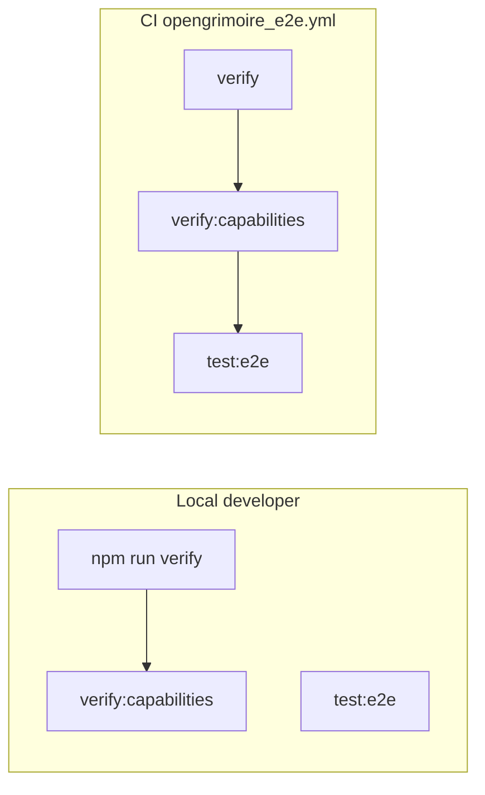

# OpenGrimoire: `verify` green + CI alignment with VERIFICATION_CI_ALIGNMENT

## Summary table (CI vs local vs gap)


| Layer                           | What runs                                                                                                                                                                                                                                                                 | Where                                       |
| ------------------------------- | ------------------------------------------------------------------------------------------------------------------------------------------------------------------------------------------------------------------------------------------------------------------------- | ------------------------------------------- |
| **CI (OpenGrimoire path)**         | `npm ci` then `**npm run test:e2e`** only ([opengrimoire_e2e.yml](D:/portfolio-harness/.github/workflows/opengrimoire_e2e.yml)); Playwright starts `**npm run dev`** per [playwright.config.ts](D:/portfolio-harness/OpenGrimoire/playwright.config.ts)                            | GitHub Actions on `OpenGrimoire/**` pushes/PRs |
| **Local `npm run verify`**      | `**npm run lint**` (`next lint`) + `**npm run type-check**` (`tsc --noEmit`) + `**npm run test**` (Vitest) — see [package.json](D:/portfolio-harness/OpenGrimoire/package.json) `verify` script                                                                              | Developer machine                           |
| **Local `verify:capabilities`** | Node script [scripts/verify-capabilities-routes.mjs](D:/portfolio-harness/OpenGrimoire/scripts/verify-capabilities-routes.mjs) — compares `src/app/api/**/route.ts` to [src/app/api/capabilities/route.ts](D:/portfolio-harness/OpenGrimoire/src/app/api/capabilities/route.ts) | Manual / CONTRIBUTING step 5                |
| **Local `verify:e2e`**          | `verify` then Playwright — not run in current CI as a single script                                                                                                                                                                                                       | Optional local                              |


**Gap:** CI does **not** run lint, `tsc`, Vitest, or `verify:capabilities`. A PR can pass CI while failing local `verify` (the situation you are in). [docs/VERIFICATION_CI_ALIGNMENT.md](D:/portfolio-harness/docs/VERIFICATION_CI_ALIGNMENT.md) states local definition of done should match CI for the same package—here CI is **narrower** than local, so alignment requires **extending CI**, not narrowing local “done” (lowering local bar would contradict the doc’s principle).

**Recommendation:** **Extend CI** by adding steps (or a preceding job) in the OpenGrimoire workflow to run, at minimum:

1. `npm run verify`
2. `npm run verify:capabilities`

Order: run these **before** `npx playwright install` / `npm run test:e2e` so failures are fast and cheaper. Same path filters and `working-directory: OpenGrimoire` as today. Node 20 matches the workflow.

Optional doc tweak (separate small follow-up): one sentence in [docs/VERIFICATION_CI_ALIGNMENT.md](D:/portfolio-harness/docs/VERIFICATION_CI_ALIGNMENT.md) under Portfolio-harness listing that OpenGrimoire workflow runs `verify` + capabilities + E2E.

---

## Phase A — Make `npm run verify` pass

**Execution (Agent mode):**

1. From `D:\portfolio-harness\OpenGrimoire`, run `npm run verify` and capture **all** `tsc` errors with file:line (refresh the list; prior sessions reported issues in areas such as `src/app/test-chord/page.tsx`, `src/app/test-context/page.tsx`, `src/components/visualization/Controls.tsx`, `NetworkGraph.tsx`, `src/lib/dataAdapter.ts`, `src/lib/utils/export.ts`—treat as hints only).
2. Fix with **minimal diffs**: prefer correct typings and narrowing over `@ts-expect-error`. For d3-heavy files, align with `@types/d3` and local domain types (e.g. chord utils).
3. `**tsconfig` exclude:** [tsconfig.json](D:/portfolio-harness/OpenGrimoire/tsconfig.json) currently only excludes `node_modules`. [CONTRIBUTING.md](D:/portfolio-harness/OpenGrimoire/CONTRIBUTING.md) does **not** endorse excluding experimental routes—only exclude dev-only paths if you add an explicit team convention; default plan is **fix types** for `test-chord` / `test-context` or remove dead experimental pages if truly unused.
4. Re-run `npm run verify` until exit 0.
5. Handoff: commands run, pass/fail, file list touched.

**Out of scope for this plan unless errors force it:** `next build` (not part of `verify`); ESLint warning-only cleanup across the whole repo—focus on errors that fail `next lint` if any.

---

## Phase B — CI workflow change (only after Phase A is green)

**Single workflow file:** [.github/workflows/opengrimoire_e2e.yml](D:/portfolio-harness/.github/workflows/opengrimoire_e2e.yml).

**Smallest change:** After `npm ci`, insert:

```yaml
      - name: Lint, typecheck, unit tests
        run: npm run verify
      - name: Capabilities manifest vs routes
        run: npm run verify:capabilities
```

Then keep existing Playwright install + `npm run test:e2e` steps unchanged.

**Naming:** Optionally rename workflow job/workflow name in a follow-up to reflect “verify + E2E” (cosmetic).

**Not adding:** Matrix builds, `next build` (unless you later want production compile gate—separate decision).

---

## Verification checklist (post-implementation)

- `D:\portfolio-harness\OpenGrimoire`: `npm run verify` passes
- Same directory: `npm run verify:capabilities` passes
- Optional local parity with CI: `npm run test:e2e` still passes after changes
- PR to `portfolio-harness`: Actions run extended steps on `OpenGrimoire/`** changes




**Today:** CI only runs E2Eci. **Target:** CI runs Vci + Capci + E2Eci, matching the documented principle in [VERIFICATION_CI_ALIGNMENT.md](D:/portfolio-harness/docs/VERIFICATION_CI_ALIGNMENT.md).