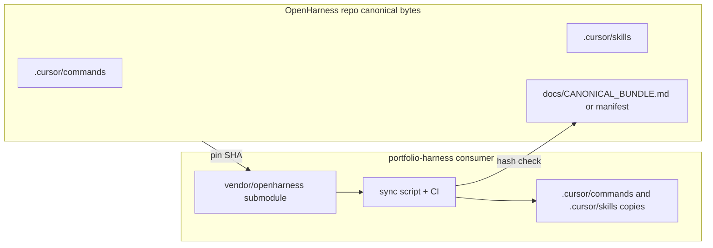

# OpenHarness as canonical home for agent-native + architect artifacts

## Current state (facts)

- `[portfolio-harness/.cursor/commands/architect.md](D:/portfolio-harness/.cursor/commands/architect.md)` exists and points at `[.cursor/skills/tech-lead/SKILL.md](../skills/tech-lead/SKILL.md)` via a **relative** path (repo-local).
- **OpenHarness** already has `[.cursor/skills/tech-lead/SKILL.md](D:/openharness/.cursor/skills/tech-lead/SKILL.md)` but has **no** `[.cursor/commands/](D:/openharness/.cursor/commands)` directory yet.
- `**/agent-native-audit`** text you use appears to come from the **compound-engineering** Cursor plugin (or similar), not from a tracked file under `portfolio-harness/.cursor/commands` (no `agent-native-audit.md` there).
- Related harness doc: `[portfolio-harness/.cursor/docs/AGENT_NATIVE_CHECKLIST.md](D:/portfolio-harness/.cursor/docs/AGENT_NATIVE_CHECKLIST.md)` (worth bundling with the audit workflow).

## Target architecture

**Principle:** Consumers keep **copies** under `.cursor/commands` / `.cursor/skills` because Cursor resolves those paths in **each** repo; verification is **not** “trust the README” but **submodule commit pin + optional file hashes + CI**.

## Deliverables (OpenHarness)

1. **Create** `[.cursor/commands/](D:/openharness/.cursor/commands)` in OpenHarness with:
  - `**architect.md`** — same contract as portfolio-harness today; **rewrite the tech-lead link** to OpenHarness-local: `.cursor/skills/tech-lead/SKILL.md` (relative from command file: `../skills/tech-lead/SKILL.md`).
  - `**agent-native-audit.md`** — capture the **full** command body you rely on (from plugin or your global commands) as **versioned markdown** in-repo (this is the mechanical source for the prompt template).
2. `**agent-native-architecture` skill in OpenHarness**
  - **License gate (blocking):** Read the compound-engineering plugin **LICENSE** under your Cursor plugins cache. If redistribution is allowed, **vendor** the skill into e.g. `[.cursor/skills/agent-native-architecture/](D:/openharness/.cursor/skills/agent-native-architecture/)` including `references/` and add a `**THIRD_PARTY_NOTICES.md`** (plugin name, version, license, source URL).
  - If **not** redistributable: ship a **short** OpenHarness-native `SKILL.md` that *only* describes principles + points to **installing/pinning** the plugin version, plus link to official repo—still mechanical (pinned version string in manifest) but no copied prose.
3. `**tech-lead` as canonical**
  - Diff [portfolio-harness `.cursor/skills/tech-lead/SKILL.md](D:/portfolio-harness/.cursor/skills/tech-lead/SKILL.md)` vs OpenHarness; **merge any portfolio-only improvements** into OpenHarness, then treat **OpenHarness as authoritative** going forward.
4. **Optional but recommended:** Move or copy `[AGENT_NATIVE_CHECKLIST.md](D:/portfolio-harness/.cursor/docs/AGENT_NATIVE_CHECKLIST.md)` into OpenHarness (e.g. `docs/AGENT_NATIVE_CHECKLIST.md` or `.cursor/docs/`) and link it from `agent-native-audit.md`.
5. **Verification manifest (verify-not-trust)**
  - Add `docs/CANONICAL_AGENT_BUNDLE.md` (or `.cursor/canonical-bundle.sha256`) listing **git commit** of OpenHarness as release line + **SHA256** of each bundled file (`architect.md`, `agent-native-audit.md`, `tech-lead/SKILL.md`, agent-native skill files or version pin).
  - Add `scripts/verify_canonical_bundle.ps1` (or `.sh`) in OpenHarness: recompute hashes and exit non-zero on mismatch.

## Deliverables (portfolio-harness consumer)

1. **Submodule:** Add `vendor/openharness` (or `external/openharness`) pinned to a **specific commit** documented in `[HARNESS_ROUTER_INVENTORY.md](D:/portfolio-harness/.cursor/docs/HARNESS_ROUTER_INVENTORY.md)` or root README.
2. **Sync script:** `scripts/sync_openharness_cursor_artifacts.ps1` that copies from the submodule into:
  - `.cursor/commands/architect.md`
  - `.cursor/commands/agent-native-audit.md`
  - `.cursor/skills/agent-native-architecture/` (if vendored)
  - `.cursor/skills/tech-lead/SKILL.md` (if OpenHarness is canonical for tech-lead)
  - Optionally `.cursor/docs/AGENT_NATIVE_CHECKLIST.md`
3. **CI check (recommended):** After sync, run OpenHarness’s `verify_canonical_bundle.ps1` against the **copied** files **or** `git diff --exit-code` if you choose to **commit** synced copies and require PRs to run sync + commit.
4. **Deprecate direct edits** in portfolio-harness for those paths: one-line header in synced files: `<!-- SYNCED FROM openharness@<sha> — edit upstream -->`.

## Cursor command naming

- OpenHarness: commands are `**/architect`** and `**/agent-native-audit**` (standard Cursor discovery).
- The label `**portfolio-harness/architect**` in your UI is a **namespaced alias** only; document in OpenHarness README: “same command body as legacy portfolio-harness `/architect`.”

## Risks / decisions

- **Third-party skill copying** is the main legal/process risk—resolve **before** copying `agent-native-architecture` wholesale.
- **Submodule vs subtree:** Submodule + sync script is usually simpler on Windows than teaching Cursor to read across submodule boundaries for commands.

## Verification

- OpenHarness repo: commands discoverable under `.cursor/commands/`; skills under `.cursor/skills/`; manifest + verify script passes locally.
- portfolio-harness: submodule pinned; sync produces identical hashes to manifest; CI fails on drift.

