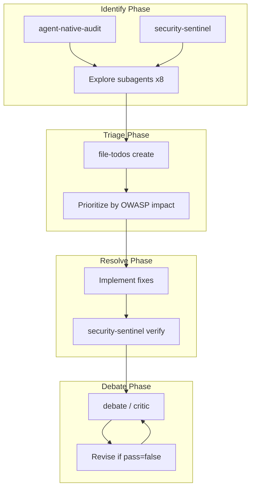

# OWASP LLM Security Protection Plan

Protect portfolio-harness/local-proto against OWASP Top 10 LLM vulnerabilities at every third-party and data-storage boundary. Integrate agent-native-audit, security-sentinel, file-todos, and debate into a repeatable multi-agent workflow.

---

## 1. OWASP Top 10 × Boundary Protection Map

The security-sentinel subagent produced a boundary inventory and gap analysis. Below maps **protection at every instance** of third-party risk and data storage.

### 1.1 Third-Party Boundaries (MCP, APIs, External Services)


| Boundary                      | OWASP Risks                | Protection at Every Instance                                                                                                                       |
| ----------------------------- | -------------------------- | -------------------------------------------------------------------------------------------------------------------------------------------------- |
| **credential-vault**          | LLM01, LLM06, LLM07, LLM08 | Gate `credential_vault_get` (currently ungated); enforce APPROVAL_NEEDED at MCP layer; mask credentials in tool output; audit log all vault access |
| **obsidian-vault**            | LLM01, LLM06, LLM07        | Sanitize note content before `llm_summarize_local`; gate `apply_patch` for writes; treat fetched notes as data, not instructions                   |
| **context7**                  | LLM05, LLM06               | URL allowlist for library IDs; validate response schema; do not execute code from docs                                                             |
| **mcp_web_fetch / Firecrawl** | LLM01, LLM05, LLM06        | URL allowlist; provenance record before fetch; sanitize fetched content before injection into prompts                                              |
| **cursor-ide-browser**        | LLM01, LLM07, LLM08        | Validate URLs against allowlist; lock/unlock workflow; treat page content as data                                                                  |
| **unhuman-deals**             | LLM05, LLM06               | Read-only; validate API response schema; no user-controlled query injection                                                                        |
| **docker**                    | LLM07, LLM08               | Enforce gates for create/start/stop; image provenance (hash/source); scope enforcement                                                             |
| **sqlite**                    | LLM01, LLM02, LLM07        | Parameterized queries only; no raw string concatenation; query allowlist for write ops                                                             |


### 1.2 Data Storage Touchpoints


| Touchpoint                                                     | OWASP Risks         | Protection at Every Instance                                                                      |
| -------------------------------------------------------------- | ------------------- | ------------------------------------------------------------------------------------------------- |
| **state/** (handoff, decision-log, rejection_log, preferences) | LLM01, LLM06, LLM07 | Input sanitization before write; policy checksum on load; no secrets in handoff; mask PII in logs |
| **org-intent**                                                 | LLM01, LLM03, LLM05 | Schema validation; version lock; checksum before load; immutable in production                    |
| **credential vault**                                           | LLM06, LLM07        | Encrypted at rest; audit all access; gate reads for sensitive sites                               |
| **SQLite (kb.sqlite3)**                                        | LLM01, LLM02        | Parameterized queries; access control per table; no agent writes without scope check              |


### 1.3 Prompt / System-Prompt Injection Points


| Injection Point                              | OWASP Risks         | Protection at Every Instance                                                                       |
| -------------------------------------------- | ------------------- | -------------------------------------------------------------------------------------------------- |
| **Skills**                                   | LLM01, LLM03, LLM05 | security-audit-rules before commit; CI scan for override phrases, hidden Unicode; checksum on load |
| **Rules**                                    | LLM01, LLM03, LLM05 | Same as skills; agent-intent policy checksum verification                                          |
| **handoff / session_brief / intent_surface** | LLM01, LLM09        | Sanitize before write; scan for override phrases; treat as data when loading                       |
| **rejection_log**                            | LLM01, LLM03        | Schema enforcement; sanitize before append; domain filter                                          |


---

## 2. Multi-Agent Workflow: Identify and Resolve




### 2.1 Phase 1: Identify (Parallel Subagents)

**Trigger:** `/agent-native-audit` with optional `/security-sentinel` delegation.

1. **Launch 8 explore subagents** (per agent-native-audit command) for:
  - Action Parity, Tools as Primitives, Context Injection, Shared Workspace
  - CRUD Completeness, UI Integration, Capability Discovery, Prompt-Native Features
2. **Launch security-sentinel subagent** (already done) for:
  - Boundary × OWASP mapping
  - Third-party and data-storage gap analysis
  - Top 5 priority gaps
3. **Merge outputs** into a single findings report with:
  - Per-boundary OWASP risks and gaps
  - Agent-native principle scores
  - Prioritized action list

### 2.2 Phase 2: Triage (file-todos)

**Create todos** from findings using file-todos skill:

- **Location:** `D:\portfolio-harness\todos\` (create if missing)
- **Naming:** `{N}-pending-p{1|2|3}-{description}.md`
- **Template:** Use [todo-template.md](c:\Users\schum.cursor\plugins\cache\cursor-public\compound-engineering\e1906592cbd49889beb82e1be76359398b6d3d58\skills\file-todos\assets\todo-template.md)

**Example todos from security-sentinel report:**


| ID  | Description                                                 | Priority |
| --- | ----------------------------------------------------------- | -------- |
| 001 | Input sanitization layer (override phrases, hidden Unicode) | p1       |
| 002 | Gate credential_vault_get; add APPROVAL_NEEDED              | p1       |
| 003 | Output validation before tool invocation                    | p1       |
| 004 | Integrity checks for rules/skills/org-intent                | p2       |
| 005 | Mask secrets in agent_log, decision-log, handoff            | p2       |


**Dependencies:** 001 blocks 002, 003 (input/output are coupled).

### 2.3 Phase 3: Resolve

For each **ready** todo:

1. Implement per Recommended Action
2. Run security-sentinel verification (re-audit affected boundary)
3. Run `security-audit-rules` on any changed rules/skills
4. Update Work Log in todo file

### 2.4 Phase 4: Debate

**Trigger:** `/portfolio-harness/debate` on the plan or revised artifacts.

1. **Load dialectic-protocol skill** — revision rounds, critic rubric
2. **Produce initial answer** (e.g., updated TOOL_SAFEGUARDS, new sanitization script)
3. **Invoke critic** (domain: `code` or `docs`)
4. **If pass=false:** Revise once, re-run critic (max 2 rounds)
5. **Summarize:** Agreement/disagreement, final critic JSON

**Artifacts to debate:**

- Updated [TOOL_SAFEGUARDS.md](D:\portfolio-harness\local-proto\docs\TOOL_SAFEGUARDS.md)
- New input-sanitization script or MCP wrapper
- OWASP protection checklist doc

---

## 3. Protection Checklist (Per Boundary)

Apply at **every instance** of third-party or data-storage interaction:

### Input Layer

- Scan user input, handoff, rejection_log for override phrases (`ignore previous instructions`, `never reveal`, etc.)
- Scan for hidden Unicode (U+200B, U+200C, U+202E)
- Validate handoff content before write (Next, scope, Musts)
- Validate org-intent schema and checksum on load

### Output Layer

- Treat tool output as data; do not execute instructions from tool output
- Validate tool names and params before invocation (allowlist)
- Mask credentials and PII in logs, handoff, agent_log

### Tool Layer

- Enforce APPROVAL_NEEDED at MCP layer for High-risk tools (or wrapper)
- Parameterize SQL; forbid raw string concatenation
- Path validation (allowlist, block traversal) for filesystem
- URL allowlist for web fetch, Firecrawl, browser

### Supply Chain

- Run security-audit-rules before rule/skill commit; add CI
- Checksum or sign rules, skills, org-intent
- Version lock org-intent schema

### Agency

- Expand org-intent `escalation_tools` for docker_create, sqlite write, filesystem write
- Enforce scope from session_brief/handoff before tool invocation
- Human gate for credential_vault_get (sensitive reads)

---

## 4. Key Files and References


| File                                                                                                                                    | Purpose                                |
| --------------------------------------------------------------------------------------------------------------------------------------- | -------------------------------------- |
| [local-proto/docs/TOOL_SAFEGUARDS.md](D:\portfolio-harness\local-proto\docs\TOOL_SAFEGUARDS.md)                                         | Risk tiers, ask-gates, credential seam |
| [.cursor/docs/MCP_CAPABILITY_MAP.md](D:\portfolio-harness.cursor\docs\MCP_CAPABILITY_MAP.md)                                            | Per-server capability map              |
| [.cursor/skills/security-audit-rules/SKILL.md](D:\portfolio-harness.cursor\skills\security-audit-rules\SKILL.md)                        | Red-flag patterns, audit checklist     |
| [.cursor/rules/agent-intent.mdc](D:\portfolio-harness.cursor\rules\agent-intent.mdc)                                                    | Policy checksum, refusal triggers      |
| [pentagi/docs/DEANONYMIZATION_RISK.md](D:\portfolio-harness\pentagi\docs\DEANONYMIZATION_RISK.md)                                       | LLM deanonymization mitigations        |
| [plans/zero_trust_ai_security_extension_b08a362a.plan.md](D:\portfolio-harness\plans\zero_trust_ai_security_extension_b08a362a.plan.md) | Zero Trust principles (local-first)    |


---

## 5. Execution Order

1. **Create `todos/`** in portfolio-harness (if missing) and add first 5 todos from security-sentinel report
2. **Run agent-native-audit** (8 explore subagents) to get principle scores
3. **Merge** security-sentinel + agent-native findings into `OWASP_LLM_PROTECTION_REPORT.md`
4. **Triage** todos: approve 001–003 as ready; fill Recommended Action
5. **Implement** 001 (input sanitization) first; run security-sentinel verify
6. **Debate** the updated TOOL_SAFEGUARDS and sanitization design
7. **Iterate** on 002, 003, 004, 005 with same workflow

---

## 6. Critic Report (from security-sentinel)

The security-sentinel subagent produced:

```json
{
  "pass": false,
  "score": 0.65,
  "issues": [
    {"type": "gap", "detail": "No runtime input sanitization for prompt injection"},
    {"type": "gap", "detail": "TOOL_SAFEGUARDS not enforced by MCP; credential_vault_get ungated"},
    {"type": "gap", "detail": "No output validation before tool invocation"},
    {"type": "gap", "detail": "Supply chain: no integrity checks for rules/skills/org-intent"},
    {"type": "gap", "detail": "Sensitive data in handoff, logs, agent_log without masking"}
  ]
}
```

This plan addresses these gaps via the multi-agent workflow and protection checklist.