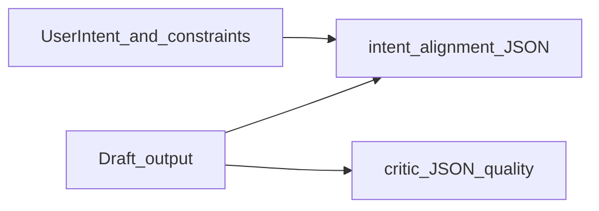

# Digest 2511.18538 + intent-drift gate + gap topography

## Context

- **Paper:** [HF papers 2511.18538](https://hf.co/papers/2511.18538) — *From Code Foundation Models to Agents and Applications: A Practical Guide to Code Intelligence* (survey: data → models → agents → deployment).
- **Local file:** `c:\Users\schum\Downloads\2511.18538v5.pdf` — treat as **local copy**; prefer **citing arXiv/HF URL + accessed date** in git-tracked docs (consistent with [decision-log](D:/openharness/.cursor/state/decision-log.md) pattern: avoid bulky or ambiguous-rights blobs in public harness repos unless you explicitly want them).

## Product scope (what “done” means)

1. **Digest:** Section-level map + your own “claims we care about” list (intent, evaluation, agent loops, safety).
2. **Archive:** One canonical markdown note with **provenance** (identifier, source URL, date accessed—not the whole PDF in-repo unless you choose otherwise).
3. **Gap analysis:** Table: **paper claim / recommendation** → **present in harness?** → **file(s) or gap ID** (reuse the rigor of [BRAIN_MAP_PROCESS_GAP_ANALYSIS.md](D:/openharness/docs/BRAIN_MAP_PROCESS_GAP_ANALYSIS.md)).
4. **Intent-drift rule:** A machine-checkable companion to the **critic** JSON—orthogonal axes: **quality** (critic) vs **alignment to stated intent** (new).

## How to digest and analyze (tool chain)


| Step              | Action                                                                                                                                                                                                                                                                     | Harness tie-in                                                                              |
| ----------------- | -------------------------------------------------------------------------------------------------------------------------------------------------------------------------------------------------------------------------------------------------------------------------- | ------------------------------------------------------------------------------------------- |
| Extract text      | Use a local PDF extractor (e.g. `pdftotext`, PyMuPDF) to `.md` or `.txt` under a **non-git or private** path if you want full text offline; or work from HF’s HTML/PDF in browser                                                                                          | Matches “Resources” in [CONTEXT_ENGINEERING.md](D:/openharness/docs/CONTEXT_ENGINEERING.md) |
| Safety before LLM | Run **SCP pipeline** on extracted chunks if they will enter agent state (see [secure-contain-protect](D:/openharness/.cursor/skills/secure-contain-protect/SKILL.md), portfolio [TOOL_SAFEGUARDS](D:/portfolio-harness/local-proto/docs/TOOL_SAFEGUARDS.md) if applicable) | Same as any RAG/handoff                                                                     |
| Structure         | Build a **TOC → section notes** matrix; tag lines with themes: `intent`, `context`, `evaluation`, `agents`, `deployment`                                                                                                                                                   | Feeds gap table                                                                             |
| Code topography   | For each theme, **grep / jCodeMunch `search_symbols`** in [D:/openharness](D:/openharness) and [D:/portfolio-harness](D:/portfolio-harness) for `intent`, `critic`, `handoff`, `goal-constraint`, `ESCALATE`                                                               | Map paper ↔ repo                                                                            |
| Research OA       | If you later obtain a **DOI**, use Unpaywall ([research-open-access skill](D:/openharness/.cursor/skills/research-open-access/SKILL.md)) for license/OA location—HF/arXiv is already a practical OA pointer for this preprint                                              | Provenance block in archive note                                                            |


**Optional heavier path:** If you use **campaign_kb** or another RAG ingest (e.g. Daggr `campaign_kb_ingest` with `source: pdfs`), only after text extraction + SCP—only if you need retrieval across long survey text.

## Architect: where artifacts live (OpenHarness–first)


| Artifact                   | Recommended location                                                                                                                            | Rationale                                                                                                                    |
| -------------------------- | ----------------------------------------------------------------------------------------------------------------------------------------------- | ---------------------------------------------------------------------------------------------------------------------------- |
| Brainstorm / scope         | [D:/openharness/docs/brainstorms/](D:/openharness/docs/brainstorms/) `YYYY-MM-DD-code-intelligence-survey-brainstorm.md`                        | Matches `/brainstorm` command; portable harness                                                                              |
| Research archive + gap doc | [D:/openharness/docs/research/](D:/openharness/docs/research/) (create if missing) `2511.18538-harness-gap-analysis.md`                         | Keeps surveys separate from `BRAIN_MAP`_* but same gap-analysis style                                                        |
| Cross-link from intent doc | Small subsection in [INTENT_ENGINEERING.md](D:/openharness/docs/INTENT_ENGINEERING.md) linking “alignment check” + new rule                     | Single source for intent semantics                                                                                           |
| New rule                   | [D:/openharness/.cursor/rules/intent-alignment-gate.mdc](D:/openharness/.cursor/rules/intent-alignment-gate.mdc) (new file)                     | Parity with [critic-loop-gate.mdc](D:/openharness/.cursor/rules/critic-loop-gate.mdc); `alwaysApply: false` until you opt in |
| Role routing touch         | [D:/openharness/.cursor/rules/role-routing.mdc](D:/openharness/.cursor/rules/role-routing.mdc) — one bullet: when to emit intent-alignment JSON | Discoverability                                                                                                              |


Portfolio-harness consumers can **copy or symlink** the rule, or inherit via their bundle docs ([CANONICAL_AGENT_BUNDLE](D:/openharness/docs/CANONICAL_AGENT_BUNDLE.md))—avoid duplicating prose in two places; link to OpenHarness as source of truth.

## Intent alignment gate (design)

**Problem the critic does not solve:** [critic-loop-gate.mdc](D:/openharness/.cursor/rules/critic-loop-gate.mdc) scores **artifact quality** (docs/code/UI). It does not check **drift from user intent** (scope creep, ignored constraints, goal-constraint conflict per [INTENT_ENGINEERING.md](D:/openharness/docs/INTENT_ENGINEERING.md)).

**Proposed JSON shape** (mirror critic simplicity):

```json
{
  "aligned": true,
  "drift_score": 0.0,
  "axes": {
    "scope": "in_scope|expanded|unclear",
    "constraints": "respected|violated|unknown",
    "human_gate": "honored|skipped|n/a"
  },
  "drift_signals": [{"type": "scope_creep", "detail": "..."}],
  "escalate": false,
  "rationale": "one paragraph"
}
```

**When to run:** After substantive assistant output (same class of triggers as critic), **inputs** = latest user **intent** (message + optional `intent_surface` / handoff fields from [HARNESS_ARCHITECTURE](D:/openharness/docs/HARNESS_ARCHITECTURE.md)) + draft response.

**Relationship to critic:** Run **both** for high-stakes multi-file work: critic → quality; intent-alignment → fit to mission.




## Gap analysis “topography” (what to compare)

Use a short table in the research doc:

- **Rows:** Survey sections most relevant to you (e.g. prompting/evaluation, autonomous agents, safety).
- **Columns:** `Harness_coverage` | `Primary_files` | `Gap_or_next_step`.
- **Anchors already in tree:** [INTENT_ENGINEERING.md](D:/openharness/docs/INTENT_ENGINEERING.md), [CONTEXT_ENGINEERING.md](D:/openharness/docs/CONTEXT_ENGINEERING.md), [critic-loop-gate.mdc](D:/openharness/.cursor/rules/critic-loop-gate.mdc), [HANDOFF_FLOW.md](D:/openharness/docs/HANDOFF_FLOW.md), [AGENT_NATIVE_CHECKLIST.md](D:/openharness/docs/AGENT_NATIVE_CHECKLIST.md), [BRAIN_MAP_PROCESS_GAP_ANALYSIS.md](D:/openharness/docs/BRAIN_MAP_PROCESS_GAP_ANALYSIS.md) (as **template**, not content overlap).

## Risk and governance

- **Low** for docs-only + new optional rule file; follow human-gated workflow in [.cursorrules](D:/software/.cursorrules) for anything that changes automation or CI.
- **No secrets** in archive notes; **no pasted emails** in public artifacts (Unpaywall etiquette).

## Implementation order (after you approve)

1. Extract/section-map PDF (local) → outline in brainstorm file.
2. Write `docs/research/2511.18538-harness-gap-analysis.md` with provenance + gap table.
3. Add `intent-alignment-gate.mdc` + pointer in `INTENT_ENGINEERING.md` + optional `role-routing.mdc` line.
4. Optional: sync rule to portfolio-harness and refresh bundle hashes if you use [CANONICAL_AGENT_BUNDLE](D:/openharness/docs/CANONICAL_AGENT_BUNDLE.md).

