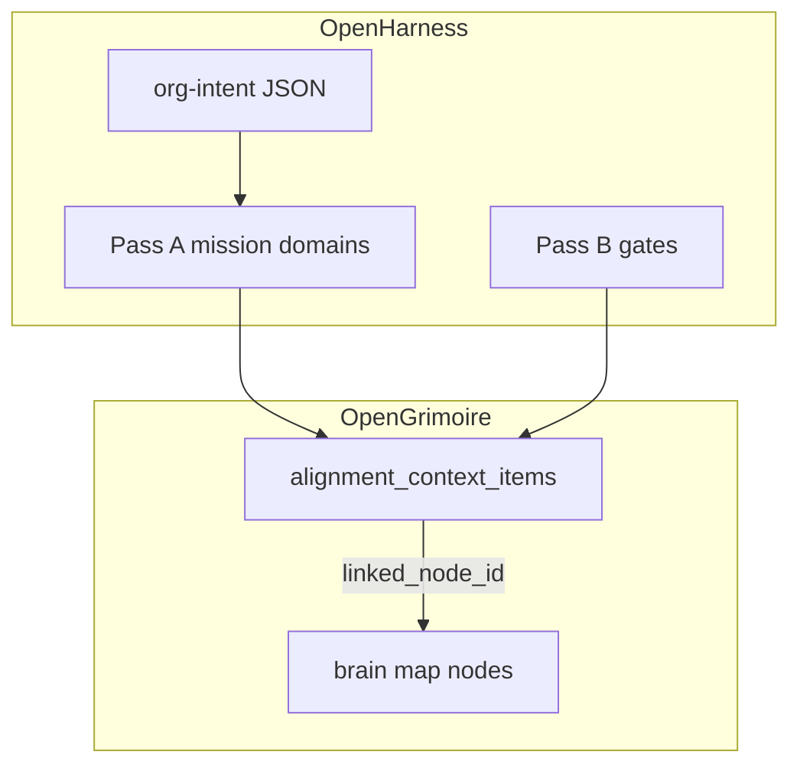

# Pass C — Context for AI labor (OpenGrimoire + brain map)

## Architecture (tech-lead / architect)

- **Source of truth for machine contract:** OpenGrimoire `alignment_context_items` exposed via [ALIGNMENT_CONTEXT_API.md](D:/portfolio-harness/OpenGrimoire/docs/agent/ALIGNMENT_CONTEXT_API.md) — fields relevant to Pass C: `**body`** (free text / structured notes), `**tags`** (string array for domain and classification), `**linked_node_id**` (optional string tying an item to a brain-map graph node), plus `title`, `status`, `priority`.
- **OpenHarness** documents intent and org-intent passes in-repo; OpenGrimoire lives under **portfolio-harness** ([README pointer](D:/openharness/README.md)). Pass C **extends** the same brainstorm as Pass A/B so one narrative flows: North star → gates → **operational context**.
- **Placement:** Add **Pass C** as a new major section to [2026-03-22-org-intent-north-star-brainstorm.md](D:/openharness/docs/brainstorms/2026-03-22-org-intent-north-star-brainstorm.md). Update **Repo alignment** with OpenGrimoire + MCP map link ([MCP_CAPABILITY_MAP.md](D:/portfolio-harness/.cursor/docs/MCP_CAPABILITY_MAP.md) OpenGrimoire / Brain Map rows).
- **Rationale:** Keeps human narrative and cross-links in `openharness/docs/brainstorms/`; avoids duplicating the HTTP contract (single canonical doc in OpenGrimoire).

## Pass C content to author (WHAT, not implementation code)

### C.1 Inventory tables (templates)

- **Current projects / repos / teams / tools:** Markdown tables with columns such as Name, Role, Repo path or URL, Owner, Notes — **placeholders only** in the public brainstorm (no secrets); user fills private doc.
- **Knowledge bases by domain:** Rows per domain (e.g. alignment tech, Fedimint/mesh research, personal health runbook, art portfolio, finance/home) with **Location** (vault path, repo, OpenGrimoire-only), **Refresh cadence**, **Agent may read**, **Human-only**.

### C.2 Explicitly out of scope for automation

- Bullet list pattern: medical diagnosis/treatment planning, binding legal/financial moves, relationship-sensitive content, unreleased IP — aligned with Pass B `hard_boundaries`; reference **delegation_rules** / escalate.

### C.3 Mapping to OpenGrimoire: `body`, `tags`, `linked_node_id`

| Concept               | How to encode                                                                                                                                                 |
| --------------------- | ------------------------------------------------------------------------------------------------------------------------------------------------------------- |
| Domain / labor lane   | `tags`: e.g. `domain:health`, `domain:wealth`, `domain:influence`, `repo:openharness`, `tool:mcp` (convention documented in Pass C)                           |
| Rich context          | `body`: short markdown or structured sections (projects active, blockers, links to handoff paths)                                                             |
| Graph / visualization | `linked_node_id`: ID of the corresponding node in the brain-map viewer (same ID space the map uses for nodes; document where IDs are minted in your workflow) |
| Priority              | `priority` + `status` (`draft` / `active` / `archived`) per API                                                                                               |

### C.4 Brain map and intent

- One subsection: **why** `linked_node_id` matters — intent visualization stays anchored when context items change; agents **patch** items rather than duplicating graph state in prompts.
- Link to OpenGrimoire brain-map fixtures / e2e only as **reference** ([context-atlas.spec.ts](D:/portfolio-harness/OpenGrimoire/e2e/context-atlas.spec.ts) uses brain-map JSON) — no need to copy fixtures into openharness.

## Agent-native architecture (discipline)

- **Context injection:** Session briefs or handoffs should **summarize** active alignment items (or `GET /api/alignment-context?status=active`) so the agent knows current projects and domains — aligns with dynamic context injection and “available resources” in system prompt.
- **Parity:** Operators can CRUD via UI (admin) or agents via [alignment-context-cli.mjs](D:/portfolio-harness/OpenGrimoire/scripts/alignment-context-cli.mjs) with `OPENGRIMOIRE_BASE_URL` / secret — same contract as [MCP_CAPABILITY_MAP](D:/portfolio-harness/.cursor/docs/MCP_CAPABILITY_MAP.md).
- **Granularity:** Prefer **atomic** items per project or per domain slice; avoid one giant `body` that mixes unrelated labor — easier to tag and link nodes.

## Optional follow-up (out of this plan unless you ask)

- Seed **example** `POST` payloads in OpenGrimoire `docs/agent/` (non-secret) mirroring Pass C tag convention — only if you want discoverability inside OpenGrimoire repo without opening the brainstorm.

## Verification after edits

- Markdown links resolve (relative paths from `openharness/docs/brainstorms/` to `../INTENT_ENGINEERING.md` and to portfolio-harness OpenGrimoire docs using stable relative or full `D:` paths as you prefer elsewhere in the file).
- No secrets or PII in the brainstorm body.

