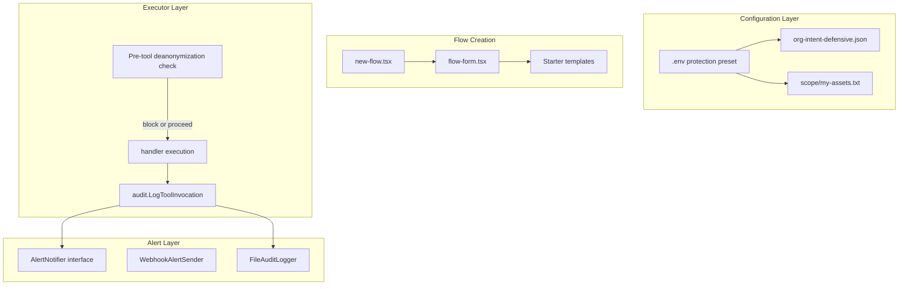

# PentAGI Protection-Oriented Setup and Gap Implementation

## Architecture Overview




---

## Phase 1: Protection-Oriented Configuration

### 1.1 Create `org-intent-defensive.json`

**File:** [pentagi/examples/org-intent-defensive.json](D:\portfolio-harness\pentagi\examples\org-intent-defensive.json) (new)

Copy [org-intent.example.json](D:\portfolio-harness\pentagi\examples\org-intent.example.json), change:

- `mode`: `"defensive"`
- `mission`: "Assess and harden systems. Identify exposure and threat surface. Do not exploit; document weaknesses for remediation."
- Keep hb-3 and escalation_tools for deanonymization_risk

### 1.2 Create scope example

**File:** [pentagi/examples/scope/my-assets.example.txt](D:\portfolio-harness\pentagi\examples\scope\my-assets.example.txt) (new)

One domain/IP per line (or comma-separated for TARGET_ALLOWLIST). Add header comment.

### 1.3 Add `.env.protection` preset

**File:** [pentagi/.env.protection](D:\portfolio-harness\pentagi.env.protection) (new)

Minimal override file with protection-oriented defaults:

- `ASK_USER=true`
- `ASK_BEFORE_OSINT_PII=true`
- `DEFENSIVE_PREAMBLE_ENABLED=true`
- `ORG_INTENT_PATH=examples/org-intent-defensive.json`
- `TERMINAL_BLOCKLIST_ENABLED=true`
- `BROWSER_URL_BLOCKLIST_ENABLED=true`
- `PENTAGI_AUDIT_LOG_PATH` (commented with example path)

Document in [pentagi/docs/HITL_PLAYBOOK.md](D:\portfolio-harness\pentagi\docs\HITL_PLAYBOOK.md) or [DEANONYMIZATION_RISK.md](D:\portfolio-harness\pentagi\docs\DEANONYMIZATION_RISK.md): "For protection-oriented setup, copy `.env.protection` values into `.env` or source before starting."

---

## Phase 2: Exposure Check User Flow Template

### 2.1 Add starter templates to new-flow UI

**Files:**

- [pentagi/frontend/src/pages/flows/new-flow.tsx](D:\portfolio-harness\pentagi\frontend\src\pages\flows\new-flow.tsx)
- [pentagi/frontend/src/features/flows/flow-form.tsx](D:\portfolio-harness\pentagi\frontend\src\features\flows\flow-form.tsx)

**Approach:** Add optional "Starter templates" dropdown or quick-fill buttons above the message textarea. When user selects "Exposure check", pre-fill:

- `message`: "Investigate user — identify the current exposed threat surface for the user. Use defensive mode: assess exposure of assets in scope, CVE lookups, threat intel search. Do not exploit."
- Optionally set `intent: "defensive"` when creating the flow (if CreateFlow mutation accepts it).

**CreateFlow mutation:** Check if `createFlow` accepts `intent` in input. Schema: [pentagi/backend/pkg/graph/schema.graphqls](D:\portfolio-harness\pentagi\backend\pkg\graph\schema.graphqls) — flows have `intent` column; verify CreateFlowInput.

**Implementation:**

1. Add `starterTemplates` constant: `{ id: 'exposure_check', label: 'Exposure check', message: '...' }`
2. In flow-form, add template selector (dropdown or chips); on select, set `message` and optionally pass `intent: 'defensive'` to createFlow
3. If CreateFlowInput does not include intent, set flow intent via UpdateFlowIntent after creation, or document that user must use org-intent defensive mode

### 2.2 Create exposure check prompt example

**File:** [pentagi/examples/prompts/exposure_check.md](D:\portfolio-harness\pentagi\examples\prompts\exposure_check.md) (new)

Structured prompt for "identify exposed threat surface": scope to own assets, CVE lookup, OSINT on domains/IPs in scope, search for threat intel, no exploitation. Reference in docs.

---

## Phase 3: Proactive Deanonymization Detection

### 3.1 Add `pkg/tools/deanonymization` package

**File:** [pentagi/backend/pkg/tools/deanonymization/check.go](D:\portfolio-harness\pentagi\backend\pkg\tools\deanonymization\check.go) (new)

- `IsDeanonymizationRiskTool(tool string) bool` — returns true for osint, search, browser, google, tavily, perplexity (from escalation_tools)
- `MatchesIdentityQuery(args []byte, tool string) bool` — heuristic: for search/browser, regex on url/query for patterns like "who is", "identify user", "find person"; for osint, use existing `WorkflowTagForAudit` logic (phone/username)
- `CheckPreTool(flowID int64, tool string, args []byte, db *database.DB) (block bool, reason string)`:
  - If tool not in risk set, return false
  - If osint with phone/username: already gated by ASK_BEFORE_OSINT_PII; optionally log intent_check
  - If search/browser with identity-like query: query `GetFlowLastNToolcalls(flowID, 10)` — if flow had osint (phone/username) in last N, return block=true, reason="deanonymization_risk: osint PII + identity search in same flow"
  - Use new DB query for flow tool history

### 3.2 Add `GetFlowLastNToolcalls` query

**File:** [pentagi/backend/sqlc/models/toolcalls.sql](D:\portfolio-harness\pentagi\backend\sqlc\models\toolcalls.sql)

```sql
-- name: GetFlowLastNToolcalls :many
SELECT id, name, args, created_at
FROM toolcalls
WHERE flow_id = $1
ORDER BY created_at DESC
LIMIT $2;
```

Run `sqlc generate`; add to querier.

### 3.3 Integrate pre-tool hook in executor

**File:** [pentagi/backend/pkg/tools/executor.go](D:\portfolio-harness\pentagi\backend\pkg\tools\executor.go)

In `wrapHandler`, before `handler(ctx, name, args)`:

- If `ce.cfg.DeanonymizationCheckEnabled` (new config) and `ce.db != nil`:
  - Call `deanonymization.CheckPreTool(ce.flowID, name, args, ce.db)`
  - If block: return error `"ESCALATE: deanonymization_risk — %s"`, do not call handler
- Pass config: add `DeanonymizationCheckEnabled bool` to config, default false (opt-in)

**File:** [pentagi/backend/pkg/config/config.go](D:\portfolio-harness\pentagi\backend\pkg\config\config.go)

Add `DeanonymizationCheckEnabled bool` with `env:"DEANONYMIZATION_CHECK_ENABLED" envDefault:"false"`

**File:** [pentagi/backend/cmd/ftester/worker/executor.go](D:\portfolio-harness\pentagi\backend\cmd\ftester\worker\executor.go)

Same pre-tool check before `tool.Handle`, when worker has db and config.

### 3.4 Wire config into executor construction

**File:** [pentagi/backend/pkg/tools/tools.go](D:\portfolio-harness\pentagi\backend\pkg\tools\tools.go)

Ensure `customExecutor` receives config (or at least `DeanonymizationCheckEnabled`). Check `NewCustomExecutor`-style constructors; add config field if missing.

---

## Phase 4: Audit Alerts

### 4.1 Add AlertNotifier interface and WebhookAlertSender

**File:** [pentagi/backend/pkg/audit/alert.go](D:\portfolio-harness\pentagi\backend\pkg\audit\alert.go) (new)

```go
type AlertNotifier interface {
    NotifyIdentityLikeWorkflow(entry ToolInvocationEntry) error
}

type WebhookAlertSender struct {
    URL    string
    Client *http.Client
}

func (w *WebhookAlertSender) NotifyIdentityLikeWorkflow(entry ToolInvocationEntry) error {
    // POST JSON to URL with event=identity_like_workflow, flow_id, tool, workflow_tag, timestamp
}
```

### 4.2 Add config for alert webhook

**File:** [pentagi/backend/pkg/config/config.go](D:\portfolio-harness\pentagi\backend\pkg\config\config.go)

- `AuditAlertWebhookURL string` — `env:"PENTAGI_AUDIT_ALERT_WEBHOOK_URL"` (empty = no alerts)

### 4.3 Compose FileAuditLogger with AlertNotifier

**Option A (simpler):** After `LogToolInvocation` in executor, if `entry.WorkflowTag == "osint_pii"` and `AuditAlertWebhookURL != ""`, call `AlertNotifier.NotifyIdentityLikeWorkflow(entry)`.

**Option B:** Wrap `AuditLogger` with a `AlertingAuditLogger` that logs to file and conditionally calls notifier. Keeps executor unchanged.

**Recommendation:** Option A — in executor, after `LogToolInvocation`, if config has webhook URL and `WorkflowTag == "osint_pii"`, call webhook. Minimal new types; executor already has auditLogger.

**File:** [pentagi/backend/pkg/tools/executor.go](D:\portfolio-harness\pentagi\backend\pkg\tools\executor.go)

After `LogToolInvocation`:

- If `ce.alertNotifier != nil` and `WorkflowTagForAudit(name, args) == "osint_pii"`:
  - `ce.alertNotifier.NotifyIdentityLikeWorkflow(entry)`

**Executor constructor:** When `AuditAlertWebhookURL` is set, create `WebhookAlertSender` and pass as `alertNotifier` to executor.

### 4.4 Document in .env.example

Add comment for `PENTAGI_AUDIT_ALERT_WEBHOOK_URL` — when set, POST to URL on osint_pii invocations.

---

## Phase 5: Documentation Updates

### 5.1 DEANONYMIZATION_RISK.md

- Add "Protection-Oriented Setup" section: link to `.env.protection`, `org-intent-defensive.json`, scope example
- Add "Proactive Detection" section: `DEANONYMIZATION_CHECK_ENABLED`, behavior, when to enable
- Add "Audit Alerts" section: `PENTAGI_AUDIT_ALERT_WEBHOOK_URL`, payload format

### 5.2 HITL_PLAYBOOK.md

- Add "Exposure Check" flow template description
- Reference starter template in new-flow UI

### 5.3 .env.example

- Add `DEANONYMIZATION_CHECK_ENABLED` (default false)
- Add `PENTAGI_AUDIT_ALERT_WEBHOOK_URL` (optional)

---

## Implementation Order


| Step | Task                                                                                         | Risk   |
| ---- | -------------------------------------------------------------------------------------------- | ------ |
| 1    | Create org-intent-defensive.json, scope example, .env.protection                             | Low    |
| 2    | Add starter templates to new-flow + flow-form; exposure_check.md                             | Low    |
| 3    | Add GetFlowLastNToolcalls SQL + sqlc generate                                                | Low    |
| 4    | Add deanonymization/check.go (IsDeanonymizationRiskTool, MatchesIdentityQuery, CheckPreTool) | Medium |
| 5    | Add DeanonymizationCheckEnabled config; integrate pre-tool hook in executor + ftester        | Medium |
| 6    | Add AlertNotifier, WebhookAlertSender, config; wire into executor                            | Low    |
| 7    | Update docs (DEANONYMIZATION_RISK, HITL_PLAYBOOK, .env.example)                              | Low    |


---

## Verification

- `.env.protection` + org-intent-defensive + scope example exist
- New-flow shows "Exposure check" starter template; selecting it pre-fills message
- With DEANONYMIZATION_CHECK_ENABLED=true, osint (phone/username) + identity search in same flow blocks with ESCALATE
- With PENTAGI_AUDIT_ALERT_WEBHOOK_URL set, osint_pii invocations trigger webhook POST
- Docs updated

---

## Out of Scope / Deferred

- LLM-based search intent classification (adds latency/cost)
- In-app notification UI for alerts (webhook is sufficient for integration with external systems)
- Flow-level intent set from template at creation (if CreateFlowInput lacks intent, defer to org-intent)

