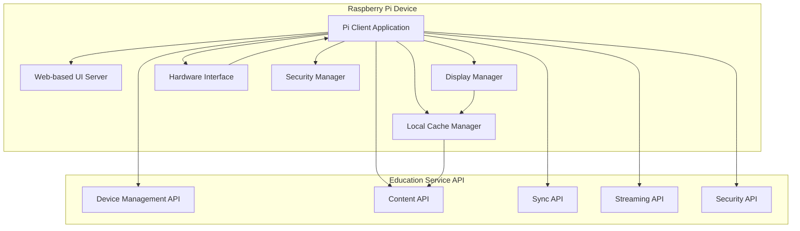

# Raspberry Pi Client System Integration Plan

## Overview

This plan implements a complete Raspberry Pi client system that connects to the educational platform for content streaming, display management, and local interaction. The system will be a standalone Python application with a web-based interface, supporting offline operation, hardware integration, and secure communication.

## Architecture Overview




## Component Structure

### 1. Pi Client Application (`pi-client/`)

**Location**: New directory at project root level**Structure**:

```javascript
pi-client/
├── pi_client/
│   ├── __init__.py
│   ├── main.py                 # Main application entry point
│   ├── config.py               # Configuration management
│   ├── client.py               # API client library
│   ├── cache/
│   │   ├── __init__.py
│   │   ├── manager.py          # Cache management
│   │   ├── storage.py          # Local storage operations
│   │   └── sync.py              # Sync operations
│   ├── display/
│   │   ├── __init__.py
│   │   ├── server.py           # Web UI server
│   │   ├── manager.py          # Display management
│   │   └── templates/          # HTML templates
│   ├── streaming/
│   │   ├── __init__.py
│   │   ├── client.py           # Streaming client
│   │   ├── buffer.py            # Buffering strategy
│   │   └── quality.py           # Adaptive quality
│   ├── hardware/
│   │   ├── __init__.py
│   │   ├── gpio.py             # GPIO interface
│   │   ├── camera.py            # Camera support
│   │   ├── audio.py             # Audio management
│   │   └── power.py             # Power management
│   └── security/
│       ├── __init__.py
│       ├── auth.py              # Device authentication
│       ├── crypto.py            # Encryption/decryption
│       ├── certificates.py      # Certificate management
│       └── remote_wipe.py       # Remote wipe capability
├── tests/
├── scripts/
│   ├── install.sh               # Installation script
│   ├── setup.sh                 # Setup script
│   └── deploy.sh                # Deployment script
├── requirements.txt
├── setup.py
└── README.md
```


### 2. Server-Side Enhancements

**Files to modify/create**:

- `education-service/app/api/pi/streaming.py` - New streaming endpoints
- `education-service/app/api/pi/security.py` - New security endpoints
- `education-service/app/services/streaming_service.py` - New streaming service
- `education-service/app/services/security_service.py` - New security service
- `education-service/app/models/pi_device.py` - Add security fields
- `education-service/app/schemas/pi.py` - Add security schemas

## Implementation Details

### Phase 1: Core Client Library

#### 1.1 API Client Library (`pi_client/client.py`)

**Features**:

- Lightweight HTTP client using `httpx`
- Automatic token refresh
- Retry logic with exponential backoff
- Connection pooling
- Request/response logging

**Key Methods**:

- `authenticate()` - Device authentication
- `get_content_list()` - Fetch content list
- `get_content_item()` - Fetch specific content
- `check_sync()` - Check for updates
- `request_sync()` - Request sync package
- `download_package()` - Download sync package
- `stream_media()` - Stream media with range requests

#### 1.2 Configuration Management (`pi_client/config.py`)

**Configuration Sources**:

- Environment variables
- Config file (`/etc/pi-client/config.yaml` or `~/.pi-client/config.yaml`)
- Command-line arguments
- Device registration data

**Configuration Schema**:

```python
{
    "device_id": str,
    "api_url": str,
    "auth_token": str,
    "cache_dir": str,
    "cache_size_mb": int,
    "sync_interval": int,
    "display": {
        "port": int,
        "rotation": str,
        "fullscreen": bool
    },
    "hardware": {
        "gpio_enabled": bool,
        "camera_enabled": bool,
        "audio_enabled": bool
    },
    "security": {
        "cert_path": str,
        "encryption_enabled": bool
    }
}
```


### Phase 2: Caching and Offline Support

#### 2.1 Cache Manager (`pi_client/cache/manager.py`)

**Features**:

- LRU cache with size limits
- Content metadata caching
- Media file caching with TTL
- Cache invalidation on sync
- Disk space management

**Storage Structure**:

```javascript
~/.pi-client/cache/
├── metadata/
│   └── content_*.json
├── media/
│   └── {content_id}/
│       ├── video.mp4
│       └── thumbnail.jpg
└── sync/
    └── packages/
```


#### 2.2 Sync Manager (`pi_client/cache/sync.py`)

**Features**:

- Background sync checking
- Incremental sync support
- Package download and extraction
- Conflict resolution
- Offline queue management

**Sync Flow**:

1. Check for updates (polling or webhook)
2. Request sync package
3. Download package (with resume support)
4. Verify checksum
5. Extract and update cache
6. Mark sync complete

### Phase 3: Content Streaming

#### 3.1 Streaming Client (`pi_client/streaming/client.py`)

**HTTP Range Request Implementation**:

- Chunked downloading
- Adaptive buffer management
- Network quality detection
- Automatic quality adjustment
- Resume on interruption

**Streaming Strategy**:

- Pre-buffer initial segment
- Maintain buffer threshold
- Adjust chunk size based on network
- Support multiple formats (MP4, WebM, etc.)

#### 3.2 Server-Side Streaming (`education-service/app/api/pi/streaming.py`)

**New Endpoints**:

- `GET /devices/{device_id}/content/{content_id}/stream` - Stream media with range support
- `GET /devices/{device_id}/content/{content_id}/stream/info` - Get stream metadata

**Implementation**:

- Use FastAPI's `StreamingResponse` with range support
- Support for multiple quality levels
- Content-Type detection
- CORS headers for Pi client

### Phase 4: Display Management

#### 4.1 Web UI Server (`pi_client/display/server.py`)

**Technology Stack**:

- FastAPI for web server
- Jinja2 for templating
- WebSocket for real-time updates
- Static file serving

**Features**:

- Dashboard view
- Content browser
- Media player
- Settings interface
- Remote control interface

#### 4.2 Display Manager (`pi_client/display/manager.py`)

**Features**:

- Content rotation scheduling
- Display mode switching (kiosk, interactive, etc.)
- Touch event handling
- Screen orientation management
- Fullscreen control

**Display Modes**:

- Kiosk: Auto-rotate content, no interaction
- Interactive: Touch-enabled, user navigation
- Presentation: Fullscreen media playback
- Dashboard: Multi-content display

#### 4.3 Remote Control (`pi_client/display/remote.py`)

**WebSocket API**:

- Content navigation commands
- Playback control
- Display mode switching
- Settings updates

### Phase 5: Hardware Integration

#### 5.1 GPIO Interface (`pi_client/hardware/gpio.py`)

**Features**:

- Sensor reading (temperature, humidity, etc.)
- Button input handling
- LED control
- Relay control
- I2C/SPI device support

**Dependencies**:

- `RPi.GPIO` or `gpiozero` library
- Optional: `adafruit-circuitpython` for advanced sensors

#### 5.2 Camera Support (`pi_client/hardware/camera.py`)

**Features**:

- Photo capture
- Video recording
- Timelapse creation
- Integration with content system

**Dependencies**:

- `picamera2` (Raspberry Pi Camera Library)

#### 5.3 Audio Management (`pi_client/hardware/audio.py`)

**Features**:

- Audio playback control
- Volume management
- Audio routing
- System sound control

**Dependencies**:

- `pygame` or `pyaudio` for audio playback

#### 5.4 Power Management (`pi_client/hardware/power.py`)

**Features**:

- Battery monitoring (if applicable)
- Power state detection
- Sleep/wake management
- Power optimization

### Phase 6: Security

#### 6.1 Device Authentication (`pi_client/security/auth.py`)

**Authentication Flow**:

1. Device registration (one-time, generates device certificate)
2. Certificate-based authentication
3. Token refresh mechanism
4. Secure credential storage

#### 6.2 Certificate Management (`pi_client/security/certificates.py`)

**Features**:

- Certificate generation on registration
- Certificate renewal
- Certificate validation
- Trust store management

**Server-Side** (`education-service/app/services/security_service.py`):

- Device certificate storage
- Certificate validation
- Revocation list management

#### 6.3 Encryption (`pi_client/security/crypto.py`)

**Features**:

- TLS/SSL for all communications
- Encrypted local cache (optional)
- Secure credential storage
- Data encryption at rest

#### 6.4 Remote Wipe (`pi_client/security/remote_wipe.py`)

**Features**:

- Remote wipe command reception
- Secure data deletion
- Cache clearing
- Certificate revocation
- Factory reset capability

**Server-Side Endpoint**:

- `POST /api/v1/pi/devices/{device_id}/wipe` - Initiate remote wipe

### Phase 7: Server-Side Enhancements

#### 7.1 Streaming Service (`education-service/app/services/streaming_service.py`)

**Features**:

- Media file serving with range support
- Quality adaptation logic
- Stream metadata generation
- Content delivery optimization

#### 7.2 Security Service (`education-service/app/services/security_service.py`)

**Features**:

- Device certificate management
- Certificate validation
- Remote wipe command handling
- Security event logging

#### 7.3 Database Schema Updates

**Add to `PiDevice` model**:

- `certificate_fingerprint` (String) - Device certificate fingerprint
- `last_seen` (DateTime) - Last connection timestamp
- `security_status` (Enum) - Security status (active, revoked, wiped)
- `encryption_key` (String, encrypted) - Device encryption key

**New Model: `DeviceCertificate`**:

- `device_id` (FK)
- `certificate_data` (Text)
- `private_key` (Text, encrypted)
- `issued_at` (DateTime)
- `expires_at` (DateTime)
- `revoked` (Boolean)

### Phase 8: Deployment and Scripts

#### 8.1 Installation Script (`scripts/install.sh`)

**Features**:

- System dependency installation
- Python virtual environment setup
- Service file creation (systemd)
- Configuration file setup
- User/group creation

#### 8.2 Setup Script (`scripts/setup.sh`)

**Features**:

- Interactive device registration
- Network configuration
- Hardware detection and setup
- Initial sync
- Service activation

#### 8.3 Deployment Script (`scripts/deploy.sh`)

**Features**:

- Remote deployment support
- Configuration updates
- Service restart
- Health check verification

## API Specifications

### Client-to-Server APIs

**Base URL**: `{api_url}/api/v1/pi`**Authentication**: Bearer token or certificate-based**New Endpoints**:

1. **Streaming**:

- `GET /devices/{device_id}/content/{content_id}/stream` - Stream media (Range: bytes=start-end)
- `GET /devices/{device_id}/content/{content_id}/stream/info` - Get stream info

2. **Security**:

- `POST /devices/{device_id}/certificates/register` - Register device certificate
- `POST /devices/{device_id}/certificates/renew` - Renew certificate
- `GET /devices/{device_id}/security/status` - Get security status

3. **Remote Control**:

- `POST /devices/{device_id}/control/command` - Send remote command
- `WebSocket /devices/{device_id}/control/ws` - Real-time control

### Internal APIs (Web UI)

**Base URL**: `http://localhost:{display_port}`**Endpoints**:

- `GET /` - Dashboard
- `GET /content` - Content browser
- `GET /content/{id}` - Content viewer
- `GET /settings` - Settings page
- `WebSocket /ws` - Real-time updates

## Streaming Protocol Design

### HTTP Range Request Protocol

**Request Format**:

```javascript
GET /api/v1/pi/devices/{device_id}/content/{content_id}/stream HTTP/1.1
Host: {api_host}
Authorization: Bearer {token}
Range: bytes=0-1048575
```

**Response Format**:

```javascript
HTTP/1.1 206 Partial Content
Content-Type: video/mp4
Content-Range: bytes 0-1048575/52428800
Content-Length: 1048576
Accept-Ranges: bytes
```

**Client Implementation**:

- Request chunks of configurable size (default: 1MB)
- Maintain buffer of 2-3 chunks ahead
- Adjust chunk size based on download speed
- Support resume on interruption

## Deployment Guide

### Prerequisites

- Raspberry Pi OS (Bullseye or later)
- Python 3.9+
- Network connectivity
- Sufficient storage (minimum 8GB free)

### Installation Steps

1. **Clone and Install**:
   ```bash
      git clone <repository>
      cd pi-client
      ./scripts/install.sh
   ```


2. **Configure**:
   ```bash
      ./scripts/setup.sh
   ```


3. **Register Device**:

- Run setup script
- Enter API URL and credentials
- Device will be registered automatically

4. **Start Service**:
   ```bash
      sudo systemctl start pi-client
      sudo systemctl enable pi-client
   ```


### Configuration Files

**Location**: `/etc/pi-client/config.yaml`**Example**:

```yaml
device:
  device_id: "pi-001"
  device_name: "Classroom Display 1"

api:
  base_url: "https://education.example.com"
  auth_token: "..."

cache:
  directory: "/home/pi/.pi-client/cache"
  max_size_mb: 5000
  ttl_hours: 168

display:
  port: 8080
  rotation: "landscape"
  fullscreen: true
  mode: "kiosk"

hardware:
  gpio_enabled: true
  camera_enabled: false
  audio_enabled: true

security:
  cert_path: "/etc/pi-client/certs/device.pem"
  encryption_enabled: true
```


## Hardware Integration Guide

### GPIO Setup

**Example**: Temperature sensor reading

```python
from pi_client.hardware.gpio import GPIOInterface

gpio = GPIOInterface()
temperature = gpio.read_sensor("temperature")
```


### Camera Setup

**Example**: Capture photo for content

```python
from pi_client.hardware.camera import CameraInterface

camera = CameraInterface()
photo_path = camera.capture_photo("/tmp/photo.jpg")
```


### Audio Setup

**Example**: Play audio content

```python
from pi_client.hardware.audio import AudioManager

audio = AudioManager()
audio.play_file("/path/to/audio.mp3")
```


## Testing Strategy

### Unit Tests

- Client library methods
- Cache management
- Streaming logic
- Security functions

### Integration Tests

- API communication
- Sync operations
- Hardware interfaces
- Display management

### End-to-End Tests

- Full device registration flow
- Content sync and playback
- Offline operation
- Remote control

## Security Considerations

1. **Certificate-Based Auth**: All devices use certificates for authentication
2. **Encrypted Communication**: TLS 1.3 for all
3. API calls
4. **Secure Storage**: Credentials encrypted at rest
5. **Remote Wipe**: Capability to securely wipe devices
6. **Certificate Revocation**: Support for revoking compromised devices
7. **Audit Logging**: All security events logged

## Performance Optimization

1. **Caching**: Aggressive local caching to reduce API calls
2. **Background Sync**: Non-blocking sync operations
3. **Adaptive Streaming**: Quality adjustment based on network
4. **Resource Management**: Memory and CPU usage monitoring
5. **Connection Pooling**: Reuse HTTP connections

## Monitoring and Logging

- Application logs: `/var/log/pi-client/app.log`
- Error logs: `/var/log/pi-client/error.log`
- Sync logs: `/var/log/pi-client/sync.log`
- Health check endpoint: `GET /health`

## Future Enhancements

1. WebRTC for real-time communication
2. Machine learning for content recommendations
3. Advanced analytics and reporting