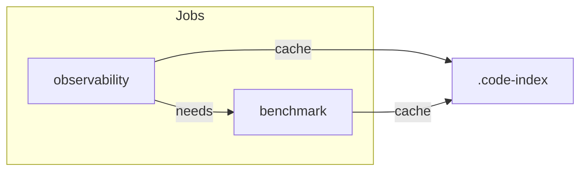

# Remaining Work Plan

## 1. Critic-loop-gate: Add Multi-File Reminder

**Current state:** [critic-loop-gate.mdc](c:\Users\schum.cursor\rules\critic-loop-gate.mdc) already has a rule on line 22: "When implementing multi-file changes (docs, workflow UI, or code), produce the critic JSON before marking the task complete."

**Proposed change:** Add a prominent **CONTEXT** block at the top (after the frontmatter) so agents see the multi-file reminder before the general rules. This surfaces the requirement at the moment of "marking complete" rather than burying it in the Rules list.

```markdown
---
description: Require model-as-judge critic loop for RAG outputs
alwaysApply: true
---

# Critic Loop Gate

**CONTEXT:** Before marking any multi-file change (docs, workflow UI, or code) as complete, you MUST produce the critic JSON below. Do not skip this step.

When generating RAG outputs...
```

**Alternative:** Add a cross-reference in [.cursor/state/README.md](D:\portfolio-harness.cursor\state\README.md) handoff schema (e.g. in the Done section guidance) pointing to critic-loop-gate for multi-file work. Lower priority; the CONTEXT block in the rule file is the primary fix.

---

## 2. Session Grouping in Audit

**Status:** Deferred. No implementation planned. Document as "optional future enhancement" in [audit_adoption.py](D:\portfolio-harness.cursor\scripts\audit_adoption.py) or [JCODEMUNCH_OBSERVABILITY.md](D:\portfolio-harness.cursor\docs\JCODEMUNCH_OBSERVABILITY.md) if desired.

---

## 3. Consolidate Duplicate jCodeMunch Workflows

**Current state:**

- [jcodemunch_ci.yml](D:\portfolio-harness.github\workflows\jcodemunch_ci.yml): single job, cache, ripgrep, observability + benchmark, artifact robustness, no pytest
- [jcodemunch_tests.yml](D:\portfolio-harness.github\workflows\jcodemunch_tests.yml): two jobs (observability, benchmark), pytest (observability, stress, golden), REPO_ROOT, broader paths, no cache, no ripgrep

**Target:** One consolidated workflow with the best of both.

### Merge Strategy


| Feature                                | Source | Rationale                                                                                |
| -------------------------------------- | ------ | ---------------------------------------------------------------------------------------- |
| Two jobs (observability, benchmark)    | tests  | Clear separation; benchmark needs portfolio-harness indexed                              |
| Cache .code-index                      | ci     | Speeds up runs                                                                           |
| ripgrep install                        | ci     | Required for benchmark grep method on Unix                                               |
| REPO_ROOT env                          | tests  | Path portability                                                                         |
| Path triggers                          | tests  | Broader: `.cursor/`**, `local-proto/**`                                                  |
| Pytest (observability, stress, golden) | tests  | Full test coverage                                                                       |
| Artifact robustness                    | ci     | `mkdir -p`, `touch`, `if-no-files-found: warn`                                           |
| Output paths                           | tests  | `.cursor/state/jcodemunch_report.json`, `.cursor/state/jcodemunch_benchmark_report.json` |


### Consolidated Workflow Structure




**Observability job:**

- Checkout, Python 3.11, ripgrep, jcodemunch-mcp
- Cache .code-index (key: `jcodemunch-index-${{ hashFiles('local-proto/**/*.py', '.cursor/scripts/**/*.py', '.cursor/tests/**/*.py') }}`)
- Index local-proto
- Run observability script → `.cursor/state/jcodemunch_report.json`
- Run pytest: `test_jcodemunch_observability.py`, `test_jcodemunch_stress.py`
- Upload artifact (with `if-no-files-found: warn`)

**Benchmark job** (needs: observability):

- Checkout, Python 3.11, ripgrep, jcodemunch-mcp
- Restore cache (same key)
- Index local-proto + portfolio-harness (repo root)
- Run benchmark `--assert-golden`
- Run pytest: `test_jcodemunch_golden.py`
- Ensure artifact paths exist (`touch`), upload both reports as single artifact `jcodemunch-reports`

**Triggers:** push/PR on `main`/`master`, paths: `.cursor/`**, `local-proto/**`

### Implementation Steps

1. Rewrite [jcodemunch_ci.yml](D:\portfolio-harness.github\workflows\jcodemunch_ci.yml) with the merged structure above.
2. Delete [jcodemunch_tests.yml](D:\portfolio-harness.github\workflows\jcodemunch_tests.yml).
3. Verify: both jobs use `REPO_ROOT`, `CODE_INDEX_PATH`, `JCODEMUNCH_LOCAL_PROTO`; observability output is `-o .cursor/state/jcodemunch_report.json`.

### Cache Sharing Between Jobs

GitHub Actions cache is key-based; both jobs use the same key. The observability job creates the cache; the benchmark job restores it. Include `.cursor/tests/**` in the hash so test changes invalidate the cache when relevant.

---

## Summary


| Item                | Action                                                          |
| ------------------- | --------------------------------------------------------------- |
| Critic-loop-gate    | Add CONTEXT block to critic-loop-gate.mdc                       |
| Session grouping    | Deferred; no change                                             |
| Duplicate workflows | Consolidate into jcodemunch_ci.yml; delete jcodemunch_tests.yml |


