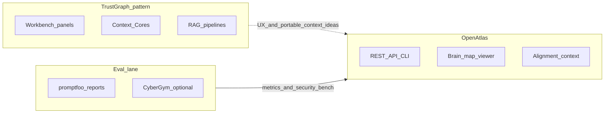

# External repos vs your stacks — reflection and next steps

## Constraints (this session)

- **Plan mode** is on: no file writes, no Obsidian commits, no skill files created until you approve a follow-up execution.
- **SCP:** A direct `scp_inspect` call failed here (MCP JSON error). Before archiving curated text in Obsidian, run `**scp_run_pipeline(content, sink='llm_context')`** or the atomic chain in [portfolio-harness/OpenAtlas/docs/agent/SCP_LLM_INGESTION_CHECKLIST.md](D:/portfolio-harness/OpenAtlas/docs/agent/SCP_LLM_INGESTION_CHECKLIST.md) — same policy as alignment/survey text: treat third-party README excerpts as **untrusted** at the harness boundary.

---

## Alignment matrix (concise)


| Source                                                                | Core idea                                                                                                                                                        | Fits your intent                                                                                                                                                                                                                                                                                                                                              | Contrast / risk                                                                                                                                                                                                                                                                             |
| --------------------------------------------------------------------- | ---------------------------------------------------------------------------------------------------------------------------------------------------------------- | ------------------------------------------------------------------------------------------------------------------------------------------------------------------------------------------------------------------------------------------------------------------------------------------------------------------------------------------------------------- | ------------------------------------------------------------------------------------------------------------------------------------------------------------------------------------------------------------------------------------------------------------------------------------------- |
| [TrustGraph](https://github.com/trustgraph-ai/trustgraph)             | Full “context platform”: multi-model store (Cassandra, Qdrant, Pulsar, RAG flows), **Workbench** UI (~8888), **Context Cores** (versioned portable bundles), MCP | Strong conceptual overlap with **context + retrieval + agents**. Ideas to **assimilate**: Context Core = pin/version/rollback for “what agents know”; workbench **surface areas** (vector search, graph viz, flows, runtime prompts, MCP tools panel) map to improving **OpenAtlas GUI philosophy** (operator clarity, staged knowledge, inspectable graphs). | Not a drop-in: OpenAtlas is **API/contract-first** ([INTEGRATION_PATHS.md](D:/portfolio-harness/OpenAtlas/docs/agent/INTEGRATION_PATHS.md)); TrustGraph is an **entire infra product**. Prefer **patterns and UX**, not fork-the-stack, unless you explicitly want Cassandra/Qdrant/Pulsar. |
| YouTube (`watch?v=sWc7mkhITIo`)                                       | Unknown without transcript                                                                                                                                       | Likely TrustGraph/marketing or UX — tie to Workbench inspiration after **transcript**                                                                                                                                                                                                                                                                         | Fetch captions (e.g. `mcp_ai-trends_fetch_youtube_captions` or manual), **SCP**, then one paragraph in vault                                                                                                                                                                                |
| [CyberGym](https://github.com/sunblaze-ucb/cybergym)                  | Large-scale **agent security eval** (real vulns, PoC server, Docker)                                                                                             | Aligns with **verifiable agent capability** and **security** posture; complements **promptfoo**-style LLM evals (you already have a [decide-sim / promptfoo plan](D:/software/.cursor/plans/decide-sim_harness_follow-on_8c9b784d.plan.md) pointing at OpenAtlas static JSON / reports)                                                                       | **Heavy assets** (~240GB dataset, large server data); integration = **optional CI lane** or **referenced benchmark**, not full data in-repo                                                                                                                                                 |
| [get-shit-done](https://github.com/gsd-build/get-shit-done)           | **Spec-driven** loop: discuss → plan → execute (waves) → verify; `.planning/` artifacts; XML tasks; multi-runtime installer                                      | **Philosophy matches** OpenHarness: verifiable work, phases, atomic commits, context hygiene — comparable to portfolio [HANDOFF_FLOW](D:/portfolio-harness/.cursor/HANDOFF_FLOW.md), **planning** / **qa-verifier** skills, critic + intent gates                                                                                                             | GSD is **Claude Code–centric commands**; OpenHarness is **repo rules + skills + CI alignment**. A **skill** should **bridge** (when to use GSD vs native planning), not duplicate 40k lines                                                                                                 |
| [learn-claude-code](https://github.com/shareAI-lab/learn-claude-code) | Pedagogical **harness** (loop, tools, subagents, skills, tasks, teams)                                                                                           | Aligns with [openharness/.cursor/skills/agent-native-architecture/SKILL.md](D:/openharness/.cursor/skills/agent-native-architecture/SKILL.md) and “harness not intelligence” narrative                                                                                                                                                                        | Reference implementation for **teaching**; optional **thin skill** that points to sessions s01–s12 + your existing patterns                                                                                                                                                                 |
| [MoneyPrinterV2](https://github.com/FujiwaraChoki/MoneyPrinterV2)     | Social/automation tooling (Twitter, Shorts, affiliate, outreach)                                                                                                 | **Low alignment** with OpenAtlas/OpenHarness **unless** you explicitly build growth automation                                                                                                                                                                                                                                                                | **AGPL-3.0** — license contagion if copied; ToS/automation ethics; treat as **out-of-stack comparison** only                                                                                                                                                                                |
| [Maestro](https://github.com/mobile-dev-inc/Maestro)                  | YAML **mobile/web E2E**, resilient flows                                                                                                                         | **Already reflected** in OpenAtlas: Playwright = CI truth; Maestro = optional YAML smoke — [INTEGRATION_PATHS.md](D:/portfolio-harness/OpenAtlas/docs/agent/INTEGRATION_PATHS.md), [ARCHITECTURE_REST_CONTRACT.md](D:/portfolio-harness/OpenAtlas/docs/ARCHITECTURE_REST_CONTRACT.md)                                                                         | No change required unless you want **more** Maestro coverage; keep **Playwright** as gate                                                                                                                                                                                                   |





---

## Recommended “assimilation” (what to actually do)

1. **TrustGraph → OpenAtlas GUI**
  - Borrow **information architecture**: one place for search, graph/relationships, library/staging, flows, prompts/schemas — without adopting their full backend.  
  - Treat **Context Core** as a product metaphor: versioned, portable bundles tied to your **alignment context** / brain-map story (fits human-gated autonomy in [.cursorrules](D:/software/.cursorrules)).
2. **CyberGym + promptfoo**
  - **promptfoo**: continue the trajectory in your existing plan (static JSON / HTML reports, optional OpenAtlas UI).  
  - **CyberGym**: define a **narrow** integration: e.g. document as **security eval reference**, run subset tasks in isolated CI, or link from OpenAtlas “agent capabilities” docs — **not** full dataset vendoring.
3. **GSD + learn-claude-code → skills (openharness + local-proto)**
  - Add `**gsd-workflow` (or `spec-driven-planning`)** skill: when to use GSD commands vs `/workflows:plan` / OpenHarness planning skill; pointer to install (`npx get-shit-done-cc`); alignment with **atomic commits**, **verification**, **critic JSON**.  
  - Add `**learn-claude-code-harness`** (thin): links to shareAI-lab repo + mapping table (s01–s12 → your skills: secure-contain-protect, planning, agent-native-architecture).  
  - **local-proto:** mirror or symlink skill stubs under `local-proto` only if that repo has `.cursor/skills` (currently **no** `.cursor` skills found at [D:/local-proto](D:/local-proto); plan to create structure or document cross-repo pointer).
4. **MoneyPrinterV2**
  - **Brief only**: contrast with your stacks (no social monetization core in OpenAtlas); **do not** merge code without explicit product decision and license review.
5. **Maestro**
  - **Brief**: confirm current docs remain source of truth; expand Maestro flows only where Playwright does not cover mobile.

---

## Execution sequence (after plan approval)

1. **SCP:** Run pipeline on **curated excerpts** (README bullets per repo + YouTube transcript if fetched).
2. **Obsidian:** One note per repo (or one note with sections) with wikilinks; include **source URL**, **SCP tier summary**, **alignment bullets**, **open questions**. Use your vault workflow (e.g. `mcp_obsidian-vault` or Foam path you use).
3. **Brainstorm doc:** [software/docs/brainstorms/](D:/software/docs/brainstorms/) `2026-03-23-external-repos-landscape-brainstorm.md` (or project convention) — **What / Why / Key decisions / Open questions** per brainstorming command.
4. **Skills PR:** Implement the two thin skills under [openharness/.cursor/skills/](D:/openharness/.cursor/skills/) (+ portfolio-harness if you mirror skills there). Run **security-audit-rules** on new SKILL.md per [.cursorrules](D:/portfolio-harness/.cursorrules).

---

## Open questions to resolve before implementation

- **Obsidian vault path:`**obsidian_cursor_integration` : confirm where archived notes should live.  
- **TrustGraph depth:** UX-only vs any pilot integration (e.g. read-only API comparison spike).  
- **CyberGym:** documentation-only vs CI subset (cost/maintenance).  
- **GSD:** global install for your machine vs project-local only.

---

## Actionable paths (briefing)


| Priority      | Path                                                                                                                                                      |
| ------------- | --------------------------------------------------------------------------------------------------------------------------------------------------------- |
| High          | **GUI roadmap** for OpenAtlas inspired by TrustGraph Workbench (panels, staging, inspectable graph, runtime prompts) — design doc first, no backend swap. |
| High          | **Eval stack**: unify promptfoo + (optional) CyberGym references in OpenAtlas/harness docs and CI story; align with existing promptfoo/DECIDE-SIM plan.   |
| Medium        | **Skills**: `gsd-workflow` + `learn-claude-code-harness` in openharness; wire local-proto pointer if you add `.cursor` there.                             |
| Medium        | **YouTube**: transcript + SCP + one “design insight” bullet in vault.                                                                                     |
| Low / caution | MoneyPrinterV2: **no integration** unless scope explicitly expands; AGPL and product mismatch.                                                            |
| Done          | Maestro: **document as already integrated** optionally; no mandatory change.                                                                              |


---

## Critic JSON (multi-file / design output — portfolio rule)

```json
{
  "pass": true,
  "score": 0.82,
  "issues": [
    {"type": "dependency", "detail": "SCP MCP failed in-session; operator must verify pipeline locally before Obsidian."},
    {"type": "scope", "detail": "TrustGraph full stack not recommended without explicit infra decision."},
    {"type": "license", "detail": "MoneyPrinterV2 AGPL requires explicit boundary if any code reuse."}
  ],
  "fixes": [
    {"action": "verify_scp", "detail": "Run scp_run_pipeline on archived excerpts before vault write."},
    {"action": "narrow_cybergym", "detail": "Start with docs + optional tiny CI subset, not full dataset."}
  ]
}
```

