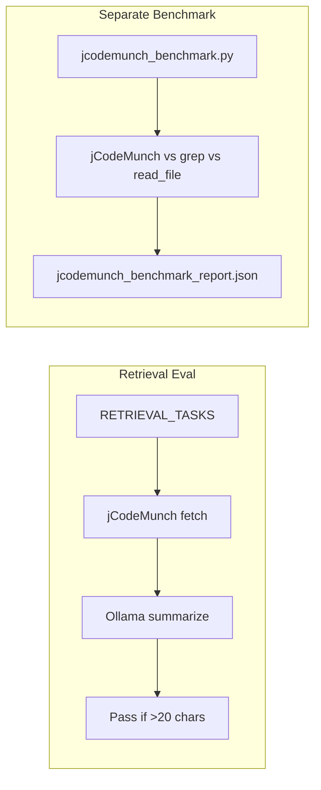

# Retrieval Eval and Doc Updates

## 1. Add retrieval eval to run_model_floor_evals.py

**File:** [run_model_floor_evals.py](D:\portfolio-harness.cursor\scripts\run_model_floor_evals.py)

**Changes:**

- Add `jcodemunch-mcp` as optional dependency (try/except import; if missing, retrieval task type exits with clear message).
- Define `RETRIEVAL_TASKS` — subset of 3–5 symbols from jcodemunch_benchmark TASKS (e.g. `compute_checksum`, `_resolve_repo_id`, `run_observability`). Use tuple format: `(symbol, repo_id_or_path, expected_file)`.
- Add `_fetch_symbol_via_jcodemunch(repo_id, symbol, expected_file) -> str` — calls `search_symbols` then `get_symbol`; returns source or empty string. Reuse logic from [jcodemunch_benchmark.py](D:\portfolio-harness.cursor\scripts\jcodemunch_benchmark.py) `_method_jcodemunch` (lines 66–100).
- Add `run_retrieval_eval(url, model) -> bool`:
  - Pick one task from RETRIEVAL_TASKS (e.g. round-robin or first).
  - Fetch symbol via jCodeMunch.
  - If empty, return False.
  - Call Ollama: system = "Summarize this function in one sentence."; user = source.
  - Pass = len(text.strip()) > 20.
- Update `--task-type` choices to include `retrieval`.
- Update `eval_fn` dispatch: `run_retrieval_eval` when `task_type == "retrieval"`.
- For retrieval: calibration_check uses same heuristic (smallest model on critic → fail; retrieval uses `success` for smallest or `fail` — scope says retrieval is lighter than critic, so default `success` for heuristic).

**Repo resolution:** `run_model_floor_evals` runs from portfolio-harness; ROOT = CURSOR_ROOT.parent. Use `_resolve_repo_id` from benchmark or inline. `LOCAL_PROTO` may be `local-proto` submodule; prefer ROOT symbols (compute_checksum, _resolve_repo_id, run_observability) to avoid path issues.

---

## 2. Update run_model_floor_evals.ps1

**File:** [run_model_floor_evals.ps1](D:\portfolio-harness.cursor\scripts\run_model_floor_evals.ps1)

- Add `retrieval` to `$TaskType` validation (or remove ValidateSet if using dynamic list).
- No other changes; script passes `--task-type` through.

---

## 3. Update AI_TASK_EVALS.md

**File:** [AI_TASK_EVALS.md](D:\portfolio-harness.cursor\docs\AI_TASK_EVALS.md)

**Model-Floor Table (lines 22–24):** Add row:

| Symbol retrieval (jCodeMunch) | 3B–7B | 7B+ | Fetch symbol via jCodeMunch; model summarizes in one sentence |

**Registry (lines 39–50):** Add row:

| **Retrieval eval** | jCodeMunch fetch + model summarize; pass = non-empty summary >20 chars | Before new task type; after model updates; quarterly | 3B–7B |

**Running evals (lines 54–62):** Add:

- **Retrieval:** Run `run_model_floor_evals.ps1 -TaskType retrieval`; outputs to model_floor_results.json.
- **Retrieval benchmark (separate):** Run `python .cursor/scripts/jcodemunch_benchmark.py`; no LLM; compares jCodeMunch vs grep+read_file vs read_file. Output: `jcodemunch_benchmark_report.json`. Optional: run before/after model-floor evals.

**Cross-references:** Add [CONTEXT_ENGINEERING.md](CONTEXT_ENGINEERING.md) — retrieval routing (jCodeMunch for symbol-by-name).

---

## 4. Update COMMANDS_README.md

**File:** [COMMANDS_README.md](D:\portfolio-harness.cursor\docs\COMMANDS_README.md)

**Audits and Evals section (lines 35–45):** Add rows:

| `.\\.cursor\\scripts\\run_model_floor_evals.ps1 -TaskType retrieval` | Model-floor retrieval eval (jCodeMunch + model summarize) |
| `python .cursor/scripts/jcodemunch_benchmark.py` | Retrieval benchmark (separate; no LLM); output_chars, latency, correct |

---

## 5. Add Daggr/calibration retrieval notes

**AI_TASK_EVALS.md:** In "Daggr workflows" and "Calibration" registry rows, add a brief note: "When retrieval needed (symbol lookup): use jCodeMunch per [CONTEXT_ENGINEERING.md](CONTEXT_ENGINEERING.md)."

**calibration_test_suite.md:** Add after "Model-floor evals" section:

**Retrieval routing:** When calibration tasks need code context (e.g. "Will AI succeed at task: find definition of function X?"), use jCodeMunch `search_symbols` → `get_symbol` per [CONTEXT_ENGINEERING.md](../docs/CONTEXT_ENGINEERING.md). Smaller payloads than codebase_search or full-file read.

**daggr_test_matrix.md (if exists):** Add one-line retrieval note. If file does not exist, skip (AI_TASK_EVALS already links it).

---

## 6. Dependency handling

**jcodemunch-mcp:** Import at top of `run_model_floor_evals.py` only when `task_type == "retrieval"` (lazy import) to avoid breaking handoff/critic when jcodemunch is not installed. If retrieval selected and import fails, print "Install: pip install jcodemunch-mcp" and exit 1.

---

## 7. Verification

- Run `python run_model_floor_evals.py --task-type retrieval --models phi` (or tinyllama) — verify pass/fail and model_floor_results.json.
- Run `.\run_model_floor_evals.ps1 -TaskType retrieval` — verify PowerShell wrapper.
- Run `python jcodemunch_benchmark.py` — verify no regression (existing benchmark).
- Grep for "retrieval" in AI_TASK_EVALS, COMMANDS_README, calibration_test_suite — confirm docs updated.

---

## Data flow

Retrieval eval = model + jCodeMunch. Benchmark = retrieval-only, no LLM.