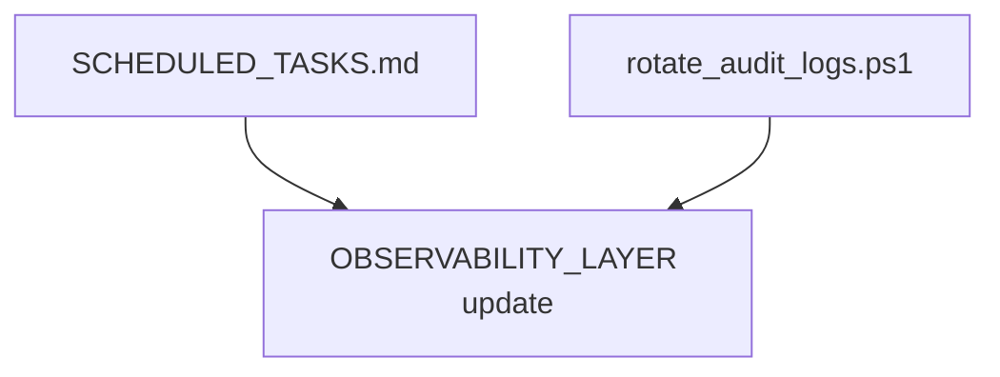

# Scheduled Tasks Implementation Plan

## Scope

- Create [local-proto/docs/SCHEDULED_TASKS.md](D:\portfolio-harness\local-proto\docs\SCHEDULED_TASKS.md) as central documentation
- Implement [rotate_audit_logs.ps1](D:\portfolio-harness\local-proto\scripts\rotate_audit_logs.ps1) (referenced in OBSERVABILITY_LAYER but missing)
- Optionally: drift-alert wrapper script

**Path convention:** Use `$env:HARNESS_ROOT` or document "Replace D:\portfolio-harness with your repo path" in all schtasks examples. [SCHEDULE_VEHICLE_RECOVERY.md](D:\portfolio-harness\local-proto\docs\SCHEDULE_VEHICLE_RECOVERY.md) uses `D:\CodeRepositories`; SCHEDULED_TASKS will use `D:\portfolio-harness` and note the override.

---

## Phase 1: SCHEDULED_TASKS.md

**File:** [local-proto/docs/SCHEDULED_TASKS.md](D:\portfolio-harness\local-proto\docs\SCHEDULED_TASKS.md)

**Content structure:**

1. **Overview** — Purpose: central doc for harness/local-proto scheduled automation. Platform: Windows (schtasks); Linux/macOS use cron (examples in appendix).
2. **Prerequisites** — HARNESS_ROOT env or set repo path; Python in PATH; PowerShell for .ps1 scripts.
3. **Task registry** — Table: Task name, schedule, script, purpose.
4. **schtasks commands** — One section per task with:
  - Exact command (use `%HARNESS_ROOT%` or `D:\portfolio-harness` with note to override)
  - Start in / working directory
  - Remove command
5. **Maintenance** — List tasks: `schtasks /query /tn "Harness-*"`; disable: `schtasks /change /tn "..." /disable`; view history: Task Scheduler GUI; logs: `%LOCALAPPDATA%\local-proto\` or task output.
6. **Cross-references** — Link to SCHEDULE_VEHICLE_RECOVERY.md, OBSERVABILITY_LAYER.md, COMMANDS_README.md.
7. **Appendix** — Optional cron equivalents for Linux/macOS.

**Tasks to document:**


| Task                      | Schedule                      | Script                                        |
| ------------------------- | ----------------------------- | --------------------------------------------- |
| LocalProto-Orchestrator   | On logon                      | orchestrator.py                               |
| Harness-DriftAnalysis     | Weekly Sun 9 AM               | analyze_drift.ps1 -Days 7                     |
| Harness-MetaReviewPrompt  | Weekly Mon 8 AM               | run_meta_review.ps1                           |
| Harness-IntentChecksum    | Weekly Sun 8 AM               | check_intent_checksum.ps1                     |
| Harness-PreCommitSecurity | Daily 6 AM                    | sanitize_input, validate_output, mask_secrets |
| Harness-AuditRotation     | Weekly Sun 2 AM               | rotate_audit_logs.ps1                         |
| VehicleRecovery-*         | Per SCHEDULE_VEHICLE_RECOVERY | run_vehicle_recovery_scheduled.ps1            |


---

## Phase 2: rotate_audit_logs.ps1

**File:** [local-proto/scripts/rotate_audit_logs.ps1](D:\portfolio-harness\local-proto\scripts\rotate_audit_logs.ps1) (new)

**Behavior (per OBSERVABILITY_LAYER):**

- **Audit dir:** `%LOCALAPPDATA%\local-proto\audit\` (or `LOCAL_PROTO_AUDIT_DIR` env)
- **Files:** `intent_decisions.jsonl`, `mcp_audit.jsonl`
- **Actions:**
  1. Parse each JSONL; extract timestamp from each line
  2. Split entries older than `-RetentionDays` (default 90) into archive
  3. Write archive to `audit/archive/YYYY-MM/` (e.g. `audit/archive/2026-01/intent_decisions.jsonl`)
  4. Overwrite source file with remaining (recent) entries
  5. Create archive dir if missing

**Params:** `-RetentionDays 90`, `-DryRun` (preview only)

**Security:** Reuse `analyze_drift.ps1` pattern: validate audit dir under `LOCAL_PROTO_AUDIT_SAFE_BASE` (default `%LOCALAPPDATA%`); reject if outside.

**Edge cases:** Empty file; malformed JSONL; missing timestamp (skip line or log warning).

**Placement:** `local-proto/scripts/` (same as check_intent_checksum.ps1) since it operates on local-proto audit dir. OBSERVABILITY_LAYER references it without path; we'll add path in docs: `local-proto/scripts/rotate_audit_logs.ps1` or `portfolio-harness/.cursor/scripts/` if we want it with other harness scripts. Given audit dir is `%LOCALAPPDATA%\local-proto\audit`, local-proto is the logical home.

---

## Phase 3: Optional Drift-Alert Wrapper

**File:** [.cursor/scripts/run_drift_analysis_with_alert.ps1](D:\portfolio-harness.cursor\scripts\run_drift_analysis_with_alert.ps1) (optional)

**Behavior:** Run `analyze_drift.ps1 -Days 7`; if exit code 1, append to `$env:LOCALAPPDATA\local-proto\drift_alerts.log` with timestamp and summary. No Signal/email unless user configures; keeps it simple. User can add webhook or Signal later.

**Alternative:** Skip wrapper; document in SCHEDULED_TASKS that user can chain: `analyze_drift.ps1; if ($LASTEXITCODE -eq 1) { ... }`. Defer to Phase 2+ if user wants more.

**Recommendation:** Phase 1 and 2 only; document drift exit 1 in SCHEDULED_TASKS and suggest "check task history for exit 1" or manual review. Add wrapper only if user explicitly requests alerting.

---

## Phase 4: Update OBSERVABILITY_LAYER

**File:** [local-proto/docs/OBSERVABILITY_LAYER.md](D:\portfolio-harness\local-proto\docs\OBSERVABILITY_LAYER.md)

**Change:** Replace "rotate_audit_logs.ps1 or cron job" with explicit path: `local-proto/scripts/rotate_audit_logs.ps1`. Add link to SCHEDULED_TASKS.md for scheduling.

---

## Orchestrator Path Note

[orchestrator.py](D:\portfolio-harness.cursor\scripts\orchestrator.py) lives in `portfolio-harness/.cursor/scripts/`, not local-proto. SCHEDULED_TASKS will use:

```
python D:\portfolio-harness\.cursor\scripts\orchestrator.py
```

With working directory `D:\portfolio-harness` (or `%HARNESS_ROOT%`) so orchestrator can find state_dir and config. Verify orchestrator config path: `.cursor/orchestrator_config.json` under local-proto per [ORCHESTRATOR_CONFIG.md](D:\portfolio-harness\local-proto\docs\ORCHESTRATOR_CONFIG.md) — config may be under `local-proto/.cursor/`. If orchestrator expects to run from portfolio-harness root, use that as Start in.

---

## Dependency Graph




Phase 1 and 2 can run in parallel. Phase 4 depends on both.

---

## Verification

- **SCHEDULED_TASKS:** All schtasks commands copy-paste; user runs one (e.g. Harness-IntentChecksum) and verifies.
- **rotate_audit_logs:** Run with `-DryRun` on sample audit dir; then run for real; verify archive created and source trimmed.
- **OBSERVABILITY_LAYER:** Link resolves; path correct.

---

## Files to Create/Modify


| File                                                                                                        | Action               |
| ----------------------------------------------------------------------------------------------------------- | -------------------- |
| [local-proto/docs/SCHEDULED_TASKS.md](D:\portfolio-harness\local-proto\docs\SCHEDULED_TASKS.md)             | Create               |
| [local-proto/scripts/rotate_audit_logs.ps1](D:\portfolio-harness\local-proto\scripts\rotate_audit_logs.ps1) | Create               |
| [local-proto/docs/OBSERVABILITY_LAYER.md](D:\portfolio-harness\local-proto\docs\OBSERVABILITY_LAYER.md)     | Update (path + link) |


---

## Out of Scope

- Drift-alert wrapper (defer unless requested)
- Signal/email notification integration
- Linux/macOS cron examples (optional appendix; can add later)
- Creating actual schtasks (user runs commands manually)

