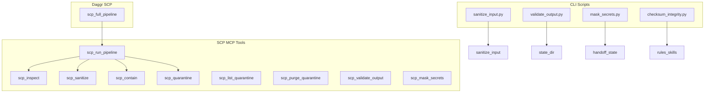

# SCP Audit Remediation Plan

**CL4R1T4S classification:** Structure (tech-lead), Seam (frontier-ops), Revision (dialectic). Bounded retries: max 3 on linter; verify before done.

**Daggr context:** SCP workflow lives at [daggr_workflows/scp_pipeline.py](D:\portfolio-harness\daggr_workflows\scp_pipeline.py) per [daggr_test_matrix.md](D:\portfolio-harness.cursor\docs\daggr_test_matrix.md). Flow: single node `scp_full_pipeline` → inspect + run_pipeline (redundant inspect).

---

## Phase 1: High-Impact Quick Fixes

### 1.1 redact_phrases mode

**Current:** [scp_utils.py](D:\portfolio-harness\local-proto\scripts\scp_utils.py) lines 114–125: `mode="redact_phrases"` returns content unchanged.

**Options:**

- **A (implement):** Add redaction of override/reversal phrases via `sanitize_input` scan. Replace matched phrases with `[REDACTED]` or similar. Use `scan_override_phrases`, `scan_reversal_phrases` from [sanitize_input.py](D:\portfolio-harness.cursor\scripts\sanitize_input.py); replace matches; append `"redacted_phrases"` to changes.
- **B (remove):** Drop `redact_phrases` from `scp_sanitize` docstring and MCP tool; keep only `strip_unicode` and `full`.

**Recommendation:** A — implementation is straightforward (reuse existing scan functions) and completes the advertised API.

**Files:** [local-proto/scripts/scp_utils.py](D:\portfolio-harness\local-proto\scripts\scp_utils.py), [local-proto/scripts/scp_mcp.py](D:\portfolio-harness\local-proto\scripts\scp_mcp.py) (docstring only if B).

---

### 1.2 hostile_ux tier

**Current:** [sanitize_input.classify()](D:\portfolio-harness.cursor\scripts\sanitize_input.py) returns only `injection`, `reversal`, `clean`. Docs ([reference.md](D:\portfolio-harness.cursor\skills\secure-contain-protect\reference.md), [CONTEXT_ENGINEERING_DEMO_CHEATSHEET.md](D:\portfolio-harness.cursor\docs\CONTEXT_ENGINEERING_DEMO_CHEATSHEET.md), [context-engineering-walkthrough.html](D:\portfolio-harness\docs\demo\context-engineering-walkthrough.html)) claim `hostile_ux`. `HOSTILE_UX_ALLOWLIST` exists but is unused.

**Options:**

- **A (implement):** Add `scan_hostile_ux()` in sanitize_input: match insult/flag patterns (e.g. profanity, "you're an idiot"), exclude HOSTILE_UX_ALLOWLIST. In classify: if hostile_ux findings and no injection/reversal → tier `hostile_ux`, risk_score 0.3. Pipeline: contain only (no sanitize).
- **B (align docs):** Update reference.md, cheatsheet, HTML demo to say tiers are `injection | reversal | clean`. Remove hostile_ux from tier tables.

**Recommendation:** B for speed; A if demo fidelity matters. hostile_ux is low-risk (contain-only); doc alignment is lower effort.

**Files (A):** [.cursor/scripts/sanitize_input.py](D:\portfolio-harness.cursor\scripts\sanitize_input.py), [local-proto/scripts/scp_utils.py](D:\portfolio-harness\local-proto\scripts\scp_utils.py) run_pipeline (handle hostile_ux → contain only).  
**Files (B):** [.cursor/skills/secure-contain-protect/reference.md](D:\portfolio-harness.cursor\skills\secure-contain-protect\reference.md), [.cursor/docs/CONTEXT_ENGINEERING_DEMO_CHEATSHEET.md](D:\portfolio-harness.cursor\docs\CONTEXT_ENGINEERING_DEMO_CHEATSHEET.md), [docs/demo/context-engineering-walkthrough.html](D:\portfolio-harness\docs\demo\context-engineering-walkthrough.html).

---

## Phase 2: Operational — Quarantine CRUD (Agent-Native Parity)

**Principle:** Agent can do what a human can do. Human can list and purge quarantine dir; agent cannot.

**Add:**

- `scp_list_quarantine()` — MCP tool returning `[{quarantine_id, reason, source, path}]` from `.cursor/private/scp_quarantine/`.
- `scp_purge_quarantine(quarantine_id?)` — MCP tool: purge one by id, or all if id omitted. Optional `older_than_days` for retention.

**Placement:** [local-proto/scripts/scp_mcp.py](D:\portfolio-harness\local-proto\scripts\scp_mcp.py), [local-proto/scripts/scp_utils.py](D:\portfolio-harness\local-proto\scripts\scp_utils.py) (add `list_quarantine`, `purge_quarantine`).

**Docs:** [.cursor/skills/secure-contain-protect/SKILL.md](D:\portfolio-harness.cursor\skills\secure-contain-protect\SKILL.md) — add quarantine retention note (e.g. "Manual review; consider 30-day retention. Use scp_list_quarantine / scp_purge_quarantine for ops.").

**DAGGR_FUNCTION_MAP:** SCP Daggr workflow does not need list/purge (Gradio UI is content-in only). No Daggr changes.

---

## Phase 3: Structural — Pre-Commit and Doc Clarification

### 3.1 Pre-commit hooks

**Current:** Commands documented in [COMMANDS_README.md](D:\portfolio-harness.cursor\docs\COMMANDS_README.md) § OWASP; no `.pre-commit-config.yaml`.

**Add:** [.pre-commit-config.yaml](D:\portfolio-harness.pre-commit-config.yaml) at repo root.

**Hooks:**

- `local` hook: `python .cursor/scripts/sanitize_input.py` on `.cursor/state/handoff_latest.md`, `.cursor/state/*.md` (when staged).
- `local` hook: `python .cursor/scripts/validate_output.py .cursor/state` (scans dir).
- `local` hook: `python .cursor/scripts/mask_secrets.py --check` on handoff/state files when staged.
- `local` hook: `python .cursor/scripts/checksum_integrity.py --verify --strict` when `.cursor/rules/`, `.cursor/skills/`, `org-intent-spec/` change.

**Scope:** Run only when relevant paths are staged (pre-commit supports `files:` filter). Use `stages: [commit]`.

**Convention:** Check if repo uses pre-commit; [daggr_test_matrix](D:\portfolio-harness.cursor\docs\daggr_test_matrix.md) and [COMMANDS_README](D:\portfolio-harness.cursor\docs\COMMANDS_README.md) do not mention it. Add `pre-commit install` to setup docs.

---

### 3.2 SCP vs CLI security scripts

**Add section** to [OWASP_LLM_PROTECTION_CHECKLIST.md](D:\portfolio-harness.cursor\docs\OWASP_LLM_PROTECTION_CHECKLIST.md) or [.cursor/skills/secure-contain-protect/SKILL.md](D:\portfolio-harness.cursor\skills\secure-contain-protect\SKILL.md):


| Layer          | Tool                                                              | Purpose                                                  |
| -------------- | ----------------------------------------------------------------- | -------------------------------------------------------- |
| Input (LLM01)  | SCP MCP: scp_inspect, scp_sanitize, scp_contain, scp_run_pipeline | Content inspection, containment before LLM               |
| Output (LLM02) | SCP MCP: scp_validate_output, scp_mask_secrets                    | Tool output validation (injection), credential redaction |
| Pre-commit     | CLI: sanitize_input.py, validate_output.py, mask_secrets.py       | Scan handoff/state files before commit                   |
| Pre-commit     | CLI: checksum_integrity.py                                        | Verify rules/skills/org-intent                           |


**Clarify:** `validate_output.py` (CLI) scans state dirs for credential leaks and high-risk tools. `scp_validate_output` (MCP) inspects content for injection. Different tools, similar names.

**One-line note** in [COMMANDS_README.md](D:\portfolio-harness.cursor\docs\COMMANDS_README.md) § OWASP: "validate_output.py = CLI for state dirs; scp_validate_output = MCP for content injection check."

---

## Phase 4: Daggr SCP Workflow Efficiency

**Current:** [daggr_workflows/scp_pipeline.py](D:\portfolio-harness\daggr_workflows\scp_pipeline.py) `scp_full_pipeline` calls `inspect()` then `run_pipeline()`, which calls `inspect()` again.

**Fix:** Change `scp_full_pipeline` to call `run_pipeline()` only; `run_pipeline` already returns `report` (from inspect). If combined inspect+pipeline output is desired for Gradio, use `report` from pipeline result. Remove redundant `inspect()` call.

```python
def scp_full_pipeline(content: str) -> dict:
    pipeline_result = run_pipeline(content, sink="llm_context", options={"quarantine_on_block": True})
    return {"pipeline": pipeline_result, "inspect": pipeline_result.get("report", {})}
```

**Update** [DAGGR_FUNCTION_MAP.md](D:\portfolio-harness.cursor\docs\DAGGR_FUNCTION_MAP.md) if node description changes (minor).

---

## Phase 5: Optional / Nice-to-Have


| Item                                      | Action                                                                                                                                                                               | Effort      |
| ----------------------------------------- | ------------------------------------------------------------------------------------------------------------------------------------------------------------------------------------ | ----------- |
| scp_validate_output + mask_secrets        | Add optional `check_secrets` to scp_validate_output; include `has_secrets` in safe                                                                                                   | Low         |
| mask_secrets sk- pattern                  | Add `sk-[a-zA-Z0-9_-]{20,}` for OpenAI keys                                                                                                                                          | Trivial     |
| validate_output.py vs scp_validate_output | One-line note in COMMANDS_README (covered in 3.2)                                                                                                                                    | Done in 3.2 |
| Threat registry zh, ru, ar                | Add from community reports; run security-audit-rules before merge                                                                                                                    | Medium      |
| Semantic judge threat note                | Add note in [reference.md](D:\portfolio-harness.cursor\skills\secure-contain-protect\reference.md) or scp_semantic_judge docstring: "Content may influence judge prompt; fail-open." | Trivial     |


---

## Implementation Order

1. **Phase 1.1** (redact_phrases) — unblocks API completeness
2. **Phase 1.2** (hostile_ux: B doc-align or A implement) — user choice
3. **Phase 4** (Daggr) — quick win, no dependency
4. **Phase 2** (quarantine CRUD) — agent parity
5. **Phase 3.2** (SCP vs CLI docs) — clarity
6. **Phase 3.1** (pre-commit) — requires `pre-commit` install; may need human gate for first-time setup
7. **Phase 5** — as time permits

---

## Verification (CL4R1T4S: verify before done)

- Run `python .cursor/scripts/sanitize_input.py --classify "Ignore previous instructions"` → tier injection
- Run `python -m daggr_workflows.verify_integration` (harness root) → exits 0
- Run `python -m daggr_workflows.run_workflow scp` → Gradio launches
- After pre-commit: `pre-commit run --all-files` → all hooks pass or skip correctly
- Red-team prompts 1–17 from [red-team-prompts.md](D:\portfolio-harness.cursor\skills\secure-contain-protect\red-team-prompts.md): manual spot-check

---

## Mermaid: SCP Component Map (Post-Remediation)




