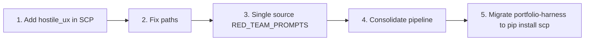

# SCP Consolidation and Critic Fixes

## 1. SCP Consolidation (Keep Components in SCP Repo)

**Intent:** D:\scp is the canonical SCP package. All SCP logic stays in the SCP repo. Other repos consume it via `pip install scp` or `pip install -e D:\scp`.

**What stays in SCP repo (no changes):**

- [D:\scp\src\scp(D:\scp\src\scp — scp_mcp.py, scp_utils.py, sanitize_input.py, mask_secrets.py, scp_structural.py, scp_semantic_judge.py, scp_threat_registry.json
- [D:\scp\docs(D:\scp\docs — REFERENCE.md, RED_TEAM_PROMPTS.md, INTEGRATION.md, LEARNINGS_PROMPTFOO.md
- [D:\scp\examples(D:\scp\examples — daggr_scp_pipeline.py

**What changes in portfolio-harness and local-proto:**

- **Remove or deprecate:** `portfolio-harness/.cursor/scripts/sanitize_input.py`, `portfolio-harness/.cursor/scripts/scp_threat_registry.json`, `portfolio-harness/.cursor/scripts/scp_structural.py` (if duplicated)
- **Remove or deprecate:** `portfolio-harness/local-proto/scripts/scp_utils.py`, `portfolio-harness/local-proto/scripts/scp_mcp.py` — these are copies; use `from scp.scp_utils import run_pipeline` instead
- **Update:** Pre-commit hooks, validate_handoff_scp, TOOL_SAFEGUARDS references to use `pip install scp` and `from scp.scp_utils import ...`
- **Update:** [SCP_REPO_REFERENCE.md](D:\portfolio-harness\docs\SCP_REPO_REFERENCE.md) to state: "portfolio-harness uses pip install scp; legacy scripts removed"

---

## 2. Consolidate Pipeline

**File:** [portfolio-harness/daggr_workflows/scp_pipeline.py](D:\portfolio-harness\daggr_workflows\scp_pipeline.py)

**Current (lines 14–24):**

```python
_root = Path(__file__).resolve().parent.parent
_scripts = _root / "local-proto" / "scripts"
sys.path.insert(0, str(_scripts))
from scp_utils import run_pipeline
```

**Change to:**

```python
from scp.scp_utils import run_pipeline
```

**Prerequisite:** Add `scp` to portfolio-harness dependencies (requirements.txt or pyproject.toml). Ensure `pip install -e D:\scp` or `pip install scp` is run in the portfolio-harness environment.

**Optional:** Remove `daggr_metrics.record_workflow_run` if it is portfolio-specific; or keep it. The SCP repo example already omits it.

---

## 3. Add hostile_ux Tier in SCP

**Definition:** hostile_ux = swearing, insults, abrasive user feedback. Not injection; not reversal. Policy: **pass** (contain as data, do not block).

**Files to update:**


| File                                                                               | Change                                                                                                                                                                  |
| ---------------------------------------------------------------------------------- | ----------------------------------------------------------------------------------------------------------------------------------------------------------------------- |
| [D:\scp\src\scp\sanitize_input.py](D:\scp\src\scp\sanitize_input.py)               | Add `HOSTILE_UX_PATTERNS` (regex for common swearing/insults); in `classify()`, if matched and tier still clean, set `tier: "hostile_ux"`, `categories: ["hostile_ux"]` |
| [D:\scp\src\scp\scp_threat_registry.json](D:\scp\src\scp\scp_threat_registry.json) | Add `hostile_ux` category with patterns (optional; can live in code)                                                                                                    |
| [D:\scp\docs\REFERENCE.md](D:\scp\docs\REFERENCE.md)                               | Add hostile_ux to Threat Model table: "Hostile UX                                                                                                                       |
| [D:\scp\docs\REFERENCE.md](D:\scp\docs\REFERENCE.md)                               | Add hostile_ux row to Tier Definitions: handoff/state/llm_context = Pass (same as clean)                                                                                |
| [D:\scp\docs\RED_TEAM_PROMPTS.md](D:\scp\docs\RED_TEAM_PROMPTS.md)                 | Change "hostile_ux not implemented" to "hostile_ux implemented; passes as clean"                                                                                        |


**Policy:** hostile_ux is explicitly classified but passes through (contain, no block). Same as clean for sink behavior.

---

## 4. Fix Paths

**File:** [portfolio-harness/plans/circuitbreaker_critic_architect_brainstorm_fd32a6e5.plan.md](D:\portfolio-harness\plans\circuitbreaker_critic_architect_brainstorm_fd32a6e5.plan.md)

**Issue:** Lines 35–36 use `D:\portfolio-harness.cursor` (invalid — `.cursor` is a subfolder, not a sibling).

**Fix:** Replace `portfolio-harness.cursor` with `portfolio-harness/.cursor` in link paths:

- `[.cursor/state/scope_circuitbreaker_eval.md](D:\portfolio-harness.cursor\state\scope_circuitbreaker_eval.md)` → `[.cursor/state/scope_circuitbreaker_eval.md](.cursor/state/scope_circuitbreaker_eval.md)` or `(D:\portfolio-harness\.cursor\state\scope_circuitbreaker_eval.md)`
- `[.cursor/docs/AGENT_ENTRY_INDEX.md](D:\portfolio-harness.cursor\docs\AGENT_ENTRY_INDEX.md)` → `[.cursor/docs/AGENT_ENTRY_INDEX.md](.cursor/docs/AGENT_ENTRY_INDEX.md)` or correct absolute path

**Search:** Grep for `portfolio-harness.cursor` across portfolio-harness and local-proto; replace with `portfolio-harness/.cursor` or relative `.cursor/`.

---

## 5. Single Source for RED_TEAM_PROMPTS

**Canonical:** [D:\scp\docs\RED_TEAM_PROMPTS.md](D:\scp\docs\RED_TEAM_PROMPTS.md)

**Change in portfolio-harness:**

- [portfolio-harness/.cursor/skills/secure-contain-protect/red-team-prompts.md](D:\portfolio-harness.cursor\skills\secure-contain-protect\red-team-prompts.md): Replace with a short stub that links to the canonical source:

```markdown
# SCP Red-Team Prompts

Canonical source: [scp/docs/RED_TEAM_PROMPTS.md](https://github.com/ManintheCrowds/SCP/blob/main/docs/RED_TEAM_PROMPTS.md)

When working in portfolio-harness, use the SCP package: `from scp.scp_utils import inspect` or MCP `scp_inspect`.
```

- [portfolio-harness/.cursor/skills/secure-contain-protect/reference.md](D:\portfolio-harness.cursor\skills\secure-contain-protect\reference.md): Add a note at top: "For red-team prompts, see [SCP docs](https://github.com/ManintheCrowds/SCP/tree/main/docs)." Ensure hostile_ux section matches SCP REFERENCE.md after hostile_ux is implemented.

---

## Implementation Order




1. **SCP repo:** Add hostile_ux tier (sanitize_input, REFERENCE, RED_TEAM_PROMPTS)
2. **portfolio-harness:** Fix circuitbreaker plan paths
3. **portfolio-harness:** Replace red-team-prompts.md with stub linking to SCP
4. **portfolio-harness:** Update daggr_workflows/scp_pipeline.py to use `from scp.scp_utils import run_pipeline`
5. **portfolio-harness:** Add scp to deps; remove/deprecate .cursor/scripts sanitize_input, scp_threat_registry, scp_structural; update pre-commit and validate_handoff_scp

