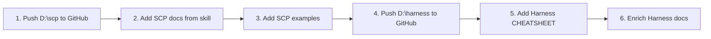

# SCP and Harness Repo Gap Analysis

## Current State

| Repo        | GitHub (public)                   | Local (D:\scp, D:\harness)                                 |
| ----------- | --------------------------------- | ---------------------------------------------------------- |
| **SCP**     | README + LICENSE only (1 commit)  | Full package: `src/scp/`, pyproject.toml, requirements.txt |
| **Harness** | README + LICENSE only (3 commits) | Full content: docs/, state/, scripts/                      |

The GitHub repos are placeholders. The local `D:\scp` and `D:\harness` folders contain the extracted content but may not be fully pushed or may have diverged.

---

## SCP Repo Gaps

### 1. Code Package (Critical)

**Status:** D:\scp has full package; GitHub has none.

**Contents to push:**

- [D:\scp\src\scp(D:\scp\src\scp — scp_mcp.py, scp_utils.py, sanitize_input.py, mask_secrets.py, scp_structural.py, scp_semantic_judge.py, scp_threat_registry.json
- [D:\scp\pyproject.toml](D:\scp\pyproject.toml), [D:\scp\requirements.txt](D:\scp\requirements.txt)

**Action:** Push D:\scp to GitHub. Ensure `pip install -e .` works.

---

### 2. Documentation Gaps (Port from portfolio-harness)

| Source                                                                                                                                           | Content                                          | Recontextualize for SCP                                                                                                                                             | Target in SCP repo                              |
| ------------------------------------------------------------------------------------------------------------------------------------------------ | ------------------------------------------------ | ------------------------------------------------------------------------------------------------------------------------------------------------------------------- | ----------------------------------------------- |
| [.cursor/skills/secure-contain-protect/SKILL.md](D:\portfolio-harness.cursor\skills\secure-contain-protect\SKILL.md)                             | Agent usage, pipeline, tool reference            | Remove `.cursor/scripts/scp_threat_registry.json` path; use `scp_threat_registry.json` (in package). Remove AI Trends, frontier-ops-kb, AGENT_INTEGRITY references. | `docs/USAGE.md` or merge into README            |
| [.cursor/skills/secure-contain-protect/reference.md](D:\portfolio-harness.cursor\skills\secure-contain-protect\reference.md)                     | Threat model, tier definitions, red-team prompts | Keep as-is; standalone.                                                                                                                                             | `docs/REFERENCE.md`                             |
| [.cursor/skills/secure-contain-protect/red-team-prompts.md](D:\portfolio-harness.cursor\skills\secure-contain-protect\red-team-prompts.md)       | Self-test prompts                                | Merge into REFERENCE or keep separate                                                                                                                               | `docs/RED_TEAM_PROMPTS.md`                      |
| [.cursor/skills/secure-contain-protect/LEARNINGS_PROMPTFOO.md](D:\portfolio-harness.cursor\skills\secure-contain-protect\LEARNINGS_PROMPTFOO.md) | Promptfoo learnings                              | Review for portability; may have internal refs                                                                                                                      | `docs/` (if portable)                           |
| [daggr_workflows/scp_pipeline.py](D:\portfolio-harness\daggr_workflows\scp_pipeline.py)                                                          | Daggr + Gradio example                           | Change import from `scp_utils` (local-proto) to `from scp.scp_utils import run_pipeline`. Remove daggr_metrics, record_workflow_run.                                | `examples/daggr_scp_pipeline.py` or `examples/` |
| [local-proto/docs/TOOL_SAFEGUARDS.md](D:\local-proto\docs\TOOL_SAFEGUARDS.md)                                                                    | SCP gate sections                                | Extract SCP-specific paragraphs (verification before persist, SCP gate for Bitcoin). Generalize; remove org-intent, PentAGI refs.                                   | `docs/INTEGRATION.md` (SCP as guardrail)        |

---

### 3. Source Redundancy (Clarify)

| Path                                                                   | Role                                  | Action                                                                      |
| ---------------------------------------------------------------------- | ------------------------------------- | --------------------------------------------------------------------------- |
| D:\local-proto\scripts\scp_mcp.py, scp_utils.py                        | Canonical (pre-extraction)            | Deprecated; SCP repo is canonical                                           |
| portfolio-harness/local-proto/scripts/                                 | Nested copy/submodule                 | Same; point to SCP package                                                  |
| portfolio-harness/.cursor/scripts/sanitize_input.py, scp_structural.py | Legacy; some still used by pre-commit | Migrate to `pip install scp`; update validate_handoff_scp, pre-commit hooks |

---

## Harness Repo Gaps

### 1. Core Content (Critical)

**Status:** D:\harness has condensed docs; portfolio-harness has richer versions.

**Contents to push (from D:\harness):**

- docs/: CONTEXT_ENGINEERING.md, INTENT_ENGINEERING.md, HARNESS_ARCHITECTURE.md, HANDOFF_FLOW.md
- state/: README.md, continue_prompt.txt
- scripts/: copy_continue_prompt.ps1/sh/cmd, validate_handoff_scp.py

**Action:** Push D:\harness to GitHub.

---

### 2. Documentation Gaps (Port from portfolio-harness)

| Source                                                                                                                            | Content                                                  | Recontextualize for Harness                                                                                                                                                        | Target in Harness repo               |
| --------------------------------------------------------------------------------------------------------------------------------- | -------------------------------------------------------- | ---------------------------------------------------------------------------------------------------------------------------------------------------------------------------------- | ------------------------------------ |
| [docs/cognitive-ergonomics-seed/HARNESS_CHEATSHEET.md](D:\portfolio-harness\docs\cognitive-ergonomics-seed\HARNESS_CHEATSHEET.md) | One-page harness compression                             | Remove TOOL_OUTPUT_LIMITS, POLICY_CHECKSUM, EPISTEMIC_HYGIENE (project-specific). Keep: components, memory order, handoff schema, archive rule.                                    | `docs/CHEATSHEET.md`                 |
| [.cursor/docs/HANDOFF_CHAIN_PATTERNS.md](D:\portfolio-harness.cursor\docs\HANDOFF_CHAIN_PATTERNS.md)                              | Phase boundaries, role switches                          | Remove portfolio-specific refs.                                                                                                                                                    | `docs/HANDOFF_CHAIN_PATTERNS.md`     |
| [.cursor/docs/CONTEXT_ENGINEERING.md](D:\portfolio-harness.cursor\docs\CONTEXT_ENGINEERING.md)                                    | Full version with mermaid, retrieval routing, jCodeMunch | Strip: AI_USAGE_ENGINEERING, Bitcoin-Chaos, org-intent, `.cursor/plans/`. Keep: retrieval routing tree, compaction, memory.                                                        | Enrich `docs/CONTEXT_ENGINEERING.md` |
| [.cursor/docs/INTENT_ENGINEERING.md](D:\portfolio-harness.cursor\docs\INTENT_ENGINEERING.md)                                      | Full version with examples                               | Strip: ALIGNMENT_SURFACE, org-intent value_hierarchy. Keep: schema, latency negotiation, human gate.                                                                               | Enrich `docs/INTENT_ENGINEERING.md`  |
| [.cursor/state/README.md](D:\portfolio-harness.cursor\state\README.md)                                                            | Full state schema                                        | Strip: Bitcoin-Chaos, DAGGR, Arc_Forge, continual-learning, agent_log, goals.json (optional). Keep: handoff schema, decision-log, known-issues, preferences, rejection_log, daily. | Enrich `state/README.md`             |

---

### 3. Out of Scope (Stay in portfolio-harness)

- AGENT_ENTRY_INDEX, MCP_CAPABILITY_MAP, role-routing, skills (project-specific)
- AI_TASK_EVALS, daggr_test_matrix, GUI_ACTION_MAP (Daggr/portfolio-specific)
- org-intent-spec, frontier-ops-kb, BITCOIN_AGENT_CAPABILITIES
- HANDOFF_FLOW.md full version with handoff-scp hook, session_save (Obsidian)

---

## Recontextualization Principles

1. **Path normalization:** Replace `.cursor/state/` with `state/` or document "typically `.cursor/state/` when integrated."
2. **Remove internal refs:** No `D:\portfolio-harness`, `D:\local-proto`, `org-intent-spec`, `frontier-ops-kb`.
3. **Genericize:** "Run validate_handoff_scp as pre-commit" instead of "portfolio-harness handoff-scp hook."
4. **Link to sibling repos:** Harness README links to SCP for validation; SCP README stays self-contained.
5. **ACE compliance:** Harness already states "Compliant to Autonomous Cognitive Entities Framework"; keep that in description.

---

## Implementation Order

1. **SCP:** Push D:\scp; add docs/REFERENCE.md, docs/RED_TEAM_PROMPTS.md (from skill); add examples/daggr_scp_pipeline.py (adapted).
2. **Harness:** Push D:\harness; add docs/CHEATSHEET.md; optionally enrich CONTEXT_ENGINEERING, INTENT_ENGINEERING, state/README from portfolio-harness (with recontextualization).
3. **portfolio-harness:** Update SCP_REPO_REFERENCE.md, HARNESS_REPO_REFERENCE.md with final GitHub URLs and "canonical source" pointers.

---

## Open Questions

1. **License:** GitHub shows GPL-3.0 for both; D:\scp and D:\harness README say MIT. Align before push.
2. **D:\scp and D:\harness git status:** Are these folders git repos? Are they connected to GitHub remotes? Need to verify before push.
3. **daggr_workflows dependency:** The SCP pipeline example requires daggr, gradio. Add to examples/ as optional, or document as "requires daggr" in example README.

