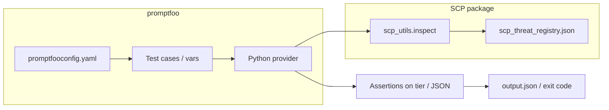

# SCP + promptfoo integration and learning brainstorm

## Context

- [D:\scpgithub\workflows\ci.yml](D:\scp.github\workflows\ci.yml) today runs only Python `pytest` for [tests/test_mcp_contract_v1.py](D:\scp\tests\test_mcp_contract_v1.py).
- [D:\scp\docs\LEARNINGS_PROMPTFOO.md](D:\scp\docs\LEARNINGS_PROMPTFOO.md) is conceptual; no runnable promptfoo assets exist in-repo.
- Portfolio-harness already has [daggr_workflows/tests/test_scp_pipeline_golden.py](D:\portfolio-harness\daggr_workflows\tests\test_scp_pipeline_golden.py) for `run_pipeline` — complementary, not duplicate: **this plan adds promptfoo-native evals inside the SCP repo** so `LEARNINGS_PROMPTFOO.md` is verifiable locally and in CI.

## Architecture (integration to document and render)

**Integration story:** promptfoo drives **deterministic** test cases (adversarial strings as `vars`). A **Python custom provider** (promptfoo’s supported pattern) imports `scp.scp_utils.inspect`, returns structured output (e.g. tier + categories). **Assertions** in YAML or JS check expected tier vs golden expectations — no target LLM required for the minimal package, keeping CI credential-free.

**Optional later (out of minimal scope):** second promptfoo “track” that calls a real model and compares behavior — document in README as local-only with API keys; do not block CI on it.

## Implementation plan

### 1. Minimal eval package under `examples/promptfoo/`

| Artifact                                                                 | Role                                                                                                                                                                              |
| ------------------------------------------------------------------------ | --------------------------------------------------------------------------------------------------------------------------------------------------------------------------------- |
| `promptfooconfig.yaml` (or project-default name per promptfoo 2026 docs) | Declares tests, default assertions, and provider id                                                                                                                               |
| Python provider module                                                   | `call_api` (or current equivalent) invoking `inspect(content, context=...)`; return JSON string for promptfoo to assert on                                                        |
| Small `vars` / test matrix                                               | Reuse or mirror a subset of strings from [docs/RED_TEAM_PROMPTS.md](D:\scp\docs\RED_TEAM_PROMPTS.md) and [docs/REFERENCE.md](D:\scp\docs\REFERENCE.md) — keep count small (YAGNI) |
| Optional `package.json`                                                  | Pin `promptfoo` devDependency for reproducible `npx promptfoo eval` / CI                                                                                                          |

**Install path:** README instructs `cd` to repo root, `pip install -e .`, then `cd examples/promptfoo` and run promptfoo (exact commands go in README).

### 2. CI job

- Add a **second job** (e.g. `promptfoo-eval`) in [ci.yml](D:\scp.github\workflows\ci.yml): `ubuntu-latest`, `actions/setup-python` + `pip install -e ".[dev]"`, `actions/setup-node` with cache, install promptfoo via `npm ci` in `examples/promptfoo` **or** `npx promptfoo@<pinned>` if you avoid committing `package-lock.json` (pick one approach for reproducibility).
- Run `**promptfoo eval`** (or `npx promptfoo eval` with explicit config path) against the minimal config; fail on non-zero exit.
- Keep Python matrix **3.10+3.12** on contract job only; promptfoo job can use a single Python version (e.g. 3.12) to save minutes.

### 3. Documentation updates

- **[docs/LEARNINGS_PROMPTFOO.md](D:\scp\docs\LEARNINGS_PROMPTFOO.md):** Add sections **“Runnable validation”** (CI job name + link to workflow), **“Integration diagram”** (mermaid as above or ASCII fallback if markdown policy prefers), and **“Relationship to portfolio-harness golden tests”** (one paragraph) so the doc is no longer “paper only.”
- **[examples/README.md](D:\scp\examples\README.md):** New subsection linking to `examples/promptfoo/README.md`.
- **[examples/promptfoo/README.md](D:\scp\examples\promptfoo\README.md):** Copy-paste commands: install editable SCP, install/run promptfoo, `promptfoo eval`, optional `promptfoo view` for local HTML report; note **no API keys** for the default tier-classification suite.

### 4. Brainstorm deliverable (WHAT, not implementation)

**Create** [D:\scp\docs\brainstorms\2026-04-01-promptfoo-scp-learning-brainstorm.md](D:\scp\docs\brainstorms\2026-04-01-promptfoo-scp-learning-brainstorm.md) (create `docs/brainstorms/` if missing) with:

| Section                 | Content                                                                                                                                                                         |
| ----------------------- | ------------------------------------------------------------------------------------------------------------------------------------------------------------------------------- |
| **What we’re building** | A closed loop: promptfoo runs → structured results → human-reviewed proposals → updates to `scp_threat_registry.json` / tests — **not** blind auto-merging of untrusted strings |
| **Why**                 | promptfoo produces **failure cases and metrics**; SCP needs **curated** patterns and regression tests                                                                           |
| **Data sources**        | promptfoo `output.json` / CSV exports; assertion failures; optional `promptfoo` red-team plugin outputs                                                                         |
| **Key decisions**       | SCP gate on any imported probe list (`scp_run_pipeline` before LLM or handoff); versioned registry bumps; golden tests for new patterns                                         |
| **Open questions**      | Human approval workflow; false-positive budget; whether to store raw failing prompts in-repo vs private quarantine                                                              |

This satisfies the `/brainstorm` intent for **using promptfoo data to improve prompt-injection defenses** without mixing implementation into the brainstorm file.

### 5. Verification (post-implementation)

- Local: `pytest tests/test_mcp_contract_v1.py` + `promptfoo eval` from `examples/promptfoo`.
- CI: both jobs green on PR.

## Risk and scope

- **Medium** (new CI surface + Node): pin promptfoo version; pin Python for the eval job.
- **YAGNI:** No LLM-backed promptfoo in default CI; optional local-only section in README.

## Dependencies

- Confirm promptfoo **2026** custom Python provider API against official docs at implementation time ([Context7](https://context7.com) for `promptfoo` if needed) — small API drift may require adjusting `config`/`provider` shape.

