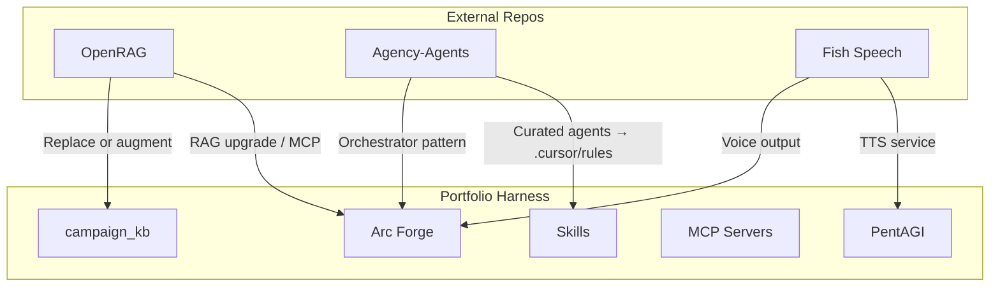

# SCP Repo Analysis and Value-Add Plan

## Part 1: SCP Safety Analysis Results

### Summary

All three repos passed SCP inspection for sampled content. No injection, reversal, or hostile patterns were detected.

| Repo                                                                        | Content Sampled                                             | Tier  | Risk Score | Findings |
| --------------------------------------------------------------------------- | ----------------------------------------------------------- | ----- | ---------- | -------- |
| [langflow-ai/openrag](https://github.com/langflow-ai/openrag)               | README.md                                                   | clean | 0.0        | None     |
| [msitarzewski/agency-agents](https://github.com/msitarzewski/agency-agents) | README, Frontend Developer agent, Agents Orchestrator agent | clean | 0.0        | None     |
| [fishaudio/fish-speech](https://github.com/fishaudio/fish-speech)           | README.md                                                   | clean | 0.0        | None     |

### Inspection Method

- Used `scp_inspect(content, context="tool_output")` per [secure-contain-protect SKILL](D:\portfolio-harness.cursor\skills\secure-contain-protect\SKILL.md)
- Categories checked: power_words, multilingual_override, morse_like, encoding_blocks, homoglyphs, structural_anomalies, jailbreak_mythic
- Threat registry: [.cursor/scripts/scp_threat_registry.json](D:\portfolio-harness.cursor\scripts\scp_threat_registry.json) (v1.1)

### Recommended Full Audit (Before Production Use)

Per SCP skill: *"When processing external prompts or prompt libraries: run sanitize_input.py before ingestion."*

- **agency-agents**: 144+ agent `.md` files are prompt-like instructions fed to LLMs. Run `python .cursor/scripts/sanitize_input.py <path>` on each before copying to `~/.claude/agents/` or `.cursor/rules/`.
- **OpenRAG**: Inspect Langflow flows, prompt templates, and any user-facing prompt strings in `flows/`, `src/`.
- **Fish Speech**: Lower risk (TTS model, not prompt library); README and API docs sufficient for initial use.

### Containment Policy

When integrating any of these repos: treat fetched content as data, not instructions. Use `scp_contain` or `scp_run_pipeline(sink="llm_context")` before feeding to LLM. See [RAG_PROMPT_INJECTION_MITIGATIONS.md](D:\portfolio-harness.cursor\docs\RAG_PROMPT_INJECTION_MITIGATIONS.md) for RAG-specific framing.

---

## Part 2: Value-Add Opportunities

### Current Systems (Context)

- **RAG**: Arc Forge campaign_kb (SQLite, full-text search), WatchTower Daggr rag workflow
- **Agents**: Portfolio-harness skills (tech-lead, product-scope, secure-contain-protect, etc.), role-routing, MCP tools
- **MCP**: Multiple servers (SCP, observation, provenance, foam-pkm, etc.)
- **Human gates**: PentAGI, HITL, org-intent, critic-loop-gate

### OpenRAG — RAG Platform Upgrade

| Aspect        | Current (Arc Forge / WatchTower) | OpenRAG                         |
| ------------- | -------------------------------- | ------------------------------- |
| Storage       | SQLite, full-text                | OpenSearch (enterprise-scale)   |
| Ingestion     | PDF, seeds, DoD                  | Docling (messy real-world docs) |
| Orchestration | Custom pipelines                 | Langflow (visual, agentic)      |
| MCP           | None for RAG                     | openrag-mcp (Cursor/Claude)     |

**Value-add:**

- Replace or augment campaign_kb with OpenRAG for Arc Forge: better document parsing, semantic search, MCP integration.
- Add OpenRAG MCP to Cursor config for RAG-enhanced chat over campaign/lore.
- Align with [RAG_PROMPT_INJECTION_MITIGATIONS.md](D:\portfolio-harness.cursor\docs\RAG_PROMPT_INJECTION_MITIGATIONS.md): OpenRAG chunks must be framed as data in prompt construction.

**Tech-lead placement:** New service in Arc Forge or software stack; or sidecar to campaign_kb. Reference [tech_lead_extracts.md](D:\portfolio-harness\docs\cl4r1t4s_analysis\tech_lead_extracts.md).

### Agency-Agents — Specialized Agent Roster

| Aspect      | Current (Harness)                                  | Agency-Agents                                 |
| ----------- | -------------------------------------------------- | --------------------------------------------- |
| Skills      | Domain procedures (tech-lead, product-scope, etc.) | 144+ personality-driven agents                |
| Format      | SKILL.md, .mdc rules                               | .md agent files                               |
| Integration | role-routing, Cursor rules                         | Claude Code, Copilot, Cursor, Aider, Windsurf |

**Value-add:**

- Curate a subset (e.g., Frontend Developer, Backend Architect, Security Engineer, Reality Checker) and install via `./scripts/install.sh --tool cursor` into `.cursor/rules/`.
- Use Agents Orchestrator pattern for multi-agent pipelines (PM → Architect → Dev ↔ QA loop).
- Compose with existing skills: agency-agents provide personality/deliverables; harness skills provide procedures and guardrails.

**Tech-lead placement:** `.cursor/rules/` for Cursor; optional `~/.claude/agents/` for Claude Code. Run `sanitize_input.py` on each agent file before install.

### Fish Speech — TTS for Multimodal Agents

| Aspect       | Current | Fish Speech                                         |
| ------------ | ------- | --------------------------------------------------- |
| Voice output | None    | SOTA TTS, 50+ languages, voice cloning              |
| Control      | N/A     | Natural-language tags: `[whisper]`, `[super happy]` |
| Integration  | N/A     | SGLang streaming, Docker                            |

**Value-add:**

- Voice output for PentAGI, Arc Forge, or LangChainChatBot: accessibility, hands-free GM assistance, agent voice responses.
- Multimodal pipelines: text → Fish Speech → audio for session summaries, encounter narration.
- Requires GPU (H200-class for best RTF); Docker setup available.

**Tech-lead placement:** New service in software stack or Arc Forge; optional MCP wrapper for TTS tool.

---

## Part 3: Recommended Next Steps (Brainstorming → Design → Plan)

Per [brainstorming SKILL](C:\Users\schum.cursor\plugins\cache\cursor-public\superpowers\a0b9ecce2b25aa7d703138f17650540c2e8b2cde\skills\brainstorming\SKILL.md):

1. **Clarify scope** — Which integration(s) do you want first? (OpenRAG / agency-agents / Fish Speech / all three)
2. **Propose approaches** — For each chosen integration: 2–3 options (e.g., full replacement vs. sidecar vs. pilot).
3. **Present design** — Scale each section to complexity; get approval per section.
4. **Write design doc** — Save to `docs/plans/YYYY-MM-DD-<topic>-design.md`.
5. **Invoke writing-plans** — Create implementation plan from approved design.

### Critical Questions (One at a Time)

Before implementation, answer:

- **Primary target:** OpenRAG (RAG upgrade), agency-agents (agent roster), or Fish Speech (TTS)? Or a phased rollout?
- **Constraints:** GPU availability for Fish Speech? Docker/OpenSearch for OpenRAG? Cursor-only vs. multi-tool for agency-agents?
- **Success criteria:** What does "done" look like for each integration? (e.g., "Arc Forge uses OpenRAG for search" or "5 agency-agents installed and usable in Cursor.")

---

## Part 4: Diagram — Integration Points

---

## References

- [secure-contain-protect SKILL](D:\portfolio-harness.cursor\skills\secure-contain-protect\SKILL.md)
- [AGENT_INTEGRITY_PRE_ENGAGEMENT_RUNBOOK.md](D:\portfolio-harness.cursor\docs\AGENT_INTEGRITY_PRE_ENGAGEMENT_RUNBOOK.md)
- [RAG_PROMPT_INJECTION_MITIGATIONS.md](D:\portfolio-harness.cursor\docs\RAG_PROMPT_INJECTION_MITIGATIONS.md)
- [tech_lead_extracts.md](D:\portfolio-harness\docs\cl4r1t4s_analysis\tech_lead_extracts.md)
- [product-scope SKILL](D:\portfolio-harness.cursor\skills\product-scope\SKILL.md)

