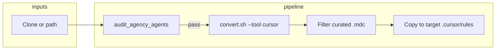

# SCP Repo Automatic Integration Plan

**Scope:** agency-agents, OpenRAG, Fish Speech — automatic integration into portfolio-harness as tools/resources.

**Design reference:** [2026-03-13-scp-repo-value-add-design.md](D:\portfolio-harness\docs\plans\2026-03-13-scp-repo-value-add-design.md)

---

## 1. Requirements (Product-Scope)

### 1.1 Agency-Agents


| #   | Requirement                                  | AC                                                                                                           |
| --- | -------------------------------------------- | ------------------------------------------------------------------------------------------------------------ |
| R1  | One-command install of curated agency-agents | Given harness root, When user runs install script, Then curated agents appear in target `.cursor/rules/`     |
| R2  | SCP gate before install                      | Audit must pass (exit 0) before convert/install; fail-fast on any injection                                  |
| R3  | Curated subset only                          | Install only: Frontend Developer, Backend Architect, Security Engineer, Reality Checker, Agents Orchestrator |
| R4  | Optional: clone from GitHub                  | Script can clone agency-agents if path not provided                                                          |
| R5  | Optional: CI or bootstrap hook               | Run on project setup when opted in                                                                           |


### 1.2 OpenRAG


| #   | Requirement                                | AC                                                                           |
| --- | ------------------------------------------ | ---------------------------------------------------------------------------- |
| R6  | OpenRAG MCP available when OpenRAG running | Add MCP block to harness config; agent can query RAG                         |
| R7  | Optional: merge script                     | Setup script merges OpenRAG block into Cursor MCP config without overwriting |
| R8  | Optional: start/verify script              | Start OpenRAG (Docker/uv) and verify reachability                            |


### 1.3 Fish Speech


| #   | Requirement                               | AC                                                             |
| --- | ----------------------------------------- | -------------------------------------------------------------- |
| R9  | Optional: TTS MCP tool                    | Agent can call `text_to_speech(text)` when Fish Speech running |
| R10 | Optional: one-command Fish Speech startup | Docker Compose or script to bring up Fish Speech               |


### 1.4 Harness Wiring


| #   | Requirement                | AC                                                                                                      |
| --- | -------------------------- | ------------------------------------------------------------------------------------------------------- |
| R11 | Role-routing triggers      | Agent loads relevant skill when user mentions agency-agents, RAG retrieval, or TTS                      |
| R12 | MCP capability map updated | New tools documented in [MCP_CAPABILITY_MAP.md](D:\portfolio-harness.cursor\docs\MCP_CAPABILITY_MAP.md) |


---

## 2. Architecture (Tech-Lead)

### 2.1 Placement


| Component                    | Path                                       | Layer      | Rationale                                                               |
| ---------------------------- | ------------------------------------------ | ---------- | ----------------------------------------------------------------------- |
| agency-agents install script | `.cursor/scripts/install_agency_agents.py` | Scripts    | Matches `setup_env.py`, `audit_agency_agents.py`; run from harness root |
| OpenRAG MCP merge script     | `.cursor/scripts/merge_mcp_openrag.py`     | Scripts    | Optional; merges into Cursor MCP config                                 |
| Fish Speech MCP              | `local-proto/scripts/fish_speech_mcp.py`   | MCP server | Matches other local-proto MCPs (daggr, scp, etc.); uses audit_wrapper   |
| OpenRAG MCP block            | `.cursor/mcp.json` or merge target         | Config     | Direct add or merge                                                     |
| Role-routing entries         | `.cursor/rules/role-routing.mdc`           | Rules      | Add branches 4i (agency-agents), 4j (OpenRAG/RAG), 4k (Fish Speech TTS) |
| Agency-agents skill          | `.cursor/skills/agency-agents/SKILL.md`    | Skills     | When to use curated agents; composes with role-routing                  |


### 2.2 Agency-Agents Flow




**Curated slug mapping** (from convert.sh `agency-$(slugify name).mdc`):

- Frontend Developer → `agency-frontend-developer.mdc`
- Backend Architect → `agency-backend-architect.mdc`
- Security Engineer → `agency-security-engineer.mdc`
- Reality Checker → `agency-testing-reality-checker.mdc` (testing category)
- Agents Orchestrator → `agency-agents-orchestrator.mdc`

**Cross-platform:** `convert.sh` and `install.sh` are bash; Windows needs Git Bash or WSL. Script should detect and use `bash` when available, else document WSL/Git Bash requirement.

### 2.3 OpenRAG MCP

- **Option A (simple):** Add OpenRAG block directly to [.cursor/mcp.json](D:\portfolio-harness.cursor\mcp.json) with audit_wrapper (per harness convention).
- **Option B (merge):** `merge_mcp_openrag.py` reads Cursor MCP config path, merges OpenRAG server, writes back. Preserves user config.

**Audit wrapper:** Harness wraps all MCPs with `audit_wrapper.py`. OpenRAG would use:

```json
"openrag": {
  "command": "python",
  "args": ["D:/portfolio-harness/local-proto/scripts/audit_wrapper.py", "--", "uvx", "openrag-mcp"],
  "env": { "OPENRAG_URL": "...", "OPENRAG_API_KEY": "...", "ORG_INTENT_PATH": "...", "MCP_RISK_TIER": "low" }
}
```

### 2.4 Fish Speech MCP (Optional)

- **Placement:** `local-proto/scripts/fish_speech_mcp.py`
- **Tool:** `fish_speech_tts(text: str) -> base64_audio` or path to temp file
- **Dependency:** Fish Speech API (HTTP or SGLang); requires Fish Speech server running
- **Risk tier:** low (read-only TTS)

### 2.5 Harness Wiring


| Trigger                                                           | Skill/Rule                   | Action                                                |
| ----------------------------------------------------------------- | ---------------------------- | ----------------------------------------------------- |
| "agency agents", "Frontend Developer agent", "use curated agents" | agency-agents skill          | Load skill; reference AGENCY_AGENTS_INTEGRATION       |
| "RAG", "retrieve from knowledge base", "OpenRAG"                  | Existing or new              | Load when RAG retrieval needed; use openrag MCP tools |
| "TTS", "text to speech", "voice output", "Fish Speech"            | fish-speech skill (optional) | Load when TTS needed; use fish_speech_tts             |


---

## 3. Implementation Phases

### Phase 1: Agency-Agents Automation (Core)

1. **Create `install_agency_agents.py`**
  - Args: `--target <path>` (default: CWD), `--clone` (clone from GitHub if no path), `--path <agency_agents_repo>`
  - Steps: (1) resolve agency-agents root (clone or path), (2) run `audit_agency_agents.py`, (3) run `convert.sh --tool cursor`, (4) filter `integrations/cursor/rules/` to curated slugs, (5) copy to `target/.cursor/rules/`
  - Curated list: `agency-frontend-developer.mdc`, `agency-backend-architect.mdc`, `agency-security-engineer.mdc`, `agency-testing-reality-checker.mdc`, `agency-agents-orchestrator.mdc`
  - Use `subprocess` for convert.sh; require `bash` (Git Bash on Windows)
2. **Update [AGENCY_AGENTS_INTEGRATION.md](D:\portfolio-harness.cursor\docs\AGENCY_AGENTS_INTEGRATION.md)**
  - Add "Automatic install" section: `python .cursor/scripts/install_agency_agents.py --clone` or `--path <path>`
3. **Add COMMANDS_README entry**
  - `python .cursor/scripts/install_agency_agents.py` | Install curated agency-agents to project

### Phase 2: OpenRAG MCP

1. **Add OpenRAG to [.cursor/mcp.json](D:\portfolio-harness.cursor\mcp.json)**
  - Use audit_wrapper pattern; env from `.env` or placeholder
  - Document OPENRAG_URL, OPENRAG_API_KEY in OPENRAG_INTEGRATION.md
2. **Optional: `merge_mcp_openrag.py`**
  - For users who manage MCP outside harness repo; merges OpenRAG block into their config
3. **Optional: `start_openrag.ps1` or `start_openrag.sh`**
  - `uv run openrag` or Docker; verify health endpoint

### Phase 3: Fish Speech (Optional)

1. **Create `fish_speech_mcp.py`**
  - MCP server with `fish_speech_tts(text)` tool
  - Call Fish Speech HTTP API or SGLang endpoint
  - Wrap with audit_wrapper in mcp.json
2. **Add to mcp.json** (conditional on Fish Speech URL env)
3. **Document in FISH_SPEECH_INTEGRATION.md**

### Phase 4: Harness Wiring

1. **Create agency-agents skill**
  - [.cursor/skills/agency-agents/SKILL.md](D:\portfolio-harness.cursor\skills\agency-agents\SKILL.md)
    - Triggers: "agency agents", "curated agents", "Frontend Developer", etc.
    - Steps: Run install script if not installed; reference which agents are available
2. **Add role-routing branches**
  - 4i: agency-agents
    - 4j: OpenRAG / RAG retrieval
    - 4k: Fish Speech TTS
3. **Update MCP_CAPABILITY_MAP.md**
  - openrag: query, retrieve
    - fish-speech: text_to_speech (if implemented)

---

## 4. Decisions / Constraints


| Decision                            | Rationale                                                              |
| ----------------------------------- | ---------------------------------------------------------------------- |
| agency-agents: filter after convert | convert.sh has no --filter; we control copy step                       |
| OpenRAG: add to mcp.json directly   | Simpler; harness owns config; merge script optional for external users |
| Fish Speech MCP: optional           | GPU required; not all users need TTS                                   |
| Bash required for agency-agents     | convert.sh/install.sh are bash; document Git Bash/WSL on Windows       |
| audit_wrapper for all new MCPs      | Harness convention; org-intent, audit logging                          |


---

## 5. Out of Scope

- CI integration (e.g. GitHub Action) — deferred; can add later
- Project bootstrap hook (e.g. post-clone script) — deferred
- Fish Speech Docker Compose in harness — user brings own; document only

---

## 6. Verification

- **agency-agents:** Run `install_agency_agents.py --clone`; verify 5 `.mdc` files in `target/.cursor/rules/`
- **OpenRAG:** Add MCP; restart Cursor; verify openrag tools visible when OpenRAG running
- **Fish Speech:** If implemented, call `fish_speech_tts(text)`; verify audio returned
- **Role-routing:** Mention "agency agents" in chat; verify agency-agents skill loads

