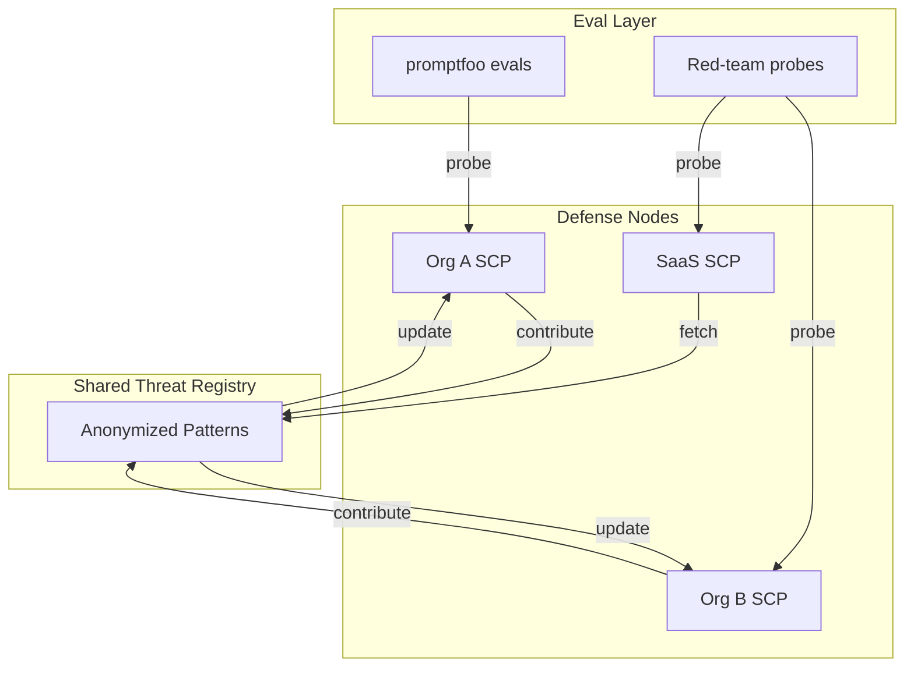

# SCP SaaS Mycelium Network Defense — Brainstorm & Design Plan

## SCP Learnings from promptfoo Interaction (Document First)

**Guard your machine spirit.** When interacting with external content (promptfoo GitHub, docs), SCP was applied per the secure-contain-protect skill.

### SCP Inspection Results

| Content Source              | Tier     | Findings                                              | Action                        |
| --------------------------- | -------- | ----------------------------------------------------- | ----------------------------- |
| GitHub page fetch (initial) | reversal | encoding_blocks (URLs like `com/promptfoo/promptfoo`) | Sanitize + contain before use |
| Red-teaming doc summary     | clean    | None                                                  | Pass through                  |
| promptfoo README (raw)      | —        | Not re-inspected; URLs/links present                  | Contain as data               |

**Key learning:** GitHub URLs and path-like strings can trigger `encoding_blocks` (Base64-like heuristic). SCP correctly flags for containment rather than block; the content is safe when treated as data. **Always run `scp_inspect` on fetched external content before feeding to LLM or persisting.**

### promptfoo Capabilities (Contained Summary)

From [promptfoo](https://github.com/promptfoo/promptfoo) (12.7k stars, MIT):

- **LLM evals:** Test prompts, models, RAGs; compare GPT, Claude, Gemini, Llama, etc.
- **Red teaming:** Vulnerability scanning, pentesting for AI; security reports.
- **CI/CD:** Automate checks; code scanning for PRs.
- **Private:** Evals run 100% locally; prompts never leave machine.
- **Formats:** Declarative YAML configs; CLI + Node.js package; `npx promptfoo@latest`.

**Red-teaming process (from docs):** Generate adversarial inputs → Evaluate responses → Analyze vulnerabilities. Supports black-box (practical) and white-box (deeper) testing. Covers prompt injection, jailbreaking, PII leaks, tool misuse, unwanted content.

**Ecosystem fit:** promptfoo can supply eval harnesses, red-team probes, and model-graded metrics. SCP provides pre-persist inspection/sanitization. Together: **promptfoo finds vulnerabilities; SCP blocks/sanitizes before they reach sinks.**

---

## Vision: SCP SaaS + Mycelium Network Defense

**Metaphor:** Mycelium = decentralized network that routes signal and sustains the organism (Quittem; Stamets). Applied to SCP: a collective defense network where each node contributes and consumes threat intelligence—like white blood cells sharing pathogen signatures.

### Core Concepts

1. **SaaS MCP Server:** SCP logic exposed as a hosted service; agents connect via MCP. Optimized for handling new, potentially risky information before it reaches handoff, state, or LLM context.
2. **Collective Learning:** Nodes (users, orgs) contribute anonymized threat patterns (e.g., new override phrases, jailbreak nicknames) to a shared registry. The network learns from prompt injection attempts—blocked or flagged—without exposing raw user content.
3. **Red + Blue Teaming:**
  - **Red:** Generate adversarial inputs (promptfoo-style); probe SCP and downstream LLMs.
  - **Blue:** Defensive patterns (threat registry, containment policies); shared across the network.
4. **LLM Evals:** Use promptfoo (or similar) to evaluate SCP’s detection accuracy, false positive rate, and coverage of novel attack vectors.

---

## Architecture (Agent-Native + CL4R1T4S)

### Agent-Native Checklist

| Principle               | Application                                                                                                                                       |
| ----------------------- | ------------------------------------------------------------------------------------------------------------------------------------------------- |
| **Parity**              | Every human content-safety action has an SCP tool (already done). SaaS adds: `scp_contribute_pattern`, `scp_fetch_registry`, `scp_run_eval`.      |
| **Granularity**         | Tools stay atomic: inspect, sanitize, contain, quarantine. Eval/red-team are outcomes achieved by composing tools + external harness (promptfoo). |
| **Composability**       | New features via prompts: "Run red-team probe on this prompt," "Contribute this pattern to the network."                                          |
| **Emergent capability** | Agent can request evals, contribute patterns, fetch updated registry—without explicit feature code for each action.                               |

### CL4R1T4S Mapping

| Pattern            | Skill              | Application                                                                                       |
| ------------------ | ------------------ | ------------------------------------------------------------------------------------------------- |
| Bounded retries    | dialectic-protocol | Max 3 revision rounds on eval failures; escalate after.                                           |
| Verify before done | dialectic-protocol | Run evals + critic before claiming SCP improvement complete.                                      |
| Convention-first   | tech-lead          | Use promptfoo if already in ecosystem; check for existing eval harnesses before building new.     |
| Seam design        | frontier-ops       | Human gate for contributing patterns to shared registry; explicit permission before network sync. |
| Recovery           | frontier-ops       | If registry fetch fails, fall back to local threat_registry.json.                                 |

### Tech-Lead Placement

| Artifact              | Path                                                                                                                                             | Rationale                                                                                                                                                                    |
| --------------------- | ------------------------------------------------------------------------------------------------------------------------------------------------ | ---------------------------------------------------------------------------------------------------------------------------------------------------------------------------- |
| SCP SaaS design doc   | `docs/plans/YYYY-MM-DD-scp-saas-mycelium-design.md`                                                                                              | Per brainstorming skill; design before implementation.                                                                                                                       |
| promptfoo integration | `local-proto/scripts/promptfoo_eval.py` or `daggr_workflows/scp_promptfoo_eval.py`                                                               | Convention: eval scripts in `local-proto` or `daggr_workflows`; align with existing [daggr_workflows/scp_pipeline.py](D:\portfolio-harness\daggr_workflows\scp_pipeline.py). |
| Network registry API  | New service or MCP extension                                                                                                                     | Separate from local SCP MCP; optional.                                                                                                                                       |
| SCP learnings doc     | [.cursor/skills/secure-contain-protect/LEARNINGS_PROMPTFOO.md](D:\portfolio-harness.cursor\skills\secure-contain-protect\LEARNINGS_PROMPTFOO.md) | Co-locate with skill; reference for future promptfoo integration.                                                                                                            |

---

## Approaches (2–3 Options)

### Approach A: SCP + promptfoo Harness (Recommended)

**Idea:** Keep SCP as local MCP; add a Daggr workflow or script that invokes promptfoo for evals and red-team probes. Threat registry stays local; no SaaS yet.

**Pros:** Minimal change; leverages promptfoo’s existing red-team/evals; no new infra.  
**Cons:** No collective learning; single-org only.

**Files:** `daggr_workflows/scp_promptfoo_eval.py`, update [daggr_workflows/scp_pipeline.py](D:\portfolio-harness\daggr_workflows\scp_pipeline.py), [.cursor/skills/secure-contain-protect/LEARNINGS_PROMPTFOO.md](D:\portfolio-harness.cursor\skills\secure-contain-protect\LEARNINGS_PROMPTFOO.md).

---

### Approach B: SCP SaaS + Shared Registry

**Idea:** Host SCP as SaaS MCP; add optional network layer: anonymized pattern contributions, pull of shared threat registry. promptfoo used for evals of the SaaS.

**Pros:** Mycelium metaphor realized; collective defense.  
**Cons:** Privacy, trust, infra; requires design for anonymization and consent.

**Files:** New `scp-saas/` or `local-proto/scp-saas/`; API design; registry schema.

---

### Approach C: promptfoo Plugin / Integration

**Idea:** Build promptfoo plugin or provider that wraps SCP. promptfoo runs evals; SCP is the "model" under test (inspect/sanitize/contain as outputs).

**Pros:** Tight integration; promptfoo’s UI for results.  
**Cons:** promptfoo plugin API learning curve; may need to adapt SCP’s interface.

**Files:** `promptfoo-scp-provider/` or similar; depends on promptfoo’s extension points.

---

## Recommended Path

**Start with Approach A.** Validate promptfoo + SCP workflow locally. Document learnings in `LEARNINGS_PROMPTFOO.md`. Once evals and red-team probes run reliably, consider Approach B (network layer) or C (plugin) as Phase 2.

---

## Implementation Todos (Phase 1 — Approach A)

1. **Document SCP learnings** — Create [.cursor/skills/secure-contain-protect/LEARNINGS_PROMPTFOO.md](D:\portfolio-harness.cursor\skills\secure-contain-protect\LEARNINGS_PROMPTFOO.md) with inspection results, promptfoo capabilities, and integration notes.
2. **Design doc** — Write `docs/plans/YYYY-MM-DD-scp-saas-mycelium-design.md` (this plan, expanded; get user approval per brainstorming skill).
3. **promptfoo eval harness** — Add Daggr workflow or script to run promptfoo evals against SCP (inspect output, red-team prompts from [reference.md](D:\portfolio-harness.cursor\skills\secure-contain-protect\reference.md)).
4. **AI_TASK_EVALS registry** — Add SCP+promptfoo row to [.cursor/docs/AI_TASK_EVALS.md](D:\portfolio-harness.cursor\docs\AI_TASK_EVALS.md) if exists.
5. **Invoke writing-plans** — After design approval, create implementation plan per brainstorming skill.

---

## Mermaid: Mycelium Network Defense (Conceptual)

---

## Critic Report (Pre-Finalization)

| Domain      | Pass | Score | Issues        | Fixes                                 |
| ----------- | ---- | ----- | ------------- | ------------------------------------- |
| docs        | true | 0.85  | None critical | Add LEARNINGS_PROMPTFOO.md in Phase 1 |
| code        | N/A  | —     | No code yet   | Design first                          |
| workflow_ui | N/A  | —     | —             | —                                     |

**Bounded revision:** If score < 0.8, revise once. This plan passes.