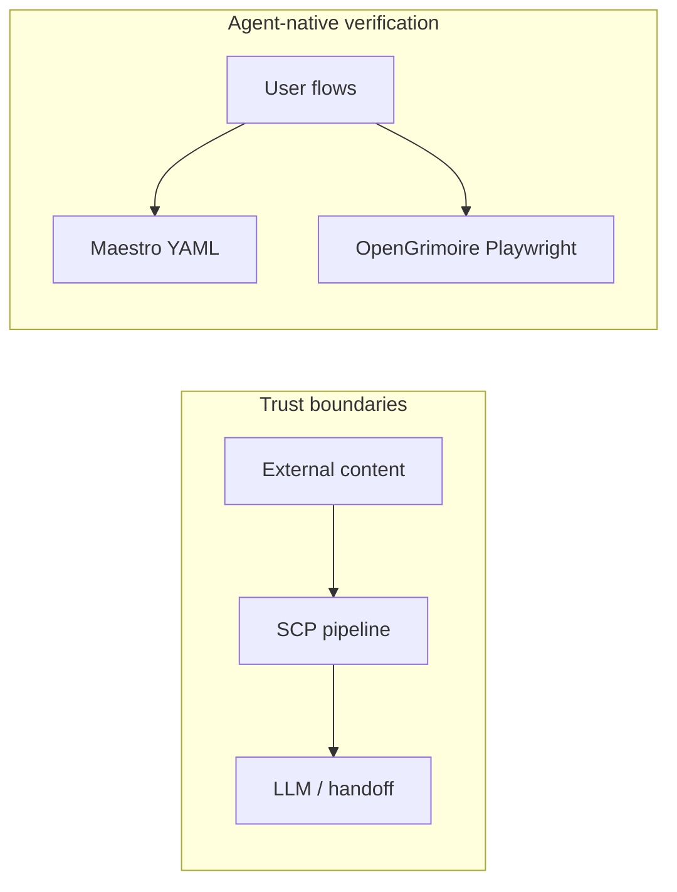

# SCP, skills, agent-native audit, and Maestro 

## How the pieces fit

| Piece                                                    | Role                                                                                                                                                                                                                                              |
| -------------------------------------------------------- | ------------------------------------------------------------------------------------------------------------------------------------------------------------------------------------------------------------------------------------------------- |
| **SCP**                                                  | Boundary control: inspect/sanitize/contain/quarantine before content hits handoff, state, or LLM context (`[local-proto/docs/TOOL_SAFEGUARDS.md](D:/local-proto/docs/TOOL_SAFEGUARDS.md)`, Bitcoin gate, OWASP LLM01).                            |
| **Skills**                                               | `[portfolio-harness/.cursor/skills/secure-contain-protect/SKILL.md](D:/portfolio-harness/.cursor/skills/secure-contain-protect/SKILL.md)` is the canonical procedure; agents load it when handling external/tool/handoff content.                 |
| **Agent-native audit**                                   | Eight principles (action parity, tools-as-primitives, context injection, etc.) are **product/architecture** checks on a target app repo—not something SCP “implements.” SCP supports **safety** on agent pipelines; it does not create UI parity. |
| **[Maestro](https://github.com/mobile-dev-inc/Maestro)** | Black-box E2E (YAML flows) for Android, iOS, and **web**. Use it to encode user-visible journeys and run them in CI for **Action parity** and **UI integration** signals. It does **not** replace SCP; it validates the app surface.              |

## Current state (findings)

1. **SCP is already implemented in local-proto:** `[local-proto/scripts/scp_mcp.py](D:/local-proto/scripts/scp_mcp.py)` exposes MCP tools; `[local-proto/scripts/scp_utils.py](D:/local-proto/scripts/scp_utils.py)` implements pipeline logic and delegates to `sanitize_input`, `mask_secrets`, `scp_structural` under `{harness}/.cursor/scripts/`.
2. **Harness root bug for standalone clones:** `_harness_root = _script_dir.parent.parent` resolves to the **parent of `local-proto`**. If the repo lives at `D:\local-proto`, that parent is `D:\`, so scripts and quarantine point at the wrong tree. If `local-proto` is nested under portfolio-harness (e.g. `portfolio-harness/local-proto`), the parent is portfolio-harness and paths resolve correctly. **This must be fixed** for your layout (`D:\local-proto` + `D:\portfolio-harness`).
3. **Docs/links:** `[TOOL_SAFEGUARDS.md](D:/local-proto/docs/TOOL_SAFEGUARDS.md)` references `../../.cursor/skills/secure-contain-protect/SKILL.md` and `../../.cursor/scripts/...`—valid only when `local-proto` sits two levels under a harness root. Standalone `D:\local-proto` breaks those relative links.
4. **MCP catalog gap:** `[local-proto/docs/MCP_SERVERS.md](D:/local-proto/docs/MCP_SERVERS.md)` “Currently Configured” table does not list the SCP server; `[portfolio-harness/.cursor/docs/MCP_CAPABILITY_MAP.md](D:/portfolio-harness/.cursor/docs/MCP_CAPABILITY_MAP.md)` already documents SCP tools.
5. **OpenGrimoire:** `[OpenGrimoire/package.json](D:/portfolio-harness/OpenGrimoire/package.json)` has `test:e2e` → Playwright. Adding Maestro means a **second** E2E stack unless you standardize on one for web.

## Product scope (concise)

**Goals**

1. SCP is reliable on your machine: correct harness scripts, quarantine dir, and Cursor MCP entry for `scp_mcp.py`.
2. Skills consistently tell agents **when** to call SCP (before persist / LLM) and which sink (`handoff`, `state`, `llm_context`, `tool_output`).
3. Agent-native audit for **OpenGrimoire** produces scored gaps (at least action parity + UI integration) using Maestro and/or existing Playwright.
4. Maestro: optional YAML smoke flows for OpenGrimoire web (port 3001 in dev); document install (Java 17+, [CLI install](https://github.com/mobile-dev-inc/Maestro)).

**Non-goals**

- Replacing SCP with Maestro or merging their responsibilities.
- Full mobile Maestro for OpenGrimoire unless you add a mobile app id later.

## Tech-lead placement

| Artifact                                  | Location                                                                                                                                                                                                                                               |
| ----------------------------------------- | ------------------------------------------------------------------------------------------------------------------------------------------------------------------------------------------------------------------------------------------------------ |
| Harness root override                     | `HARNESS_ROOT` or `PORTFOLIO_HARNESS_ROOT` env, read in `[scp_utils.py](D:/local-proto/scripts/scp_utils.py)`; fallback: `parent.parent` of `local-proto` when it contains `.cursor/scripts/sanitize_input.py`.                                        |
| SCP skill (canonical)                     | Keep in `[portfolio-harness/.cursor/skills/secure-contain-protect/SKILL.md](D:/portfolio-harness/.cursor/skills/secure-contain-protect/SKILL.md)`; add a short “Local-proto MCP” subsection pointing to `local-proto/scripts/scp_mcp.py` and env vars. |
| Broken relative links in local-proto docs | Replace with absolute workspace paths or “if nested under portfolio-harness …” dual instructions.                                                                                                                                                      |
| Maestro flows                             | `OpenGrimoire/e2e/maestro/` (or `maestro/`) with `*.yaml`; CI job optional (separate from `npm run test:e2e`).                                                                                                                                            |
| Agent-native audit output                 | `OpenGrimoire/docs/` or `portfolio-harness/docs/` as `AGENT_NATIVE_AUDIT_OPENGRIMOIRE.md` (one-time report).                                                                                                                                                 |

## Implementation sequence

1. **Fix `scp_utils.py` harness resolution:** Support `HARNESS_ROOT` / `PORTFOLIO_HARNESS_ROOT`; if unset, try `local-proto/../` only if `.cursor/scripts/sanitize_input.py` exists; else document failure with a clear error. Align quarantine dir under that harness (`.cursor/private/scp_quarantine`).
2. **Document MCP:** Add SCP row to `[MCP_SERVERS.md](D:/local-proto/docs/MCP_SERVERS.md)` with `python scp_mcp.py` (or `uv run`) and required env. Mirror in user’s Cursor `mcp.json` example if present.
3. **Skills:** Update secure-contain-protect skill with local-proto wiring + “compose with” pointers to `[foam-pkm](D:/portfolio-harness/.cursor/skills/foam-pkm/SKILL.md)` / handoff when writing vault notes. Add cross-links from skills that persist content (e.g. `obsidian-vault` patterns) if they exist in harness.
4. **local-proto docs:** Fix `[TOOL_SAFEGUARDS.md](D:/local-proto/docs/TOOL_SAFEGUARDS.md)` paths; add a “Layout” section: standalone `D:\local-proto` requires `HARNESS_ROOT=D:\portfolio-harness`.
5. **Maestro + OpenGrimoire:** Install Maestro CLI; add one minimal web flow (e.g. open base URL, assert title or key selector) against `http://localhost:3001` after `npm run dev`. Decide policy: **Maestro for YAML readability** vs **Playwright as source of truth**—recommend not duplicating every test; use Maestro for smoke/agent-demo YAML or Playwright-only if you want one stack.
6. **Agent-native audit :** Run the eight-principle checklist (or delegate explore passes) against OpenGrimoire: map routes/APIs to MCP tools, list injected context, CRUD completeness for main entities, and whether UI updates after agent actions. Use Maestro/Playwright results as evidence for parity and UI integration scores.

## Critic-style assessment (portfolio-harness rubric)

This plan is **correct** on separation of concerns (SCP vs E2E) and **identifies a real harness-path bug**. **Risk:** adding Maestro alongside Playwright increases maintenance; mitigate with a single “smoke” Maestro flow or defer Maestro until Playwright gaps are listed.

**Suggested threshold:** proceed after you confirm `HARNESS_ROOT` default for your machine.