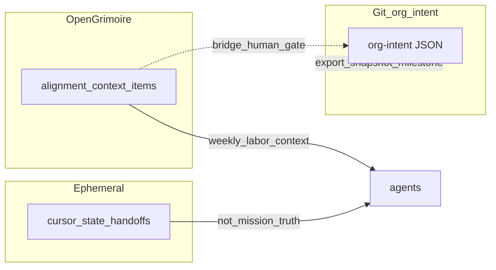

# Execute handoff Next: Section 6 (critic engagement follow-on)

## Context loaded

- No `[openharness/.cursor/state/intent_surface.md](D:/openharness/.cursor/state/intent_surface.md)` or `session_brief.md` — skipped.
- Source of truth: `[openharness/.cursor/state/handoff_latest.md](D:/openharness/.cursor/state/handoff_latest.md)` → **Next** = implement Section 6 per `[D:/software/.cursor/plans/pass_d_+_resolved_qs_cf2648a4.plan.md](D:/software/.cursor/plans/pass_d_+_resolved_qs_cf2648a4.plan.md)` (lines 126–232).
- **plan_ref:** Section 6. Prior handoff note “do not implement follow-on yet” is **superseded** by your explicit request to execute.

## Pushback / scope

- Section 6 is **documentation and example JSON** only (design-time); no L402 implementation, no OpenGrimoire UI changes unless you expand scope later.
- Keep edits **focused**: prefer 2–3 new/edited docs under `openharness/docs/` plus targeted updates to `[2026-03-22-org-intent-north-star-brainstorm.md](D:/openharness/docs/brainstorms/2026-03-22-org-intent-north-star-brainstorm.md)` and `[org-intent.consulting-feedback.example.json](D:/portfolio-harness/org-intent-spec/examples/org-intent.consulting-feedback.example.json)` to avoid a giant single-file brainstorm.

## Implementation map (Section 6 subsections → artifacts)

| Subsection                                      | Deliverable                                                                                                                                                                                                                                                                                                                                                                                                                                                                                                                     |
| ----------------------------------------------- | ------------------------------------------------------------------------------------------------------------------------------------------------------------------------------------------------------------------------------------------------------------------------------------------------------------------------------------------------------------------------------------------------------------------------------------------------------------------------------------------------------------------------------- |
| **6.1** Discipline                              | New `[openharness/docs/critic-log-org-intent.md](D:/openharness/docs/critic-log-org-intent.md)`: table template (risk / mitigation / residual / next experiment); short prose on **critic JSON** vs **intent-alignment** (when each fires; drift threshold calibration). Link to `[critic-loop-gate.mdc](D:/openharness/.cursor/rules/critic-loop-gate.mdc)` and `[intent-alignment-gate.mdc](D:/openharness/.cursor/rules/intent-alignment-gate.mdc)`.                                                                         |
| **6.2** Goodhart                                | Extend Pass A in brainstorm: per domain (Health, Wealth, three Influence lanes) add **leading / lagging / anti-metrics** columns or a tight sub-table; add **Goodhart shield** question block; one paragraph on **metric-class tagging** for task leaves.                                                                                                                                                                                                                                                                       |
| **6.3** Precedence                              | New short doc `[openharness/docs/PRECEDENCE_AND_STEERING.md](D:/openharness/docs/PRECEDENCE_AND_STEERING.md)` (one page): macro weekly steering, micro soft-rank when silent, escalate when conflict + no steering; reference existing Pass A/B text so it does not contradict.                                                                                                                                                                                                                                                 |
| **6.4** Ethics (machine-readable)               | Update `[org-intent.consulting-feedback.example.json](D:/portfolio-harness/org-intent-spec/examples/org-intent.consulting-feedback.example.json)`: add `values` lines and `hard_boundaries` entries with stable ids (e.g. no deception, consent/attribution, no dark patterns, reputation escalation) — aligned with schema `[org-intent.v1.json](D:/portfolio-harness/org-intent-spec/schema/org-intent.v1.json)`. In brainstorm Pass A Influence rows, add anti-goal lines for **manipulation / coercive UX** where relevant. |
| **6.5–6.6** L402 commercial + sync              | In `critic-log-org-intent.md` (or a subsection of `PRECEDENCE_AND_STEERING.md`): **commercial intent** questionnaire bullets (hobby vs productized API, merchant-of-record, disputes); **risk register** rows (preimage expiry, retry economics, bad output after payment); **dual source of truth** table + optional mermaid (Git audit vs OpenGrimoire runtime vs `.cursor/state` ephemeral + bridge).                                                                                                                           |
| **6.7–6.10** Privacy, survey, bundles, approval | Same doc or `critic-log-org-intent.md`: privacy (what logged, retention, access); **survey mapping table** (strategic wizard vs `survey.ts` — Option A/B + column: target store); knowledge bundle **owner/version/review/deprecation**; **async_ok** default + batch weekly review (per `[INTENT_ENGINEERING.md](D:/openharness/docs/INTENT_ENGINEERING.md)`).                                                                                                                                                                 |

## Brainstorm cross-link

- Append a short section **“Section 6 — Critic engagement (see also)”** at end of `[2026-03-22-org-intent-north-star-brainstorm.md](D:/openharness/docs/brainstorms/2026-03-22-org-intent-north-star-brainstorm.md)` with links to the new docs (avoid duplicating full tables if they live in `critic-log-org-intent.md`).

## Handoff file update (after work)

- Update `[openharness/.cursor/state/handoff_latest.md](D:/openharness/.cursor/state/handoff_latest.md)`: **Done** = Section 6 artifacts landed; **Next** = optional polish (AI index links, JSON schema validation command) or operator review; mark plan todos in `[pass_d_+_resolved_qs_cf2648a4.plan.md](D:/software/.cursor/plans/pass_d_+_resolved_qs_cf2648a4.plan.md)` frontmatter `todos` to `completed` when slices match.

## Verification

- **Links:** Relative paths from `openharness/docs/brainstorms/` and new docs to `portfolio-harness` and rules remain valid.
- **JSON:** Validate `org-intent.consulting-feedback.example.json` against `org-intent.v1.json` (e.g. `ajv` or project script if present; else manual structural check).
- **No** OpenGrimoire E2E unless UI changes (none planned).

