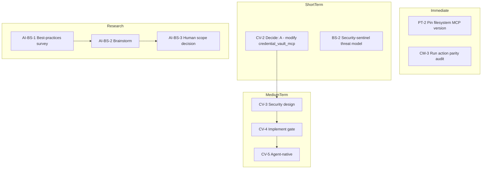

# Security Vectors Next Tasks and AI Pools Research

## 1. Credential Vault: Best Option for Stack

**Recommendation: Option A (modify local script)**

The credential-vault MCP is already a **local Python script** ([credential_vault_mcp.py](D:\portfolio-harness\local-proto\scripts\credential_vault_mcp.py)), not a third-party package. It is wrapped by [audit_wrapper.py](D:\portfolio-harness\local-proto\scripts\audit_wrapper.py), which blocks `credential_vault_create`, `credential_vault_revoke`, `credential_vault_export` when `ORG_INTENT_ENFORCE=1`—but that is "block entirely" (ESCALATE), not "block until human confirms."

| Option                                | Fit for stack | Rationale                                                                                                                                      |
| ------------------------------------- | ------------- | ---------------------------------------------------------------------------------------------------------------------------------------------- |
| **A: Modify credential_vault_mcp.py** | Best          | We own the script. Add gate at start of create/update/revoke/export handlers. Logic stays with credential server; audit_wrapper stays generic. |
| B: Wrapper/proxy                      | Possible      | Would require audit_wrapper to parse tool args and implement approval flow. More complex; mixes concerns.                                      |
| C: Cursor feature request             | N/A           | credential-vault is our script, not Cursor-provided.                                                                                           |

**Implementation path (CV-2 decided):** Add pre-execution check in each gated handler; approval store (file or env); return `APPROVAL_NEEDED: create credential for [site]` when unapproved. Human approves via file or `CREDENTIAL_VAULT_APPROVE=1` with token.

---

## 2. PT-2: Filesystem MCP Version Check

**Current state:** [mcp.json](D:\portfolio-harness.cursor\mcp.json) line 58 uses `npx -y @modelcontextprotocol/server-filesystem` with **no version pin**.

**Finding:** npm registry shows latest is `2026.1.14` (Jan 2026). CVE-2025-53110 is fixed in `2025.7.1+`. Latest is safe.

**Action:**

1. Run `npx @modelcontextprotocol/server-filesystem@latest --version` or check resolved version.
2. Pin version in mcp.json args: `@modelcontextprotocol/server-filesystem@2025.7.1` (or `@2026.1.14`) to avoid regressions.
3. Document in [known-issues.md](D:\portfolio-harness.cursor\state\known-issues.md) that version is pinned.

**No package.json** in portfolio-harness root for this—filesystem MCP is invoked via npx. Pin in mcp.json args.

---

## 3. CM-3: Action Parity Audit

**Action:** Run `/agent-native-audit` with argument `action parity` (or `1`).

**Output:** Score (X/Y user actions), missing agent tools, recommendations. Per [agent-native-audit command](D:\portfolio-harness.cursor\docs\AGENT_ENTRY_INDEX.md) and TOOL_SAFEGUARDS Cursor MCP mapping.

---

## 4. BS-2: Formal Threat Model

**Action:** Delegate to **security-sentinel** subagent.

**Inputs:**

- [scope_bitcoin_ingestion_paths.md](D:\portfolio-harness.cursor\state\scope_bitcoin_ingestion_paths.md)
- [observation_mcp.py](D:\portfolio-harness\local-proto\scripts\observation_mcp.py) (SCP gate)
- [ai_trends_ingest.py](D:\portfolio-harness\local-proto\scripts\ai_trends_ingest.py) (_scp_gate pattern)

**Deliverable:** Threat model doc (threats, assets, mitigations, bypass paths) in `.cursor/state/adhoc/` or `docs/security/`.

---

## 5. AI Pools Research (AI-BS-1, AI-BS-2, AI-BS-3)

**Start AI-BS-1 now.** Use SCP when ingesting external content (web fetch, survey results).

### AI-BS-1: Best-practices-researcher survey

**Subagent:** best-practices-researcher

**Task:** Survey projects: Gonka AI, x402 Stacks, Lumerin, DeltaHash, Cocoon, Routstr. Focus: Bitcoin block space as **data layer** vs **payment rail** for AI compute coordination.

**SCP gate:** Before persisting fetched content (URLs, summaries) to brainstorm or scope docs, run `scp_run_pipeline` or `scp_inspect`. Block injection-tier; sanitize reversal. Per [TOOL_SAFEGUARDS](D:\portfolio-harness\local-proto\docs\TOOL_SAFEGUARDS.md) and observation_mcp pattern.

**Output:** Summary doc in `docs/brainstorms/` or `.cursor/state/ai_trends/raw/`.

### AI-BS-2: Brainstorm

**Action:** Run `/brainstorm` on "AI pools using Bitcoin block space/data as prompts for sovereign decentralized AI compute."

**Output:** [docs/brainstorms/2026-03-16-ai-pools-bitcoin-block-space-brainstorm.md](D:\portfolio-harness\docs\brainstorms\2026-03-16-ai-pools-bitcoin-block-space-brainstorm.md)

**Ensure:** `docs/brainstorms/` exists. SCP gate on any external content before writing.

### AI-BS-3: Scope decision

**Owner:** Human. After AI-BS-1 and AI-BS-2, decide: harness integration (observation source, Routstr skill extension) or tracking only. Log to decision-log or scope-notes.

---

## 6. Implementation Order

---

## 7. File Changes Summary

| Task    | Files                                                                                                                                                                      |
| ------- | -------------------------------------------------------------------------------------------------------------------------------------------------------------------------- |
| PT-2    | [.cursor/mcp.json](D:\portfolio-harness.cursor\mcp.json) — pin `@modelcontextprotocol/server-filesystem@2025.7.1` or higher                                                |
| CV-2    | Decision only; CV-3/4 touch [credential_vault_mcp.py](D:\portfolio-harness\local-proto\scripts\credential_vault_mcp.py)                                                    |
| BS-2    | New: `.cursor/state/adhoc/bitcoin_ingestion_threat_model_2026-03-16.md` or `docs/security/`                                                                                |
| AI-BS-1 | New: summary in `docs/brainstorms/` or `.cursor/state/ai_trends/`                                                                                                          |
| AI-BS-2 | New: [docs/brainstorms/2026-03-16-ai-pools-bitcoin-block-space-brainstorm.md](D:\portfolio-harness\docs\brainstorms\2026-03-16-ai-pools-bitcoin-block-space-brainstorm.md) |

---

## 8. SCP Usage for AI Pools Research

- **Before persisting** fetched content (web pages, API responses) to brainstorm or scope: run `scp_inspect` or `scp_run_pipeline(content, sink='tool_output')`.
- **If tier=injection:** block; do not write.
- **If tier=reversal:** sanitize, contain, then write.
- **Reference:** [observation_mcp.py](D:\portfolio-harness\local-proto\scripts\observation_mcp.py) `_scp_gate`, [ai_trends_ingest.py](D:\portfolio-harness\local-proto\scripts\ai_trends_ingest.py) `_scp_gate`.

